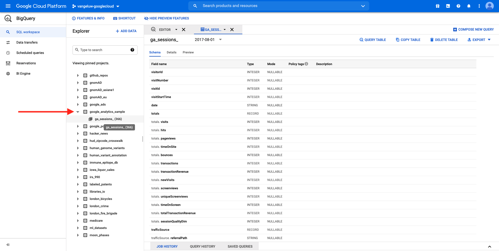

# 12.1 Skapa ett Google Cloud Platform-konto

## Mål

- Skapa ett Google Cloud Platform-konto
- Bekanta dig med Google Cloud Platform Console
- Skapa och förbered ditt BigQuery-projekt

## 12.1.1 Varför koppla Google BigQuery till Adobe Experience Platform för att hämta Google Analytics-data

Google Cloud Platform (GCP) är en serie publika molntjänster som erbjuds av Google. Google Cloud Platform innehåller en rad värdtjänster för dator-, lagrings- och programutveckling som körs på Google maskinvara.

BigQuery är en av dessa tjänster och ingår alltid i Google Analytics 360. Google Analytics data samplas ofta när vi försöker hämta data direkt från dem (till exempel API). Det är därför Google inkluderar BigQuery för att få osamplade data, så att varumärkena kan göra avancerad analys med SQL och dra nytta av kraften i GCP.

Google Analytics data läses in dagligen till BigQuery med hjälp av en batchmekanism. Det är därför ingen mening med att använda denna GCP/BigQuery-integrering för personalisering i realtid och aktiveringsfall.

Om ett varumärke vill leverera användningsfall för personalisering i realtid baserat på data från Google Analytics, kan det samla in dessa data på webbplatsen med Google Tag Manager och sedan strömma dem till Adobe Experience Platform i realtid.

GCP/BigQuery-källkopplingen ska användas..

- spåra alla kundbeteenden på webbplatsen och läsa in dessa data i Adobe Experience Platform för analyser, datavetenskap och personalisering som inte kräver aktivering i realtid.
- läsa in historiska data från Google Analytics i Adobe Experience Platform, återigen för analyser och datavetenskapliga användningsområden

## 12.1.2 Skapa ett Google-konto

För att få ett Google Cloud Platform-konto behöver du ett Google-konto.

## 12.1.3 Aktivera ditt Google Cloud Platform-konto

Nu när du har ett Google-konto kan du skapa en plattformsmiljö för Google Cloud. Om du vill göra det går du till [https://console.cloud.google.com/](https://console.cloud.google.com/).

Godkänn villkoren på nästa sida.

Klicka på **Välj ett projekt**.

Klicka på **NYTT PROJEKT**.

Namnge projektet enligt den här namnkonventionen:

| Konvention | Exempel |
| ----------------- |-------------| 
| `--demoProfileLdap---googlecloud` | delaigle-googlecloud |

Klicka **Skapa**.

Vänta tills meddelandet längst upp till höger på skärmen talar om att skapandet är klart. Klicka sedan på **Visa projekt**.

Gå sedan till sökfältet överst på skärmen och skriv **BigQuery**. Markera det första resultatet.

Du kommer sedan att omdirigeras till BigQuery-konsolen så visas ett popup-meddelande.

**Klicka på Klar**.

Målet med den här modulen är att få in data från Google Analytics i Adobe Experience Platform. För att göra det behöver vi dummydata i en datauppsättning från Google Analytics.

Klicka på **Lägg till data** på den vänstra menyn, följt av att klicka **Utforska publika datauppsättningar**.

Då visas det här fönstret:

Ange söktermen **Exempel på Google Analytics** i sökfältet och välj det första resultatet.

Följande skärm visas med en beskrivning av datauppsättningen. Klicka på **VISA DATAUPPSÄTTNING**.

Du kommer sedan att omdirigeras till BigQuery där du kommer att se detta **bigquery-public-data** datauppsättning under **Utforskaren**.

I **Utforskaren** bör du nu se ett antal tabeller. Experimentera fritt. Gå till `google_analytics_sample`.

Klicka för att öppna tabellen `ga_sessions`.

Innan du fortsätter med nästa övning bör du skriva följande i en separat textfil på datorn:

| Autentiseringsuppgifter | Namngivning | Exempel |
| ----------------- |-------------| -------------|
| Projektnamn | `--demoProfileLdap---googlecloud` | vangeluw-googlecloud |
| Projekt-ID | random | sammansatt-uppgift-306413 |

Du kan hitta ditt projektnamn och ditt projekt-ID genom att klicka på **Projektnamn** i den övre menyraden:

Du kommer då att se ditt projekt-ID till höger:

Nu kan du gå över till Exercise 12.2 där du kan få dina händer smutsiga genom att fråga Google Analytics data.

Nästa steg: [12.2 Skapa din första fråga i BigQuery](./ex2.md)

[Gå tillbaka till modul 12](./customer-journey-analytics-bigquery-gcp.md)

[Gå tillbaka till Alla moduler](./../../overview.md)
