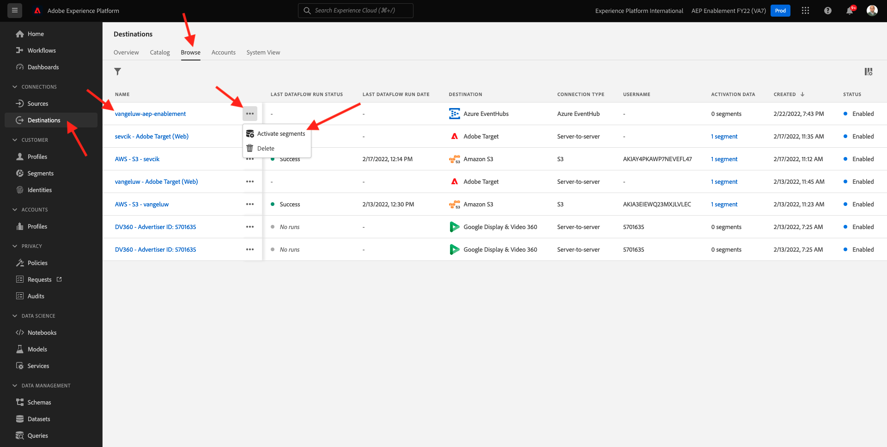

# 13.4 Aktivera segment

## 13.4.1 Lägg till segment i Azure Event Hub-målet

I den här övningen ska du lägga till ditt segment `--demoProfileLdap-- - Interest in Equipment` till `--demoProfileLdap---aep-enablement` Azure Event Hub-mål.

Logga in på Adobe Experience Platform genom att gå till denna URL: [https://experience.adobe.com/platform](https://experience.adobe.com/platform).

När du loggat in kommer du till Adobe Experience Platform hemsida.

Innan du fortsätter måste du välja en **sandlåda**. Sandlådan som ska markeras har namnet ``--aepSandboxId--``. Du kan göra detta genom att klicka på texten **[!UICONTROL Produktionsprodukt]** i den blå linjen ovanför skärmen. När du har valt rätt sandlåda ser du skärmändringen och nu befinner du dig i din dedikerade sandlåda.

Gå till **Destinationer** och sedan klicka **Bläddra**. Då ser du alla tillgängliga destinationer. Leta upp målet och klicka på **+** ikonen enligt nedan.

Du kommer då att se det här. Sök efter ditt segment med hjälp av din ldap och välj `--demoProfileLdap-- - Interest in Equipment` i listan över segment.

Klicka på **Nästa**.

Adobe Experience Platform CDP i realtid kan leverera en nyttolast till två typer av destinationer, segmentdestinationer och profildestinationer.

Segmentdestinationer får en fördefinierad segmentkvalificeringsnyttolast som kommer att diskuteras senare. En sådan nyttolast innehåller **alla** Segmentkvalifikationer för en viss profil. Även för segment som inte finns med i målets aktiveringslista. Ett exempel på ett sådant segmentmål är **Azure Event Hubs** och **AWS Kinesis**.

Profilbaserade mål gör att du kan välja valfritt attribut (firstName, lastName, ...) från XDM-profilens unionsschema och inkludera det i aktiveringsnyttolasten. Ett exempel på en sådan destination är **E-postmarknadsföring**.

Eftersom din Azure Event Hub-destination är en **segment** mål, välj till exempel fältet `--aepTenantId--.identification.core.ecid`.

Klicka **Lägg till nytt fält**, klicka på bläddra i schemat och markera fältet `--aepTenantId--identification.core.ecid` (ta bort alla andra fält som visas automatiskt).

Klicka på **Nästa**.

Klicka **Slutför**.

Ditt segment är nu aktiverat mot din Microsoft Event Hub-destination.

Nästa steg: [13.5 Skapa ditt Microsoft Azure-projekt](./ex5.md)

[Gå tillbaka till modul 13](./segment-activation-microsoft-azure-eventhub.md)

[Gå tillbaka till Alla moduler](./../../overview.md)
