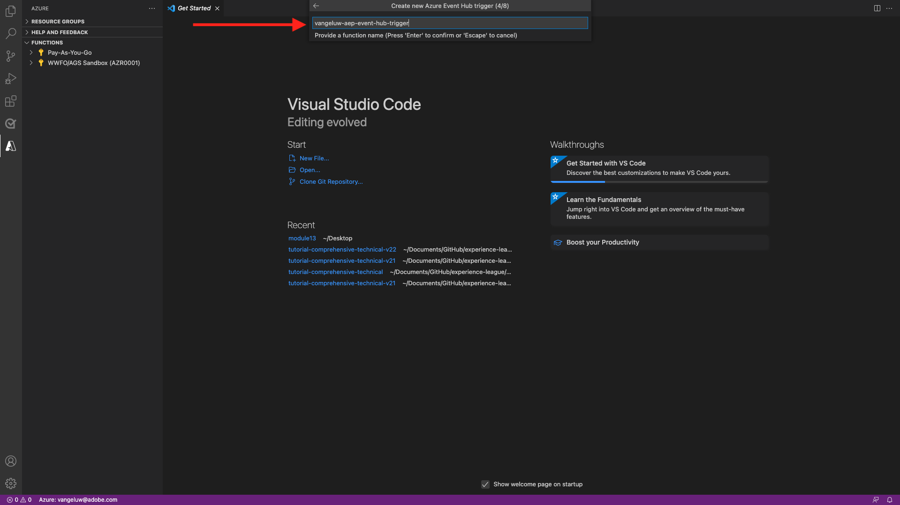
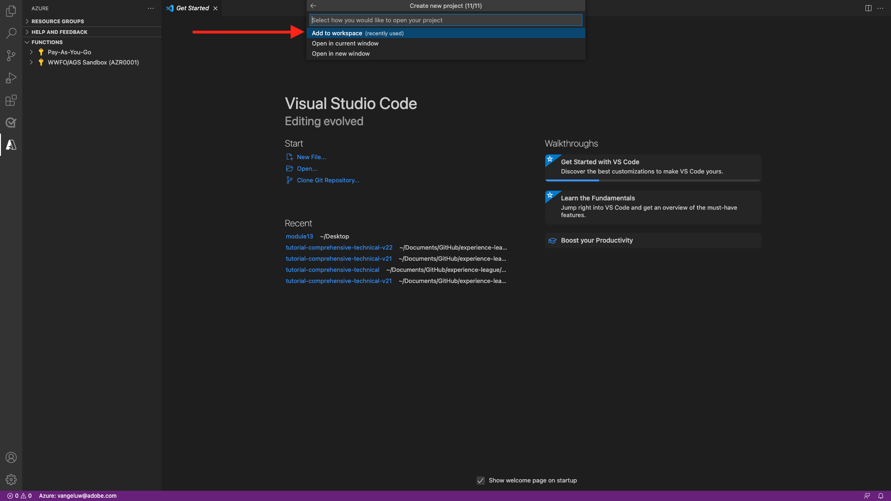

# 13.5 Skapa ditt Microsoft Azure-projekt

## 13.5.1 Bekanta dig med Azure Event Hub-funktioner

Med Azure-funktioner kan du köra små kodavsnitt (som kallas **funktioner**) utan att behöva bekymra sig om programinfrastrukturen. Med Azure-funktioner ger molninfrastrukturen alla aktuella servrar du behöver för att ditt program ska kunna köras i stor skala.

En funktion är **utlöst** av en specifik typ av händelse. De utlösare som stöds är bland annat att svara på dataändringar, svara på meddelanden (till exempel händelsehubbar), köra ett schema eller som ett resultat av en HTTP-begäran.

Azure-funktioner är en serverlös beräkningstjänst som gör att du kan köra händelseutlösad kod utan att explicit behöva etablera eller hantera infrastruktur.

Azure Event Hubs kan integreras med Azure-funktioner för en serverlös arkitektur.

## 13.5.2 Öppna Visual Studio-kod och logga in på Azure

Visual Studio Code gör det enkelt att ...

- definiera och binda Azure-funktioner till Event Hubs
- testa lokalt
- distribuera till Azure
- körning av fjärrloggfunktion

### Öppna Visual Studio-kod

Öppna Visual Studio Code genom att skriva **visuell** i operativsystemets sökning (Spotlight-sökning i OSX, Sök i Aktivitetsfältet i Windows). Om du inte hittar den måste du upprepa stegen som beskrivs i [Utövning 0 - Krav](./ex0.md).


### Logga in på Azure

När du loggar in med ditt Azure-konto som du använde för att registrera dig i [Utövning 0 - Krav](./ex0.md)Med Visual Studio Code kan du söka efter och binda alla Event Hub-resurser.

Klicka på **Azure** i Visual Studio Code. Om du inte har det alternativet kan något ha gått fel med installationen av de nödvändiga tilläggen.

Nästa val **Logga in på Azure**:


Du omdirigeras till webbläsaren för att logga in. Kom ihåg att välja det Azure-konto som du använde för att registrera.


När du ser följande skärm i webbläsaren loggas du in med Visual Code Studio:


Återgå till Visual Code Studio (du ser till exempel namnet på din Azure-prenumeration) **Azure-prenumeration 1**):


## 13.5.3 Skapa ett Azure-projekt

När du hovrar över **Azure-prenumeration 1**, visas en meny ovanför avsnittet, välj **Skapa nytt projekt...**:


Välj en lokal mapp som du vill spara projektet i och klicka på **Välj**:


Du kommer nu att ange guiden Skapa projekt. Välj **Javascript** som språk i ditt projekt:


Välj **Azure Event Hub-utlösare** som projektets första funktionsmall:


Ange ett namn för funktionen och använd följande format `--demoProfileLdap---aep-event-hub-trigger` och tryck på Retur:



Välj **Skapa ny inställning för lokal app**:


Välj ett namnutrymme för händelsehubben, du bör se den händelsehubb som du definierade i **Utövning 2**. I det här exemplet är händelsehubbens namnutrymme **vangeluw-aep-enablement**:


Välj händelsehubben så ser du händelsehubben som du definierade i **Utövning 2**. I mitt fall är det **vangeluw-aep-enablement-event-hub**:


Välj **RootHanteraDeladÅtkomstnyckel** som din händelsehubbsprincip:


Ange att använda **$Standard**:


Välj **Lägg till på arbetsytan** om hur du öppnar ditt projekt:



När du har skapat projektet klickar du på **index.js** om du vill att filen ska vara öppen i redigeraren:


Nyttolasten som skickas av Adobe Experience Platform till din händelsehubb kommer att innehålla segment-ID:n:

```json
[{
"segmentMembership": {
"ups": {
"ca114007-4122-4ef6-a730-4d98e56dce45": {
"lastQualificationTime": "2020-08-31T10:59:43Z",
"status": "realized"
},
"be2df7e3-a6e3-4eb4-ab12-943a4be90837": {
"lastQualificationTime": "2020-08-31T10:59:56Z",
"status": "realized"
},
"39f0feef-a8f2-48c6-8ebe-3293bc49aaef": {
"lastQualificationTime": "2020-08-31T10:59:56Z",
"status": "realized"
}
}
},
"identityMap": {
"ecid": [{
"id": "08130494355355215032117568021714632048"
}]
}
}]
```

Ersätt koden i Visual Studio-kodens index.js med koden nedan. Den här koden körs varje gång CDP i realtid skickar segmentkvalifikationer till din Event Hub-destination. I vårt exempel handlar koden bara om att visa och förbättra den mottagna nyttolasten. Men du kan föreställa dig vilken funktion som helst för att bearbeta segmentens kvalifikationer i realtid.

```javascript
// Marc Meewis - Solution Consultant Adobe - 2020
// Adobe Experience Platform Enablement - Module 13

// Main function
// -------------
// This azure function is fired for each segment activated to the Adobe Exeperience Platform Real-time CDP Azure 
// Eventhub destination
// This function enriched the received segment payload with the name fo the segment. 
// You can replace this function with any logic that is require to process and deliver
// Adobe Experience Platform segments in real-time to any application or platform that 
// would need to act upon an AEP segment qualiification.
// 

module.exports = async function (context, eventHubMessages) {

    return new Promise (function (resolve, reject) {

        context.log('Message : ' + JSON.stringify(eventHubMessages, null, 2));

        resolve();

    });    

};
```

Resultatet bör se ut så här:


## 13.5.4 Kör Azure Project

Nu är det dags att köra projektet. I det här skedet distribuerar vi inte projektet till Azure. Vi kör den lokalt i felsökningsläge. Välj ikonen Kör och klicka på den gröna pilen.


Första gången du kör ditt projekt i felsökningsläge måste du koppla ett Azure-lagringskonto. Klicka **Välj lagringskonto**.


I listan över lagringskonton väljer du det som du har skapat som en del av [13.1.4 Konfigurera ditt Azure Storage-konto](./ex1.md). Ditt lagringskonto är namngivet `--demoProfileLdap--aepstorage`, till exempel: **mmeewisaepstorage**.


Ditt projekt är nu igång och visas med en lista över händelser i händelsehubben. I nästa övning kommer du att visa hur man beter sig på Lumas demowebbplats som kommer att kvalificera sig för dessa segment. Du får därför en nyttolast för segmentkvalificering i terminalen för händelsehubbens utlösarfunktion:


## 13.5.5 Stoppa Azure Project

Om du vill stoppa projektet väljer du **Terminal** klickar du i terminalfönstret och trycker **CMD-C** på OSX eller **CTRL-C** i Windows:


Nästa steg: [13.6 Heltäckande scenario](./ex6.md)

[Gå tillbaka till modul 13](./segment-activation-microsoft-azure-eventhub.md)

[Gå tillbaka till Alla moduler](./../../overview.md)
