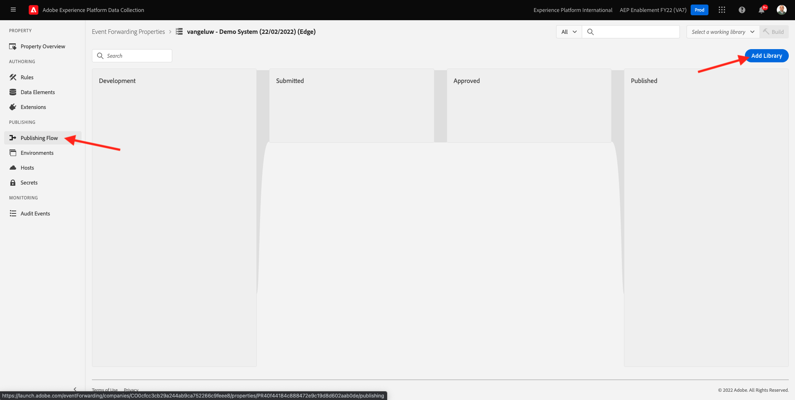

# 14.1 Skapa en händelsevidarebefordringsegenskap för Adobe Experience Platform Data Collection

>[!NOTE]
>
>Mobiltillägget Adobe Experience Platform Edge finns för närvarande i BETA. Tillägget används endast genom inbjudan. Kontakta din Customer Success Manager på Adobe om du vill veta mer och få tillgång till materialet för kursen.

## 14.1.1 Vad är en Adobe Experience Platform Data Collection Event Forwarding-egenskap?

När data samlas in med Adobe Experience Platform Data Collection samlas de oftast in på **Klientsida**. The **Klientsida** är en miljö som en webbplats eller ett mobilprogram. I modul 0 och Modul 1 diskuterades konfigurationen av en klientegenskap i Adobe Experience Platform Data Collection i detalj och du implementerade den egenskapen i Adobe Experience Platform Data Collection Client på din webbplats och i ditt mobilprogram, så att data kunde samlas in där när en kund interagerade med webbplatsen och mobilappen.

När interaktionsdata samlas in av egenskapen Adobe Experience Platform Data Collection Client skickas en begäran från webbplatsen eller mobilappen till Adobe Edge. Edge är Adobe Data Collection-miljö och är ingångspunkt för clickstream-data i Adobe-ekosystemet. Från Edge skickas sedan insamlade data till program som Adobe Experience Platform, Adobe Analytics, Adobe Audience Manager eller Adobe Target.

Med en ny händelsevidarebefordringsegenskap för Adobe Experience Platform Data Collection är det nu möjligt att konfigurera en Adobe Experience Platform Data Collection-egenskap som lyssnar på inkommande data på Edge. När händelsevidarebefordringsegenskapen för Adobe Experience Platform Data Collection som körs på Edge ser inkommande data kan den använda dessa data och vidarebefordra dem till någon annan plats. Det kan nu också vara en extern webkrok som inte är Adobe, vilket gör det möjligt att skicka data till exempelvis valfri datarö, ett beslutsprogram eller något annat program som kan öppna en webkrok.

Konfigurationen av en händelsevidarebefordringsegenskap för Adobe Experience Platform Data Collection ser bekant ut för en klientegenskap, med möjligheten att konfigurera dataelement och regler precis som tidigare med egenskaper för Adobe Experience Platform Data Collection Client. Hur data kommer att användas och kommas emellertid att se lite annorlunda ut beroende på hur de används.

Låt oss börja med att skapa egenskapen Händelsevidarebefordran för Adobe Experience Platform Data Collection.

## 14.1.2 Skapa en händelsevidarebefordringsegenskap för Adobe Experience Platform Data Collection

Gå till [https://experience.adobe.com/#/data-collection/](https://experience.adobe.com/#/data-collection/). Klicka på **Vidarebefordran av händelser**. Därefter visas en översikt över alla tillgängliga egenskaper för händelsevidarebefordran i Adobe Experience Platform Data Collection. Klicka på **Ny egenskap** -knappen.

Nu måste du ange ett namn för egenskapen för händelsevidarebefordran i Adobe Experience Platform Data Collection. Som en namnkonvention använder du `--demoProfileLdap-- - Demo System (DD/MM/YYYY) (Edge)`. I det här exemplet är namnet **vangeluw - Demo System (22/02/2022) (Edge)**. Klicka **Spara**.

Du kommer sedan tillbaka till listan över egenskaper för vidarebefordran av händelser för Adobe Experience Platform Data Collection. Klicka för att öppna den egenskap du nyss skapade.

## 14.1.2 Konfigurera tillägget Adobe Cloud Connector

Gå till den vänstra menyn **Tillägg**. Du kommer att se att **Core** tillägget har redan konfigurerats.

Gå till **Katalog**. Du kommer att se **Adobe Cloud Connector** tillägg. Klicka **Installera** för att installera den.

Tillägget läggs sedan till. Det finns ingen konfiguration att göra i det här steget. Du kommer tillbaka till översikten över installerade tillägg.

## 14.1.3 Distribuera din egenskap för händelsevidarebefordran i Adobe Experience Platform Data Collection

Gå till den vänstra menyn **Publiceringsflöde**. Klicka **Lägg till bibliotek**.

Ange namnet **Huvud**, välj miljö **Utveckling** och klicka **+ Lägg till alla ändrade resurser**.

Du kommer då att se det här. Klicka **Spara och bygg för utveckling**.

Ditt bibliotek kommer sedan att byggas, vilket kan ta 1-2 minuter.

Äntligen är biblioteket klart.

Nästa steg: [14.2 Uppdatera ditt datastream så att data blir tillgängliga för din Data Collection Event Forwarding-egenskap](./ex2.md)

[Gå tillbaka till modul 14](./aep-data-collection-ssf.md)

[Gå tillbaka till Alla moduler](./../../overview.md)
