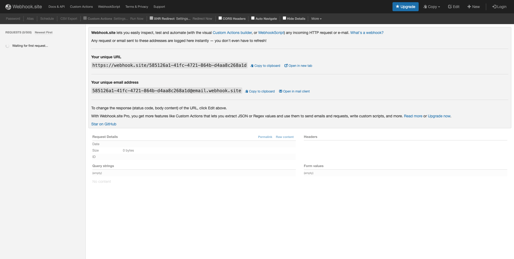
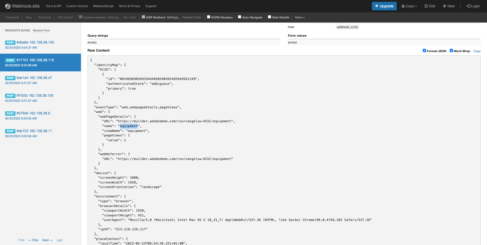

# 14.3 Skapa och konfigurera en anpassad webkrok

## 14.3.1 Skapa en egen webkrok

Gå till [https://webhook.site/](https://webhook.site/). Du kommer att se något liknande:

Du kommer att se din unika URL, som ser ut så här: `https://webhook.site/585126a1-41fc-4721-864b-d4aa8c268a1d`.

Den här webbplatsen har nu skapat den här webbkroken åt dig och du kan konfigurera den i din **[!DNL Event Forwarding property]** för att testa vidarebefordran av händelser.

## 14.3.2 Uppdatera egenskapen för händelsevidarebefordran: Skapa ett dataelement

Gå till [https://experience.adobe.com/#/data-collection/](https://experience.adobe.com/#/data-collection/) och gå till **Vidarebefordran av händelser**. Sök i egenskapen för vidarebefordran av händelser och klicka på den för att öppna den.

Gå till den vänstra menyn **Dataelement**. Klicka **Skapa nytt dataelement**.

Sedan visas ett nytt dataelement att konfigurera.

Gör följande val:

- Som **Namn**, ange **XDM-händelse**.
- Som **Tillägg**, markera **Core**.
- Som **Dataelementtyp**, markera **Bana**.
- Som **Bana**, ange **arc.event.xdm**. Genom att ange den här sökvägen filtrerar du ut **XDM** från händelsenyttolasten som skickas av webbplatsen eller mobilappen till Adobe Edge.

Du kommer nu att ha den här. Klicka **Spara**.

>[!NOTE]
>
>I ovanstående bana görs en referens till **arc**. **arc** står för Adobe Resource Context och **arc** står alltid för det högsta tillgängliga objektet som är tillgängligt i Server-sideskontexten. Detta kan kompletteras med berikning och omformning **arc** objekt med Adobe Experience Platform Data Collection Server-funktioner.
>
>I ovanstående bana görs en referens till **event**. **event** står för en unik händelse och Adobe Experience Platform Data Collection Server utvärderar alltid varje enskild händelse. Ibland kan du se en referens till **händelser** i nyttolasten som skickas av Web SDK-klientsidan, men i Adobe Experience Platform Data Collection Server utvärderas varje händelse för sig.

## 14.3.3 Uppdatera egenskapen för Adobe Experience Platform Data Collection Server: Skapa en regel

Gå till den vänstra menyn **Regler**. Klicka **Skapa ny regel**.

Därefter visas en ny regel att konfigurera. Ange **Namn**: **Alla sidor**. För den här övningen behöver du inte konfigurera något villkor. I stället ska du konfigurera en åtgärd. Klicka på **+ Lägg till** knapp under **Åtgärder**.

Du kommer då att se det här. Gör följande val:

- Välj **Tillägg**: **Adobe Cloud Connector**.
- Välj **Åtgärdstyp**: **Ring för hämtning**.

Det borde ge dig den här **Namn**: **Adobe Cloud Connector - ring för hämtning**. Nu bör du se det här:

Konfigurera sedan följande:

- Ändra förfrågningsmetoden från GET till **POST**
- Ange URL:en för den anpassade webkroken som du skapade i något av de föregående stegen på [https://webhook.site/](https://webhook.site/) webbplats, som ser ut så här: `https://webhook.site/585126a1-41fc-4721-864b-d4aa8c268a1d`

Du borde ha den här nu. Nästa, gå till **Brödtext**.

Du kommer då att se det här. Klicka på dataelementsikonen enligt nedan.

Markera dataelementet på popup-menyn **XDM-händelse** som du skapade i föregående steg. Klicka **Välj**.

Du kommer då att se det här. Klicka **Behåll ändringar**.

Du kommer då att se det här. Klicka **Spara**.

Du har nu konfigurerat din första regel i en händelsevidarebefordringsegenskap. Gå till **Publiceringsflöde** för att publicera ändringarna.
Öppna utvecklingsbiblioteket **Huvud** genom att klicka **Redigera** enligt vad som anges.

Klicka på **Lägg till alla ändrade resurser** efter vilken du ser regel- och dataelementen i det här biblioteket. Klicka på **Spara och bygg för utveckling**. Ändringarna distribueras nu.

Efter några minuter ser du att distributionen är klar och klar att testas.

## 14.3.4 Testa konfigurationen

Gå till [https://builder.adobedemo.com/projects](https://builder.adobedemo.com/projects). När du har loggat in med din Adobe ID ser du det här. Klicka på webbplatsprojektet för att öppna det.

Nu kan du följa nedanstående flöde för att komma åt webbplatsen. Klicka **Integreringar**.

På **Integreringar** måste du välja den datainsamlingsegenskap som skapades i övning 0.1.

Du kommer då att se din demowebbplats öppnas. Markera URL-adressen och kopiera den till Urklipp.

Öppna ett nytt inkognito-webbläsarfönster.

Klistra in webbadressen till demowebbplatsen, som du kopierade i föregående steg. Du ombeds sedan logga in med din Adobe ID.

Välj kontotyp och slutför inloggningsprocessen.

Därefter visas webbplatsen i ett inkognitivt webbläsarfönster. För varje demonstration måste du använda ett nytt, inkognitivt webbläsarfönster för att läsa in webbadressen till demowebbplatsen.

När du öppnar din webbläsarutvecklarvy kan du inspektera nätverksbegäranden enligt nedan. När du använder filtret **interagera** kommer du att se de nätverksbegäranden som skickas av Adobe Experience Platform Data Collection Client till Adobe Edge.

Om du väljer oformaterad nyttolast går du till [https://jsonformatter.org/json-pretty-print](https://jsonformatter.org/json-pretty-print) och klistra in nyttolasten. Klicka **Gör vacker**. Du kommer då att se JSON-nyttolasten, **händelser** -objektet och **xdm** -objekt. När du definierade dataelementet använde du referensen **arc.event.xdm**, vilket resulterar i att du tolkar **xdm** nyttolastens objekt.

Byt vy till webbplatsen [https://webhook.site/](https://webhook.site/) som du använde i ett av de föregående stegen. Nu bör du ha en vy som liknar den här, där nätverksbegäranden visas på den vänstra menyn. Du ser **xdm** nyttolast som filtrerades bort från nätverksbegäran som visades ovan.

Bläddra nedåt en bit i nyttolasten för att hitta sidnamnet, vilket i det här fallet är **vangeluw-OCUC** (som är projektnamnet på demowebbplatsen).

Om du nu navigerar på webbplatsen kommer du att se ytterligare nätverksförfrågningar bli tillgängliga på den här anpassade webbkroken i realtid.

Du har nu konfigurerat vidarebefordran på serversidan av Web SDK/XDM-nyttolaster till en extern anpassad webkrok. I nästa övning kommer du att konfigurera ett liknande tillvägagångssätt, och du kommer att skicka samma data till Google- och AWS-miljöer.

Nästa steg: [14.4 Skapa och konfigurera en Google Cloud-funktion](./ex4.md)

[Gå tillbaka till modul 14](./aep-data-collection-ssf.md)

[Gå tillbaka till Alla moduler](./../../overview.md)
