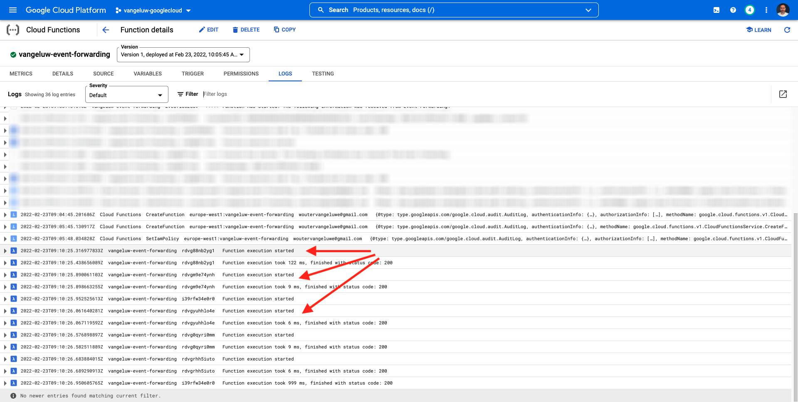

# 14.4 Skapa och konfigurera en Google Cloud-funktion

## 14.4.1 Skapa en Google Cloud-funktion

Gå till [https://console.cloud.google.com/](https://console.cloud.google.com/). Gå till **Molnfunktioner**.


Du kommer då att se det här. Klicka **SKAPA FUNKTION**.


Du kommer då att se det här.


Gör följande val:

- **Funktionsnamn**: `--demoProfileLdap---event-forwarding`
- **Län**: välj region
- **Utlösartyp**: välj **HTTP**
- **Autentisering**: välj **Tillåt oautentiserade anrop**

Du borde ha den här nu. Klicka **SPARA**.


Klicka **NÄSTA**.


Då ser du det här:


Gör följande val:

- **Körning**: välj **Node.js 16** (eller senare)
- **Startpunkt**: enter **helloAEP**

Klicka **AKTIVERA API** för att aktivera **API för molnbygge**. Då visas ett nytt fönster. I det nya fönstret klickar du på **AKTIVERA** igen.


Du kommer då att se det här. Klicka **Aktivera**.


En gång **API för molnbygge** har aktiverats, du kommer att se detta.


Gå tillbaka till **Molnfunktion**.
Kontrollera att du har följande kod i den inbyggda redigeraren för molnfunktioner:

```javascript
/**
 * Responds to any HTTP request.
 *
 * @param {!express:Request} req HTTP request context.
 * @param {!express:Response} res HTTP response context.
 */
exports.helloAEP = (req, res) => {
  let message = req.query.message || req.body.message || 'Hello World!';
  res.status(200).send(message);
};
```

Klicka på **DISTRIBUERA**.


Du kommer då att se det här. Din molnfunktion skapas nu. Det här kan ta några minuter.


När funktionen har skapats och körts ser du det här. Klicka på funktionens namn för att öppna den.


Du kommer då att se det här. Gå till **TRIGGER**. Då ser du **Utlösar-URL** vilket är det du ska använda för att definiera slutpunkten i Launch Server Side.


Kopiera utlösar-URL:en som ser ut så här: **https://europe-west1-dazzling-pillar-273812.cloudfunctions.net/vangeluw-event-forwarding**.

I nästa steg ska du konfigurera Adobe Experience Platform Data Collection Server för direktuppspelning av specifik information om **Sidvyer** till din Google Cloud-funktion. I stället för att bara vidarebefordra hela nyttolasten i befintligt skick skickar du bara saker som **ECID**, **tidsstämpel** och **Sidnamn** till din Google Cloud-funktion.

Här är ett exempel på en nyttolast som du måste analysera för att filtrera bort de ovannämnda variablerna:

```json
{
  "events": [
    {
      "xdm": {
        "eventType": "web.webpagedetails.pageViews",
        "web": {
          "webPageDetails": {
            "URL": "https://builder.adobedemo.com/run/vangeluw-OCUC",
            "name": "vangeluw-OCUC",
            "viewName": "vangeluw-OCUC",
            "pageViews": {
              "value": 1
            }
          },
          "webReferrer": {
            "URL": "https://builder.adobedemo.com/run/vangeluw-OCUC/equipment"
          }
        },
        "device": {
          "screenHeight": 1080,
          "screenWidth": 1920,
          "screenOrientation": "landscape"
        },
        "environment": {
          "type": "browser",
          "browserDetails": {
            "viewportWidth": 1920,
            "viewportHeight": 451
          }
        },
        "placeContext": {
          "localTime": "2022-02-23T06:51:07.140+01:00",
          "localTimezoneOffset": -60
        },
        "timestamp": "2022-02-23T05:51:07.140Z",
        "implementationDetails": {
          "name": "https://ns.adobe.com/experience/alloy/reactor",
          "version": "2.8.0+2.9.0",
          "environment": "browser"
        },
        "_experienceplatform": {
          "identification": {
            "core": {
              "ecid": "08346969856929444850590365495949561249"
            }
          },
          "demoEnvironment": {
            "brandName": "vangeluw-OCUC"
          },
          "interactionDetails": {
            "core": {
              "channel": "web"
            }
          }
        }
      },
      "query": {
        "personalization": {
          "schemas": [
            "https://ns.adobe.com/personalization/html-content-item",
            "https://ns.adobe.com/personalization/json-content-item",
            "https://ns.adobe.com/personalization/redirect-item",
            "https://ns.adobe.com/personalization/dom-action"
          ],
          "decisionScopes": [
            "eyJ4ZG06YWN0aXZpdHlJZCI6Inhjb3JlOm9mZmVyLWFjdGl2aXR5OjE0YzA1MjM4MmUxYjY1MDUiLCJ4ZG06cGxhY2VtZW50SWQiOiJ4Y29yZTpvZmZlci1wbGFjZW1lbnQ6MTRiZjA5ZGM0MTkwZWJiYSJ9",
            "__view__"
          ]
        }
      }
    }
  ],
  "query": {
    "identity": {
      "fetch": [
        "ECID"
      ]
    }
  },
  "meta": {
    "state": {
      "domain": "adobedemo.com",
      "cookiesEnabled": true,
      "entries": [
        {
          "key": "kndctr_907075E95BF479EC0A495C73_AdobeOrg_identity",
          "value": "CiYwODM0Njk2OTg1NjkyOTQ0NDg1MDU5MDM2NTQ5NTk0OTU2MTI0OVIPCPn66KfyLxgBKgRJUkwx8AH5-uin8i8="
        },
        {
          "key": "kndctr_907075E95BF479EC0A495C73_AdobeOrg_consent_check",
          "value": "1"
        },
        {
          "key": "kndctr_907075E95BF479EC0A495C73_AdobeOrg_consent",
          "value": "general=in"
        }
      ]
    }
  }
}
```

Det här är de fält som innehåller den information som behöver tolkas:

- ECID: **events.xdm._experience.platform.identify.core.ecid**
- tidsstämpel: **tidsstämpel**
- Sidnamn: **events.xdm.web.webPageDetails.name**

Vi går till Adobe Experience Platform Data Collection Server nu och konfigurerar dataelementen så att det blir möjligt.

## 14.4.2 Uppdatera egenskapen för händelsevidarebefordran: Dataelement

Gå till [https://experience.adobe.com/#/data-collection/](https://experience.adobe.com/#/data-collection/) och gå till **Vidarebefordran av händelser**. Sök i egenskapen för vidarebefordran av händelser och klicka på den för att öppna den.


Gå till den vänstra menyn **Dataelement**. Klicka **Lägg till dataelement**.


Sedan visas ett nytt dataelement att konfigurera.


Gör följande val:

- Som **Namn**, ange **customerECID**.
- Som **Tillägg**, markera **Core**.
- Som **Dataelementtyp**, markera **Bana**.
- Som **Bana**, ange `arc.event.xdm.--aepTenantId--.identification.core.ecid`. Genom att ange den här sökvägen filtrerar du ut fältet **ecid** från händelsenyttolasten som skickas av webbplatsen eller mobilappen till Adobe Edge.

>[!NOTE]
>
>I banorna ovan och under görs en referens till **arc**. **arc** står för Adobe Resource Context och **arc** står alltid för det högsta tillgängliga objektet som är tillgängligt i Server-sideskontexten. Detta kan kompletteras med berikning och omformning **arc** objekt med Adobe Experience Platform Data Collection Server-funktioner.
>
>I banorna ovan och under görs en referens till **event**. **event** står för en unik händelse och Adobe Experience Platform Data Collection Server utvärderar alltid varje enskild händelse. Ibland kan du se en referens till **händelser** i nyttolasten som skickas av Web SDK-klientsidan, men i Adobe Experience Platform Data Collection Server utvärderas varje händelse för sig.

Du kommer nu att ha den här. Klicka **Spara**.


Klicka **Lägg till dataelement**.


Sedan visas ett nytt dataelement att konfigurera.


Gör följande val:

- Som **Namn**, ange **eventTimestamp**.
- Som **Tillägg**, markera **Core**.
- Som **Dataelementtyp**, markera **Bana**.
- Som **Bana**, ange **arc.event.xdm.timestamp**. Genom att ange den här sökvägen filtrerar du ut fältet **tidsstämpel** från händelsenyttolasten som skickas av webbplatsen eller mobilappen till Adobe Edge.

Du kommer nu att ha den här. Klicka **Spara**.


Klicka **Lägg till dataelement**.


Sedan visas ett nytt dataelement att konfigurera.


Gör följande val:

- Som **Namn**, ange **pageName**.
- Som **Tillägg**, markera **Core**.
- Som **Dataelementtyp**, markera **Bana**.
- Som **Bana**, ange **arc.event.xdm.web.webPageDetails.name**. Genom att ange den här sökvägen filtrerar du ut fältet **name** från händelsenyttolasten som skickas av webbplatsen eller mobilappen till Adobe Edge.

Du kommer nu att ha den här. Klicka **Spara**.


Nu har du skapat dessa dataelement:


## 14.4.3 Uppdatera egenskapen för händelsevidarebefordran: Uppdatera en regel

Gå till den vänstra menyn **Regler**. I föregående övning skapade du regeln **Alla sidor**. Klicka på den regeln för att öppna den.


Du kommer då att göra det här. Klicka på **+** ikon under **Åtgärder** för att lägga till en ny åtgärd.


Du kommer då att se det här.


Gör följande val:

- Välj **Tillägg**: **Adobe Cloud Connector**.
- Välj **Åtgärdstyp**: **Ring för hämtning**.

Det borde ge dig den här **Namn**: **Adobe Cloud Connector - ring för hämtning**. Nu bör du se det här:


Konfigurera sedan följande:

- Ändra begärandeprotokollet från GET till **POST**
- Ange URL-adressen till den Google Cloud-funktion du skapade i något av de föregående stegen som ser ut så här: **https://europe-west1-dazzling-pillar-273812.cloudfunctions.net/vangeluw-event-forwarding**

Du borde ha den här nu. Nästa, gå till **Brödtext**.


Du kommer då att se det här. Klicka på alternativknappen för **JSON**.


Konfigurera **Brödtext** enligt följande:

| NYCKEL | VÄRDE |
|--- |--- |
| customerECID | {{customerECID}} |
| pageName | {{pageName}} |
| eventTimestamp | {{eventTimestamp}} |

Du kommer då att se det här. Klicka **Behåll ändringar**.


Du kommer då att se det här. Klicka **Spara**.


Du har nu uppdaterat din befintliga regel i en Adobe Experience Platform Data Collection Server-egenskap. Gå till **Publiceringsflöde** för att publicera ändringarna. Öppna utvecklingsbiblioteket **Huvud** genom att klicka **Redigera** enligt vad som anges.


Klicka på **Lägg till alla ändrade resurser** efter vilken du ser regel- och dataelementen i det här biblioteket. Klicka på **Spara och bygg för utveckling**. Ändringarna distribueras nu.


Efter några minuter ser du att distributionen är klar och klar att testas.


## 14.3.4 Testa konfigurationen

Gå till [https://builder.adobedemo.com/projects](https://builder.adobedemo.com/projects). När du har loggat in med din Adobe ID ser du det här. Klicka på webbplatsprojektet för att öppna det.


Nu kan du följa nedanstående flöde för att komma åt webbplatsen. Klicka **Integreringar**.


På **Integreringar** måste du välja den datainsamlingsegenskap som skapades i övning 0.1.


Du kommer då att se din demowebbplats öppnas. Markera URL-adressen och kopiera den till Urklipp.


Öppna ett nytt inkognito-webbläsarfönster.


Klistra in webbadressen till demowebbplatsen, som du kopierade i föregående steg. Du ombeds sedan logga in med din Adobe ID.


Välj kontotyp och slutför inloggningsprocessen.


Därefter visas webbplatsen i ett inkognitivt webbläsarfönster. För varje demonstration måste du använda ett nytt, inkognitivt webbläsarfönster för att läsa in webbadressen till demowebbplatsen.


När du öppnar din webbläsarutvecklarvy kan du inspektera nätverksbegäranden enligt nedan. När du använder filtret **interagera** kommer du att se de nätverksbegäranden som skickas av Adobe Experience Platform Data Collection Client till Adobe Edge.


Byt vy till din Google Cloud-funktion och gå till **LOGGAR**. Nu bör du ha en vy som liknar den här, där ett antal loggposter visas. Varje gång du ser **Funktionskörningen har startats** innebär det att inkommande trafik togs emot i din Google Cloud-funktion.



Låt oss uppdatera funktionen lite för att arbeta med inkommande data och visa den information som togs emot från Adobe Experience Platform Data Collection Server. Gå till **KÄLLA** och klicka **REDIGERA**.


På nästa skärm klickar du på **NÄSTA**.


Uppdatera koden så här:

```javascript
/**
 * Responds to any HTTP request.
 *
 * @param {!express:Request} req HTTP request context.
 * @param {!express:Response} res HTTP response context.
 */
exports.helloAEP = (req, res) => {
  console.log('>>>>> Function has started. The following information was received from Event Forwarding:');
  console.log(req.body);

  let message = req.query.message || req.body.message || 'Hello World!';
  res.status(200).send(message);
};
```

Du får den här då. Klicka **DISTRIBUERA**.


Efter några minuter distribueras funktionen igen. Klicka på funktionsnamnet för att öppna det.


Gå till en produkt på demowebbplatsen, till exempel **DEIRDRE RELAXED-FIT CAPRI**.


Byt vy till din Google Cloud-funktion och gå till **LOGGAR**. Nu bör du ha en vy som liknar den här, där ett antal loggposter visas.

För varje sidvy på demowebbplatsen bör du nu se en ny logginmatning i loggarna för Google Cloud Function som visar den mottagna informationen.


Du har nu skickat data som samlats in av Adobe Experience Platform Data Collection i realtid till en Google Cloud Function-slutpunkt. Därifrån kan dessa data användas av alla Google Cloud Platform-program, som BigQuery för lagring och rapportering eller för Machine Learning-användningsfall.

Nästa steg: [14.5 Vidarebefordra evenemang till AWS ekosystem](./ex5.md)

[Gå tillbaka till modul 14](./aep-data-collection-ssf.md)

[Gå tillbaka till Alla moduler](./../../overview.md)
