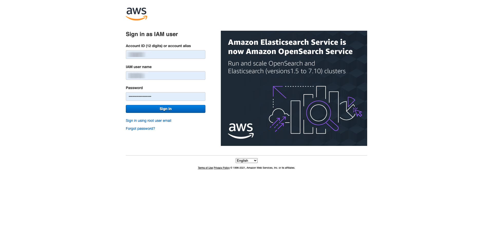
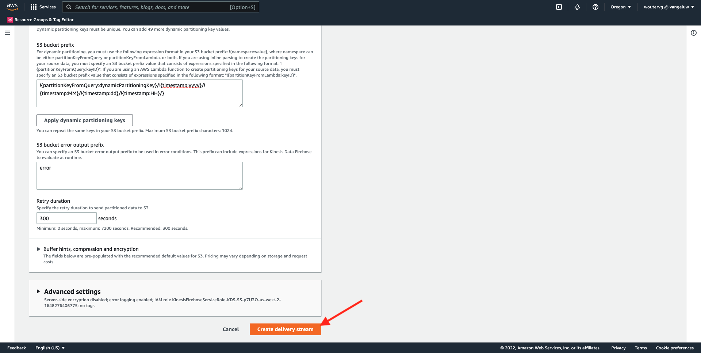
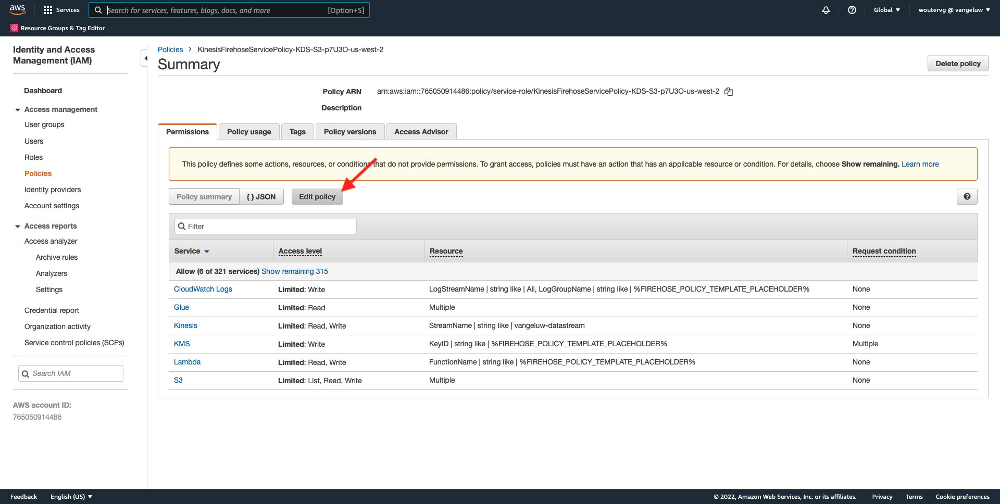
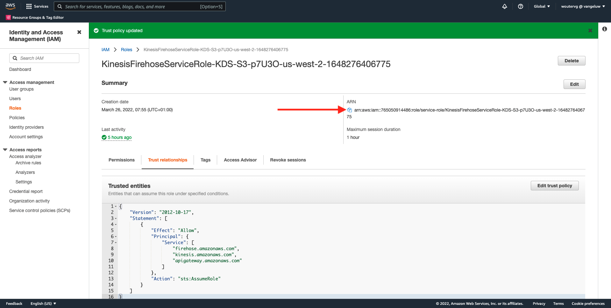
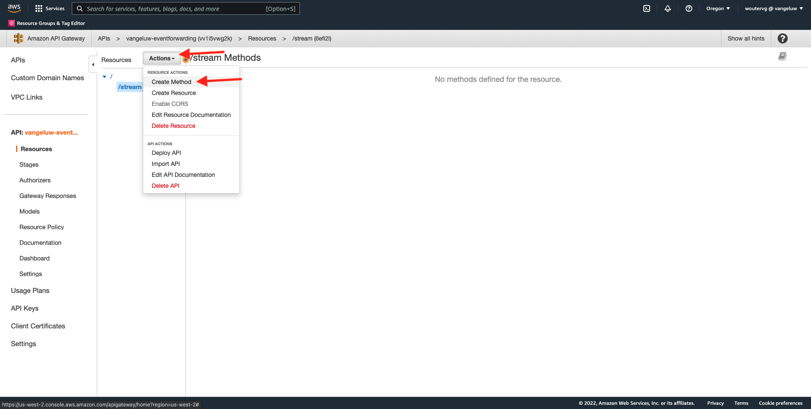
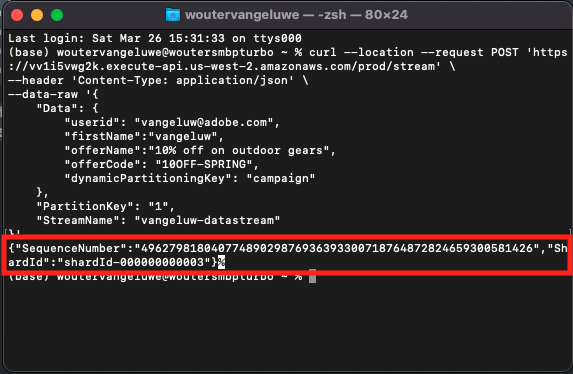
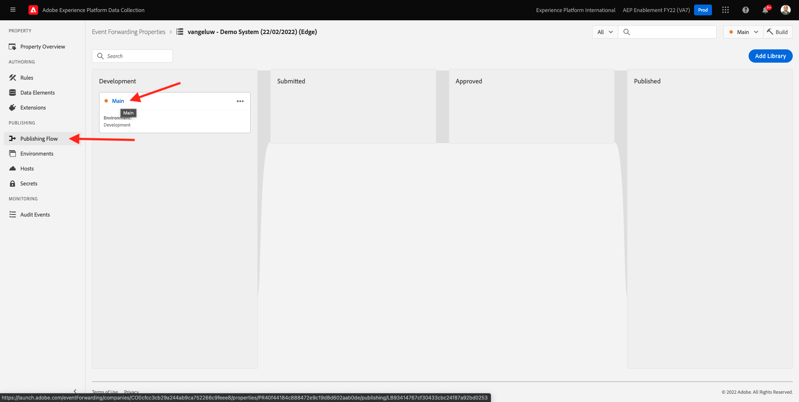

# 14.5 Vidarebefordra evenemang till AWS ekosystem

>[!IMPORTANT]
>
>Det är valfritt att slutföra övningen och det kostar inte att använda AWS Kinesis. AWS erbjuder ett kostnadsfritt nivåkonto där du kan testa och konfigurera många tjänster utan kostnad, men AWS Kinesis ingår inte i det kostnadsfria nivåkontot. För att genomföra och testa denna övning kommer det att kosta att använda AWS Kinesis.

## Bra att veta

Adobe Experience Platform stöder olika Amazon-tjänster som mål.
Kinesis och S3 är båda [mål för profilexport](https://experienceleague.adobe.com/docs/experience-platform/destinations/destination-types.html?lang=en) och kan användas som en del av Adobe Experience Platform Real-Time CDP.
Du kan enkelt mata in värdefulla segmenthändelser och tillhörande profilattribut i valfritt system.

I den här artikeln får du lära dig hur du konfigurerar en egen Amazon Kinesis-ström för att strömma händelsedata från Adobe Experience Platform Edge-ekosystemet till ett molnlagringsmål, som Amazon S3. Detta är användbart om du vill samla in upplevelsehändelser från webb- och mobilsajter och överföra dem till datalagret för analys och operativ rapportering. I allmänhet importeras data batchvis med stora dagliga filimporter, men de visar inte offentliga http-slutpunkter som kan användas i samband med händelsevidarebefordran.

Stöd för ovanstående användningsfall innebär att strömmande data måste buffras eller placeras i en kö innan de skrivs till en fil. Man måste se till att inte öppna filen för skrivåtkomst i flera processer. Att delegera denna uppgift till ett dedikerat system är idealiskt för att skalas fint samtidigt som man säkerställer en hög servicenivå. Det är här Kinesis kommer till undsättningen.

Amazon Kinesis dataströmmar fokuserar på inmatning och lagring av dataströmmar. Kinesis Data Firehose fokuserar på att leverera dataströmmar till utvalda destinationer, till exempel S3-bucket.

Som en del av den här övningen..

- Utför en grundläggande konfiguration av en dataström från Kinesis
- Skapa en Firehows leveransström och använd S3-bucket som mål
- Konfigurera Amazon API-gateway som en rest API-slutpunkt för att ta emot händelsedata
- Vidarebefordra råa händelsedata från Adobe Edge till din Kinesis-ström

## 14.5.1 Konfigurera din AWS S3-bucket

Gå till [https://console.aws.amazon.com](https://console.aws.amazon.com) och logga in med det Amazon-konto du skapade tidigare.



När du har loggat in omdirigeras du till **AWS Management Console**.


I **Hitta tjänster** meny, söka efter **s3**. Klicka på det första sökresultatet: **S3 - Skalbar lagring i molnet**.


Då ser du **Amazon S3** hemsida. Klicka **Skapa kryss**.


I **Skapa kryss** måste du konfigurera två saker:

- Namn: använd namnet `eventforwarding---demoProfileLdap--`. I den här övningen är Bucket-namnet **aepmodulertcdpvangeluw**
- Region: använd regionen **EU (Frankfurt) eu-central-1**


Låt alla andra standardinställningar vara som de är. Bläddra nedåt och klicka **Skapa bucket**.


Då ser du att din bucket skapas och kommer att omdirigeras till Amazon S3-hemsida.


## 14.5.2 Konfigurera AWS Kinesis dataström

I **Hitta tjänster** meny, söka efter **kines**. Klicka på det första sökresultatet: **Kinesis - Arbeta med realtidsströmmande data**.


Välj **Kinesis dataströmmar**. Klicka **Skapa dataström**.


För **Dataströmmens namn**, använda `--demoProfileLdap---datastream`.


Du behöver inte ändra några andra inställningar. Bläddra nedåt och klicka **Skapa dataström**.


Du kommer då att se det här. När dataströmmen har skapats kan du gå vidare till nästa övning.


## 14.5.3 Konfigurera AWS Firehose Delivery Stream

I **Hitta tjänster** meny, söka efter **kines**. Klicka **Kinesis Data Fireworks**.


Klicka **Skapa leveransström**.


För **Källa**, markera **Amazon Kinesis dataströmmar**. För **Mål**, markera **Amazon S3**. Klicka **Bläddra** för att välja dataström.


Välj dataström. Klicka **Välj**.


Du kommer då att se det här. Kom ihåg **Namn på leveransström** som du kommer att behöva det senare.


Bläddra nedåt tills du ser **Destinationsinställningar**. Klicka **Bläddra** för att välja din S3-bucket.


Välj S3-bucket och klicka **Välj**.


Då ser du något sådant här. Uppdatera följande inställningar:

- Dynamisk partitionering: ange till **Aktiverad**
- Delning av flera poster: ange till **Handikappade**
- Ny radavgränsare: ange till **Aktiverad**
- Textbunden analys för JSON: ange till **Aktiverad**


Bläddra ned en bit så ser du det här. Uppdatera följande inställningar:

- Dynamiska partitioneringsnycklar
   - Nyckelnamn: **dynamicPartitioningKey**
   - JQ-uttryck: **.dynamicPartitioningKey**
- S3-bucket-prefix: lägg till följande kod:

```bash
!{partitionKeyFromQuery:dynamicPartitioningKey}/!{timestamp:yyyy}/!{timestamp:MM}/!{timestamp:dd}/!{timestamp:HH}/}
```

- Utdataprefix för S3-bucket-fel: ange till **fel**


Rulla sedan ned lite till och klicka **Skapa leveransström**



Efter några minuter kommer din leveransström att skapas och **Aktiv**.


## 14.5.4 Konfigurera din AWS IAM-roll

I **Hitta tjänster** meny, söka efter **iam**. Klicka **API-gateway**.


Klicka **Roller**.


Sök efter **KinesisFirehose** roll. Klicka på den för att öppna den.


Klicka på ditt namn för behörighetsprincip för att öppna det.


Klicka på **Redigera princip**.



Under **Kinesis** - **Åtgärder**, se till att **Skriv** behörigheter för **PutRecord** är aktiverat. Klicka **Granska princip**.


Klicka **Spara ändringar**.


Du kommer då tillbaka hit. Klicka **Roller**.


Sök efter **KinesisFirehose** roll. Klicka på den för att öppna den.


Gå till **Förtroenderelationer** och klicka **Redigera förtroendeprincip**.


Skriv över den aktuella förtroendeprincipen genom att klistra in den här koden för att ersätta den befintliga koden:

```json
{
	"Version": "2012-10-17",
	"Statement": [
		{
			"Effect": "Allow",
			"Principal": {
				"Service": [
                    "firehose.amazonaws.com",
                    "kinesis.amazonaws.com",
                    "apigateway.amazonaws.com"
                ]
			},
			"Action": "sts:AssumeRole"
		}
	]
}
```

Klicka **Uppdatera princip**


Du kommer då att se det här. Du måste ange **ARN** för den här rollen i nästa steg.



## 14.5.5 Konfigurera din AWS API Gateway

Amazon API Gateway är en AWS-tjänst som du kan använda för att skapa, publicera, underhålla, övervaka och skydda REST-, HTTP- och WebSocket-API:er i alla skalor. API-utvecklare kan skapa API:er som har åtkomst till AWS eller andra webbtjänster, samt data som lagras i AWS Cloud.

Du kommer nu att visa Kinesis dataström för Internet via en HTTPS-slutpunkt som sedan kan användas direkt av Adobes tjänster, som till exempel händelsevidarebefordran.

I **Hitta tjänster** meny, söka efter **api gateway**. Klicka **API-gateway**.


Då ser du något sådant här. Klicka **Skapa API**.


Klicka **Bygge** på **REST API** kort.


Du kommer då att se det här. Fyll i inställningarna så här:

- Välj protokoll: välj **REST**
- Skapa nytt API: välj **Nytt API**
- Inställningar:
   - API-namn: use `--demoProfileLdap---eventforwarding`
   - Slutpunktstyp: välj **Regional**

Klicka **Skapa API**.


Du kommer då att se det här. Klicka **Åtgärder** och sedan klicka **Skapa resurs**.


Du kommer då att se det här. Ange **Resursnamn** till **stream**. Klicka **Skapa resurs**.


Du kommer då att se det här. Klicka **Åtgärder** och sedan klicka **Skapa metod**.



I listrutan väljer du **POST** och klicka på **v** -knappen.


Du kommer då att se det här. Fyll i inställningarna så här:

- Integrationstyp: **AWS Service**
- AWS: Markera den region som används av Kinesis dataström, i det här fallet: **us-west-2**
- AWS-tjänst: välj **Kinesis**
- AWS-underdomän: lämna tomt
- HTTP-metod: välj **POST**
- Åtgärdstyp: välj **Använd åtgärdsnamn**
- Åtgärd: enter **PutRecord**
- Körningsroll: klistra in **ARN** av den körningsroll som används av Kinesis Data Firehose, enligt instruktionerna i föregående övning
- Innehållshantering: välj **Genomströmning**
- Använd standardtimeout: aktivera kryssrutan

Klicka **Spara**.


Du kommer då att se det här. Klicka **Integreringsbegäran**.


Klicka **HTTP-huvuden**.


Bläddra nedåt en stund och klicka **Lägg till rubrik**.


Ange **Namn** till **Content-Type**, ange **Mappat från** till `'application/x-amz-json-1.1'`. Klicka på **v** om du vill spara ändringarna.


Du kommer då att se det här. För **Begär brödtext**, markera **När inga mallar har definierats (rekommenderas)**. Klicka på **Lägg till mappningsmall**.


Under **Content-Type**, ange **application/json**. Klicka på **v** om du vill spara ändringarna.


Bläddra ned för att hitta ett kodredigeringsfönster. Klistra in nedanstående kod där:

```json
{
  "StreamName": "$input.path('StreamName')",
  "Data": "$util.base64Encode($input.json('$.Data'))",
  "PartitionKey": "$input.path('$.PartitionKey')"
}
```

Klicka **Spara**.


Bläddra sedan uppåt och klicka **&lt;- Metodkörning** att gå tillbaka.


Klicka **TEST**.


Bläddra nedåt och klistra in koden under **Begärandetext**. Klicka **Testa**.

```json
{
  "Data": {
    "message": "Hello World",
    "dynamicPartitioningKey": "v2"
  },
  "PartitionKey": "1",
  "StreamName": "--demoProfileLdap---datastream"
}
```


Då ser du ett liknande resultat:


Du kommer då att se det här. Klicka **Åtgärder** och sedan klicka **Distribuera API**.


För **Distributionsfas**, markera **Ny scen**. Som **Scennamn**, ange **prod**. Klicka **Distribuera**.


Du kommer då att se det här. Klicka **Spara ändringar**. Obs! URL:en i bilden är den URL som ska användas för att skicka data till (i det här exemplet: https://vv1i5vwg2k.execute-api.us-west-2.amazonaws.com/prod).


Du kan testa konfigurationen genom att använda nedanstående cURL-begäran. Allt du behöver göra är att ersätta nedanstående URL med din, `https://vv1i5vwg2k.execute-api.us-west-2.amazonaws.com/prod` i det här exemplet och lägg till `/stream` i slutet av URL:en.

```json
curl --location --request POST 'https://vv1i5vwg2k.execute-api.us-west-2.amazonaws.com/prod/stream' \
--header 'Content-Type: application/json' \
--data-raw '{
    "Data": {
        "userid": "--demoProfileLdap--@adobe.com",
        "firstName":"--demoProfileLdap--",
        "offerName":"10% off on outdoor gears",
        "offerCode": "10OFF-SPRING",
        "dynamicPartitioningKey": "campaign"
    },
    "PartitionKey": "1",
    "StreamName": "--demoProfileLdap---datastream"
}'
```

Klistra in ovanstående uppdaterade kod i ett terminalfönster och tryck på Retur. Du kommer då att se det här svaret, som det svar du kunde se när du testade ovan.



## 14.5.6 Uppdatera egenskapen för händelsevidarebefordran

Nu kan du aktivera till dataströmmen för AWS Kinesis via AWS API Gateway, så att du kan skicka dina raw-upplevelsehändelser till AWS ekosystem. Med Real-Time CDP Connections och Event Forwarding kan du nu enkelt aktivera vidarebefordran av händelser till din nya AWS API Gateway-slutpunkt.

### 14.5.6.1 Uppdatera egenskapen för händelsevidarebefordran: Skapa ett dataelement

Gå till [https://experience.adobe.com/#/data-collection/](https://experience.adobe.com/#/data-collection/) och gå till **Vidarebefordran av händelser**. Sök i egenskapen för vidarebefordran av händelser och klicka på den för att öppna den.


Gå till den vänstra menyn **Dataelement**. Klicka **Lägg till dataelement**.


Sedan visas ett nytt dataelement att konfigurera.


Gör följande val:

- Som **Namn**, ange **awsDataObject**.
- Som **Tillägg**, markera **Core**.
- Som **Dataelementtyp**, markera **Egen kod**.

Du kommer nu att ha den här. Klicka **&lt;/> Öppna redigeraren**.


Klistra in följande kod på rad 3 i Editor. Klicka **Spara**.

```javascript
const newObj = {...arc.event.xdm, dynamicPartitioningKey: "event_forwarding"}
return JSON.stringify(newObj);
```


>[!NOTE]
>
>I ovanstående bana görs en referens till **arc**. **arc** står för Adobe Resource Context och **arc** står alltid för det högsta tillgängliga objektet som är tillgängligt i Server-sideskontexten. Detta kan kompletteras med berikning och omformning **arc** objekt med Adobe Experience Platform Data Collection Server-funktioner.
>
>I ovanstående bana görs en referens till **event**. **event** står för en unik händelse och Adobe Experience Platform Data Collection Server utvärderar alltid varje enskild händelse. Ibland kan du se en referens till **händelser** i nyttolasten som skickas av Web SDK-klientsidan, men i händelsevidarebefordran för Adobe Experience Platform Data Collection utvärderas varje händelse individuellt.

Du kommer då tillbaka hit. Klicka **Spara** eller **Spara i bibliotek**.


### 14.5.6.2 Uppdatera egenskapen för Adobe Experience Platform Data Collection Server: Uppdatera din regel

Gå till den vänstra menyn **Regler**. Klicka för att öppna regeln **Alla sidor** som du skapade i en av de tidigare övningarna.


Du kommer då att se det här. Klicka på **+** om du vill lägga till ett nytt funktionsmakro.


Du kommer då att se det här. Gör följande val:

- Välj **Tillägg**: **Adobe Cloud Connector**.
- Välj **Åtgärdstyp**: **Ring för hämtning**.

Det borde ge dig den här **Namn**: **Adobe Cloud Connector - ring för hämtning**. Nu bör du se det här:


Konfigurera sedan följande:

- Ändra förfrågningsmetoden från GET till **POST**
- Ange URL:en för AWS API Gateway-slutpunkten som du skapade i något av de föregående stegen, som ser ut så här: `https://vv1i5vwg2k.execute-api.us-west-2.amazonaws.com/prod/stream`

Du borde ha den här nu. Nästa, gå till **Sidhuvuden**.


Under rubriker lägger du till en ny rubrik med nyckel **Content-Type** och värde **application/json**. Nästa, gå till **Brödtext**.


Du kommer då att se det här. Klistra in följande kod i fältet **Brödtext (Raw)**. Klicka **Behåll ändringar**.

```json
{
    "Data":{{awsDataObject}},
    "PartitionKey": "1",
    "StreamName": "--demoProfileLdap---datastream"
}
```


Du kommer då att se vara tillbaka här. Klicka **Spara** eller **Spara i bibliotek**.


Du har nu konfigurerat din första regel i en händelsevidarebefordringsegenskap. Gå till **Publiceringsflöde** för att publicera ändringarna.
Öppna utvecklingsbiblioteket genom att klicka på **Huvud**.



Klicka på **Lägg till alla ändrade resurser** efter vilken du kommer att se ändringarna för regel och dataelement visas i det här biblioteket. Klicka på **Spara och bygg för utveckling**. Ändringarna distribueras nu.


Efter några minuter ser du att distributionen är klar och klar att testas.


## 14.5.7 Testa konfigurationen

Gå till [https://builder.adobedemo.com/projects](https://builder.adobedemo.com/projects). När du har loggat in med din Adobe ID ser du det här. Klicka på webbplatsprojektet för att öppna det.


Nu kan du följa nedanstående flöde för att komma åt webbplatsen. Klicka **Integreringar**.


På **Integreringar** måste du välja den datainsamlingsegenskap som skapades i övning 0.1.


Du kommer då att se din demowebbplats öppnas. Markera URL-adressen och kopiera den till Urklipp.


Öppna ett nytt inkognito-webbläsarfönster.


Klistra in webbadressen till demowebbplatsen, som du kopierade i föregående steg. Du ombeds sedan logga in med din Adobe ID.


Välj kontotyp och slutför inloggningsprocessen.


Därefter visas webbplatsen i ett inkognitivt webbläsarfönster. För varje demonstration måste du använda ett nytt, inkognitivt webbläsarfönster för att läsa in webbadressen till demowebbplatsen.


När du öppnar din webbläsarutvecklarvy kan du inspektera nätverksbegäranden enligt nedan. När du använder filtret **interagera** kommer du att se de nätverksbegäranden som skickas av Adobe Experience Platform Data Collection Client till Adobe Edge.


Om du väljer oformaterad nyttolast går du till [https://jsonformatter.org/json-pretty-print](https://jsonformatter.org/json-pretty-print) och klistra in nyttolasten. Klicka **Gör vacker**. Du kommer då att se JSON-nyttolasten, **händelser** -objektet och **xdm** -objekt. När du definierade dataelementet använde du referensen **arc.event.xdm**, vilket resulterar i att du tolkar **xdm** nyttolastens objekt.


Växla vy till **AWS**. Genom att öppna dataströmmen och gå in i **Övervakning** kommer du att se inkommande trafik.


När du sedan öppnar leveransflödet och går in i **Övervakning** visas även inkommande trafik.


När du har tittat på S3-bucket kommer du nu att märka att filer skapas där som en följd av att du har lagt in data.


När du laddar ned en sådan fil och öppnar den med en textredigerare ser du att den innehåller XDM-nyttolasten från de händelser som vidarebefordrats.


Nästa steg: [Sammanfattning och fördelar](./summary.md)

[Gå tillbaka till modul 14](./aep-data-collection-ssf.md)

[Gå tillbaka till Alla moduler](./../../overview.md)
