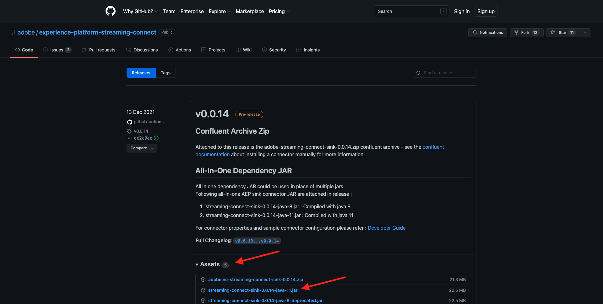
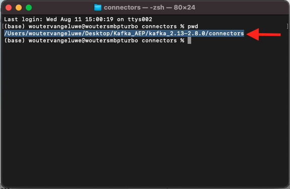
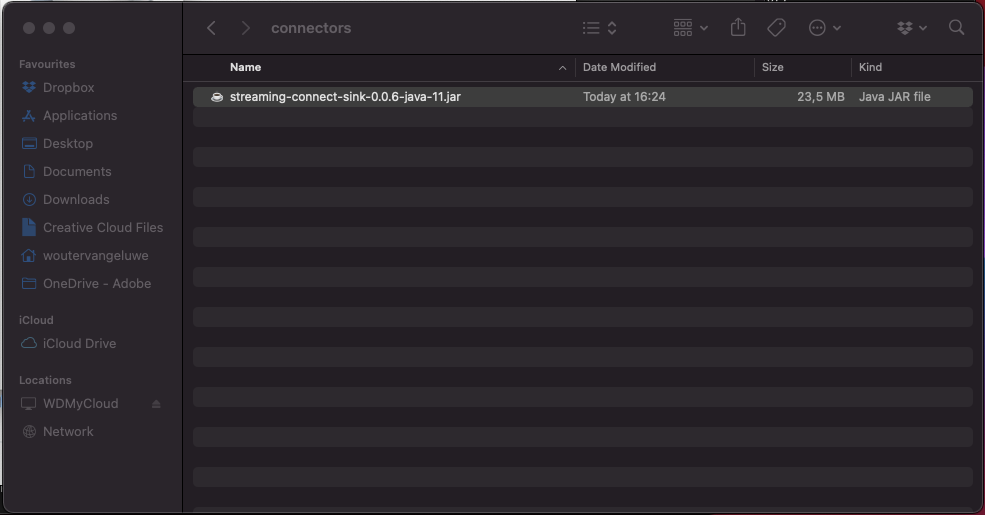
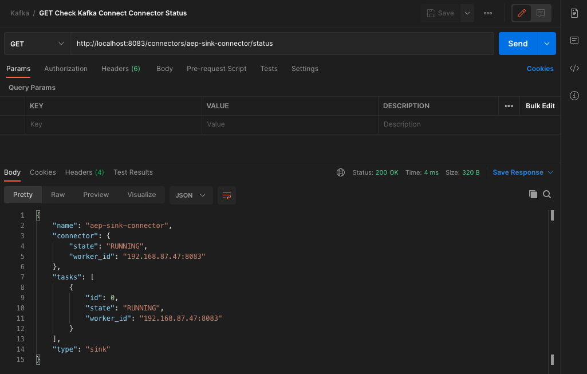
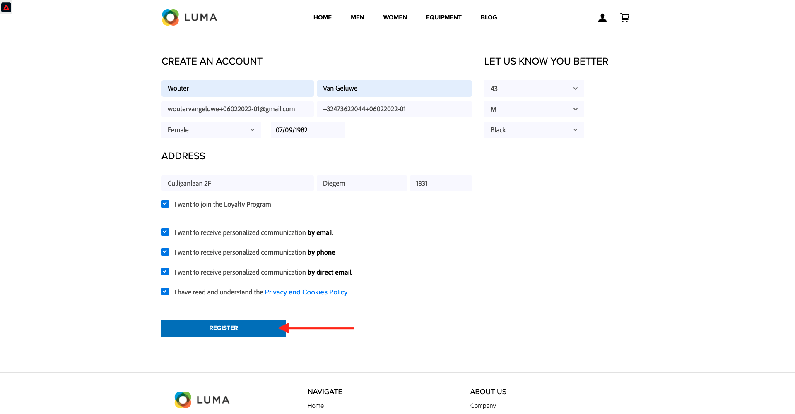
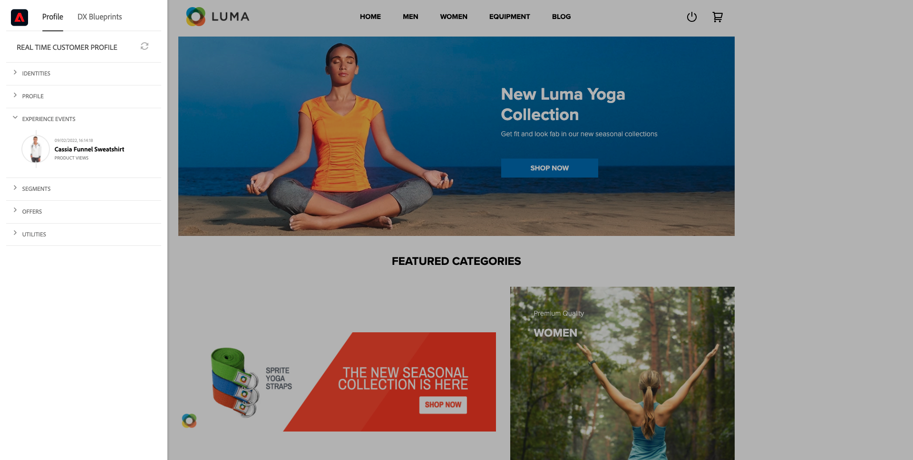

# 15.4 Installera och konfigurera Kafka Connect och Adobe Experience Platform Sink Connector

## 15.4.1 Ladda ned Adobe Experience Platform Sink Connector

Gå till [https://github.com/adobe/experience-platform-streaming-connect/releases](https://github.com/adobe/experience-platform-streaming-connect/releases) och ladda ned den senaste officiella versionen av Adobe Experience Platform Sink Connector.



Placera den hämtade filen, **streaming-connect-sink-0.0.14-java-11.jar**, på datorn.


## 15.4.2 Konfigurera Kafka Connect

Gå till mappen på skrivbordet med namnet **Kafka_AEP** och navigera till mappen `kafka_2.13-3.1.0/config`.
Öppna filen i den mappen **connect-distributed.properties** med en textredigerare.


Gå till rad 34 och 35 i textredigeraren och se till att du anger fälten `key.converter.schemas.enable` och `value.converter.schemas.enable` till `false`

```json
key.converter.schemas.enable=false
value.converter.schemas.enable=false
```

Spara ändringarna i den här filen.


Gå sedan tillbaka till mappen `kafka_2.13-3.1.0` och skapa en ny mapp manuellt och namnge den `connectors`.


Högerklicka på mappen och klicka på **Ny terminal i mapp**.


Du kommer då att se det här. Ange kommandot `pwd` om du vill hämta den fullständiga sökvägen för den mappen. Markera den fullständiga sökvägen och kopiera den till Urklipp.



Gå tillbaka till textredigeraren, till filen **connect-distributed.properties** och rulla ned till den sista raden (rad 86 i skärmbilden). Du bör avkommentera raden som börjar med `# plugin.path=` och du bör klistra in den fullständiga sökvägen till mappen med namnet `connectors`. Resultatet bör se ut ungefär så här:

`plugin.path=/Users/woutervangeluwe/Desktop/Kafka_AEP/kafka_2.13-3.1.0/connectors`

Spara ändringarna i filen **connect-distributed.properties** och stäng textredigeraren.


Kopiera sedan den senaste officiella versionen av Adobe Experience Platform Sink Connector som du laddat ned till mappen `connectors`. Den fil du laddade ned tidigare har ett namn **streaming-connect-sink-0.0.14-java-11.jar** kan du flytta det till `connectors` mapp.



Öppna sedan ett nytt terminalfönster på nivån **kafka_2.13-3.1.0** mapp. Högerklicka på mappen och klicka på **Ny terminal i mapp**.

Klistra in det här kommandot i terminalfönstret: `bin/connect-distributed.sh config/connect-distributed.properties` och klicka **Retur**. Det här kommandot startar Kafka Connect och läser in biblioteket för Adobe Experience Platform Sink Connector.


Efter några sekunder ser du något liknande:


## 15.4.3 Skapa en Adobe Experience Platform Sink Connector med Postman

Nu kan du interagera med Kafka Connect med Postman. Om du vill göra det hämtar du [this Postman Collection](../../assets/postman/postman_kafka.zip) och dekomprimera den till din lokala dator på skrivbordet. Du får då en fil som kallas `Kafka_AEP.postman_collection.json`.


Du måste importera den här filen till Postman. Öppna Postman och klicka **Importera**, dra och släpp filen `Kafka_AEP.postman_collection.json` i popup-fönstret och klicka **Importera**.


Den här samlingen finns sedan på den vänstra menyn i Postman. Klicka på den första begäran, **Kafka Connect-anslutningar tillgängliga för GET** för att öppna den.


Du kommer då att se det här. Klicka på den blå **Skicka** efter vilken du ska se ett tomt svar `[]`. Det tomma svaret beror på att inga Kafka Connect-anslutningar är definierade.


Om du vill skapa en koppling klickar du för att öppna den andra begäran i Kafka-samlingen, **POST Skapa AEP Sink Connector**. Du kommer då att se det här. På rad 11, där det står **&quot;aep.endpoint&quot;: &quot;&quot;** måste du klistra in URL:en för HTTP API-direktuppspelning som du fick i slutet av övningen [15.3](./ex3.md). Slutpunkts-URL:en för HTTP-API-direktuppspelning ser ut så här: `https://dcs.adobedc.net/collection/d282bbfc8a540321341576275a8d052e9dc4ea80625dd9a5fe5b02397cfd80dc`.


När du har klistrat in den bör texten i din begäran se ut så här. Klicka på den blå **Skicka** för att skapa din koppling. Du får ett omedelbart svar när du skapar kontakten.


Klicka på den första begäran, **Kafka Connect-anslutningar tillgängliga för GET** för att öppna den igen och klicka på den blå **Skicka** igen. Nu ser du att en Kafka Connect-anslutning har skapats.


Öppna sedan den tredje begäran i Kafka-samlingen, **GET Check Kafka Connect Connector Status**. Klicka på den blå **Skicka** får du sedan ett svar som det nedan som anger att anslutningen är igång.



## 15.4.4 Skapa en upplevelsehändelse

Öppna ett nytt **Terminal** genom att högerklicka på mappen **kafka_2.13-3.1.0** och klicka **Ny terminal i mapp**.


Ange följande kommando:

`bin/kafka-console-producer.sh --broker-list 127.0.0.1:9092 --topic aep`


Du kommer då att se det här. Varje ny rad som följs av att du trycker på Retur-knappen leder till att ett nytt meddelande skickas till ämnet **aep**.


Du kan nu skicka ett meddelande som kommer att förbrukas av Adobe Experience Platform Sink Connector och som kommer att hämtas till Adobe Experience Platform i realtid.

Låt oss göra lite demo för att testa det här.

Gå till [https://builder.adobedemo.com/projects](https://builder.adobedemo.com/projects). När du har loggat in med din Adobe ID ser du det här. Klicka på webbplatsprojektet för att öppna det.


På **Skärmar** sida, klicka **Kör**.


Du kommer då att se din demowebbplats öppnas. Markera URL-adressen och kopiera den till Urklipp.


Öppna ett nytt inkognito-webbläsarfönster.


Klistra in webbadressen till demowebbplatsen, som du kopierade i föregående steg. Du ombeds sedan logga in med din Adobe ID.


Välj kontotyp och slutför inloggningsprocessen.


Därefter visas webbplatsen i ett inkognitivt webbläsarfönster. För varje demonstration måste du använda ett nytt, inkognitivt webbläsarfönster för att läsa in webbadressen till demowebbplatsen.


Klicka på logotypikonen för Adobe i det övre vänstra hörnet av skärmen för att öppna profilvisningsprogrammet.


Ta en titt på panelen Profilvisningsprogram och kundprofilen i realtid med **Experience Cloud ID** som primär identifierare för den här okända kunden.


Gå till sidan Register/Login. Klicka **SKAPA ETT KONTO**.


Fyll i detaljerna och klicka **Registrera** därefter omdirigeras du till föregående sida.



Öppna profilvisarpanelen och gå till kundprofilen i realtid. På panelen Profilvisningsprogram ska du se alla dina personuppgifter visas, som dina nya e-post- och telefonidentifierare.


Du kan se vissa upplevelsehändelser baserade på tidigare aktivitet.



Vi ändrar det och skickar in en Callcenter-upplevelsehändelse från Kafka till Adobe Experience Platform.

Ta med exempelupplevelsehändelsenyttolasten nedan och kopiera den till en textredigerare.

```json
{
  "header": {
    "datasetId": "61fe23fd242870194a6d779c",
    "imsOrgId": "--aepImsOrgID--",
    "source": {
      "name": "Launch"
    },
    "schemaRef": {
      "id": "https://ns.adobe.com/experienceplatform/schemas/b0190276c6e1e1e99cf56c99f4c07a6e517bf02091dcec90",
      "contentType": "application/vnd.adobe.xed-full+json;version=1"
    }
  },
  "body": {
    "xdmMeta": {
      "schemaRef": {
        "id": "https://ns.adobe.com/experienceplatform/schemas/b0190276c6e1e1e99cf56c99f4c07a6e517bf02091dcec90",
        "contentType": "application/vnd.adobe.xed-full+json;version=1"
      }
    },
    "xdmEntity": {
      "eventType": "callCenterInteractionKafka",
      "_id": "",
      "timestamp": "2022-02-23T09:54:12.232Z",
      "_experienceplatform": {
        "identification": {
          "core": {
            "phoneNumber": ""
          }
        },
        "interactionDetails": {
          "core": {
            "callCenterAgent": {
              "callID": "Support Contact - 3767767",
              "callTopic": "contract",
              "callFeeling": "negative"
            }
          }
        }
      }
    }
  }
}
```

Du kommer då att se det här. Du måste uppdatera två fält manuellt:

- **_id**: ange det som ett slumpmässigt ID, något som `--demoProfileLdap--1234`
- **tidsstämpel**: uppdatera tidsstämpeln till aktuellt datum och aktuell tid
- **phoneNumber**: Ange telefonnumret för kontot som nyss skapades på demowebbplatsen. Den finns på profilvisarpanelen under **Identiteter**.

Du måste även kontrollera och kanske uppdatera dessa fält:
- **datasetId**: du måste kopiera datauppsättnings-ID:t för datauppsättningens demosystem - händelsedatauppsättning för callcenter (Global v1.1)
- **imsOrgID**: ditt IMS-organisations-ID är `--aepImsOrgId--`

>[!NOTE]
>
>Fältet **_id** måste vara unika för varje datainmatning. Om du skapar flera händelser måste du uppdatera fältet **_id** varje gång till ett nytt, unikt värde.


Du borde då ha något sådant:


Sedan kopierar du hela upplevelsehändelsen till Urklipp. Den tomma delen av JSON-nyttolasten måste tas bort och vi använder ett onlineverktyg för att göra det. Gå till [http://jsonviewer.stack.hu/](http://jsonviewer.stack.hu/) för att göra det.


Klistra in upplevelsehändelsen i redigeraren och klicka på **Ta bort tomt utrymme**.


Markera sedan all utdatatext och kopiera den till Urklipp.


Gå tillbaka till terminalfönstret.


Klistra in den nya nyttolasten utan blanksteg i terminalfönstret och klicka på **Retur**.


Gå sedan tillbaka till demowebbplatsen och uppdatera sidan. Nu bör du se en upplevelsehändelse i din profil under **Andra händelser**, precis som den nedan:


>[!NOTE]
>
>Om du vill att interaktionen med kundtjänst ska visas på profilvisarpanelen måste du lägga till etiketten nedan och filtrera projektet på [https://builder.adobedemo.com/projects](https://builder.adobedemo.com/projects)genom att gå till fliken **Profilvisningsprogram**.


Du har gjort klart den här övningen.

Nästa steg: [Sammanfattning och fördelar](./summary.md)

[Gå tillbaka till modul 15](./aep-apache-kafka.md)

[Gå tillbaka till Alla moduler](../../overview.md)
