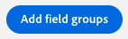
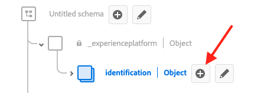
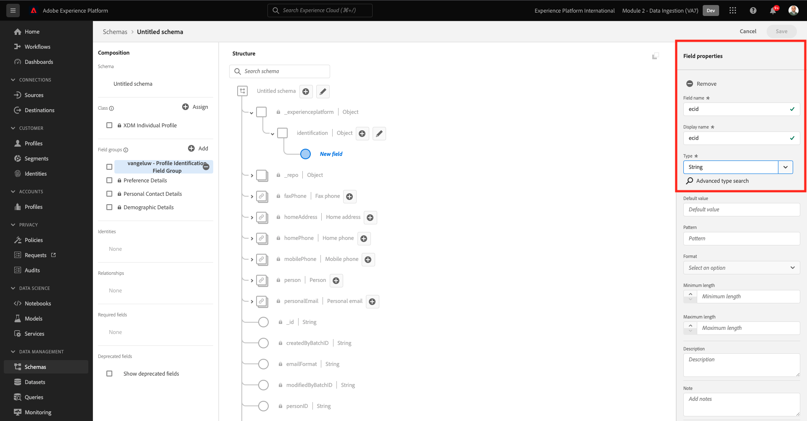
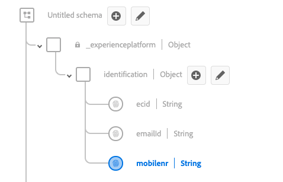

# 2.2 Konfigurera scheman och ange identifierare

I den här övningen konfigurerar du de XDM-scheman som krävs för att klassificera profilinformation och kundbeteende. I varje XDM-schema måste du också konfigurera en primär identifierare för att länka all information till.

## Artikel

Innan du börjar konfigurera XDM-scheman och ställer in primära identifierare måste vi tänka på företagskontexten för det vi försöker göra:

- Du vill ha data
- Du vill länka data till en kund
- Du vill skapa en progressiv kundprofil i realtid

Det finns två typer av data som vi vill hämta:

- Vem är den här kunden?
- Vad gör den här kunden?

Frågan **Vem är den här kunden?** är en mycket öppen fråga som har många svar. När ditt företag vill få svar på den här frågan letar du efter demografisk information som Förnamn, Efternamn och Adress. Men även för kontaktinformation som e-postadress eller mobiltelefonnummer. Och även för information som är länkad till Språk kan du välja OptIn/OptOut och till och med Profile Pictures. Och slutligen, vad ni verkligen behöver veta, är hur vi kommer att identifiera den här kunden i de olika system som ert företag använder.

Samma sak gäller frågan **Vad gör den här kunden?**. Det är en mycket öppen fråga med många svar. När ert företag vill få svar på den här frågan letar ni efter någon interaktion som kunden har haft med era online- och offlinetillgångar. Vilka sidor eller produkter har besökts? Har den här kunden lagt till en produkt i kundvagnen eller till och med köpt en artikel? Vilken enhet och webbläsare har använts för att bläddra på webbplatsen? Vilken typ av information söker den här kunden och hur kan vi använda den för att konfigurera och leverera en bra upplevelse till den här kunden? Och slutligen, vad vi verkligen behöver veta, är hur vi kommer att identifiera den här kunden i de olika system som ert företag kommer att använda.

## 2.1.1 - Vem är den här kunden

Hämtar svaret till **Vem är den här kunden?** för ditt företag görs via inloggnings-/registreringssidan.

Ur schemasynvinkel ser vi detta som en **Klass**. Frågan: **Vem är den här kunden?** är något som vi definierar i klassen **[!UICONTROL Individuell XDM-profil]**.

Så när du skapar ett XDM-schema för att hämta svaret till **Vem är den här kunden?** först och främst måste du skapa och definiera ett schema som refererar till klassen **[!UICONTROL Individuell XDM-profil]**.

Om du vill ange vilken typ av svar som kan ges på den frågan måste du definiera [!UICONTROL Fältgrupper]. [!UICONTROL Fältgrupper] är tillägg till klassen Profile och har mycket specifika konfigurationer. demografisk information som Förnamn, Efternamn, Kön och Födelsedag är till exempel en del av [!UICONTROL Fältgrupp]: **[!UICONTROL Demografiska detaljer]**.

För det andra måste företaget bestämma hur kunden ska identifieras. När det gäller ditt företag kan den huvudsakliga identifieraren för en känd kund vara ett specifikt kund-ID, till exempel en e-postadress. Men tekniskt sett finns det andra sätt att identifiera en kund på företaget, som att använda ett mobiltelefonnummer.
I det här labbet definierar vi e-postadressen som primär identifierare och telefonnumret som en sekundär identifierare.

Slutligen är det viktigt att skilja på vilken kanal som data hämtades från. I det här fallet ska vi prata om webbplatsregistreringar och det schema som behöver definieras måste spegla **där** registreringsdata har samlats in. Kanalen kommer också att ha en viktig roll när det gäller att påverka vilka data som hämtas. Därför är det en god vana att definiera scheman för varje kombination av kanal, primär identifierare och typ av data som samlas in.

Baserat på ovanstående måste du konfigurera ett schema i Adobe Experience Platform.

Logga in på Adobe Experience Platform genom att gå till denna URL: [https://experience.adobe.com/platform](https://experience.adobe.com/platform).

När du loggat in kommer du till Adobe Experience Platform hemsida.

Innan du fortsätter måste du välja en **sandlåda**. Sandlådan som ska markeras har namnet ``--module2sandbox--``. Du kan göra detta genom att klicka på texten **[!UICONTROL Produktionsprodukt]** i den blå linjen ovanför skärmen. När du har valt rätt sandlåda ser du skärmändringen och nu befinner du dig i din dedikerade sandlåda.

I Adobe Experience Platform klickar du på **[!UICONTROL Scheman]** på menyn till vänster på skärmen. Du ser listan över tillgängliga [!UICONTROL Scheman].

Du bör skapa ett nytt schema. Om du vill skapa ett nytt schema klickar du på knappen **[!UICONTROL + Skapa schema]** och markera **[!UICONTROL Individuell XDM-profil]**.

När du klickat på **[!UICONTROL + Skapa schema]** skapas ett nytt schema och du uppmanas att välja eller skapa **fältgrupper**.

Nu måste du definiera vilket svar som ska ges på frågan **Vem är den här kunden?** skulle se ut som.
I inledningen av labbet noterade vi att det fanns behov av följande attribut för att definiera en kund:

- Demografisk information som förnamn, efternamn och adress
- Kontaktinformation som hemadress, e-postadress eller mobiltelefonnummer
- Annan information länkad till Språk, OptIn/OptOut och kanske även profilbilder.
- Primär identifierare för en kund

Om du vill göra den informationen till en del av ditt schema måste du lägga till följande [!UICONTROL Fältgrupper] till ditt schema:

- Demografiska detaljer (demografiska uppgifter)
- Kontaktuppgifter (kontaktinformation)
- Inställningsinformation (annan information)
- företagets anpassade profilidentifieringsfältgrupp (primära och sekundära identifierare)

I **[!UICONTROL Lägg till fältgrupp]** väljer du [!UICONTROL Fältgrupp] **[!UICONTROL Demografiska detaljer]**, **[!UICONTROL Kontaktinformation, privat]** och **[!UICONTROL Inställningsinformation]**.

Klicka på **[!UICONTROL Lägg till fältgrupper]** för att lägga till [!UICONTROL Fältgrupp] till ditt schema.

Nu får du den här:

Därefter behöver du en ny [!UICONTROL Fältgrupp] för att hämta **[!UICONTROL Identifierare]** används för datainsamling. Som du har sett i föregående övning finns det ett koncept för primära och sekundära identifierare. En primär identifierare är den viktigaste eftersom alla insamlade data kommer att länkas till den här identifieraren.

Nu kan du skapa en egen [!UICONTROL Fältgrupp] och som sådan kommer du att utöka [!UICONTROL XDM-schema] för att uppfylla företagets behov.

Klicka på **[!UICONTROL + Lägg till]** knapp för att börja lägga till [!UICONTROL Fältgrupp].

Istället för att återanvända en befintlig [!UICONTROL Fältgrupp]skapar du nu en egen [!UICONTROL Fältgrupp]. Du kan göra det genom att välja **[!UICONTROL Skapa ny fältgrupp]**.

Du måste nu ange en **[!UICONTROL Visningsnamn]** och **[!UICONTROL Beskrivning]** för dina nya [!UICONTROL Fältgrupp].

Vi kommer att använda det här som namn för vårt schema:
`--demoProfileLdap-- - Profile Identification Field Group`

Som ett exempel för ldap **[!UICONTROL vangeluw]** bör det vara schemats namn:

**[!UICONTROL vangeluw - fältgrupp för profilidentifiering]**

Det borde ge dig något sådant:

Klicka på **[!UICONTROL Lägg till fältgrupper]** för att lägga till den nyskapade knappen [!UICONTROL Fältgrupp] till ditt schema.

Du bör nu ha den här schemastrukturen på plats.

Dina nya [!UICONTROL Fältgrupp] är fortfarande tomt, så nu måste du lägga till fält i det [!UICONTROL Fältgrupp].
I [!UICONTROL Fältgrupp]-list, klicka på din egen [!UICONTROL Fältgrupp].

Nu visas ett antal nya knappar.

Klicka på knappen **[!UICONTROL + Lägg till fält]** -knappen.

När du klickat på **[!UICONTROL + Lägg till fält]** nu visas en ny **[!UICONTROL object]** i ditt schema. Det här objektet representerar en anpassad **[!UICONTROL object]** i ditt schema och får ett namn efter ditt Adobe Experience Platform klientorganisations-ID. Ditt Adobe Experience Platform-klient-ID är `--aepTenantId--`.

Du kommer nu att lägga till ett nytt objekt under den klienten. Det gör du genom att klicka på fältet **[!UICONTROL Nytt fält]** under tenant-objektet.

Använd dessa objektdefinitioner:

- Fältnamn: **[!UICONTROL identifiering]**
- Visningsnamn:  **[!UICONTROL identifiering]**
- Typ: **[!UICONTROL Objekt]**

Klicka **[!UICONTROL Använd]** för att spara ändringarna.

Efter klickning **[!UICONTROL Använd]** ser du nu **[!UICONTROL identifiering]** -objekt i schemat.

Nu ska du lägga till tre nya fält under  **[!UICONTROL identifiering]** objekt:

- ecid:
   - Fältnamn: **[!UICONTROL ecid]**
   - Visningsnamn:  **[!UICONTROL ecid]**
   - Typ: **[!UICONTROL Sträng]**

- emailId
   - Fältnamn: **[!UICONTROL emailId]**
   - Visningsnamn:  **[!UICONTROL emailId]**
   - Typ: **[!UICONTROL Sträng]**

- mobiltelefon
   - Fältnamn: **[!UICONTROL mobiltelefon]**
   - Visningsnamn:  **[!UICONTROL mobiltelefon]**
   - Typ: **[!UICONTROL Sträng]**

Varje fält definieras som typ **[!UICONTROL Sträng]** och vi konfigurerar fälten som **[!UICONTROL Identiteter]**. För schemat **[!UICONTROL Registreringsschema för webbplats]**, antar vi att en kund alltid identifieras av sin e-postadress, vilket innebär att du måste konfigurera fältet **[!UICONTROL emailId]** som **[!UICONTROL primär]** identifierare och de andra fälten som **[!UICONTROL sekundär]** identifierare.

Lägg till fälten genom att klicka på **[!UICONTROL +]** knappen bredvid **[!UICONTROL identifiering]** -objekt.

Du har nu ett tomt fält. Du måste konfigurera de tre fälten ovan enligt indikationen.

Så här ska varje fält se ut efter den ursprungliga fältkonfigurationen.

Klicka på **[!UICONTROL +]** knappen bredvid **[!UICONTROL identifiering]** -objekt för att skapa ett nytt fält och fylla i fälten som de anges.

- ecid

Bläddra nedåt i dialogrutan för att spara fältet **[!UICONTROL Fältegenskaper]** tills knappen visas **[!UICONTROL Använd]**. Klicka på **[!UICONTROL Använd]** -knappen.

Klicka på **[!UICONTROL +]** knappen bredvid **[!UICONTROL identifiering]** -objekt för att skapa ett nytt fält och fylla i fälten som de anges.

- emailId

Bläddra nedåt i dialogrutan för att spara fältet **[!UICONTROL Fältegenskaper]** tills knappen visas **[!UICONTROL Använd]**. Klicka på **[!UICONTROL Använd]** -knappen.

Klicka på **[!UICONTROL +]** knappen bredvid **[!UICONTROL identifiering]** -objekt för att skapa ett nytt fält och fylla i fälten som de anges.

- mobiltelefon

Bläddra nedåt i dialogrutan för att spara fältet **[!UICONTROL Fältegenskaper]** tills knappen visas **[!UICONTROL Använd]**. Klicka på **[!UICONTROL Använd]** -knappen.

Du har nu tre fält, men dessa fält har inte definierats som **[!UICONTROL Identitet]**-fields ännu.

Börja definiera dessa fält som **[!UICONTROL Identitet]**-fields, följ dessa steg:

- Markera fältet **[!UICONTROL emailId]**.
- Till höger i fältegenskaperna rullar du nedåt tills du ser **[!UICONTROL Identitet]**. Markera kryssrutan för **[!UICONTROL Identitet]**.

   

- Markera kryssrutan för **[!UICONTROL Primär identitet]**.

   

- Markera namnutrymmet till sist **[!UICONTROL E-post]** i listan över **[!UICONTROL Namnutrymmen]**. Ett namnutrymme används av identitetsdiagrammet i Adobe Experience Platform för att klassificera identifierare i namnutrymmen och definiera relationen mellan dessa namnutrymmen.

   

- Klicka slutligen **[!UICONTROL Använd]** för att spara ändringarna.

   

Därefter måste du definiera de andra fälten för **[!UICONTROL ecid]** och **[!UICONTROL mobiltelefon]** som sekundära identifierare.

- Markera fältet **[!UICONTROL ecid]**.
- Till höger i fältegenskaperna rullar du nedåt tills du ser **[!UICONTROL Identitet]**. Markera kryssrutan för **[!UICONTROL Identitet]**.

   

- Välj sedan namnutrymmet **[!UICONTROL ECID]** i listan över **[!UICONTROL Namnutrymmen]**. A [!UICONTROL Namnutrymme] används av identitetsdiagrammet i Adobe Experience Platform för att klassificera identifierare i namnutrymmen och definiera relationen mellan dessa namnutrymmen.

   

- Klicka **[!UICONTROL Använd]** för att spara ändringarna.

   

- Markera fältet **[!UICONTROL mobiltelefon]**.
- Till höger i fältegenskaperna rullar du nedåt tills du ser **[!UICONTROL Identitet]**. Markera kryssrutan för **[!UICONTROL Identitet]**.

   

- Se till att markera namnutrymmet **[!UICONTROL Telefon]** i listan över **[!UICONTROL Namnutrymmen]**. Ett namnutrymme används av identitetsdiagrammet i Adobe Experience Platform för att klassificera identifierare i namnutrymmen och definiera relationen mellan dessa namnutrymmen.

   

- Klicka **[!UICONTROL Använd]** för att spara ändringarna.

   

The **[!UICONTROL identifiering]** ska nu se ut så här med de tre ID-fälten som nu även visar en **[!UICONTROL fingeravtryck]** -ikonen för att visa att de har definierats som identifierare.

Nu ger vi ditt schema ett namn. Markera fältet **Namnlöst schema**.

Som namn för vårt schema ska du använda följande:

`--demoProfileLdap-- - Demo System - Profile Schema for Website`

Ersätt **[!UICONTROL ldap]** av din specifika ldap. Som ett exempel för ldap **[!UICONTROL vangeluw]** bör det vara schemats namn:

**[!UICONTROL vangeluw - demosystem - profilschema för webbplats]**

Det borde ge dig något sådant:

Du har nu definierat ett schema, länkat befintligt och nyligen skapat [!UICONTROL Fältgrupper] och har definierade identifierare.

Klicka **[!UICONTROL Spara]** för att spara ändringarna.

Det sista du behöver göra här är att aktivera schemat som ska länkas till **[!UICONTROL Profil]**.
Genom att aktivera ditt schema för profil ser du till att alla data som skickas till Adobe Experience Platform mot det här schemat blir en del av kundprofilmiljön i realtid, vilket ser till att alla dessa data kan användas i realtid för frågor, segmentering och aktivering.

Vi gör detta genom att välja namnet på ditt schema.

På den högra fliken i ditt schema visas en **[!UICONTROL Växla profil]**, som för närvarande är inaktiverat.

Aktivera [!UICONTROL Profil] - växla genom att klicka på den.

Det här meddelandet visas:

Klicka **[!UICONTROL Aktivera]** för att aktivera det här schemat för profil.

Schemat är nu konfigurerat att ingå i [!UICONTROL Kundprofil i realtid].

Klicka slutligen **[!UICONTROL Spara]** för att spara ditt schema.

### 2.1.2 - Vad gör den här kunden?

Samla in svaret på frågan **Vad gör den här kunden?** för ditt företag t.ex. genom en produktvy på en produktsida.

Ur ett schemaperspektiv ser vi detta som ett **[!UICONTROL Klass]**. Frågan: **Vad gör den här kunden?** är något som vi har definierat i klassen **[!UICONTROL ExperienceEvent]**.

Så när du skapar en [!UICONTROL XDM-schema] för att hitta svaret på **Vad gör den här kunden?** först och främst måste du skapa och definiera ett schema som refererar till klassen **[!UICONTROL ExperienceEvent]**.

Om du vill ange vilken typ av svar som kan ges på den frågan måste du definiera [!UICONTROL Fältgrupp]. [!UICONTROL Fältgrupper] är tillägg till [!UICONTROL ExperienceEvent]-klass och har mycket specifika konfigurationer. Till exempel information om vilken typ av produkter en kund har tittat på eller lagt till i kundvagnen är en del av [!UICONTROL Fältgrupp] **Handelsinformation**.

För det andra måste ert företag bestämma hur ni ska identifiera kundens beteende. Eftersom vi talar om interaktioner på en webbplats är det möjligt att ert företag känner till kunden, men det är lika möjligt att en okänd anonym besökare är aktiv på webbplatsen. Så vi kan inte använda en identifierare som e-postadress. I det här fallet kommer ditt företag antagligen att välja att använda [!UICONTROL Experience Cloud ID (ECID)] som primär identifierare.

Slutligen är det viktigt att skilja på vilken kanal som data hämtades från. I det här fallet ska vi prata om webbplatsinteraktioner och det schema som behöver definieras måste spegla **där** interaktionsdata har samlats in. Kanalen kommer också att ha en viktig roll när det gäller att påverka vilka data som hämtas. Därför är det en god vana att definiera scheman för varje kombination av kanal, primär identifierare och typ av data som samlas in.

Baserat på ovanstående måste du konfigurera ett schema i Adobe Experience Platform.

När du loggat in kommer du till Adobe Experience Platform hemsida.

Innan du fortsätter måste du välja en **[!UICONTROL sandlåda]**. The [!UICONTROL sandlåda] att markera har ett namn ``--module2sandbox--``. Du kan göra detta genom att klicka på texten **[!UICONTROL Produktionsprodukt]** i den blå linjen ovanför skärmen. När du har valt rätt sandlåda ser du skärmändringen och nu befinner du dig i din dedikerade sandlåda.

I Adobe Experience Platform klickar du på **[!UICONTROL Scheman]** på menyn till vänster på skärmen.

I [!UICONTROL Scheman]ser du alla befintliga scheman.

Du bör skapa ett nytt schema. Om du vill skapa ett nytt schema klickar du på knappen **[!UICONTROL + Skapa schema]** och markera **[!UICONTROL XDM ExperienceEvent]**.

När du klickat på **[!UICONTROL + Skapa schema]** skapas ett nytt schema och du uppmanas att välja eller skapa **fältgrupper**.

Nu måste du definiera vilket svar som ska ges på frågan **Vad gör den här kunden?** skulle se ut som.
I inledningen av labbet noterade vi att det fanns behov av följande attribut för att definiera vad en kund gör:

- Vilka sidor eller produkter har besökts?
- Har den här kunden lagt till en produkt i kundvagnen eller till och med köpt en artikel?
- Vilken enhet och webbläsare har använts för att bläddra på webbplatsen?
- Vilken typ av information söker den här kunden och hur kan vi använda den för att konfigurera och leverera en bra upplevelse till den här kunden?
- Primär identifierare för en kund

Om du vill göra den informationen till en del av ditt schema måste du lägga till följande [!UICONTROL Fältgrupp] till ditt schema:

- Webbinformation
- Handelsinformation
- Miljöinformation
- ditt företags anpassade profilidentifiering [!UICONTROL Fältgrupp] (Primära och sekundära identifierare)

I **[!UICONTROL Lägg till fältgrupp]** väljer du [!UICONTROL Fältgrupper] **[!UICONTROL Webbinformation]**, **[!UICONTROL Handelsinformation]** och **[!UICONTROL Miljöinformation]**.

Klicka på **[!UICONTROL Lägg till fältgrupper]** för att lägga till fältgruppen i ditt schema.

Då får du den här:

Sedan måste du skapa en ny [!UICONTROL Fältgrupp] för att hämta **[!UICONTROL Identifierare]** används för datainsamling. Som du har sett i föregående övning finns det ett koncept för primära och sekundära identifierare. En primär identifierare är den viktigaste eftersom alla insamlade data kommer att länkas till den här identifieraren.

Nu kan du skapa en egen [!UICONTROL Fältgrupp] och som sådan kommer du att utöka [!UICONTROL XDM-schema] för att uppfylla företagets behov.

A [!UICONTROL Fältgrupp] är länkad till en [!UICONTROL Klass]så att du inte bara kan återanvända den tidigare skapade [!UICONTROL Fältgrupp].

Klicka på **[!UICONTROL + Lägg till]** knapp för att börja lägga till [!UICONTROL Fältgrupp].

Istället för att återanvända en befintlig [!UICONTROL Fältgrupp]skapar du nu en egen [!UICONTROL Fältgrupp]. Du kan göra det genom att välja **[!UICONTROL Skapa ny fältgrupp]**.

Du måste nu ange en **[!UICONTROL Visningsnamn]** och **[!UICONTROL Beskrivning]** för din nya fältgrupp.

Använd följande som namn för fältgruppen:

`--demoProfileLdap-- - ExperienceEvent Identification Field Group`

Som ett exempel för ldap **[!UICONTROL vangeluw]** bör det vara schemats namn:

**[!UICONTROL vangeluw - ExperienceEvent Identification Field Group]**

Det borde ge dig något sådant:

Klicka på **[!UICONTROL Lägg till fältgrupp]** för att lägga till den nyskapade knappen [!UICONTROL Fältgrupp] till ditt schema.

Du borde ha den här nu [!UICONTROL Schema] struktur på plats.

Dina nya [!UICONTROL Fältgrupp] är fortfarande tomt, så nu måste du lägga till fält i den fältgruppen.
I [!UICONTROL Fältgrupp]-list, klicka på din egen [!UICONTROL Fältgrupp].

Nu visas ett antal nya knappar.

På den översta nivån i schemat, bredvid namnet Schema - klickar du på **[!UICONTROL +]** -knappen.

När du klickat på **[!UICONTROL +]** nu visas en ny **[!UICONTROL object]** i ditt schema. Det här objektet representerar en anpassad **[!UICONTROL object]** i [!UICONTROL Schema] och namnges efter ditt Adobe Experience Platform-klientorganisations-ID. Ditt Adobe Experience Platform-klient-ID är `--aepTenantId--`.

Du kommer nu att lägga till ett nytt objekt under den klienten. Det gör du genom att klicka på fältet **[!UICONTROL Nytt fält]** under tenant-objektet.

Använd dessa objektdefinitioner:

- Fältnamn: **[!UICONTROL identifiering]**
- Visningsnamn:  **[!UICONTROL identifiering]**
- Typ: **[!UICONTROL Objekt]**

Bläddra nedåt och klicka **[!UICONTROL Använd]** för att spara ändringarna.

Efter klickning **[!UICONTROL Använd]** ser du nu **[!UICONTROL identifiering]** -objekt i schemat.

Du kommer nu att lägga till 1 nytt fält under  **[!UICONTROL identifiering]** -objekt.

Klicka på **[!UICONTROL +]** knappen bredvid **[!UICONTROL identifiering]** för att skapa ett nytt fält.

ECID-fältet definieras som typ **[!UICONTROL Sträng]** och du konfigurerar det här fältet som en **[!UICONTROL Identitet]**. För schemat **[!UICONTROL Demo System - händelseschema för webbplats]**, antar vi att en kund alltid identifieras av deras [!UICONTROL ECID], vilket innebär att du måste konfigurera fältet **[!UICONTROL ECID]** som **primär** identifierare

Du har nu ett tomt fält. Du måste konfigurera fältet ovan enligt anvisningarna.

- ecid:

   - Fältnamn: **[!UICONTROL ecid]**
   - Visningsnamn:  **[!UICONTROL ecid]**
   - Typ: **[!UICONTROL Sträng]**

Det är så här [!UICONTROL ecid]-field ska ta hänsyn till den ursprungliga fältkonfigurationen:

Bläddra nedåt och klicka **[!UICONTROL Använd]**.

Du har nu ett nytt fält, men det här fältet har inte definierats som ett **[!UICONTROL Identitet]**-field ännu.

Börja definiera dessa fält som **[!UICONTROL Identitet]**-fields, följ dessa steg:

- Markera fältet **[!UICONTROL ecid]**.
- Till höger i fältegenskaperna rullar du nedåt tills du ser **[!UICONTROL Identitet]**. Markera kryssrutan för **[!UICONTROL Identitet]**.

- Markera kryssrutan för **[!UICONTROL Primär identitet]**.

- Markera namnutrymmet till sist **[!UICONTROL ECID]** i listan över **[!UICONTROL Namnutrymmen]**. A [!UICONTROL Namnutrymme] används av [!UICONTROL Identitetsdiagram] i Adobe Experience Platform för att klassificera identifierare i namnutrymmen och definiera relationen mellan dessa namnutrymmen.

   

- Klicka slutligen **[!UICONTROL Använd]** för att spara ändringarna.

   

The **[!UICONTROL identifiering]** ska nu se ut så här, och nu visas även ett **fingeravtryck** -ikonen för att visa att de har definierats som identifierare.

Nu ger vi ditt schema ett namn. Markera fältet **Namnlöst schema**.

Vi kommer att använda det här som namn för vårt schema:
`--demoProfileLdap-- - Demo System - Event Schema for Website`

Som ett exempel för ldap **[!UICONTROL vangeluw]** bör det vara schemats namn:

**[!UICONTROL vangeluw - demosystem - händelseschema för webbplats]**

Det borde ge dig något sådant:

Klicka **[!UICONTROL Spara]** för att spara ändringarna.

Det är viktigt att komma ihåg att när data hämtas till det här schemat så behövs vissa fält.
Till exempel fälten **[!UICONTROL _id]** och **[!UICONTROL tidsstämpel]** är obligatoriska fält.

- _id måste innehålla ett unikt ID för en specifik datainmatning
- tidsstämpeln måste vara tidsstämpeln för den här träffen, i formatet **[!UICONTROL &quot;YYY-MM-DDTHH:MM:SSSZ&quot;]**, till exempel: **[!UICONTROL &quot;2019-04-08T07:20:000Z&quot;]**

Du har nu definierat ett schema, länkat befintligt och nyligen skapat [!UICONTROL Fältgrupper] och har definierade identifierare.

Det sista du behöver göra här är att aktivera schemat som ska länkas till **[!UICONTROL Profil]**.
Genom att aktivera ditt schema för [!UICONTROL Profil]ser du till att alla data som skickas till Adobe Experience Platform mot det här schemat blir en del av kundprofilen i realtid, vilket ser till att alla dessa data kan användas i realtid för frågor, segmentering och aktivering.

Vi gör detta genom att välja namnet på ditt schema.

På den högra fliken i ditt schema visas en **[!UICONTROL Profil] växla**, som för närvarande är inaktiverat.

Aktivera [!UICONTROL Profil] - växla genom att klicka på den.

Det här meddelandet visas:

Klicka **[!UICONTROL Aktivera]** för att aktivera det här schemat för profil.

Ditt schema är nu konfigurerat att ingå i kundprofilen i realtid.

Klicka slutligen **[!UICONTROL Spara]** för att spara ditt schema.

Du har nu skapat scheman som har aktiverats för användning i kundprofilen i realtid.

Låt oss titta på datauppsättningar i nästa övning.

Nästa steg: [2.3 Konfigurera datauppsättningar](./ex3.md)

[Gå tillbaka till modul 2](./data-ingestion.md)

[Gå tillbaka till Alla moduler](../../overview.md)
