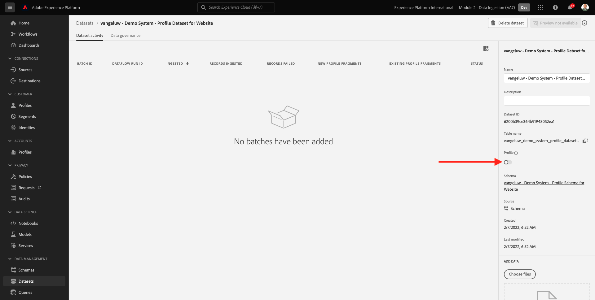

# 2.3 Konfigurera datauppsättningar

I den här övningen ska du konfigurera de nödvändiga datauppsättningarna för att hämta in och lagra profilinformation och kundbeteende. Alla datauppsättningar som du skapar i det här steget använder ett av de scheman som du skapade i föregående steg.

## Artikel

När du har definierat svaret på frågorna **Vem är den här kunden?** och **Vad gör den här kunden?** måste du nu skapa en bucket som använder den informationen för att ta emot och validera data som skickats till Adobe Experience Platform.

## 2.3.1 - Skapa datauppsättningar

Nu behöver du skapa två datauppsättningar:

- 1 datauppsättning för att samla in information som besvarar **Vem är den här kunden?** - fråga.
- 1 datauppsättning för att samla in information som besvarar **Vad gör den här kunden?** - fråga.

Logga in på Adobe Experience Platform genom att gå till denna URL: [https://experience.adobe.com/platform](https://experience.adobe.com/platform).

När du loggat in kommer du till Adobe Experience Platform hemsida.

Innan du fortsätter måste du välja en **[!UICONTROL sandlåda]**. Sandlådan som ska markeras har namnet ``--module2sandbox--``. Du kan göra detta genom att klicka på texten **[!UICONTROL Produktionsprodukt]** i den blå linjen ovanför skärmen. När du har valt lämplig [!UICONTROL sandlåda]kommer du att se skärmändringen och nu är du med på din [!UICONTROL sandlåda].

I Adobe Experience Platform klickar du på **[!UICONTROL Datauppsättningar]** på menyn till vänster på skärmen.  Då ser du det här:

Vi börjar med att skapa datauppsättningen för att hämta registreringsinformation för webbplatsen.

Du bör skapa en ny datauppsättning. Om du vill skapa en ny datauppsättning klickar du på knappen **[!UICONTROL + Skapa datauppsättning]**.

När du klickat på **[!UICONTROL + Skapa datauppsättning]** visas följande skärm.

Du måste definiera en datauppsättning från schemat som du definierade i föregående steg. Klicka på **[!UICONTROL Skapa datauppsättning från schema]** - alternativ.

På nästa skärm måste du välja det schema som du skapade i 1, `--demoProfileLdap-- - Demo System - Profile Schema for Website`.

När du har valt schemat klickar du på **[!UICONTROL Nästa]** för att fortsätta.

Låt oss ge datauppsättningen ett namn.

Använd följande som namn på datauppsättningen:

`--demoProfileLdap-- - Demo System - Profile Dataset for Website`

Som ett exempel för ldap **[!UICONTROL vangeluw]** bör det vara schemats namn:

**[!UICONTROL vangeluw - demosystem - profildatauppsättning för webbplats]**

Det borde ge dig något sådant:

Klicka **[!UICONTROL Slutför]** för att slutföra datauppsättningskonfigurationen.

Nu ser du det här:

Gå tillbaka till [!UICONTROL Datauppsättningar] översikt. Nu visas den datauppsättning som du skapade i översikten.

Därefter ska du konfigurera en andra datauppsättning för att fånga upp webbplatsinteraktioner.

Du bör skapa en ny datauppsättning. Om du vill skapa en ny datauppsättning klickar du på knappen **[!UICONTROL + Skapa datauppsättning]**.

När du klickat på **[!UICONTROL + Skapa datauppsättning]** visas följande skärm.

Du måste definiera en datauppsättning från schemat som du definierade i föregående steg. Klicka på **[!UICONTROL Skapa datauppsättning från schema]** - alternativ.

På nästa skärm måste du välja det schema som du skapade i 2.2, `--demoProfileLdap-- - Demo System - Event Schema for Website`.

När du har valt schemat klickar du på **[!UICONTROL Nästa]** för att fortsätta.

Låt oss ge datauppsättningen ett namn.

Som namn för vår datauppsättning använder vi följande:

`--demoProfileLdap-- - Demo System - Event Dataset for Website`

Som ett exempel för ldap **[!UICONTROL vangeluw]** bör det vara schemats namn:

**[!UICONTROL vangeluw - demosystem - händelsedatauppsättning för webbplats]**

Det borde ge dig något sådant:

Klicka **[!UICONTROL Slutför]** för att slutföra datauppsättningskonfigurationen.

Då ser du det här:

Gå tillbaka till [!UICONTROL Datauppsättningar] översiktsskärm.

Nu måste du göra det möjligt för dina datauppsättningar att ingå i Adobe Experience Platform kundprofil i realtid.

Öppna din datauppsättning `--demoProfileLdap--` - Demonstrationssystem - profildatauppsättning för webbplats genom att klicka på den.

Leta reda på [!UICONTROL Profil] växlingsikonen till höger på skärmen.

Klicka på [!UICONTROL Profil] växla för att aktivera den här datauppsättningen för [!UICONTROL Profil].

Klicka på **[!UICONTROL Aktivera]**.

Din datauppsättning har nu aktiverats för [!UICONTROL Profil].

Gå tillbaka till datauppsättningsöversikten och öppna datauppsättningen `--demoProfileLdap-- - Demo System - Event Dataset` för webbplats genom att klicka på den.

Leta reda på [!UICONTROL Profil] växlingsikonen till höger på skärmen.

Klicka på [!UICONTROL Profil] växla för att aktivera [!UICONTROL Profil].

Klicka **[!UICONTROL Aktivera]**.

Din datauppsättning har nu aktiverats för [!UICONTROL Profil].

Nästa steg: [2.4 Datainmatning från offlinekällor](./ex4.md)

[Gå tillbaka till modul 2](./data-ingestion.md)

[Gå tillbaka till Alla moduler](../../overview.md)
