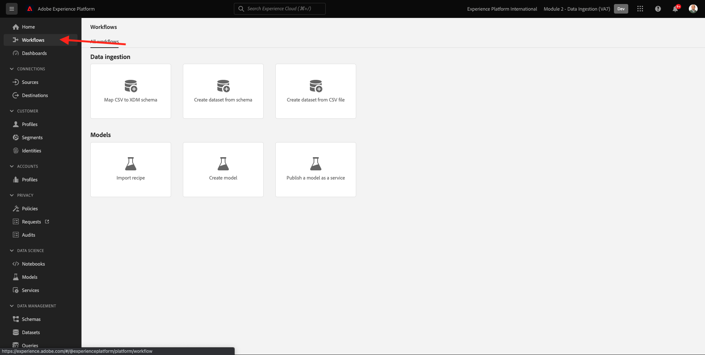
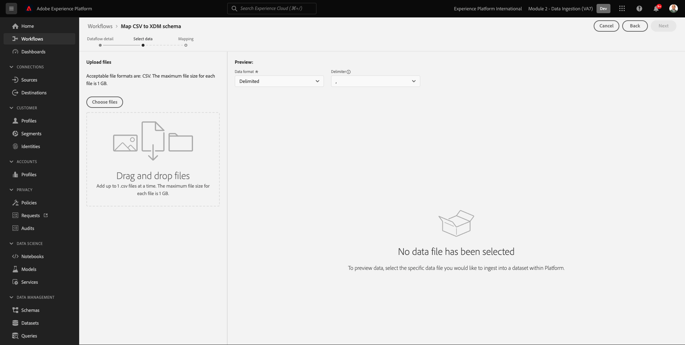
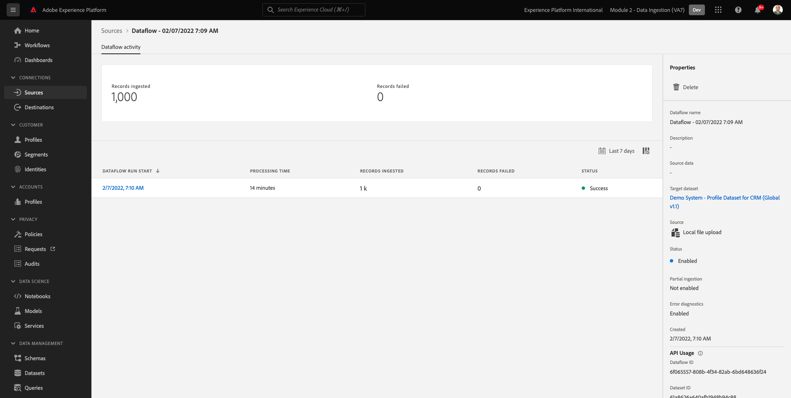

# 2.4 Datainmatning från offlinekällor

I den här övningen är målet att lägga in externa data som CRM-data i plattformen.

## Utbildningsmål

- Lär dig hur du genererar testdata
- Lär dig hur du importerar CSV
- Lär dig använda webbgränssnittet för datainmatning via arbetsflöden
- Förstå datastyrningsfunktionerna i Experience Platform

## Resurser

- Mockaroo UI: [https://www.mockaroo.com/](https://www.mockaroo.com/)
- Experience Platform användargränssnitt: [https://experience.adobe.com/platform/](https://experience.adobe.com/platform/)

## Uppgifter

- Skapa en CSV-fil med demodatum. Importera CSV-filen i Adobe Experience Platform med hjälp av de tillgängliga arbetsflödena.
- Förstå datastyrningsalternativ i Adobe Experience Platform

## 2.4.1 Skapa din CRM-datauppsättning med ett datagenereringsverktyg

För detta behöver du 1 000 exempelrader med CRM-data.

Öppna Mockaroo-mallen genom att gå till [https://www.mockaroo.com/12674210](https://www.mockaroo.com/12674210).

I mallen ska du lägga märke till följande fält:

- id
- first_name
- last_name
- e-post
- kön
- födelsedatum
- home_latitude
- home_longitude
- country_code
- stad
- land

Alla dessa fält har definierats för att producera data som är kompatibla med plattformen.

Klicka på **[!UICONTROL Hämta data]** som ger dig en CSV-fil med 1 000 rader med demodata.

Öppna CSV-filen i Microsoft Excel för att se innehållet.

När CSV-filen är klar kan du mappa den mot XDM.

### 2.4.2 Verifiera informationen om CRM-introduktion i Adobe Experience Platform

Öppna [Adobe Experience Platform](https://experience.adobe.com/platform) och gå till **[!UICONTROL Datauppsättningar]**.

Innan du fortsätter måste du välja en **[!UICONTROL sandlåda]**. Sandlådan som ska markeras har namnet ``--module2sandbox--``. Du kan göra detta genom att klicka på texten **[!UICONTROL Produktionsprodukt]** i den blå linjen ovanför skärmen. När du har valt lämplig [!UICONTROL sandlåda]kommer du att se skärmändringen och nu är du med på din [!UICONTROL sandlåda].

I Adobe Experience Platform klickar du på **[!UICONTROL Datauppsättningar]** på menyn till vänster på skärmen.

Du kommer att använda en delad datamängd som är baserad i den här aktiveringen. Den delade datamängden har redan skapats och anropas **[!UICONTROL Demo System - profildatauppsättning för CRM (Global v1.1)]**.

Öppna datauppsättningen **[!UICONTROL Demo System - profildatauppsättning för CRM (Global v1.1)]**.

På översiktsskärmen ser du tre viktiga informationsdelar.

Först och främst [!UICONTROL Datauppsättningsaktivitet] Kontrollpanelen visar det totala antalet CRM-poster i datauppsättningen och de inkapslade batcharna samt deras status

För det andra kan du genom att bläddra nedåt på sidan kontrollera när grupper av data har importerats, hur många poster som har registrerats och även om batchen har tagits med eller inte. The **[!UICONTROL Batch-ID]** är identifieraren för ett specifikt batchjobb och **[!UICONTROL Batch-ID]** är viktigt eftersom det kan användas för att felsöka varför en specifik batch inte kunde registreras.

Till sist [!UICONTROL Information om datauppsättning] -fliken visar viktig information som [!UICONTROL Datauppsättnings-ID] (även om det är viktigt ur felsökningsperspektiv), datauppsättningens namn och om datauppsättningen har aktiverats för profilen.

Den viktigaste inställningen här är länken mellan datauppsättningen och schemat. Schemat definierar vilka data som kan importeras och hur dessa data ska se ut.

I det här fallet använder vi **[!UICONTROL Demonstrationssystem - profilschema för CRM (Global v1.1)]**, som mappas mot klassen för **[!UICONTROL Profil]** och har implementerat tillägg, som även kallas fältgrupper.

Genom att klicka på schemats namn kommer du till [!UICONTROL Schema] en översikt där du kan se alla fält som har aktiverats för det här schemat.

Alla scheman måste ha en anpassad, primär beskrivare definierad. När det gäller CRM-datauppsättningen har schemat definierat att fältet **[!UICONTROL crmId]** ska vara den primära identifieraren. Om du vill skapa ett schema och länka det till [!UICONTROL Kundprofil i realtid]måste du definiera en anpassad [!UICONTROL Fältgrupp] som refererar till din primära beskrivning.

På skärmbilden ovan ser du att beskrivningen finns i `--aepTenantId--.identification.core.crmId`, som anges som [!UICONTROL Primär identifierare], länkad till [!UICONTROL namespace] av **[!UICONTROL Demo System - CRMID]**.

Alla scheman och därmed alla datauppsättningar som ska användas i [!UICONTROL Kundprofil i realtid] bör ha en [!UICONTROL Primär identifierare]. Detta [!UICONTROL Primär identifierare] är den identifierare som används av varumärket för en kund i den datauppsättningen. När det gäller en CRM-datauppsättning kan det vara e-postadressen eller CRM-ID:t, när det gäller en Call Center-datauppsättning kan det vara en kunds mobilnummer.

Det är bästa sättet att skapa ett separat, specifikt schema för varje datauppsättning och att ange beskrivningen för varje datauppsättning specifikt för att matcha hur de aktuella lösningar som används av varumärket fungerar.

### 2.4.3 Använda ett arbetsflöde för att mappa en CSV-fil till ett XDM-schema

Målet med detta är att integrera CRM-data i plattformen. Alla data som är inkapslade i Platform ska mappas mot det specifika XDM-schemat. Det du för närvarande har är en CSV-datauppsättning med 1 000 rader på ena sidan och en datauppsättning som är länkad till ett schema på den andra sidan. Om du vill läsa in CSV-filen i den datauppsättningen måste en mappning göras. För att underlätta denna kartläggning har vi **[!UICONTROL Arbetsflöden]** finns i Adobe Experience Platform.

The [!UICONTROL arbetsflöde] som vi kommer att använda här, är [!UICONTROL arbetsflöde] namngiven **[!UICONTROL Mappa CSV till XDM-schema]** i [!UICONTROL Dataintag] -menyn.

Klicka på **[!UICONTROL Mappa CSV till XDM-schema]** -knappen. Klicka **[!UICONTROL Starta]** för att starta processen.

På nästa skärm måste du välja en datauppsättning att importera filen till. Du kan välja mellan att välja en befintlig datauppsättning eller att skapa en ny. För den här övningen återanvänder vi en befintlig: välj **[!UICONTROL Demo System - profildatauppsättning för CRM (Global v1.1)]** som anges nedan och lämna de andra inställningarna som standard.

Klicka **[!UICONTROL Nästa]** till nästa steg.

Dra och släpp CSV-filen eller klicka **[!UICONTROL Bläddra]** och navigera på datorn till skrivbordet och välj en CSV-fil.

När du har valt en CSV-fil överförs den omedelbart och du kommer att se en förhandsgranskning av filen inom några sekunder.

Klicka **[!UICONTROL Nästa]** till nästa steg. Det kan ta några sekunder innan filen har bearbetats helt.

Du måste nu mappa dina CSV-kolumnrubriker med en XDM-egenskap i **[!UICONTROL Demo System - profildatauppsättning för CRM]**.

Adobe Experience Platform har redan gjort några förslag åt dig genom att länka [!UICONTROL Källattribut] med [!UICONTROL Målschemafält].

För [!UICONTROL Schemamappningar]har Adobe Experience Platform redan försökt länka ihop fält. Alla förslag på mappning är dock inte korrekta. Nu måste du **Acceptera målfält** en i taget.

#### födelsedatum

Fältet Källschema **födelsedatum** ska länkas till målfältet **person.födelsedatum**.

#### stad

Fältet Källschema **stad** ska länkas till målfältet **homeAddress.city**.

#### land

Fältet Källschema **land** ska länkas till målfältet **homeAddress.country**.

#### country_code

Fältet Källschema **country_code** ska länkas till målfältet **homeAddress.countryCode**.

#### e-post

Fältet Källschema **e-post** ska länkas till målfältet **personalEmail.address**.

#### krut

Källschemafältet ** crmid** ska länkas till målfältet **`--aepTenantId--`.identity.core.crmId**.

#### first_name

Fältet Källschema **first_name** ska länkas till målfältet **person.name.firstName**.

#### kön

Fältet Källschema **kön** ska länkas till målfältet **person.kön**.

#### home_latitude

Fältet Källschema **home_latitude** ska länkas till målfältet **homeAddress._schema.latitude**.

#### home_longitude

Fältet Källschema **home_longitude** ska länkas till målfältet **homeAddress._schema.longitud**.

#### id

Fältet Källschema **id** ska länkas till målfältet **_id**.

#### last_name

Fältet Källschema **last_name** ska länkas till målfältet **person.name.lastName**.

Nu bör du ha den här:

Klicka på **[!UICONTROL Slutför]** för att slutföra arbetsflödet.

Efter klickning **[!UICONTROL Slutför]** så ser du **Dataflöde** översikten och efter några minuter kan du uppdatera skärmen för att se om arbetsflödet har slutförts. Klicka på **Namn på måldatauppsättning**.

Sedan ser du datauppsättningen där ditt intag har bearbetats.

På datauppsättningen ser du en [!UICONTROL Batch-ID] som har importerats just nu, med 1 000 poster insamlade och status **[!UICONTROL Lyckades]**.

Klicka på **[!UICONTROL Förhandsgranska datauppsättning]**- knapp för att få en snabb vy över ett litet urval av datauppsättningen för att säkerställa att inlästa data är korrekta.

När data har lästs in kan du definiera rätt datastyrningsmetod för vår datamängd.

### 2.5.4 Lägga till datastyrning i datauppsättningen

Nu när era kunddata är insamlade måste ni se till att datauppsättningen styrs på rätt sätt för användnings- och exportkontroll. Klicka på **[!UICONTROL Datastyrning]** och observera att du kan ange tre typer av begränsningar: Contractual, Identity och Sensitive Data.

Du hittar mer information om de olika etiketterna och hur de kommer att tillämpas i framtiden via policyramverket på den här länken: [https://www.adobe.io/apis/experienceplatform/home/dule/duleservices.html](https://www.adobe.io/apis/experienceplatform/home/dule/duleservices.html)

Låt oss begränsa identitetsdata för hela datauppsättningen. Håll pekaren över datauppsättningsnamnet och klicka på pennikonen för att redigera inställningarna.

Gå till **[!UICONTROL Identitetsdata]** så ser du att **[!UICONTROL I2]** alternativet är markerat - detta förutsätter att all information i datauppsättningen åtminstone är indirekt identifierbar för personen.

Klicka **[!UICONTROL Spara ändringar]** och observera **[!UICONTROL I2]** har nu angetts för alla datafält i datauppsättningen.

Du kan också ange dessa flaggor för enskilda datafält, till exempel **[!UICONTROL firstName]** fältet kommer sannolikt att klassificeras som **[!UICONTROL I1]** nivå för direkt identifierbar information.

Markera fältet **[!UICONTROL firstName]** genom att markera kryssrutan och klicka på **[!UICONTROL Redigera styrningsetiketter]** i skärmens övre högra hörn.

Gå till **[!UICONTROL Identitetsdata]** så ser du att **[!UICONTROL I2]** är redan markerat (ärvs från datauppsättningen). Fältet firstName har också en fältspecifik konfiguration och är inställt som **[!UICONTROL I1 - direkt identifierbara data]**.

Detta innebär att du nu har inhämtat och klassificerat CRM-data i Adobe Experience Platform.

Nästa steg: [2.5 Data Landing Zone](./ex5.md)

[Gå tillbaka till modul 2](./data-ingestion.md)

[Gå tillbaka till Alla moduler](../../overview.md)
