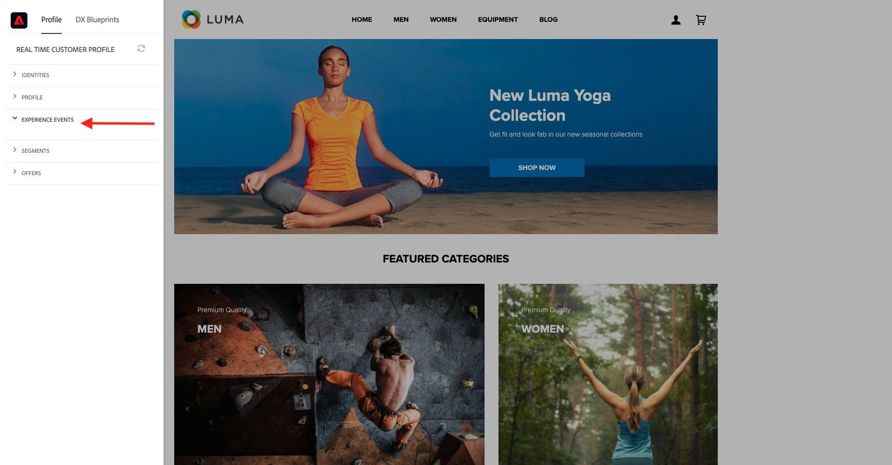
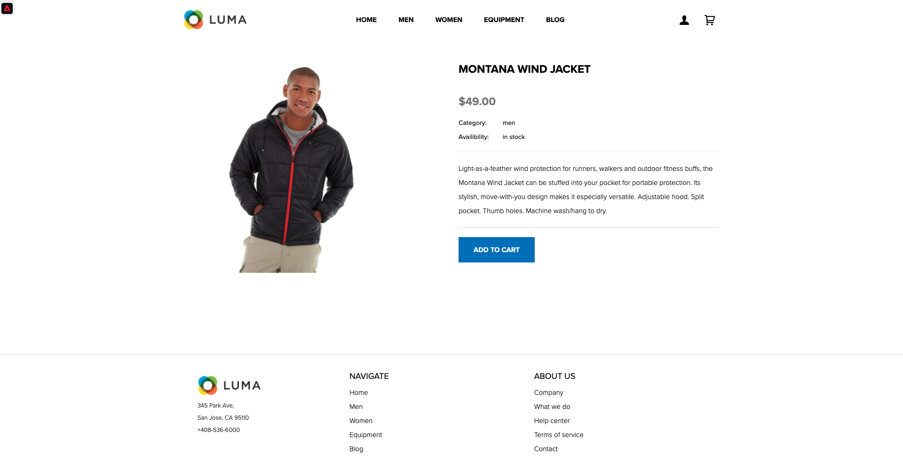
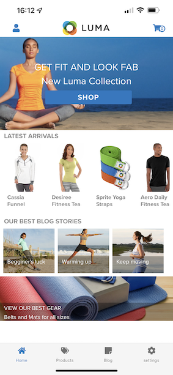
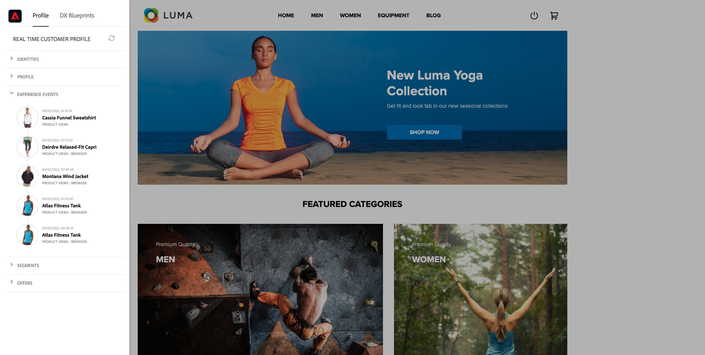

# 3.1 Från okänd till känd på webbplatsen

## Kontext

Resan från okänd till känd är en av de viktigaste ämnena bland varumärken nuförtiden, liksom kundresan från förvärv till lojalitet.

Adobe Experience Platform spelar en mycket viktig roll på den här resan. Plattformen är hjärnan för kommunikation,&quot;upplevelsesystemet för register&quot;.

Plattform är en miljö där ordet kund är bredare än bara de kända kunderna. En okänd besökare på webbplatsen är också en kund ur plattformens perspektiv, och som sådan skickas även allt beteende som en okänd besökare till Platform. Tack vare den metoden kan ett varumärke, när besökaren till slut blir en känd kund, även visualisera det som hände före det ögonblicket. Detta bidrar till att optimera attribuering och upplevelser.

## Kundreseflöde

Gå till [https://builder.adobedemo.com/projects](https://builder.adobedemo.com/projects). När du har loggat in med din Adobe ID ser du det här. Klicka på webbplatsprojektet för att öppna det.

På **Skärmar** sida, klicka **Kör**.

Du kommer då att se din demowebbplats öppnas. Markera URL-adressen och kopiera den till Urklipp.

Öppna ett nytt inkognito-webbläsarfönster.

Klistra in webbadressen till demowebbplatsen, som du kopierade i föregående steg. Du ombeds sedan logga in med din Adobe ID.

Välj kontotyp och slutför inloggningsprocessen.

Därefter visas webbplatsen i ett inkognitivt webbläsarfönster. För varje demonstration måste du använda ett nytt, inkognitivt webbläsarfönster för att läsa in webbadressen till demowebbplatsen.

Klicka på logotypikonen för Adobe i det övre vänstra hörnet av skärmen för att öppna profilvisningsprogrammet.

Ta en titt på panelen Profilvisningsprogram och kundprofilen i realtid med **Experience Cloud ID** som primär identifierare för den här okända kunden.

Ni kan också se alla upplevelsehändelser som samlats in baserat på kundens beteende. Listan är för närvarande tom, men den ändras snart.

Gå till **Män** produktkategori. Klicka sedan på produkten **Montana Wind Jacket**.

Då visas informationssidan för produkten. En upplevelsehändelse av typen **Produktvy** har nu skickats till Adobe Experience Platform med den Web SDK-implementering som du granskade i modul 1.

Öppna Provile Viewer-panelen och titta på **Experience Events**.

Gå tillbaka till **Kvinnor** kategorisida och klicka på en annan produkt. En annan Experience Event har skickats till Adobe Experience Platform.

Öppna panelen Profilvisningsprogram. Nu visas 2 upplevelsehändelser av typen **Produktvy**. Beteendet är anonymt, men vi kan spåra varje klick och lagra det i Adobe Experience Platform. När den anonyma kunden blir känd kan vi automatiskt sammanfoga alla anonyma beteenden med kunskapsprofilen.

Gå till sidan Register/Login. Klicka **SKAPA ETT KONTO**.

Fyll i detaljerna och klicka **Registrera** därefter omdirigeras du till föregående sida.

Öppna profilvisarpanelen och gå till kundprofilen i realtid. På panelen Profilvisningsprogram ska du se alla dina personuppgifter visas, som dina nya e-post- och telefonidentifierare.

Gå till Experience Events på panelen Profilvisningsprogram. Du kan se de två produkterna som du har visat tidigare på panelen Profilvisningsprogram. Båda dessa händelser är nu också anslutna till din&quot;kända&quot; profil.

Du har nu importerat data till Adobe Experience Platform och du har länkat dessa data till identifierare som ECID och e-postadresser. Målet med detta är att förstå affärssammanhanget för det ni ska göra. I nästa övning kommer du att börja konfigurera allt du behöver för att göra all den dataimporten möjlig.

### Navigera i mobilappen

Efter att ha blivit en känd kund är det dags att börja använda mobilappen. Öppna mobilappen på din iPhone och logga sedan in på appen.

Om du inte har installerat appen längre eller om du inte kommer ihåg hur du installerar den kan du titta här: [0.5 Använda mobilappen](../module0/ex5.md)

När du har installerat appen enligt instruktionerna ser du landningssidan för appen med Luma-märket inläst. Klicka på kontoikonen i skärmens övre vänstra del.

På inloggningsskärmen loggar du in med den e-postadress du använde på datorwebbplatsen. Klicka **Inloggning**.

Gå till appens startskärm och klicka för att öppna valfri produkt.

Då visas informationssidan för produkten.

Gå till startskärmen i appen och svep åt vänster på skärmen för att visa panelen Profilvisningsprogram. Du kommer då att se produkten du just visade i **Experience Events** tillsammans med alla produktvyer från webbplatssessionen tidigare.

Gå tillbaka till din stationära dator och uppdatera hemsidan. Sedan visas produkten också där.

Du har nu importerat data till Adobe Experience Platform och du har länkat dessa data till identifierare som ECID och e-postadresser. Målet med den här övningen var att förstå affärskontexten för det du ska göra. Ni har nu effektivt byggt upp en kundprofil för olika enheter i realtid. I nästa övning ska du visualisera din profil i Adobe Experience Platform.

Nästa steg: [3.2 Visualisera din egen kundprofil i realtid - användargränssnitt](./ex2.md)

[Gå tillbaka till modul 3](./real-time-customer-profile.md)

[Gå tillbaka till Alla moduler](../../overview.md)
