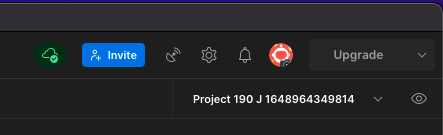
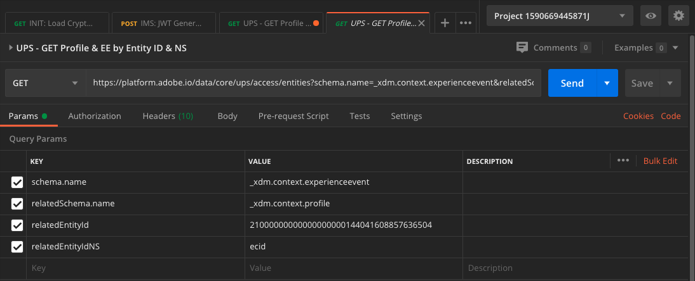

# 3.3 Visualisera din egen kundprofil i realtid - API

I den här övningen använder du Postman och Adobe I/O för att fråga Adobe Experience Platform API:er för att visa din egen kundprofil i realtid.

## Artikel

I kundprofilen i realtid visas alla profildata tillsammans med händelsedata samt befintliga segmentmedlemskap. De data som visas kan komma var som helst, från Adobe-program och externa lösningar. Detta är den mest kraftfulla vyn i Adobe Experience Platform, det upplevelsesystem som finns.

Kundprofilen i realtid kan användas av alla Adobe-program, men även av externa lösningar som Call Centers eller appar för kundanpassning i butiken. Detta gör du genom att koppla dessa externa lösningar till Adobe Experience Platform API:er.

## 3.3.1 Dina identifierare

På panelen Profilvisningsprogram på webbplatsen kan du hitta flera identiteter. Alla identiteter är länkade till ett namnutrymme.


På X-ray-panelen ser vi fyra olika kombinationer av ID:n och namnutrymmen:

| Identitet | Namnutrymme |
|:-------------:| :---------------:|
| Experience Cloud ID (ECID) | 12507560687324495704459439363261812234 |
| E-post-ID | woutervangeluwe+06022022-01@gmail.com |
| Mobilnummer-ID | +32473622044+06022022-01 |

Kom ihåg dessa identifierare för nästa steg.

Med dessa ID:n i åtanke går du till Postman.

## 3.3.2 Konfigurera ditt Adobe I/O-projekt

I den här övningen kommer du att använda Adobe I/O intensivt för att ställa frågor mot plattformens API:er. Följ stegen nedan för att konfigurera Adobe I/O.

Gå till [https://developer.adobe.com/console/home](https://developer.adobe.com/console/home)


Se till att du väljer rätt Adobe Experience Platform-instans i skärmens övre högra hörn. Din instans är `--envName--`.


Klicka **Skapa nytt projekt**.

 eller


Välj **+ Lägg till i projekt** och markera **API**.


Då ser du det här:


Klicka på **Adobe Experience Platform** ikon.


Klicka **Experience Platform API**.


Klicka på **Nästa**.


Nu kan du välja att antingen låta Adobe I/O generera ditt nyckelpar eller överföra ett befintligt.

Välj **Alternativ 1 - Generera ett nyckelpar**.


Klicka **Generera nyckelpar**.


Du får se en snurra i cirka 30 sekunder.


Du kommer då att se detta och det nyckelpar som genereras kommer att laddas ned som en zip-fil: **config.zip**.

Zippa upp filen **config.zip** på skrivbordet visas två filer:


- **certificate_pub.crt** är ditt certifikat för offentlig nyckel. Ur säkerhetssynpunkt är detta det certifikat som fritt används för att konfigurera integreringar med onlineprogram.
- **private.key** är din privata nyckel. Det här ska aldrig delas med någon. Den privata nyckeln är det du använder för att autentisera din API-implementering och ska vara en hemlighet. Om du delar din privata nyckel med vem som helst kan de komma åt implementeringen och missbruka API:t för att importera skadliga data till Platform och extrahera alla data som finns i Platform.


Spara **config.zip** på en säker plats, eftersom du behöver detta för nästa steg och för framtida åtkomst till API:er för Adobe I/O och Adobe Experience Platform.

Klicka på **Nästa**.


Du måste nu välja **Produktprofil(er)** för er integrering.

Välj önskade produktprofiler.

**FYI**: i din Adobe Experience Platform-instans kommer produktprofilerna att ha ett annat namn. Du måste välja minst en produktprofil med rätt åtkomsträttigheter, som är konfigurerad i Adobe Admin Console.


Klicka **Spara konfigurerat API**.


Du får se en snurra i några sekunder.


Och sedan ser du integreringen.


Klicka på **Ladda ned för Postman** och klicka sedan på **Tjänstkonto (JWT)** för att ladda ned en Postman-miljö (vänta tills miljön har laddats ned kan det ta några sekunder).


Bläddra nedåt tills du ser **Tjänstkonto (JWT)**, där du hittar all integreringsinformation som används för att konfigurera integreringen med Adobe Experience Platform.


IO-projektet har för närvarande ett generiskt namn. Du måste ge integreringen ett eget namn. Klicka på **Projekt 1** (eller liknande namn) som anges


Klicka **Redigera projekt**.


Ange ett namn och en beskrivning för integreringen. Som namnkonvention kommer vi att använda `AEP API --demoProfileLdap--`. Ersätt ldap med din ldap.
Om din ldap till exempel är vangeluw blir namnet och beskrivningen av din integrering AEP API-vangeluw.

Retur `AEP API --demoProfileLdap--` som **Projektets titel**. Klicka **Spara**.


Integreringen av Adobe I/O är nu klar.


## 3.3.3 Postman-autentisering till Adobe I/O

Gå till [https://www.getpostman.com/](https://www.getpostman.com/).

Klicka på **Kom igång**.


Ladda sedan ned och installera Postman.


Starta programmet när du har installerat Postman.

I Postman finns det två koncept: Miljöer och samlingar.

- Miljön innehåller alla dina miljövariabler som är mer eller mindre konsekventa. I miljön hittar du saker som IMSOrg i vår plattformsmiljö, tillsammans med säkerhetsreferenser som din privata nyckel och andra. Miljöfilen är den du laddade ned under installationen av Adobe I/O i den tidigare övningen, den har följande namn: **service.postman_environment.json**.

- Samlingen innehåller ett antal API-begäranden som du kan använda. Vi kommer att använda 2 samlingar
   - 1 samling för autentisering till Adobe I/0
   - 1 Samling för övningar i denna modul
   - 1 samling för övningarna i Real-Time CDP-modulen, för målredigering

Hämta filen [postman.zip](../../assets/postman/postman_profile.zip) till din lokala dator.

I den här **postman.zip** hittar du följande filer:

- `_Adobe I-O - Token.postman_collection.json`
- `_Adobe Experience Platform Enablement.postman_collection.json`
- `Destination_Authoring_API.json`

Zippa upp **postman.zip** lagra dessa tre filer i en mapp på skrivbordet tillsammans med den nedladdade Postman-miljön från Adobe I/O. Du måste ha dessa fyra filer i den mappen:


Gå tillbaka till Postman. Klicka **Importera**.


Klicka **Överför filer**.


Navigera till den mapp på skrivbordet där du extraherade de 4 hämtade filerna. Markera de här fyra filerna samtidigt och klicka på **Öppna**.


Efter att ha klickat **Öppna** visas en översikt över den miljö och de samlingar du håller på att importera. Klicka **Importera**.


Nu har du allt du behöver i Postman för att börja interagera med Adobe Experience Platform via API:erna.

Det första du behöver göra är att se till att du är rätt autentiserad. Du måste begära en åtkomsttoken för att kunna autentiseras.

Kontrollera att du har valt rätt miljö innan du kör någon begäran. Du kan kontrollera den valda miljön genom att verifiera listrutan Miljö i det övre högra hörnet.

Den valda miljön ska ha ett namn som liknar det här:



Klicka på **ögat** ikonen och klicka sedan på **Redigera** om du vill uppdatera den privata nyckeln i miljöfilen.


Du kommer då att se det här. Alla fält är förifyllda, utom fältet **PRIVATE_KEY**.


Den privata nyckeln har genererats när du skapade ditt Adobe I/O-projekt. Den hämtades som en zip-fil med namnet **config.zip**. Extrahera zip-filen till skrivbordet.


Öppna mappen **config** och öppna filen **private.key** med valfri textredigerare.


Du kommer då att se något liknande, kopiera all text till Urklipp.


Gå tillbaka till Postman och klistra in den privata nyckeln i fälten bredvid variabeln **PRIVATE_KEY**, för båda kolumnerna **URSPRUNGLIGT VÄRDE** och **AKTUELLT VÄRDE**. Klicka **Spara**.


Din Postman-miljö och dina samlingar är nu konfigurerade och fungerar. Nu kan du autentisera från Postman till Adobe I/O.

För att göra det måste du läsa in ett externt bibliotek som hanterar kryptering och dekryptering av kommunikation. Om du vill läsa in det här biblioteket måste du köra begäran med namnet **INIT: Läs in krypteringsbibliotek för RS256**. Välj den här förfrågan i **Adobe I/O - tokensamling** och du ser den mitt på skärmen.


Klicka på den blå **Skicka** -knappen. Efter några sekunder visas ett svar i **Brödtext** i Postman:


Med kryptobiblioteket inläst kan vi autentisera till Adobe I/O.

I **\_Adobe I/O - Token-samling** markerar du begäran med namnet **IMS: JWT Generate + Auth**. Återigen visas informationen om begäran mitt på skärmen.


Klicka på den blå **Skicka** -knappen. Efter några sekunder visas ett svar i **Brödtext** i Postman:


Om konfigurationen lyckades bör du se ett liknande svar som innehåller följande information:

| Nyckel | Värde |
|:-------------:| :---------------:| 
| token_type | **innehavare** |
| access_token | **eyJ4NXUiOiJpbXNfbmEx...QT7mqZkumN1tdsPEioOEl4087Dg** |
| förfaller_in | **86399973** |

Adobe I/O har gett dig en **innehavare**-token, med ett specifikt värde (denna mycket långa åtkomsttoken) och ett förfallofönster.

Den token vi har fått gäller nu i 24 timmar. Det innebär att om du efter 24 timmar vill använda Postman för att autentisera till Adobe I/O måste du generera en ny token genom att köra denna begäran igen.

## 3.3.4 Kundprofil-API i realtid, schema: Profil

Nu kan du skicka din första förfrågan till plattformens API:er för kundprofiler i realtid.

Leta reda på samlingen i Postman **_Adobe Experience Platform-aktivering**.


I **1. Enhetlig profiltjänst** markerar du den första begäran med namnet **UPS - GET-profil per enhets-ID och NS**.


Det finns tre obligatoriska variabler för denna begäran:

| Nyckel | Värde | Definition |
|:-------------:| :---------------:| :---------------:| 
| entityId | **id** | det specifika kund-ID |
| entityIdNS | **namespace** | det specifika namnutrymmet som gäller för ID:t |
| schema.name | **_xdm.context.profile** | det specifika schema som du vill få information om |

Om du vill be Adobe Experience Platform API:er att ge dig all profilinformation för ditt eget ECID måste du konfigurera begäran enligt följande:

| Nyckel | Värde |
|:-------------:| :---------------:| 
| entityId | **dittECID** |
| entityIdNS | **ecid** |
| schema.name | **_xdm.context.profile** |


Du bör även verifiera **Sidhuvud** - fält i din begäran. Gå till **Sidhuvuden**. Då ser du det här:


| Nyckel | Värde |
| ----------- | ----------- |
| x-sandbox-name | `--aepSandboxId--` |

>[!NOTE]
>
>Du måste ange namnet på den Adobe Experience Platform-sandlåda som du använder. Ditt x-sandbox-namn ska vara `--aepSandboxId--`.

Klicka **Skicka** för att skicka din begäran till Platform.

Du bör få ett omedelbart svar från Platform, som visar dig något sådant:


Detta är det fullständiga svaret från Platform:

```javascript
{
    "A28iM3aJBJRbEQpOnUh5HOM9": {
        "entityId": "A28iM3aJBJRbEQpOnUh5HOM9",
        "mergePolicy": {
            "id": "e632ccb8-882a-4b5e-8375-96a1ba3df1aa"
        },
        "sources": [
            "61fe23c5be4b5f19485dc379",
            "profile-streaming-segment",
            "61fe23cfa07c1219489b3ba4"
        ],
        "tags": [
            "1644130566774:1542:232:va7",
            "0a1e9dd4-940a-46ec-9114-7e371cf5c4d0",
            "aep_ups_partitioned_profile_cdc_low_lag_sla_0:106:1090888313",
            "a6fed09e-2c56-403e-8692-4e99e4779dfa:IRL1",
            "1644419616318:2989:31:va7",
            "aep_ups_profile_change_event_prod_va7:71:7946633524-8361f22c-c09e-4364-b24b-b57435c4d14f"
        ],
        "identityGraph": [
            "BUF9zMKLrXq72p4HpbsHv1SSBnr0LTAxQGdtYWlsLmNvbQ",
            "GkicrkFjgmCjUg",
            "GtCbrkFjgkSOFg",
            "A2-AP9zOsakzNTe9Rqwf7Wse",
            "BkFuK4QcJpSPByuSBnr0LTAx",
            "A28jSB484ziuECF3fEoXmFlF",
            "A28iM3aJBJRbEQpOnUh5HOM9"
        ],
        "entity": {
            "_experienceplatform": {
                "individualCharacteristics": {},
                "loyaltyDetails": {
                    "level": "Basic",
                    "points": 0
                },
                "identification": {
                    "core": {
                        "phoneNumber": "+32473622044+06022022-01",
                        "email": "woutervangeluwe+06022022-01@gmail.com",
                        "loyaltyId": "5415776",
                        "ecid": "12019606991718502754997192487345616673",
                        "crmId": "1478212"
                    }
                }
            },
            "personalEmail": {
                "address": "woutervangeluwe+06022022-01@gmail.com"
            },
            "_repo": {
                "createDate": "2022-02-06T06:56:06.424Z"
            },
            "testProfile": true,
            "homeAddress": {
                "postalCode": "1831",
                "city": "Diegem",
                "street1": "Culliganlaan 2F"
            },
            "mobilePhone": {
                "number": "+32473622044+06022022-01"
            },
            "segmentMembership": {
                "ups": {
                    "bc999ded-b6d7-40d4-87a7-d3a280b950e3": {
                        "lastQualificationTime": "2022-02-09T20:38:33Z",
                        "status": "exited"
                    },
                    "23b1cd4e-d62f-44bd-8392-3095a33109c4": {
                        "lastQualificationTime": "2022-02-09T20:38:33Z",
                        "status": "exited"
                    },
                    "f0807704-a1c8-4ac4-85dd-60db2fbf18f1": {
                        "lastQualificationTime": "2022-02-09T20:38:33Z",
                        "status": "existing"
                    }
                }
            },
            "person": {
                "name": {
                    "lastName": "Van Geluwe",
                    "firstName": "Wouter"
                },
                "gender": "female",
                "birthDate": "1982-07-08"
            },
            "userActivityRegions": {
                "IRL1": {
                    "captureTimestamp": "2022-02-09T15:21:11Z"
                }
            },
            "identityMap": {
                "email": [
                    {
                        "id": "woutervangeluwe+06022022-01@gmail.com"
                    }
                ],
                "crmid": [
                    {
                        "id": "1478212"
                    }
                ],
                "ecid": [
                    {
                        "id": "12507560687324495704459439363261812234"
                    },
                    {
                        "id": "12019606991718502754997192487345616673"
                    },
                    {
                        "id": "38335942889672702722192106363935964471"
                    }
                ],
                "phone": [
                    {
                        "id": "+32473622044+06022022-01"
                    }
                ],
                "loyaltyid": [
                    {
                        "id": "5415776"
                    }
                ]
            }
        },
        "lastModifiedAt": "2022-02-09T20:38:36Z"
    }
}
```

Detta är för närvarande alla tillgängliga profildata i Platform för detta ECID.

Du behöver inte använda ECID för att begära profildata från plattformens kundprofil i realtid. Du kan använda valfritt ID i valfritt namnområde för att begära dessa data.

Vi går tillbaka till Postman och låtsas att vi är callcenter och skickar en begäran till Platform som anger namnutrymmet för **Telefon** och ditt mobilnummer.

Om du vill be plattformens API:er att ge dig all profilinformation för en viss telefon måste du konfigurera begäran enligt följande:

| Nyckel | Värde |
|:-------------:| :---------------:| 
| entityId | **ditt telefonnummer** |
| entityIdNS | **telefon** (ersätt ecid via telefon) |
| schema.name | **_xdm.context.profile** |

Om telefonnumret innehåller specialsymboler som **+** måste du välja ditt fullständiga telefonnummer, högerklicka och klicka **EncodeURIComponent**.


Då får du den här:


Du bör även verifiera **Sidhuvud** - fält i din begäran. Gå till **Sidhuvuden**. Då ser du det här:


| Nyckel | Värde |
| ----------- | ----------- |
| x-sandbox-name | `--aepSandboxId--` |

>[!NOTE]
>
>Du måste ange namnet på den Adobe Experience Platform-sandlåda som du använder. Ditt x-sandbox-namn ska vara `--aepSandboxId--`.

Klicka på den blå **Skicka** och verifiera svaret.


Låt oss göra samma sak med din e-postadress genom att ange namnutrymmet för **e-post** och din e-postadress.

Om du vill be plattformens API:er att ge dig all profilinformation för en viss e-postadress måste du konfigurera begäran enligt följande:

| Nyckel | Värde |
|:-------------:| :---------------:| 
| entityId | **mejl** |
| entityIdNS | **e-post** (ersätt telefon med e-post) |
| schema.name | **_xdm.context.profile** |

Om din e-postadress innehåller specialsymboler som **+** måste du ange din fullständiga e-postadress, högerklicka och klicka **EncodeURIComponent**.


Då får du den här:


Du bör även verifiera **Sidhuvud** - fält i din begäran. Gå till **Sidhuvuden**. Då ser du det här:


| Nyckel | Värde |
| ----------- | ----------- |
| x-sandbox-name | `--aepSandboxId--` |

>[!NOTE]
>
>Du måste ange namnet på den Adobe Experience Platform-sandlåda som du använder. Ditt x-sandbox-namn ska vara `--aepSandboxId--`.

Klicka på den blå **Skicka** och verifiera svaret.


Detta är en mycket viktig typ av flexibilitet som erbjuds varumärken. Det innebär att alla miljöer kan skicka en begäran till plattformen med sina egna ID:n och namnutrymmen, utan att behöva förstå hur komplexa flera namnutrymmen och ID:n är.

Exempel:

- Samtalscentret begär data från plattformen med hjälp av namnutrymmet **telefon**
- Loyalty System begär data från Platform med hjälp av namnutrymmet **e-post**
- onlineprogram kan använda namnutrymmet **ecid**

Samtalscentret vet inte nödvändigtvis vilken typ av identifierare som används i bonussystemet och lojalitetssystemet vet inte nödvändigtvis vilken typ av identifierare som används av onlineprogram. Varje enskilt system kan använda den information de har och förstår för att få den information de behöver, när de behöver den.

## 3.3.5 Real-time Customer Profile API, schema: Profil och ExperienceEvent

Efter att ha frågat om plattformens API:er för profildata kan vi nu göra samma sak med ExperienceEvent-data.

Leta reda på samlingen i Postman **_Adobe Experience Platform-aktivering**.


I **1. Enhetlig profiltjänst** markerar du den andra begäran med namnet **UPS - GET Profile &amp; EE by Entity ID &amp; NS**.



Det finns fyra obligatoriska variabler för denna begäran:

| Nyckel | Värde | Definition |
|:-------------:| :---------------:|  :---------------:| 
| schema.name | **_xdm.context.experience.event** | det specifika schema som du vill få information om. I det här fallet söker vi efter data som har mappats mot ExperienceEvent-schemat. |
| relatedSchema.name | **_xdm.context.profile** | Vi söker efter data som mappas mot ExperienceEvent-schemat, men vi måste ange en identitet som vi vill ta emot data för. Schemat som har åtkomst till identiteten är profilschemat, så relatedSchema här är profilschemat. |
| relatedEntityId | **id** | den specifika kunden I D |
| relatedEntityIdNS | **namespace** | det specifika namnutrymmet som gäller för ID:t |

Om du vill be plattformens API:er att ge dig all profilinformation för ditt eget e-id måste du konfigurera begäran enligt följande:

| Nyckel | Värde |
|:-------------:| :---------------:| 
| schema.name | **_xdm.context.experience.event** |
| relatedSchema.name | **_xdm.context.profile** |
| relatedEntityId | **dittECID** |
| relatedEntityIdNS | **ecid** |


Du bör även verifiera **Sidhuvud** - fält i din begäran. Gå till **Sidhuvuden**. Då ser du det här:


| Nyckel | Värde |
| ----------- | ----------- |
| x-sandbox-name | `--aepSandboxId--` |

>[!NOTE]
>
>Du måste ange namnet på den Adobe Experience Platform-sandlåda som du använder. Ditt x-sandbox-namn ska vara `--aepSandboxId--`.

Klicka **Skicka** för att skicka din begäran till Platform.

Du bör få ett omedelbart svar från Platform, som visar dig något sådant:


Nedan visas det fullständiga svaret från Platform. I det här exemplet finns det åtta ExperienceEvents kopplade till kundens ECID. Titta närmare på de olika variablerna nedan för att se vilka de är, eftersom det du ser nedan är den direkta följden av din konfiguration i Launch i tidigare övningar.

När X-ray-panelen visar ExperienceEvent-information använder den dessutom Nedan-nyttolasten för att analysera och hämta information som produktnamn (sök efter productName i nyttolasten nedan) och produktbild-URL (sök efter productImageUrl i nyttolasten nedan).

```javascript
{
    "_page": {
        "orderby": "timestamp",
        "start": "d686ab8a-2d0c-4722-9ff5-bfc1020b0b55-0",
        "count": 31,
        "next": ""
    },
    "children": [
        {
            "relatedEntityId": "A28iM3aJBJRbEQpOnUh5HOM9",
            "entityId": "d686ab8a-2d0c-4722-9ff5-bfc1020b0b55-0",
            "timestamp": 1644127126596,
            "entity": {
                "environment": {
                    "ipV4": "213.118.129.117",
                    "type": "browser",
                    "browserDetails": {
                        "viewportHeight": 969,
                        "viewportWidth": 1920,
                        "userAgent": "Mozilla/5.0 (Macintosh; Intel Mac OS X 10_15_7) AppleWebKit/537.36 (KHTML, like Gecko) Chrome/98.0.4758.80 Safari/537.36"
                    }
                },
                "web": {
                    "webPageDetails": {
                        "pageViews": {
                            "value": 1
                        },
                        "name": "vangeluw-OCUC",
                        "URL": "https://builder.adobedemo.com/run/vangeluw-OCUC"
                    },
                    "webReferrer": {
                        "URL": "https://adobe.okta.com/"
                    }
                },
                "_experienceplatform": {
                    "interactionDetails": {
                        "core": {
                            "channel": "web"
                        }
                    },
                    "demoEnvironment": {
                        "brandName": "vangeluw-OCUC"
                    },
                    "identification": {
                        "core": {
                            "ecid": "12507560687324495704459439363261812234"
                        }
                    }
                },
                "implementationDetails": {
                    "name": "https://ns.adobe.com/experience/alloy/reactor",
                    "version": "2.8.0+2.9.0",
                    "environment": "browser"
                },
                "identityMap": {
                    "ECID": [
                        {
                            "id": "12507560687324495704459439363261812234",
                            "authenticatedState": "ambiguous",
                            "primary": true
                        }
                    ]
                },
                "eventType": "web.webpagedetails.pageViews",
                "_id": "d686ab8a-2d0c-4722-9ff5-bfc1020b0b55-0",
                "placeContext": {
                    "localTime": "2022-02-06T06:58:46.596+01:00",
                    "localTimezoneOffset": -60
                },
                "device": {
                    "screenOrientation": "landscape",
                    "screenWidth": 1920,
                    "screenHeight": 1080
                },
                "timestamp": "2022-02-06T05:58:46.596Z"
            },
            "lastModifiedAt": "2022-02-06T05:59:48Z"
        },
        {
            "relatedEntityId": "A28iM3aJBJRbEQpOnUh5HOM9",
            "entityId": "919a46bf-a591-4c32-9201-b72250d5f5d9-0",
            "timestamp": 1644127129876,
            "entity": {
                "environment": {
                    "ipV4": "213.118.129.117",
                    "type": "browser",
                    "browserDetails": {
                        "viewportHeight": 969,
                        "viewportWidth": 1920,
                        "userAgent": "Mozilla/5.0 (Macintosh; Intel Mac OS X 10_15_7) AppleWebKit/537.36 (KHTML, like Gecko) Chrome/98.0.4758.80 Safari/537.36"
                    }
                },
                "web": {
                    "webPageDetails": {
                        "pageViews": {
                            "value": 1
                        },
                        "name": "vangeluw-OCUC#",
                        "URL": "https://builder.adobedemo.com/run/vangeluw-OCUC#"
                    },
                    "webReferrer": {
                        "URL": "https://adobe.okta.com/"
                    }
                },
                "_experienceplatform": {
                    "interactionDetails": {
                        "core": {
                            "channel": "web"
                        }
                    },
                    "demoEnvironment": {
                        "brandName": "vangeluw-OCUC"
                    },
                    "identification": {
                        "core": {
                            "ecid": "12507560687324495704459439363261812234"
                        }
                    }
                },
                "implementationDetails": {
                    "name": "https://ns.adobe.com/experience/alloy/reactor",
                    "version": "2.8.0+2.9.0",
                    "environment": "browser"
                },
                "identityMap": {
                    "ECID": [
                        {
                            "id": "12507560687324495704459439363261812234",
                            "authenticatedState": "ambiguous",
                            "primary": true
                        }
                    ]
                },
                "eventType": "web.webpagedetails.pageViews",
                "_id": "919a46bf-a591-4c32-9201-b72250d5f5d9-0",
                "placeContext": {
                    "localTime": "2022-02-06T06:58:49.876+01:00",
                    "localTimezoneOffset": -60
                },
                "device": {
                    "screenOrientation": "landscape",
                    "screenWidth": 1920,
                    "screenHeight": 1080
                },
                "timestamp": "2022-02-06T05:58:49.876Z"
            },
            "lastModifiedAt": "2022-02-06T05:59:48Z"
        },
        {
            "relatedEntityId": "A28iM3aJBJRbEQpOnUh5HOM9",
            "entityId": "41a80489-00d4-446c-b456-8cb19c3f309a-0",
            "timestamp": 1644130597134,
            "entity": {
                "environment": {
                    "ipV4": "213.118.129.117",
                    "type": "browser",
                    "browserDetails": {
                        "viewportHeight": 1001,
                        "viewportWidth": 1920,
                        "userAgent": "Mozilla/5.0 (Macintosh; Intel Mac OS X 10_15_7) AppleWebKit/537.36 (KHTML, like Gecko) Chrome/98.0.4758.80 Safari/537.36"
                    }
                },
                "web": {
                    "webPageDetails": {
                        "pageViews": {
                            "value": 1
                        },
                        "name": "login",
                        "URL": "https://builder.adobedemo.com/run/vangeluw-OCUC/login"
                    },
                    "webReferrer": {
                        "URL": "https://builder.adobedemo.com/run/vangeluw-OCUC/login"
                    }
                },
                "_experienceplatform": {
                    "interactionDetails": {
                        "core": {
                            "channel": "web"
                        }
                    },
                    "demoEnvironment": {
                        "brandName": "vangeluw-OCUC"
                    },
                    "identification": {
                        "core": {
                            "ecid": "12507560687324495704459439363261812234"
                        }
                    }
                },
                "implementationDetails": {
                    "name": "https://ns.adobe.com/experience/alloy/reactor",
                    "version": "2.8.0+2.9.0",
                    "environment": "browser"
                },
                "identityMap": {
                    "ECID": [
                        {
                            "id": "12507560687324495704459439363261812234",
                            "authenticatedState": "ambiguous",
                            "primary": true
                        }
                    ]
                },
                "eventType": "web.webpagedetails.pageViews",
                "_id": "41a80489-00d4-446c-b456-8cb19c3f309a-0",
                "placeContext": {
                    "localTime": "2022-02-06T07:56:37.134+01:00",
                    "localTimezoneOffset": -60
                },
                "device": {
                    "screenOrientation": "landscape",
                    "screenWidth": 1920,
                    "screenHeight": 1080
                },
                "timestamp": "2022-02-06T06:56:37.134Z"
            },
            "lastModifiedAt": "2022-02-06T06:56:38Z"
        },
        {
            "relatedEntityId": "A28jSB484ziuECF3fEoXmFlF",
            "entityId": "8ACC7B6C-2320-4865-B414-3B0CFA01F628",
            "timestamp": 1644419615000,
            "entity": {
                "environment": {
                    "ipV4": "213.118.129.117",
                    "browserDetails": {
                        "userAgent": "Mozilla/5.0 (iPhone; CPU OS 15_3 like Mac OS X; en_BE)"
                    }
                },
                "eventType": "application.login",
                "_id": "8ACC7B6C-2320-4865-B414-3B0CFA01F628",
                "_experienceplatform": {
                    "interactionDetails": {
                        "core": {
                            "channel": "mobile"
                        }
                    },
                    "demoEnvironment": {
                        "brandName": "vangeluw-2L6V"
                    },
                    "identification": {
                        "core": {
                            "ecid": "12019606991718502754997192487345616673",
                            "email": "woutervangeluwe+06022022-01@gmail.com"
                        }
                    }
                },
                "timestamp": "2022-02-09T15:13:35Z",
                "identityMap": {
                    "ECID": [
                        {
                            "id": "12019606991718502754997192487345616673",
                            "authenticatedState": "ambiguous",
                            "primary": true
                        }
                    ]
                }
            },
            "lastModifiedAt": "2022-02-09T15:13:38Z"
        },
        {
            "relatedEntityId": "A28jSB484ziuECF3fEoXmFlF",
            "entityId": "54F68CE5-E9E1-4AD0-91B1-7B607A9285C4",
            "timestamp": 1644419658000,
            "entity": {
                "environment": {
                    "ipV4": "213.118.129.117",
                    "browserDetails": {
                        "userAgent": "Mozilla/5.0 (iPhone; CPU OS 15_3 like Mac OS X; en_BE)"
                    }
                },
                "_experienceplatform": {
                    "interactionDetails": {
                        "core": {
                            "channel": "mobile"
                        }
                    },
                    "demoEnvironment": {
                        "brandName": "vangeluw-2L6V"
                    },
                    "identification": {
                        "core": {
                            "ecid": "12019606991718502754997192487345616673"
                        }
                    }
                },
                "identityMap": {
                    "ECID": [
                        {
                            "id": "12019606991718502754997192487345616673",
                            "authenticatedState": "ambiguous",
                            "primary": true
                        }
                    ]
                },
                "eventType": "commerce.productViews",
                "_id": "54F68CE5-E9E1-4AD0-91B1-7B607A9285C4",
                "commerce": {
                    "productViews": {
                        "value": 1
                    }
                },
                "productListItems": [
                    {
                        "quantity": 1,
                        "productAddMethod": "Mobile",
                        "_experienceplatform": {
                            "core": {
                                "mainCategory": "Women",
                                "productURL": "product1",
                                "imageURL": "https://contentviewer.s3.amazonaws.com/helium/wh08-white_main.jpg"
                            }
                        },
                        "priceTotal": 42,
                        "name": "Cassia Funnel Sweatshirt",
                        "SKU": "product1",
                        "currencyCode": "USD"
                    }
                ],
                "timestamp": "2022-02-09T15:14:18Z"
            },
            "lastModifiedAt": "2022-02-09T15:14:21Z"
        },
        {
            "relatedEntityId": "A2-AP9zOsakzNTe9Rqwf7Wse",
            "entityId": "bfe26684-bc3b-40c5-9fe5-5aba854c3227-0",
            "timestamp": 1644420036035,
            "entity": {
                "environment": {
                    "ipV4": "193.105.139.131",
                    "type": "browser",
                    "browserDetails": {
                        "viewportHeight": 969,
                        "viewportWidth": 1920,
                        "userAgent": "Mozilla/5.0 (Macintosh; Intel Mac OS X 10_15_7) AppleWebKit/537.36 (KHTML, like Gecko) Chrome/98.0.4758.80 Safari/537.36"
                    }
                },
                "web": {
                    "webPageDetails": {
                        "pageViews": {
                            "value": 1
                        },
                        "name": "vangeluw-OCUC",
                        "URL": "https://builder.adobedemo.com/run/vangeluw-OCUC"
                    },
                    "webReferrer": {
                        "URL": "https://adobe.okta.com/"
                    }
                },
                "_experienceplatform": {
                    "interactionDetails": {
                        "core": {
                            "channel": "web"
                        }
                    },
                    "demoEnvironment": {
                        "brandName": "vangeluw-OCUC"
                    },
                    "identification": {
                        "core": {
                            "ecid": "38335942889672702722192106363935964471"
                        }
                    }
                },
                "implementationDetails": {
                    "name": "https://ns.adobe.com/experience/alloy/reactor",
                    "version": "2.8.0+2.9.0",
                    "environment": "browser"
                },
                "identityMap": {
                    "ECID": [
                        {
                            "id": "38335942889672702722192106363935964471",
                            "authenticatedState": "ambiguous",
                            "primary": true
                        }
                    ]
                },
                "eventType": "web.webpagedetails.pageViews",
                "_id": "bfe26684-bc3b-40c5-9fe5-5aba854c3227-0",
                "placeContext": {
                    "localTime": "2022-02-09T16:20:36.035+01:00",
                    "localTimezoneOffset": -60
                },
                "device": {
                    "screenOrientation": "landscape",
                    "screenWidth": 1920,
                    "screenHeight": 1080
                },
                "timestamp": "2022-02-09T15:20:36.035Z"
            },
            "lastModifiedAt": "2022-02-09T15:20:39Z"
        },
        {
            "relatedEntityId": "A2-AP9zOsakzNTe9Rqwf7Wse",
            "entityId": "0480c434-8fcd-4a80-b298-c561276ac989-0",
            "timestamp": 1644420037078,
            "entity": {
                "environment": {
                    "ipV4": "193.105.139.131",
                    "type": "browser",
                    "browserDetails": {
                        "viewportHeight": 969,
                        "viewportWidth": 1920,
                        "userAgent": "Mozilla/5.0 (Macintosh; Intel Mac OS X 10_15_7) AppleWebKit/537.36 (KHTML, like Gecko) Chrome/98.0.4758.80 Safari/537.36"
                    }
                },
                "web": {
                    "webPageDetails": {
                        "pageViews": {
                            "value": 1
                        },
                        "name": "vangeluw-OCUC#",
                        "URL": "https://builder.adobedemo.com/run/vangeluw-OCUC#"
                    },
                    "webReferrer": {
                        "URL": "https://adobe.okta.com/"
                    }
                },
                "_experienceplatform": {
                    "interactionDetails": {
                        "core": {
                            "channel": "web"
                        }
                    },
                    "demoEnvironment": {
                        "brandName": "vangeluw-OCUC"
                    },
                    "identification": {
                        "core": {
                            "ecid": "38335942889672702722192106363935964471"
                        }
                    }
                },
                "implementationDetails": {
                    "name": "https://ns.adobe.com/experience/alloy/reactor",
                    "version": "2.8.0+2.9.0",
                    "environment": "browser"
                },
                "identityMap": {
                    "ECID": [
                        {
                            "id": "38335942889672702722192106363935964471",
                            "authenticatedState": "ambiguous",
                            "primary": true
                        }
                    ]
                },
                "eventType": "web.webpagedetails.pageViews",
                "_id": "0480c434-8fcd-4a80-b298-c561276ac989-0",
                "placeContext": {
                    "localTime": "2022-02-09T16:20:37.078+01:00",
                    "localTimezoneOffset": -60
                },
                "device": {
                    "screenOrientation": "landscape",
                    "screenWidth": 1920,
                    "screenHeight": 1080
                },
                "timestamp": "2022-02-09T15:20:37.078Z"
            },
            "lastModifiedAt": "2022-02-09T15:20:39Z"
        },
        {
            "relatedEntityId": "A2-AP9zOsakzNTe9Rqwf7Wse",
            "entityId": "6b1b3983-6966-4551-a711-6b6e410fd819-0",
            "timestamp": 1644420045993,
            "entity": {
                "environment": {
                    "ipV4": "193.105.139.131",
                    "type": "browser",
                    "browserDetails": {
                        "viewportHeight": 969,
                        "viewportWidth": 1920,
                        "userAgent": "Mozilla/5.0 (Macintosh; Intel Mac OS X 10_15_7) AppleWebKit/537.36 (KHTML, like Gecko) Chrome/98.0.4758.80 Safari/537.36"
                    }
                },
                "web": {
                    "webPageDetails": {
                        "pageViews": {
                            "value": 1
                        },
                        "name": "login",
                        "URL": "https://builder.adobedemo.com/run/vangeluw-OCUC/login"
                    },
                    "webReferrer": {
                        "URL": "https://adobe.okta.com/"
                    }
                },
                "_experienceplatform": {
                    "interactionDetails": {
                        "core": {
                            "channel": "web"
                        }
                    },
                    "demoEnvironment": {
                        "brandName": "vangeluw-OCUC"
                    },
                    "identification": {
                        "core": {
                            "ecid": "38335942889672702722192106363935964471"
                        }
                    }
                },
                "implementationDetails": {
                    "name": "https://ns.adobe.com/experience/alloy/reactor",
                    "version": "2.8.0+2.9.0",
                    "environment": "browser"
                },
                "identityMap": {
                    "ECID": [
                        {
                            "id": "38335942889672702722192106363935964471",
                            "authenticatedState": "ambiguous",
                            "primary": true
                        }
                    ]
                },
                "eventType": "web.webpagedetails.pageViews",
                "_id": "6b1b3983-6966-4551-a711-6b6e410fd819-0",
                "placeContext": {
                    "localTime": "2022-02-09T16:20:45.993+01:00",
                    "localTimezoneOffset": -60
                },
                "device": {
                    "screenOrientation": "landscape",
                    "screenWidth": 1920,
                    "screenHeight": 1080
                },
                "timestamp": "2022-02-09T15:20:45.993Z"
            },
            "lastModifiedAt": "2022-02-09T15:20:47Z"
        },
        {
            "relatedEntityId": "A2-AP9zOsakzNTe9Rqwf7Wse",
            "entityId": "ae0f3551-7753-4467-8547-8fdbb66c2214-0",
            "timestamp": 1644420058565,
            "entity": {
                "environment": {
                    "ipV4": "193.105.139.131",
                    "type": "browser",
                    "browserDetails": {
                        "viewportHeight": 969,
                        "viewportWidth": 1920,
                        "userAgent": "Mozilla/5.0 (Macintosh; Intel Mac OS X 10_15_7) AppleWebKit/537.36 (KHTML, like Gecko) Chrome/98.0.4758.80 Safari/537.36"
                    }
                },
                "web": {
                    "webPageDetails": {
                        "URL": "https://builder.adobedemo.com/run/vangeluw-OCUC/home"
                    },
                    "webReferrer": {
                        "URL": "https://adobe.okta.com/"
                    }
                },
                "_experienceplatform": {
                    "interactionDetails": {
                        "core": {
                            "channel": "web"
                        }
                    },
                    "demoEnvironment": {
                        "brandName": "vangeluw-OCUC"
                    },
                    "identification": {
                        "core": {
                            "ecid": "38335942889672702722192106363935964471",
                            "email": "woutervangeluwe+06022022-01@gmail.com"
                        }
                    }
                },
                "implementationDetails": {
                    "name": "https://ns.adobe.com/experience/alloy/reactor",
                    "version": "2.8.0+2.9.0",
                    "environment": "browser"
                },
                "identityMap": {
                    "ECID": [
                        {
                            "id": "38335942889672702722192106363935964471",
                            "authenticatedState": "ambiguous",
                            "primary": true
                        }
                    ]
                },
                "eventType": "web.login",
                "_id": "ae0f3551-7753-4467-8547-8fdbb66c2214-0",
                "placeContext": {
                    "localTime": "2022-02-09T16:20:58.565+01:00",
                    "localTimezoneOffset": -60
                },
                "device": {
                    "screenOrientation": "landscape",
                    "screenWidth": 1920,
                    "screenHeight": 1080
                },
                "timestamp": "2022-02-09T15:20:58.565Z"
            },
            "lastModifiedAt": "2022-02-09T15:20:59Z"
        },
        {
            "relatedEntityId": "A2-AP9zOsakzNTe9Rqwf7Wse",
            "entityId": "5e67a9c9-b201-4e21-bd3a-4d10475f6156-0",
            "timestamp": 1644420058653,
            "entity": {
                "environment": {
                    "ipV4": "193.105.139.131",
                    "type": "browser",
                    "browserDetails": {
                        "viewportHeight": 969,
                        "viewportWidth": 1920,
                        "userAgent": "Mozilla/5.0 (Macintosh; Intel Mac OS X 10_15_7) AppleWebKit/537.36 (KHTML, like Gecko) Chrome/98.0.4758.80 Safari/537.36"
                    }
                },
                "web": {
                    "webPageDetails": {
                        "pageViews": {
                            "value": 1
                        },
                        "name": "home",
                        "URL": "https://builder.adobedemo.com/run/vangeluw-OCUC/home"
                    },
                    "webReferrer": {
                        "URL": "https://adobe.okta.com/"
                    }
                },
                "_experienceplatform": {
                    "interactionDetails": {
                        "core": {
                            "channel": "web"
                        }
                    },
                    "demoEnvironment": {
                        "brandName": "vangeluw-OCUC"
                    },
                    "identification": {
                        "core": {
                            "ecid": "38335942889672702722192106363935964471"
                        }
                    }
                },
                "implementationDetails": {
                    "name": "https://ns.adobe.com/experience/alloy/reactor",
                    "version": "2.8.0+2.9.0",
                    "environment": "browser"
                },
                "identityMap": {
                    "ECID": [
                        {
                            "id": "38335942889672702722192106363935964471",
                            "authenticatedState": "ambiguous",
                            "primary": true
                        }
                    ]
                },
                "eventType": "web.webpagedetails.pageViews",
                "_id": "5e67a9c9-b201-4e21-bd3a-4d10475f6156-0",
                "placeContext": {
                    "localTime": "2022-02-09T16:20:58.653+01:00",
                    "localTimezoneOffset": -60
                },
                "device": {
                    "screenOrientation": "landscape",
                    "screenWidth": 1920,
                    "screenHeight": 1080
                },
                "timestamp": "2022-02-09T15:20:58.653Z"
            },
            "lastModifiedAt": "2022-02-09T15:21:00Z"
        },
        {
            "relatedEntityId": "A2-AP9zOsakzNTe9Rqwf7Wse",
            "entityId": "33253c5a-6a7e-4858-a7d2-4e6d4a1c7901-0",
            "timestamp": 1644420061804,
            "entity": {
                "environment": {
                    "ipV4": "193.105.139.131",
                    "type": "browser",
                    "browserDetails": {
                        "viewportHeight": 969,
                        "viewportWidth": 1920,
                        "userAgent": "Mozilla/5.0 (Macintosh; Intel Mac OS X 10_15_7) AppleWebKit/537.36 (KHTML, like Gecko) Chrome/98.0.4758.80 Safari/537.36"
                    }
                },
                "web": {
                    "webPageDetails": {
                        "pageViews": {
                            "value": 1
                        },
                        "name": "vangeluw-OCUC",
                        "URL": "https://builder.adobedemo.com/run/vangeluw-OCUC"
                    },
                    "webReferrer": {
                        "URL": "https://builder.adobedemo.com/run/vangeluw-OCUC/home"
                    }
                },
                "_experienceplatform": {
                    "interactionDetails": {
                        "core": {
                            "channel": "web"
                        }
                    },
                    "demoEnvironment": {
                        "brandName": "vangeluw-OCUC"
                    },
                    "identification": {
                        "core": {
                            "ecid": "38335942889672702722192106363935964471"
                        }
                    }
                },
                "implementationDetails": {
                    "name": "https://ns.adobe.com/experience/alloy/reactor",
                    "version": "2.8.0+2.9.0",
                    "environment": "browser"
                },
                "identityMap": {
                    "ECID": [
                        {
                            "id": "38335942889672702722192106363935964471",
                            "authenticatedState": "ambiguous",
                            "primary": true
                        }
                    ]
                },
                "eventType": "web.webpagedetails.pageViews",
                "_id": "33253c5a-6a7e-4858-a7d2-4e6d4a1c7901-0",
                "placeContext": {
                    "localTime": "2022-02-09T16:21:01.804+01:00",
                    "localTimezoneOffset": -60
                },
                "device": {
                    "screenOrientation": "landscape",
                    "screenWidth": 1920,
                    "screenHeight": 1080
                },
                "timestamp": "2022-02-09T15:21:01.804Z"
            },
            "lastModifiedAt": "2022-02-09T15:21:03Z"
        },
        {
            "relatedEntityId": "A2-AP9zOsakzNTe9Rqwf7Wse",
            "entityId": "d8e81fb7-6de9-44c1-b9c6-60d93b520209-0",
            "timestamp": 1644420071737,
            "entity": {
                "environment": {
                    "ipV4": "193.105.139.131",
                    "type": "browser",
                    "browserDetails": {
                        "viewportHeight": 969,
                        "viewportWidth": 1920,
                        "userAgent": "Mozilla/5.0 (Macintosh; Intel Mac OS X 10_15_7) AppleWebKit/537.36 (KHTML, like Gecko) Chrome/98.0.4758.80 Safari/537.36"
                    }
                },
                "web": {
                    "webPageDetails": {
                        "pageViews": {
                            "value": 1
                        },
                        "name": "vangeluw-OCUC",
                        "URL": "https://builder.adobedemo.com/run/vangeluw-OCUC"
                    },
                    "webReferrer": {
                        "URL": "https://builder.adobedemo.com/run/vangeluw-OCUC/home"
                    }
                },
                "_experienceplatform": {
                    "interactionDetails": {
                        "core": {
                            "channel": "web"
                        }
                    },
                    "demoEnvironment": {
                        "brandName": "vangeluw-OCUC"
                    },
                    "identification": {
                        "core": {
                            "ecid": "38335942889672702722192106363935964471"
                        }
                    }
                },
                "implementationDetails": {
                    "name": "https://ns.adobe.com/experience/alloy/reactor",
                    "version": "2.8.0+2.9.0",
                    "environment": "browser"
                },
                "identityMap": {
                    "ECID": [
                        {
                            "id": "38335942889672702722192106363935964471",
                            "authenticatedState": "ambiguous",
                            "primary": true
                        }
                    ]
                },
                "eventType": "web.webpagedetails.pageViews",
                "_id": "d8e81fb7-6de9-44c1-b9c6-60d93b520209-0",
                "placeContext": {
                    "localTime": "2022-02-09T16:21:11.737+01:00",
                    "localTimezoneOffset": -60
                },
                "device": {
                    "screenOrientation": "landscape",
                    "screenWidth": 1920,
                    "screenHeight": 1080
                },
                "timestamp": "2022-02-09T15:21:11.737Z"
            },
            "lastModifiedAt": "2022-02-09T15:21:14Z"
        }
    ],
    "_links": {
        "next": {
            "href": ""
        }
    }
}
```

Detta är för närvarande alla tillgängliga ExperienceEvent-data i Platform för detta ECID.

Du behöver inte använda ECID för att begära ExperienceEvent-data från Adobe Experience Platform realtidsprofil, du kan använda valfritt ID i valfritt namnområde för att begära dessa data.

Nästa steg: [3.4 Skapa ett segment - användargränssnitt](./ex4.md)

[Gå tillbaka till modul 3](./real-time-customer-profile.md)

[Gå tillbaka till Alla moduler](../../overview.md)
