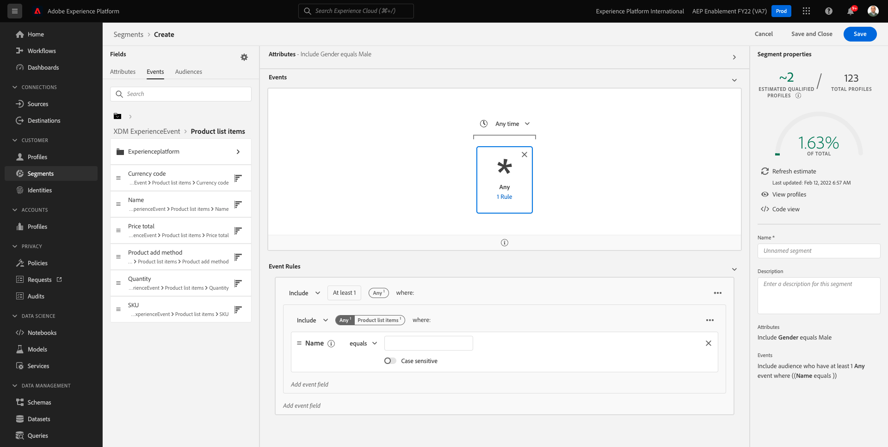
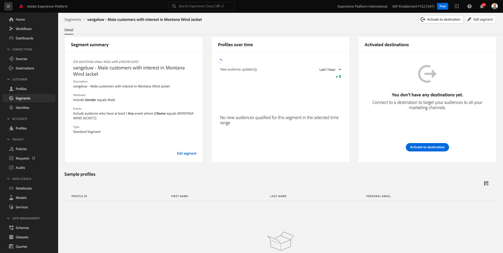

# 3.4 Skapa ett segment - användargränssnitt

I den här övningen skapar du ett segment genom att använda Adobe Experience Platform Segment Builder.

## Artikel

Gå till [Adobe Experience Platform](https://experience.adobe.com/platform). När du loggat in kommer du till Adobe Experience Platform hemsida.


Innan du fortsätter måste du välja en **sandlåda**. Sandlådan som ska markeras har namnet ``--aepSandboxId--``. Du kan göra detta genom att klicka på texten **[!UICONTROL Produktionsprodukt]** i den blå linjen ovanför skärmen. När du har valt lämplig [!UICONTROL sandlåda]kommer du att se skärmändringen och nu är du med på din [!UICONTROL sandlåda].


På menyn till vänster går du till **Segment**. På den här sidan visas en översikt över alla befintliga segment. Klicka på **+ Skapa segment** för att börja skapa ett nytt segment.


När du väl är i segmentbyggaren märker du omedelbart **Attribut** menyalternativ och **Individuell XDM-profil** referens.


Eftersom XDM är det språk som används i upplevelseverksamheten är XDM även grunden för segmentbyggaren. Alla data som är inkapslade i Platform ska mappas mot XDM, och som sådana blir alla data en del av samma datamodell oavsett varifrån dessa data kommer. Detta ger en stor fördel när du skapar segment, eftersom ni från det här segmentbyggargränssnittet kan kombinera data från vilket ursprung som helst i samma arbetsflöde. Segment som byggts i Segment Builder kan skickas till lösningar som Adobe Target, Adobe Campaign och Adobe Audience Manager för aktivering.

Låt oss bygga ett segment som innehåller alla **man** kunder.

För att komma till könsattributet måste du förstå och känna till XDM.

Kön är ett attribut till Person, som finns under Attribut. För att komma dit börjar du med att klicka på **Individuell XDM-profil**. Du kommer då att se det här. Från **Individuell XDM-profil** fönster, markera **Person**.


Du kommer då att se det här. I **Person** hittar du **Kön** -attribut. Dra Genusattributet till segmentbyggaren.


Nu kan du välja ett specifikt kön bland de förifyllda alternativen. I det här fallet väljer vi **Man**.


Efter markering **Man** kan du få en uppskattning av segmentets befolkning genom att trycka på **Uppdatera offert** -knappen. Detta är mycket användbart för en affärsanvändare, så att de kan se hur vissa attribut påverkar segmentstorleken.


Du kommer då att se en uppskattning som den nedan:


Därefter bör du finjustera segmentet lite. Ni måste bygga ut ett segment av alla manliga kunder som har tittat på produkten **Proteus Fitness Jackshirt (Orange)**.

Om du vill bygga ut det här segmentet måste du lägga till en Experience Event. Du kan hitta alla Experience Events genom att klicka på **Händelser** ikonen i **Fält** menyraden.


Nu ska vi se den översta nivån, **XDM ExperienceEvents** nod. Klicka på **XDM ExperienceEvent**.


Gå till **Produktlisteobjekt**.


Välj **Namn** och dra och släpp **Namn** objekt från den vänstra menyn på segmentbyggarbetsytan i **Händelser** -avsnitt.


Då ser du det här:



Jämförelseparametern ska vara **är lika med** och i indatafältet anger du **MONTANA WIND JACKET**.


Varje gång du lägger till ett element i segmentverktyget kan du klicka på **Uppdatera offert** för att få en ny uppskattning av populationen i ditt segment.

Hittills har du bara använt användargränssnittet för att skapa ditt segment, men det finns också ett kodalternativ för att skapa ett segment.

När du skapar ett segment skapar du faktiskt en PQL-fråga (Profile Query Language). Om du vill visualisera PQL-koden klickar du på **Kodvyn** i segmentbyggarens övre högra hörn.


Nu kan du se hela PQL-satsen:

```sql
person.gender in ["male"] and CHAIN(xEvent, timestamp, [C0: WHAT(productListItems.exists(name.equals("MONTANA WIND JACKET", false)))])
```

Du kan även förhandsgranska ett exempel på kundprofiler som ingår i det här segmentet genom att klicka på **Visa profiler**.


Till sist ger vi segmentet ett namn och sparar det.

Använd följande som namnkonvention:

- `--demoProfileLdap-- - Male customers with interest in Montana Wind Jacket`


Klicka sedan på **Spara och stäng** om du vill spara segmentet, och därefter återgår du till sidan Segmentöversikt.



Du kan nu fortsätta med nästa övning och skapa ett segment via API:t.

Nästa steg: [3.5 Skapa ett segment - API](./ex5.md)

[Gå tillbaka till modul 3](./real-time-customer-profile.md)

[Gå tillbaka till Alla moduler](../../overview.md)
