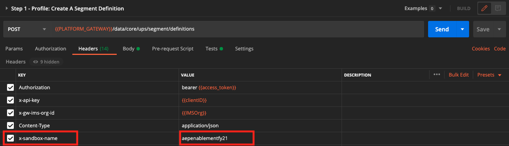

# 3.5 Skapa ett segment - API

I den här övningen ska du använda Postman och Adobe I/O för att skapa ett segment och lagra resultatet av det segmentet som en datauppsättning genom att använda Adobe Experience Platform API:er.

## Artikel

I kundprofilen i realtid visas alla profildata tillsammans med händelsedata och befintliga segmentmedlemskap. De data som visas kan komma var som helst, från Adobe-program och externa lösningar. Detta är den mest kraftfulla vyn i Adobe Experience Platform, det upplevelsesystem som finns.

## Exercise 3.5.1 - Skapa ett segment via plattforms-API

Gå till Postman.

Leta reda på samlingen: **_Adobe Experience Platform-aktivering**. I den här samlingen visas en mapp **2. Segmentering**. Vi kommer att använda de här förfrågningarna i den här övningen.


Vi ska nu följa alla steg som krävs för att skapa ett segment via API:t. Vi ska bygga ett enkelt segment: &quot;**ldap** - Alla kvinnliga kunder&quot;.

### Steg 1 - Skapa en segmentdefinition

Klicka på den namngivna begäran **Steg 1 - Profil: Skapa en segmentdefinition**.


Gå till **Brödtext** i denna begäran.


I **Brödtext** av denna förfrågan ser du följande:


Det språk som används för denna begäran kallas profilfrågespråk, eller **PQL**.

Du hittar mer information och dokumentation om PQL [här](https://experienceleague.adobe.com/docs/experience-platform/segmentation/pql/overview.html?lang=en).


Obs! uppdatera variabeln **name** i begäran nedan genom att ersätta **ldap** med dina **ldap**.

```json
{
    "name" : "ldap - API - All Female Customer",
    "expression" : {"type":"PQL", "format":"pql/json", "value":"{\"nodeType\":\"fnApply\",\"fnName\":\"in\",\"params\":[{\"nodeType\":\"fieldLookup\",\"fieldName\":\"gender\",\"object\":{\"nodeType\":\"fieldLookup\",\"fieldName\":\"person\",\"object\":{\"nodeType\":\"literal\",\"literalType\":\"XDMObject\",\"value\":\"profile\"}}},{\"literalType\":\"List\",\"nodeType\":\"literal\",\"value\":[\"female\"]}]}"},
    "createdBy": "ldap",
    "schema" : { "name" : "_xdm.context.profile"},
    "ttlInDays" : 90
}
```

När du har lagt till **ldap** bör brödtexten se ut ungefär så här:

```json
{
    "name" : "vangeluw - API - All Female Customer",
    "expression" : {"type":"PQL", "format":"pql/json", "value":"{\"nodeType\":\"fnApply\",\"fnName\":\"in\",\"params\":[{\"nodeType\":\"fieldLookup\",\"fieldName\":\"gender\",\"object\":{\"nodeType\":\"fieldLookup\",\"fieldName\":\"person\",\"object\":{\"nodeType\":\"literal\",\"literalType\":\"XDMObject\",\"value\":\"profile\"}}},{\"literalType\":\"List\",\"nodeType\":\"literal\",\"value\":[\"female\"]}]}"},
    "createdBy": "vangeluw",
    "schema" : { "name" : "_xdm.context.profile"},
    "ttlInDays" : 90
}
```

Du bör även verifiera **Sidhuvud** - fält i din begäran. Gå till **Sidhuvuden**. Då ser du det här:



| Nyckel | Värde |
| -------------- | ------------------ |
| x-sandbox-name | `--aepSandboxId--` |

>[!NOTE]
>
>Du måste ange namnet på den Adobe Experience Platform-sandlåda som du använder. Ditt x-sandbox-namn ska vara `--aepSandboxId--`.

Klicka nu på den blå **Skicka** för att skapa segmentet och visa resultatet av det.


Efter det här steget kan du visa din segmentdefinition i användargränssnittet för plattformen. Logga in på Adobe Experience Platform och gå till **Segment**.


### Steg 2 - Skapa ett jobb för POST av segment

I föregående övning skapade du en _direktuppspelning_ segment. Ett direktuppspelningssegment utvärderar kontinuerligt kvalifikationer i realtid. Det du gör här är att skapa en _batch_ segment. Gruppsegmentet ger dig en förhandsvisning av hur segmentet skulle kunna se ut när det gäller kvalifikationer, men _det betyder inte att segmentet faktiskt har körts_. För närvarande _ingen kvalificerar sig för det här segmentet_. För att få folk att kvalificera sig måste gruppsegmentet köras, vilket är precis vad vi ska göra här.

Nu ska vi POST ett segmentjobb.

Gå till Postman.


Klicka på den namngivna begäran i din Postman-samling **Steg 2 - POST segmentjobb** för att öppna den.


Du bör även verifiera **Sidhuvud** - fält i din begäran. Gå till **Sidhuvuden**. Då ser du det här:


| Nyckel | Värde |
| -------------- | ------------------ |
| x-sandbox-name | `--aepSandboxId--` |

>[!NOTE]
>
>Du måste ange namnet på den Adobe Experience Platform-sandlåda som du använder. Ditt x-sandbox-namn ska vara `--aepSandboxId--`.

Klicka på den blå **Skicka** -knappen.

Du bör få ett liknande resultat:


Segmentjobbet körs nu och det kan ta en stund. I steg 3 kan du kontrollera statusen för det här jobbet.


### Steg 3 - Jobbstatus för GET segment

Gå till Postman.


Klicka på den namngivna begäran i din Postman-samling **Steg 3 - Jobbstatus för GET segment**.


Du bör även verifiera **Sidhuvud** - fält i din begäran. Gå till **Sidhuvuden**. Då ser du det här:


| Nyckel | Värde |
| -------------- | ------------------ |
| x-sandbox-name | `--aepSandboxId--` |

>[!NOTE]
>
>Du måste ange namnet på den Adobe Experience Platform-sandlåda som du använder. Ditt x-sandbox-namn ska vara `--aepSandboxId--`.

Klicka på den blå **Skicka** -knappen.

Du bör få ett liknande resultat:


I det här exemplet **status** för jobbet är inställt på **KÖAD**.

Upprepa denna begäran genom att klicka på den blå **Skicka** knapp var minut tills **status** är inställd på **LYCKADES**.


När statusen är **LYCKADES**, segmentjobbet har körts och kunderna kvalificerar sig nu för segmentet.

Grattis, du har slutfört segmenteringsövningen. Nu ska vi se hur kundprofilen i realtid kan aktiveras i hela företaget.

Nästa steg: [3.6 Se hur kundprofilen i realtid fungerar i Call Center](./ex6.md)

[Gå tillbaka till modul 3](./real-time-customer-profile.md)

[Gå tillbaka till Alla moduler](../../overview.md)
