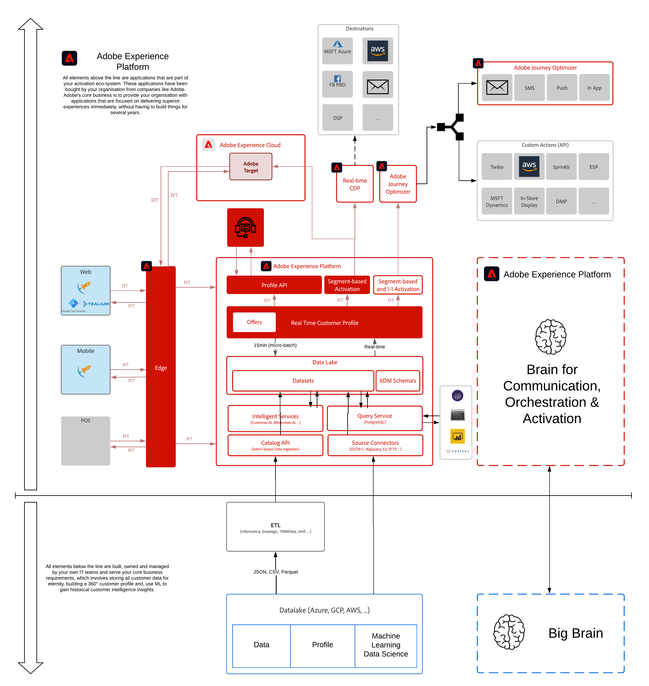

# 3. Foundation - kundprofil i realtid

**Författare: [Wouter Van Geluwe](https://www.linkedin.com/in/woutervangeluwe/)**

I den här modulen ska vi göra en djupdykning i kundprofil och identitetsfunktioner i realtid för Adobe Experience Platform. Du får lära dig hur målgrupper kan definieras, identitetstjänstens och Experience Cloud ID:ts roll och hur du definierar segmentbyggfrågor för att definiera egna segment.

## Utbildningsmål

- Lär dig visualisera kundens kundprofil i realtid via Adobe Experience Platform användargränssnitt
- Lär dig hur du skapar ett segment med Adobe Experience Platform Segment Builder
- Lär dig hur du skapar ett segment och lagrar segmentets resultat i en datauppsättning med Adobe Experience Platform API:er
- Läs mer om effekten av att ha tillgång till en fullständig kundprofil, inklusive beteenden i realtid, i offline-miljöer

## Förutsättningar

- Åtkomst till [Adobe Experience Platform](https://experience.adobe.com/platform)
- Åtkomst till [https://public.aepdemo.net](https://public.aepdemo.net)
- **Hämta dessa resurser**:
   - [Postman-samlingar](./../../assets/postman/postman_profile.zip)

>[!IMPORTANT]
>
>Den här självstudiekursen har skapats för att underlätta ett visst workshop-format. Den använder specifika system och konton som du kanske inte har tillgång till. Även om ni inte har tillgång till dem tror vi att ni fortfarande kan lära er mycket genom att läsa igenom detta mycket detaljerade innehåll. Om du deltar i något av seminarierna och behöver dina inloggningsuppgifter, kontakta din Adobe-representant som kommer att ge dig den information som krävs.

## Arkitektur - översikt

Titta närmare på arkitekturen nedan, som visar vilka komponenter som kommer att diskuteras och användas i den här modulen.

## Sandlåda att använda

Använd den här sandlådan för den här modulen: `--aepSandboxId--`.

>[!NOTE]
>
>Glöm inte att installera, konfigurera och använda Chrome-tillägget enligt referensen i [0.1 - Installera Chrome-tillägget för Experience League-dokumentationen](../module0/ex1.md)

## Utövningar

[3.1 Besök webbplatsen](./ex1.md)

I den här övningen följer du ett manus och går igenom webbplatsen.

[3.2 Visualisera din egen kundprofil i realtid - användargränssnitt](./ex2.md)

I den här övningen loggar du in på Adobe Experience Platform och visar din egen kundprofil i realtid i användargränssnittet.

[3.3 Visualisera din egen kundprofil i realtid - API](./ex3.md)

I den här övningen använder du Postman och Adobe I/O för att visa din egen kundprofil i realtid genom att använda Adobe Experience Platform API:er.

[3.4 Skapa ett segment - användargränssnitt](./ex4.md)

I den här övningen skapar du ett segment genom att använda Adobe Experience Platform Segment Builder.

[3.5 Skapa ett segment - API](./ex5.md)

I den här övningen ska du använda Postman och Adobe I/O för att skapa ett segment och lagra resultatet av det segmentet som en datauppsättning genom att använda Adobe Experience Platform API:er.

[3.6 Se hur kundprofilen i realtid fungerar i Call Center](./ex6.md)

I den här övningen personifierar du en handläggare som får ett samtal från en kund. För att verkligen påverka kundupplevelsen måste ni ha tillgång till all tillgänglig information i realtid.

[Sammanfattning och fördelar](./summary.md)

Sammanfattning av den här modulen och en översikt över fördelarna.

>[!NOTE]
>
>Tack för att du lade ned din tid på att lära dig allt om Adobe Experience Platform. Om du har frågor kan du dela allmän feedback om dina förslag på framtida innehåll. Kontakta Wouter Van Geluwe direkt genom att skicka ett e-postmeddelande till **vangeluw@adobe.com**.

[Gå tillbaka till Alla moduler](../../overview.md)
