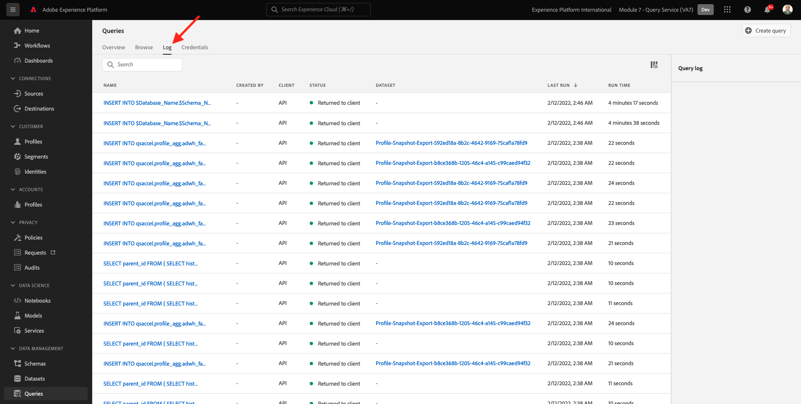

# 4.1 Komma igång

## 4.1.1 Bekanta dig med Adobe Experience Platform användargränssnitt

Gå till [Adobe Experience Platform](https://experience.adobe.com/platform). När du loggat in kommer du till Adobe Experience Platform hemsida.

Innan du fortsätter måste du välja en **sandlåda**. Sandlådan som ska markeras har namnet ``--module7sandbox--``. Du kan göra detta genom att klicka på texten **[!UICONTROL Produktionsprodukt]** i den blå linjen ovanför skärmen. När du har valt lämplig [!UICONTROL sandlåda]kommer du att se skärmändringen och nu är du med på din [!UICONTROL sandlåda].

## 4.1.2 Utforska data på plattformen

Att samla in data från olika kanaler är en svår uppgift för alla varumärken. Och i den här övningen engagerar Citi Signal-kunder med Citi Signal på sin webbplats, på sin mobilapp, så samlas köpdata in av Citi Sigals Point of Sale-system och de har CRM- och Loyalty-data. Citi Signal använder Adobe Analytics och Adobe Launch för att samla in data på sin webbplats, i mobilappen och i POS-systemet, så dessa data flödar redan till Adobe Experience Platform. Vi börjar med att utforska alla data för Citi Signal som redan finns i Adobe Experience Platform.

Gå till den vänstra menyn **Datauppsättningar**.

Citi Signal strömmar data till Adobe Experience Platform och dessa data finns i `Demo System - Event Dataset for Website (Global v1.1)` datauppsättning. Sök efter `Demo System - Event Dataset for Website`.

Citi Signals Callcenter Interaction-data hämtas i `Demo System - Event Dataset for Call Center (Global v1.1)` datauppsättning. Sök efter `Demo System - Event Dataset for Call Center` data i sökrutan. Klicka på datauppsättningens namn för att öppna den.

När du har klickat på datauppsättningen får du en översikt över datauppsättningsaktiviteten, t.ex. kapslade och misslyckade batchar.

Klicka på **Förhandsgranska datauppsättning** för att se exempel på data som lagras i `Demo System - Event Dataset for Call Center (Global v1.1)` datauppsättning. Den vänstra panelen visar schemastrukturen för den här datauppsättningen.

Klicka på **Stäng** för att stänga **Förhandsgranska datauppsättning** -fönstret.

## 4.1.3 Introduktion till Query Service

Adobe Experience Platform Query Service öppnas genom att man klickar på **Frågor** i den vänstra menyn.

Genom att gå till **Logg** På sidan Frågelista visas en lista med alla frågor som har körts i organisationen, med den senaste överst.

Klicka på en SQL-fråga i listan och observera informationen i den högra listen.

Du kan rulla fönstret för att se hela frågan eller klicka på ikonen som är markerad nedan för att kopiera hela frågan till anteckningsrutan. Du behöver inte kopiera frågan just nu.

Du kan inte bara se de frågor som har körts. Med det här användargränssnittet kan du skapa nya datauppsättningar från frågor. Dessa datauppsättningar kan länkas till Adobe Experience Platform kundprofil i realtid eller användas som indata för Adobe Experience Platform Data Science Workspace.

## 4.1.4 Anslut PSQL-klienten till frågetjänsten

Frågetjänsten stöder klienter med en drivrutin för PostgreSQL. Här kommer vi att använda PSQL, ett kommandoradsgränssnitt och Power BI eller Tableau. Låt oss ansluta till PSQL.

Klicka på **Autentiseringsuppgifter**.

Skärmen visas nedan. Konfigurationsskärmen innehåller serverinformation och autentiseringsuppgifter för autentisering till frågetjänsten. För närvarande fokuserar vi på skärmens högra sida som innehåller ett anslutningskommando för PSQL. Klicka på knappen Kopiera för att kopiera kommandot till Urklipp.

För Windows: Öppna kommandoraden genom att trycka på Windows-tangenten och skriva cmd och sedan klicka på resultatet av kommandotolken.

För macOS: Öppna terminal.app via spotlight-sökning:

Klistra in det anslutningskommando som du har kopierat från användargränssnittet för frågetjänsten och tryck på Retur i kommandotolken:

Windows:

macOS:

Du är nu ansluten till frågetjänsten med PSQL.

I de följande övningarna kommer det att finnas en hel del interaktion med detta fönster. Vi kallar det **PSQL kommandoradsgränssnitt**.

Nu kan du börja skicka frågor.

Nästa steg: [4.2 Använda frågetjänsten](./ex2.md)

[Gå tillbaka till modul 4](./query-service.md)

[Gå tillbaka till Alla moduler](../../overview.md)
