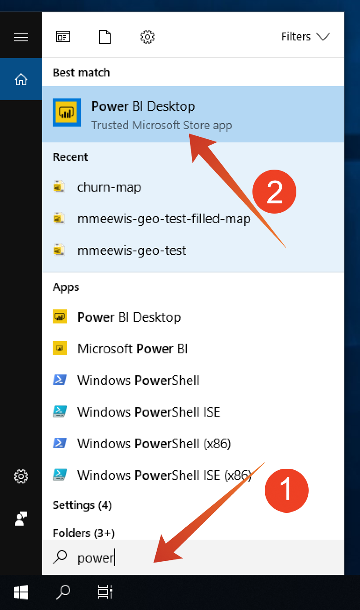

# 4.5 Query Service och Power BI

Öppna Microsoft Power BI Desktop.

Klicka **Hämta data**.

Sök efter **affischer** (1), välja **Postgres** (2) från förteckningen och **Anslut** (3).

Gå till Adobe Experience Platform **Frågor** och till **Autentiseringsuppgifter**.

Från **Autentiseringsuppgifter** i Adobe Experience Platform, kopiera **Värd** och klistra in den i **Server** och kopiera **Databas** och klistra in den i **Databas** i PowerBI och klicka sedan på OK (2).

>[!IMPORTANT]
>
>Se till att inkludera port **:80** i slutet av servervärdet eftersom frågetjänsten för närvarande inte använder PostgreSQL-standardporten 5432.

I nästa dialogruta fyller du i användarnamnet och lösenordet med ditt användarnamn och lösenord som finns i dialogrutan **Autentiseringsuppgifter** för frågor i Adobe Experience Platform.

I dialogrutan Överblick placerar du **LDAP** i sökfältet (1) för att hitta dina CTAS-datauppsättningar och markera kryssrutan bredvid varje (2). Klicka sedan på Läs in (3).

Se till att **Rapport** -fliken (1) är markerad.

Markera kartan (1) och förstora kartan (2) när den har lagts till på rapportarbetsytan.

Därefter måste vi definiera mått och mått. Det gör du genom att dra fält från **fält** till motsvarande platshållare (finns under **visualiseringar**) enligt nedan:

Som mått kommer vi att använda ett antal **customerId**. Dra **krut** fält från **fält** till **Storlek** platshållare:

Till sist: **callTopic** analys, vi drar **callTopic** till **Sidnivåfilter** platshållare (du kan behöva rulla i **visualiseringar** avsnitt),

Markera/avmarkera **callTopics** undersöka

Du har nu avslutat den här övningen.

Nästa steg: [4.7 Query Service API](./ex7.md)

[Gå tillbaka till modul 4](./query-service.md)

[Gå tillbaka till Alla moduler](../../overview.md)
