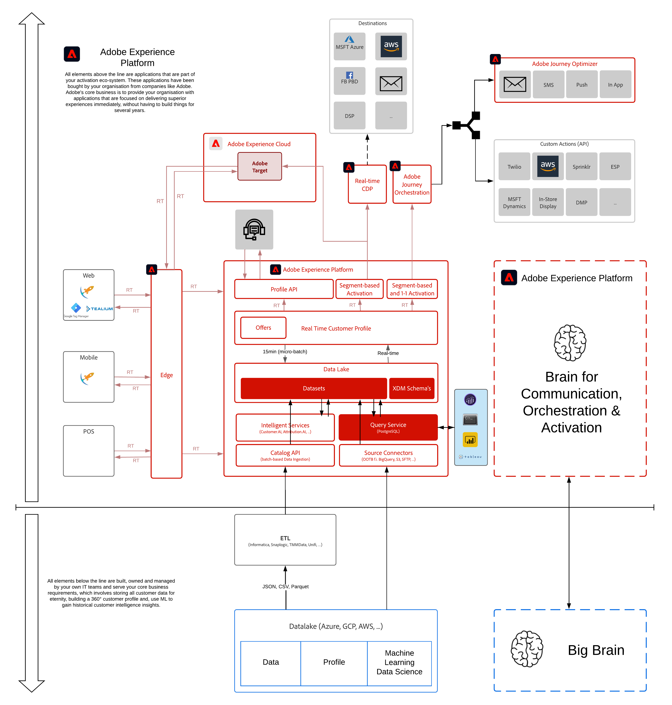

# 4. Frågetjänst

**Författare: [Marc Meewis](https://www.linkedin.com/in/marcmeewis/), [Wouter Van Geluwe](https://www.linkedin.com/in/woutervangeluwe/)**

I den här modulen får du en praktisk förhandsgranskning av Adobe Experience Platform Query Service. Med frågetjänsten kan du utföra flerkanalsfrågor i alla Adobe Experience Cloud-programdata, förena och analysera data i Adobe Campaign, Analytics, Audience Manager, Target och Advertising Cloud samt andra kunddata som läses in/infogas i Adobe Experience Platform.

Query Service är ett serverlöst verktyg. Den stöder SQL-frågor och anslutningar från flera klientprogram genom sin PostSQL-kompatibilitet.
Vi kommer att använda data som har injicerats i plattformen med antingen Web Interaction Data, Call Center Interactions i kombination med kundlojalitetsdata som överförts till plattformen.

## Utbildningsmål

- Bekanta dig med Adobe Experience Platform användargränssnitt
- Anslut till frågetjänsten och kör dina SQL-frågor
- Utforska datauppsättningar i Adobe Experience Platform
- Koppla Tableu eller Power BI till Adobe Experience Platform Query Service för att skapa visualiseringar och rapporter

## Förutsättningar

- Viss kunskap om SQL är att föredra, men behövs inte
- Tillgång till Adobe Experience Platform: [https://experience.adobe.com/platform](https://experience.adobe.com/platform)
- Datauppsättningar (datauppsättningar som används under labben, förinlästa åt dig)
- PostgreSQL
- Tableau eller Microsoft Power BI Desktop
- **Hämta dessa resurser**:
   - [JSON - Exempeldata: Webbplatsinteraktioner](./../../assets/json/ee.json)
   - [JSON - Exempeldata: Interaktion med samtalscenter](./../../assets/json/callcenter.json)
   - [JSON - Exempeldata: Lojalitet](./../../assets/json/loyalty.json)

>[!IMPORTANT]
>
>Den här självstudiekursen har skapats för att underlätta ett visst workshop-format. Den använder specifika system och konton som du kanske inte har tillgång till. Även om ni inte har tillgång till dem tror vi att ni fortfarande kan lära er mycket genom att läsa igenom detta mycket detaljerade innehåll. Om du deltar i något av seminarierna och behöver dina inloggningsuppgifter, kontakta din Adobe-representant som kommer att ge dig den information som krävs.

## Arkitektur - översikt

Titta närmare på arkitekturen nedan, som visar vilka komponenter som kommer att diskuteras och användas i den här modulen.

## Sandlåda att använda

Använd den här sandlådan för den här modulen: `--module7sandbox--`.

>[!NOTE]
>
>Glöm inte att installera, konfigurera och använda Chrome-tillägget enligt referensen i [0.1 - Installera Chrome-tillägget för Experience League-dokumentationen](../module0/ex1.md)

## Utövningar

[4.0 Förutsättningar](./ex0.md)

Du måste installera PSQL för att kunna köra frågorna i den här aktiveringsövningen. Beroende på vilket operativsystem du har måste du installera Microsoft Power BI eller Tableau. Windows-användare kan välja mellan Power BI och Tableau. Mac-användare bör installera Tableau.

[4.1 Komma igång](./ex1.md)

I den här övningen ska du utforska Adobe Experience Platform Query Service-användargränssnittet, lära dig mer om datauppsättningar, hitta dina frågor och slutligen konfigurera en anslutning från PSQL.

[4.2 Använda frågetjänsten](./ex2.md)

I den här övningen får du lära dig mer om den grundläggande frågetjänstens syntax och du kan identifiera attributen för XDM-schemat i din fråga.

[4.3 Frågor, frågor, frågor.. och bortvinningsanalys](./ex3.md)

I den här övningen kommer du att göra frågor, medan du gör någon omsättningsanalys, lära dig mer om de Adobe-definierade funktionerna. När du är klar skriver du en fråga för att förbereda en datauppsättning för användning i Microsoft Power BI.

[4.4 Generera en datauppsättning från en fråga](./ex4.md)

I den här övningen genererar du en datauppsättning från en fråga som kördes tidigare och du kommer att använda den här datauppsättningen i nästa övning.

[4.5 Query Service och Power BI](./ex5.md)

I den här övningen ansluter du Power BI till Adobe Experience Platform och frågetjänsten för att utföra callcenter-interaktionsanalys.

[4.6 Query Service och Tableau](./ex6.md)

I den här övningen ansluter du Tableau till Adobe Experience Platform och Query Service för att utföra Callcenter Interaction Analysis.

[4.7 Query Service API](./ex7.md)

I den här övningen ska du använda API:t för frågetjänsten för att hantera frågemallar och frågescheman.

[Sammanfattning och fördelar](./summary.md)

Sammanfattning av den här modulen och en översikt över fördelarna.

>[!NOTE]
>
>Tack för att du lade ned din tid på att lära dig allt om Adobe Experience Platform. Om du har frågor kan du dela allmän feedback om dina förslag på framtida innehåll. Kontakta Wouter Van Geluwe direkt genom att skicka ett e-postmeddelande till **vangeluw@adobe.com**.

[Gå tillbaka till Alla moduler](../../overview.md)
