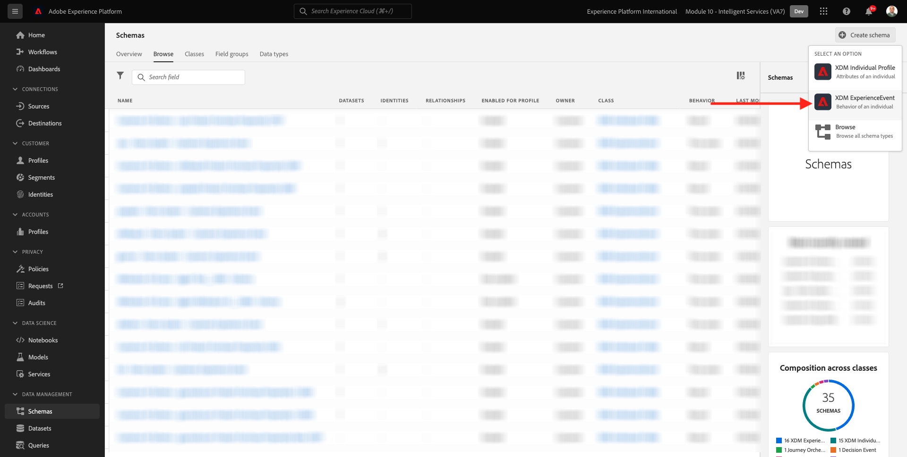
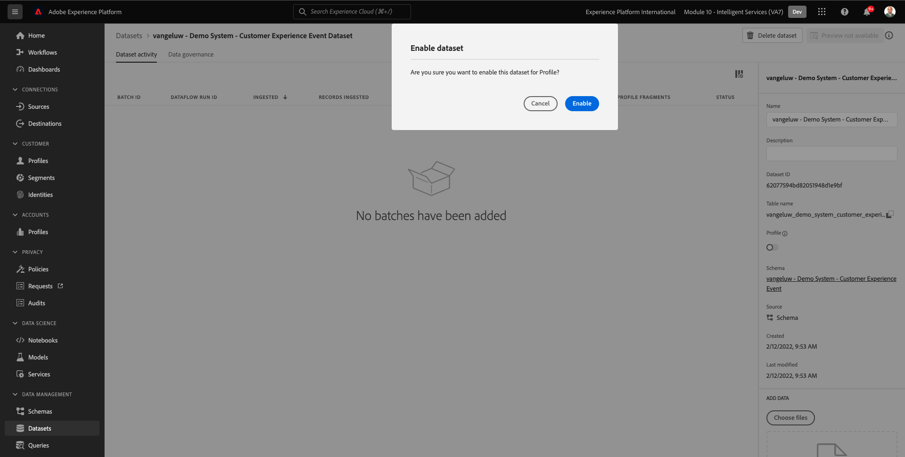

# 5.1 Customer AI - Data Preparation (Ingest)

För att Intelligent Services ska kunna hitta insikter från era marknadsföringshändelsedata måste data anrikas semantiskt och underhållas i en standardstruktur. Intelligent Services utnyttjar scheman från Adobe Experience Data Model (XDM) för att uppnå detta.
Alla datauppsättningar som används i Intelligent Services måste i synnerhet överensstämma med **Consumer Experience Event** XDM-schema.

## 5.1.1 Skapa schema

I den här övningen skapar du ett schema som innehåller **Consumer Experience Event mixin**, vilket krävs av **Kund-AI** Intelligent Service.

Logga in på Adobe Experience Platform genom att gå till denna URL: [https://experience.adobe.com/platform](https://experience.adobe.com/platform).

När du loggat in kommer du till Adobe Experience Platform hemsida.

Innan du fortsätter måste du välja en **sandlåda**. Sandlådan som ska markeras har namnet ``--module10sandbox--``. Du kan göra detta genom att klicka på texten **[!UICONTROL Produktionsprodukt]** i den blå linjen ovanför skärmen. När du har valt rätt sandlåda ser du skärmändringen och nu befinner du dig i din dedikerade sandlåda.

Klicka på **Scheman** och gå till **Bläddra**. Klicka **Skapa schema**.

Välj **XDM ExperienceEvent**.

Du kommer då att se det här.

Sök och välj följande **Blandningar** för att lägga till i schemat:

- Consumer Experience Event

   

- Information om slutanvändar-ID

   

Klicka **Lägg till fältgrupper**.

Du kommer då att se det här. Välj Mixin **Information om slutanvändar-ID**.

Navigera till fältet **endUserID:n._experience.emailid.id**.

I fältets högra meny **endUserID:n._experience.emailid.id**, rulla nedåt och markera kryssrutan för **Identitet**, markera kryssrutan för **Primär identitet** och väljer **Namnutrymme för identitet** av **E-post**.

Navigera till fältet **endUserID:n._experience.mcid.id**. Markera kryssrutan för **Identitet** och väljer **Namnutrymme för identitet** av **ECID**. Klicka **Använd**.

Ge schemat ett namn nu.

Som namn för vårt schema ska du använda följande:

- `--demoProfileLdap-- - Demo System - Customer Experience Event`

Som ett exempel för ldap **vangeluw** bör det vara schemats namn:

- **vangeluw - Demo System - Customer Experience Event**

Det borde ge dig något såhär. Klicka på **+ Lägg till** knapp för att lägga till ny **Blandningar**.

Välj namnet på schemat. Nu bör du aktivera ditt schema för **Profil** genom att klicka på **Profil** växla.

Du kommer då att se det här. Klicka **Aktivera**.

Du borde ha den här nu. Klicka **Spara** för att spara ditt schema.

## 5.1.2 Skapa datauppsättning

Klicka på **Datauppsättningar** och gå till **Bläddra**. Klicka **Skapa datauppsättning**.

Klicka **Skapa datauppsättning från schema**.

På nästa skärm väljer du den datauppsättning som du skapade i föregående övning, med namnet **[!UICONTROL ldap - Demo System - Customer Experience Event]**. Klicka på **Nästa**.

Använd `--demoProfileLdap-- - Demo System - Customer Experience Event Dataset`. Klicka **Slutför**.

Din datauppsättning har skapats. Aktivera **Profil** växla.

Klicka **Aktivera**.

Nu bör du ha den här:

Du är nu redo att börja inhämta data från kundupplevelsehändelser och börja använda kundens AI-tjänst.

## 5.1.3 Hämta testdata för Experience Event

När **Schema** och **Datauppsättning** är konfigurerade är ni nu redo att importera Experience Event-data. Eftersom kundens AI kräver data över **2 kvartal minst** måste du importera externt förberedda data.

De data som förbereds för upplevelsehändelserna måste uppfylla kraven och schemat i [XDM-mixning för konsumentupplevelsehändelse](https://github.com/adobe/xdm/blob/797cf4930d5a80799a095256302675b1362c9a15/docs/reference/context/experienceevent-consumer.schema.md).

Hämta filen som innehåller exempeldata från den här platsen: [https://dashboard.adobedemo.com/data](https://dashboard.adobedemo.com/data). Klicka på **Hämta** -knappen.

Du har nu laddat ned en fil med namnet **retail-v1-dec2020-xl.json.zip**. Placera filen på datorns skrivbord och zippa upp den. Därefter visas en fil med namnet **retail-v1.json**. Du kommer att behöva den här filen i nästa övning.

## 5.1.4 Testdata för händelsen Ingest Experience

I Adobe Experience Platform går du till **Datauppsättningar** och öppna datauppsättningen med ett namn **[!UICONTROL ldap - Demo System - Customer Experience Event Dataset]**.

Klicka på **Välj filer** för att lägga till data.

Markera filen på popup-menyn **retail-v1.json** och klicka **Öppna**.

Du kommer då att se de data som importeras och en ny grupp skapas i **Läser in** tillstånd. Navigera inte bort från den här sidan förrän filen har överförts.

När filen har överförts ser du att batchstatusen ändras från **Läser in** till **Bearbetar**.

Inmatning och bearbetning av data kan ta 10-20 minuter.

När dataimporten är klar ändras batchstatusen till **Lyckades**.

Nästa steg: [5.2 Customer AI - Create a New Instance (Konfigurera)](./ex2.md)

[Gå tillbaka till modul 5](./intelligent-services.md)

[Gå tillbaka till Alla moduler](./../../overview.md)
