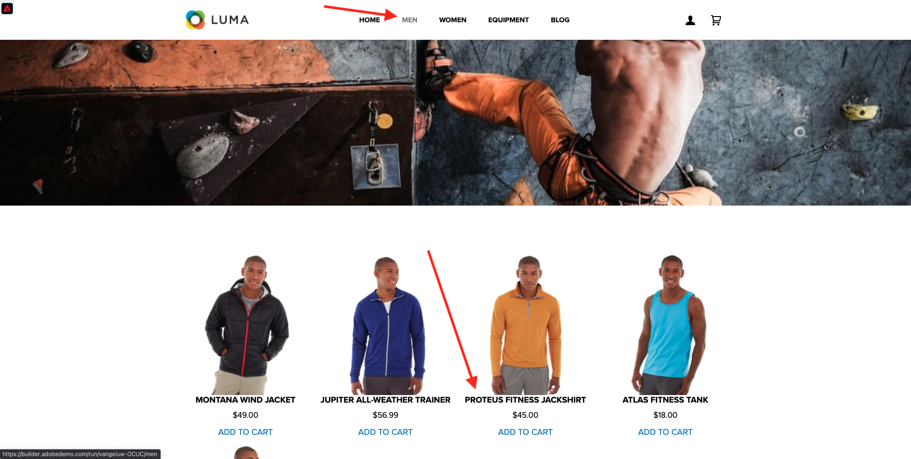
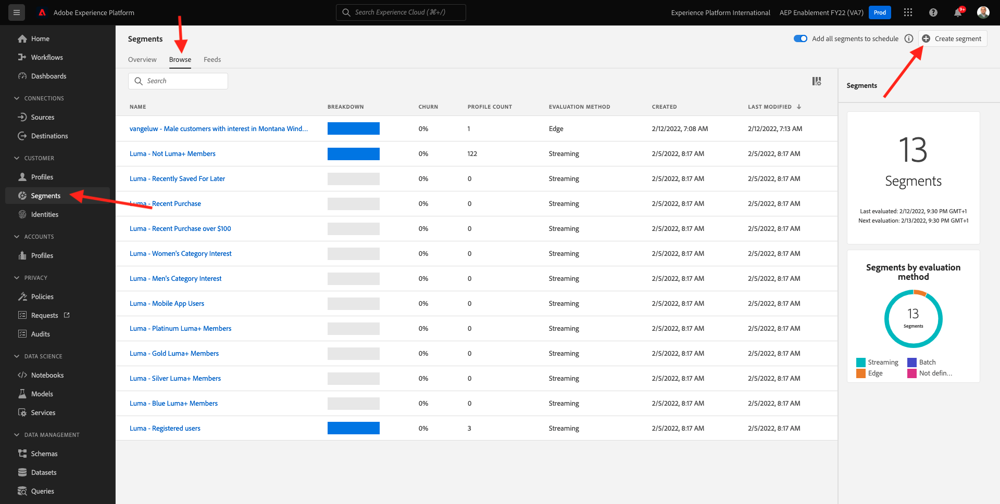
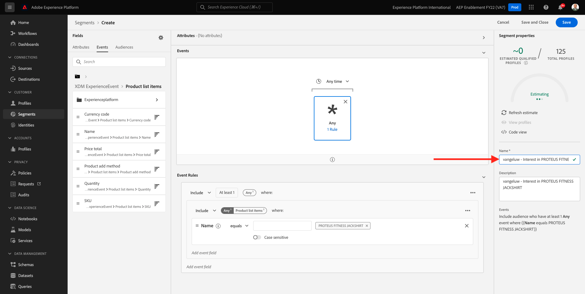

# 6.1 Skapa ett segment

I den här övningen skapar du ett segment genom att använda Adobe Experience Platform segmentbyggare.

## 6.1.1 Sammanhang

I dagens värld måste kundens beteende i realtid hanteras. Ett sätt att svara på kundbeteenden i realtid är att använda ett segment, förutsatt att segmentet kvalificeras i realtid. I den här övningen måste ni bygga ut ett segment, med hänsyn tagen till den verkliga aktiviteten på webbplatsen som vi har använt.

## 6.1.2 Identifiera det beteende du vill reagera på

Gå till [https://builder.adobedemo.com/projects](https://builder.adobedemo.com/projects). När du har loggat in med din Adobe ID ser du det här. Klicka på webbplatsprojektet för att öppna det.

Nu kan du följa nedanstående flöde för att komma åt webbplatsen. Klicka **Integreringar**.

På **Integreringar** måste du välja den datainsamlingsegenskap som skapades i övning 0.1.

Du kommer då att se din demowebbplats öppnas. Markera URL-adressen och kopiera den till Urklipp.

Öppna ett nytt inkognito-webbläsarfönster.

Klistra in webbadressen till demowebbplatsen, som du kopierade i föregående steg. Du ombeds sedan logga in med din Adobe ID.

Välj kontotyp och slutför inloggningsprocessen.

Därefter visas webbplatsen i ett inkognitivt webbläsarfönster. För varje demonstration måste du använda ett nytt, inkognitivt webbläsarfönster för att läsa in webbadressen till demowebbplatsen.

I det här exemplet vill du svara en viss kund som tittar på en viss produkt.
Från **Luma** startsida, gå till **Män** och klicka på produkten **PROTEUS FITNESS JACKSHIRT**.

Så när någon besöker produktsidan efter **PROTEUS FITNESS JACKSHIRT** vill du kunna vidta åtgärder. Det första du måste göra är att definiera ett segment.

## 6.1.3 Skapa segmentet

Gå till [Adobe Experience Platform](https://experience.adobe.com/platform). När du loggat in kommer du till Adobe Experience Platform hemsida.

Innan du fortsätter måste du välja en **sandlåda**. Sandlådan som ska markeras har namnet ``--aepSandboxId--``. Du kan göra detta genom att klicka på texten **[!UICONTROL Produktionsprodukt]** i den blå linjen ovanför skärmen. När du har valt lämplig [!UICONTROL sandlåda]kommer du att se skärmändringen och nu är du med på din [!UICONTROL sandlåda].

På menyn till vänster går du till **Segment** och sedan gå till **Bläddra** där du kan se en översikt över alla befintliga segment. Klicka på **Skapa segment** för att börja skapa ett nytt segment.

Som nämnts ovan måste ni bygga ett segment av alla kunder som har tittat på produkten **PROTEUS FITNESS JACKSHIRT**.

Om du vill bygga ut det här segmentet måste du lägga till en händelse. Du kan söka efter alla händelser genom att klicka på **Händelser** ikonen i **Segment** menyraden.

Nu visas den översta nivån **XDM ExperienceEvent** nod.

För att hitta kunder som har besökt **PROTEUS FITNESS JACKSHIRT** produkt, klicka på **XDM ExperienceEvent**.

Bläddra nedåt till **Produktlisteobjekt** och klicka på den.

Välj **Namn** och dra och släpp **Namn** objekt från vänster **Produktlisteobjekt** på segmentbyggarbetsytan i **Händelser** -avsnitt.

Jämförelseparametern ska vara **är lika med** och i indatafältet anger du `PROTEUS FITNESS JACKSHIRT`.

Dina **Händelseregler** borde nu se ut så här. Varje gång du lägger till ett element i segmentverktyget kan du klicka på **Uppdatera offert** för att få en ny uppskattning av populationen i ditt segment.

Till sist ger vi segmentet ett namn och sparar det.

Använd följande som namnkonvention:

- `--demoProfileLdap-- - Interest in PROTEUS FITNESS JACKSHIRT`

Segmentnamnet ska se ut så här:
`vangeluw - Interest in PROTEUS FITNESS JACKSHIRT`

Klicka sedan på **Spara och stäng** för att spara segmentet.

Du kommer nu tillbaka till sidan Segmentöversikt.

Nästa steg: [6.2 Granska hur du konfigurerar DV360-mål med hjälp av destinationer](./ex2.md)

[Gå tillbaka till modul 11](./real-time-cdp-build-a-segment-take-action.md)

[Gå tillbaka till Alla moduler](../../overview.md)
