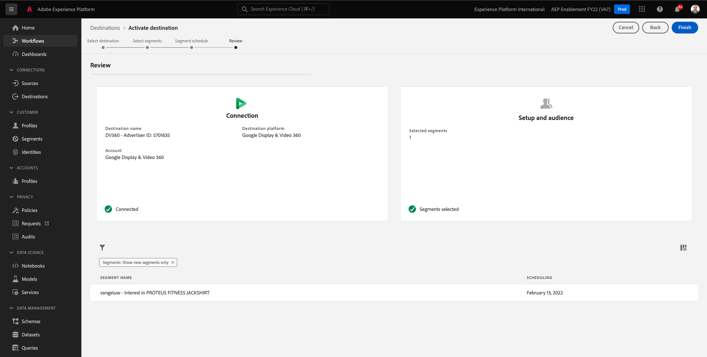

# 6.3 Vidta åtgärder: skicka segmentet till DV360

Gå till [Adobe Experience Platform](https://experience.adobe.com/platform). När du loggat in kommer du till Adobe Experience Platform hemsida.

Innan du fortsätter måste du välja en **sandlåda**. Sandlådan som ska markeras har namnet ``--aepSandboxId--``. Du kan göra detta genom att klicka på texten **[!UICONTROL Produktionsprodukt]** i den blå linjen ovanför skärmen. När du har valt lämplig [!UICONTROL sandlåda]kommer du att se skärmändringen och nu är du med på din [!UICONTROL sandlåda].

Gå till den vänstra menyn **Destinationer** och sedan gå till **Katalog**. Då ser du **Målkatalog**.

I **Destinationer** klickar du på **Aktivera segment** på **Google Display &amp; Video 360** kort.

Välj mål och klicka på **Nästa**.

I listan med tillgängliga segment väljer du det segment som du skapade i föregående övning. Klicka på **Nästa**.

På **Segmentschema** sida, klicka **Nästa**.

Till sist **Granska** sida, klicka **Slutför**.

Ditt segment är nu länkat till Google DV360. Varje gång en kund kvalificerar sig för det här segmentet skickas en signal till Google DV360 för att inkludera den kunden i målgruppen på Google DV360-sidan.

Nästa steg: [6.4 Vidta åtgärder: skicka segmentet till en S3-destination](./ex4.md)

[Gå tillbaka till modul 6](./real-time-cdp-build-a-segment-take-action.md)

[Gå tillbaka till Alla moduler](../../overview.md)
