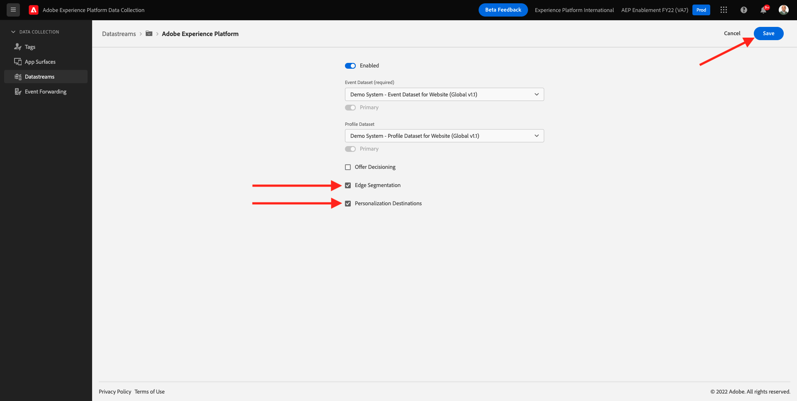
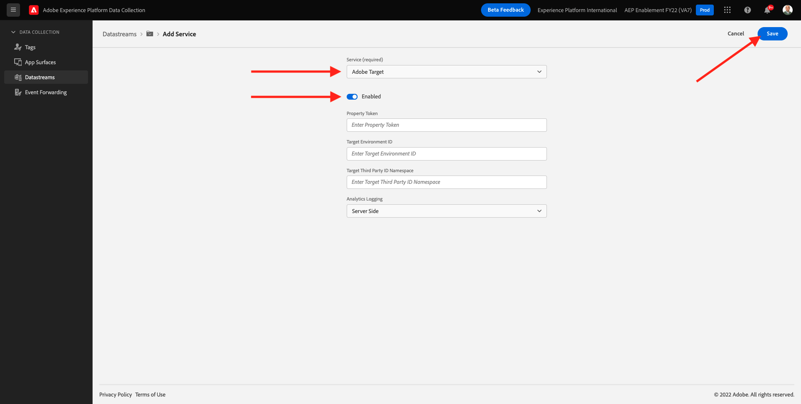
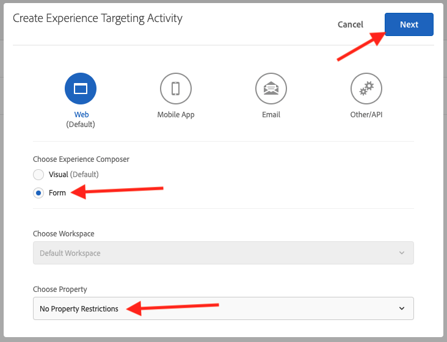
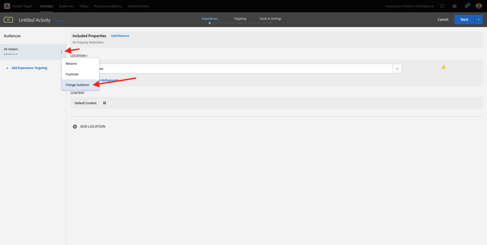
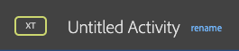
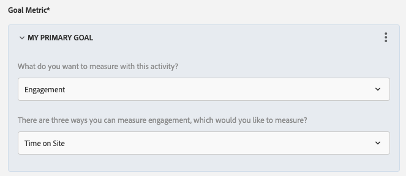

# 6.5 Vidta åtgärder: skicka segmentet till Adobe Target

Gå till [Adobe Experience Platform](https://experience.adobe.com/platform). När du loggat in kommer du till Adobe Experience Platform hemsida.


Innan du fortsätter måste du välja en **sandlåda**. Sandlådan som ska markeras har namnet ``--aepSandboxId--``. Du kan göra detta genom att klicka på texten **[!UICONTROL Produktionsprodukt]** i den blå linjen ovanför skärmen. När du har valt lämplig [!UICONTROL sandlåda]kommer du att se skärmändringen och nu är du med på din [!UICONTROL sandlåda].


## 6.5.1 Verifiera ditt datastream

Adobe Target-målet i Real-Time CDP är anslutet till den datastream som används för att importera data till kantnätverket i Adobe. Om du vill ställa in ditt Adobe Target-mål måste du först kontrollera om ditt datastream redan är aktiverat för Adobe Target. Ditt datastram har konfigurerats i [Utövning 0.2 Skapa ditt datastream](./../module0/ex2.md) och har namngetts `--demoProfileLdap-- - Demo System Datastream`.

Gå till [https://experience.adobe.com/#/data-collection/](https://experience.adobe.com/#/data-collection/)och sedan klicka **Datastreams** eller **Datastreams (beta)**.


I skärmens övre högra hörn väljer du namnet på sandlådan, som bör vara `--aepSandboxId--`.


I Datastreams söker du efter den datastream som har namnet `--demoProfileLdap-- - Demo System Datastream`. Klicka på ditt datastream för att öppna det.


Du kommer att se det här, klicka **...** nästa **Adobe Experience Platform** och sedan klicka **Redigera**.


Markera kryssrutorna för båda **Kantsegmentering** och **Destinationer för personalisering**. Klicka **Spara**.



Klicka på **+ Lägg till tjänst**.


Välj tjänsten **Adobe Target**. Klicka **Spara**.



Din datastream är nu konfigurerad för Adobe Target.


## 6.5.2 Konfigurera ditt Adobe Target-mål

Adobe Target finns som mål från Real-Time CDP. Om du vill konfigurera Adobe Target-integreringen går du till **Destinationer**, till **Katalog**.


Klicka **Personalisering** i **Kategorier** -menyn. Då ser du **Adobe Target** destinationskort. Klicka **Aktivera segment** (eller **Konfigurera** beroende på din miljö).


Beroende på din miljö kan du behöva klicka **+ Konfigurera nytt mål** för att börja skapa destinationen.


Du kommer då att se det här.


I **Konfigurera nytt mål** måste du konfigurera två saker:

- Namn: använd namnet `--demoProfileLdap-- - Adobe Target (Web)`som ser ut så här: **vangeluw - Adobe Target (webb)**.
- Datastream-ID: du måste välja den datastream som du konfigurerade i [Utövning 0.2 Skapa ditt datastream](./../module0/ex2.md). Namnet på din datastream ska vara: `--demoProfileLdap-- - Demo System Datastream`.

Klicka på **Nästa**.


På nästa skärm kan du välja en policy. Du behöver inte välja någon, i det här fallet behöver du inte välja någon, så klicka **Skapa**.


Målet skapas nu och visas i listan. Välj mål och klicka på **Nästa** för att börja skicka segment till din destination.


I listan med tillgängliga segment väljer du det segment du skapade i [Utgång 6.1 Skapa ett segment](./ex1.md), som har namnet `--demoProfileLdap-- - Interest in PROTEUS FITNESS JACKSHIRT`. Klicka sedan på **Nästa**.


På nästa sida klickar du på **Nästa**.


Klicka **Slutför**.


Ditt segment är nu aktiverat mot Adobe Target.


>[!IMPORTANT]
>
>När du just har skapat Adobe Target-destinationen i Real-Time CDP kan det ta upp till en timme innan destinationen är aktiv. Detta är en engångsväntetid på grund av konfigurationen av serverdelskonfigurationen. När den inledande väntetiden på en timme och backend-konfigurationen är klar, kommer nytillagda kantsegment som skickas till Adobe Target-destinationen att vara tillgängliga för målgruppsanpassning i realtid.

## 6.5.3 Konfigurera din formulärbaserade Adobe Target-aktivitet

Nu när ditt Real-Time CDP-segment är konfigurerat att skickas till Adobe Target kan du konfigurera din Experience Targeting-aktivitet i Adobe Target. I den här övningen ska du konfigurera en formulärbaserad aktivitet.

Gå till Adobe Experience Cloud hemsida genom att gå till [https://experiencecloud.adobe.com/](https://experiencecloud.adobe.com/). Klicka **Mål** för att öppna den.


På **Adobe Target** på startsidan ser du alla befintliga aktiviteter.


Klicka **+ Skapa aktivitet** för att skapa en ny aktivitet.


Välj **Experience Targeting**.


Välj **Formulär** och markera **Inga egenskapsbegränsningar**. Klicka på **Nästa**.



Du är nu med i den formulärbaserade aktivitetshanteraren.


För fältet **PLATS 1**, markera **target-global-mbox**.


Standardmålgruppen är för närvarande **Alla besökare**. Klicka på **3 punkter** nästa **Alla besökare** och klicka **Ändra målgrupp**.



Du ser nu en lista över tillgängliga målgrupper, och Adobe Experience Platform-segmentet som du skapade tidigare och skickade till Adobe Target ingår nu i listan. Markera det segment som du tidigare har skapat i Adobe Experience Platform. Klicka **Tilldela publik**.


Ditt Adobe Experience Platform-segment är nu en del av denna Experience Targeting Activity.


Nu ska vi ändra Hero Image på webbplatsens hemsida. Klicka för att öppna listrutan bredvid **Standardinnehåll** och klicka **Skapa HTML**.


Klistra in följande kod. Klicka sedan på **Nästa**.

```javascript
<script>document.querySelector("#home > div > div > div > div > div.banner_img.d-none.d-lg-block > img").src="https://parsefiles.back4app.com/hgJBdVOS2eff03JCn6qXXOxT5jJFzialLAHJixD9/ff92fdc3885972c0090ad5419e0ef4d4_Luma - Product - Proteus - Hero Banner.png"; document.querySelector(".banner_text > *").remove()</script>
```


Du kommer då att se den nya upplevelsen av den nya bilden för den valda målgruppen.


Klicka på aktivitetens titel i det övre vänstra hörnet för att byta namn på den.



För namnet, använd:

- `--demoProfileLdap-- - RTCDP - XT (Form)`


Klicka på **Nästa**.


På **Mål och inställningar** - sida, gå till **Målmått**.


Ställ in det primära målet på **Engagemang** - **Tid på plats**.



Klicka **Spara och stäng**.


Du är nu på **Översikt över aktivitet** sida. Du måste fortfarande aktivera din aktivitet.


Klicka på fältet **Inaktiv** och markera **Aktivera**.


Sedan får du en visuell bekräftelse på att din aktivitet nu är aktiv.


Din aktivitet finns nu tillgänglig och kan testas på demowebbplatsen.

>[!IMPORTANT]
>
>När du just har skapat Adobe Target-destinationen i Real-Time CDP kan det ta upp till en timme innan destinationen är aktiv. Detta är en engångsväntetid på grund av konfigurationen av serverdelskonfigurationen. När den inledande väntetiden på en timme och backend-konfigurationen är klar, kommer nytillagda kantsegment som skickas till Adobe Target-destinationen att vara tillgängliga för målgruppsanpassning i realtid.

Om du nu går tillbaka till din demowebbplats och besöker produktsidan för PROTEUS FITNESS JACKSHIRT, kan du direkt kvalificera dig för det segment du har skapat och du ser Adobe Target-aktiviteten visas på startsidan i realtid.


Nästa steg: [6.6 Externa målgrupper](./ex6.md)

[Gå tillbaka till modul 6](./real-time-cdp-build-a-segment-take-action.md)

[Gå tillbaka till Alla moduler](../../overview.md)
