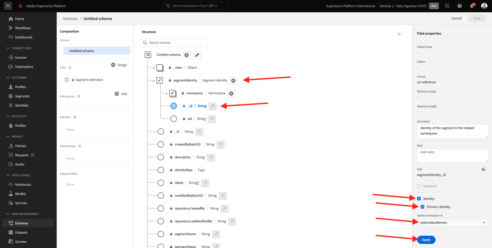
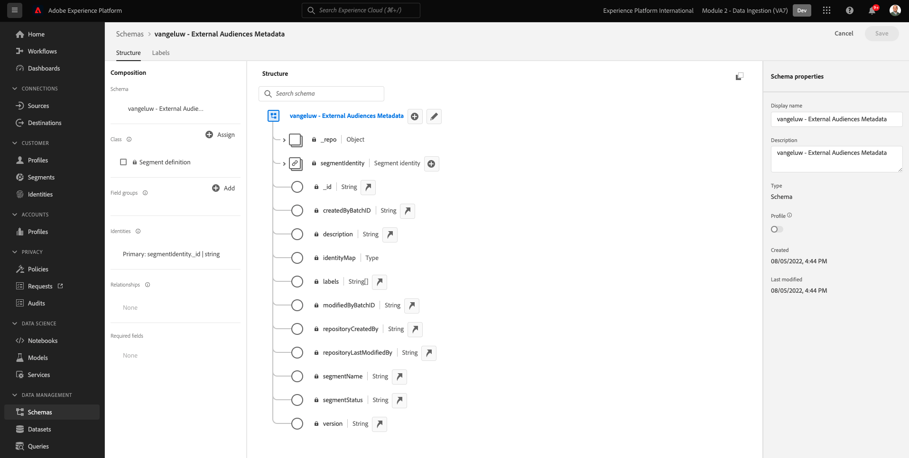
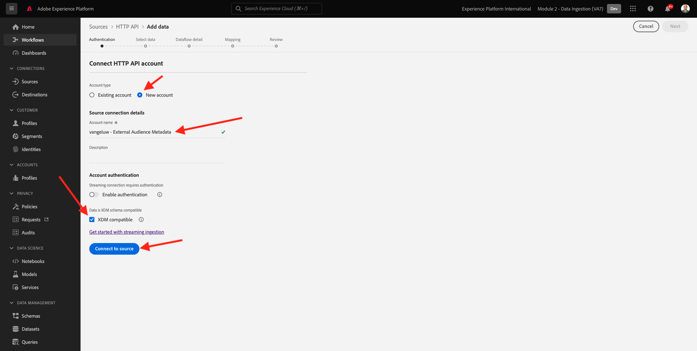
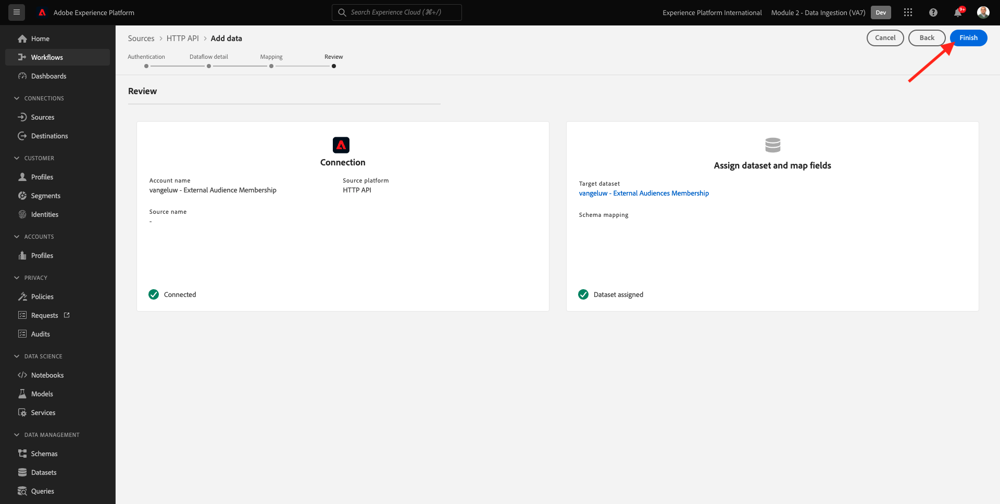

# 6.6 Externa målgrupper

I många fall kanske ditt företag vill använda befintliga segment från andra program för att förbättra kundprofilen i Adobe Experience Platform.
Dessa externa målgrupper kan ha definierats baserat på en datavetenskapsmodell eller externa dataplattformar.

Med funktionen för externa målgrupper i Adobe Experience Platform kan ni fokusera på att ta in externa målgrupper och deras aktivering utan att behöva definiera om motsvarande segmentdefinition i detalj i Adobe Experience Platform.

Den övergripande processen är uppdelad i tre huvudsteg:

- Importera externa målgruppsmetadata: det här steget är avsett att importera externa målgruppsmetadata, t.ex. målgruppens namn, till Adobe Experience Platform.
- Tilldela det externa målgruppsmedlemskapet till kundprofilen: det här steget är avsett att berika kundprofilen med det externa segmentmedlemskapsattributet.
- Skapa segmenten i Adobe Experience Platform: det här steget är avsett att skapa åtgärdbara segment baserat på det externa målgruppsmedlemskapet.

## 6.6.1 Metadata

Gå till [Adobe Experience Platform](https://experience.adobe.com/platform). När du loggat in kommer du till Adobe Experience Platform hemsida.


>[!IMPORTANT]
>
>Sandlådan som ska användas för den här övningen är ``--module2sandbox--``!

Innan du fortsätter måste du välja en **sandlåda**. Sandlådan som ska markeras har namnet ``--module2sandbox--``. Du kan göra detta genom att klicka på texten **[!UICONTROL Produktionsprodukt]** i den blå linjen ovanför skärmen. När du har valt lämplig [!UICONTROL sandlåda]kommer du att se skärmändringen och nu är du med på din [!UICONTROL sandlåda].


Medan segmentdata definierar villkoret för att en profil ska vara en del av ett segment, är segmentets metadata information om segmentet, till exempel namn, beskrivning och status för segmentet. När de externa målgruppsmetadata lagras i Adobe Experience Platform måste du använda ett identitetsnamnutrymme för att importera metadata i Adobe Experience Platform.

## 6.6.1.1 Identitetsnamnutrymme för externa målgrupper

Ett identitetsnamnutrymme har redan skapats för användning med **Externa målgrupper**.
Om du vill visa identiteten som redan har skapats går du till **Identiteter** och sök efter **Extern**. Klicka på&quot;External Audiences&quot;.

Observera:

- Identitetssymbolen **externa målgrupper** kommer att användas i nästa steg för att referera till den externa målgruppsidentiteten.
- The **Identifierare för icke-personer** type används för det här ID-namnutrymmet, eftersom det här namnutrymmet inte är avsett att identifiera kundprofiler utan segment.


## 6.6.1.2 Skapa ett schema med metadata för externa målgrupper

Metadata för externa målgrupper baseras på **Segmentdefinitionsschema**. Mer information finns i [XDM Github-databas](https://github.com/adobe/xdm/blob/master/docs/reference/classes/segmentdefinition.schema.md).

Gå till Scheman på den vänstra menyn. Klicka **+ Skapa schema** och sedan klicka **Bläddra**.


Om du vill tilldela en klass söker du efter **segmentdefinition**. Välj **Segmentdefinition** klass och klicka **Tilldela klass**.


Du kommer då att se det här. Klicka **Avbryt**.


Du kommer då att se det här. Markera fältet **_id**. Bläddra nedåt i den högra menyn och aktivera **Identitet** och **Primär identitet** kryssrutor. Välj **Externa målgrupper** identity namespace. Klicka **Använd**.



Välj sedan schemanamnet **Namnlöst schema**. Ändra namnet till `--demoProfileLdap-- - External Audiences Metadata`.



Aktivera **Profil** och bekräfta. Klicka slutligen **Spara**.


## 6.6.1.3 Skapa datamängden för metadata för externa målgrupper

I **Scheman**, gå till **Bläddra**. Sök och klicka på `--demoProfileLdap-- - External Audiences Metadata` schema som du skapade i föregående steg. Klicka på **Skapa datauppsättning från schema**.


För fältet **Namn**, ange `--demoProfileLdap-- - External Audience Metadata`. Klicka **Skapa datauppsättning**.


Du kommer då att se det här. Glöm inte att aktivera **Profil** växla!


## 6.6.1.4 Skapa en HTTP API-källanslutning

Därefter måste du konfigurera HTTP API Source Connector som du använder för att importera metadata till datauppsättningen.

Gå till **Källor**. I sökfältet anger du **HTTP**. Klicka **Lägg till data**.


Ange följande information:

- **Kontotyp**: välj **Nytt konto**
- **Kontonamn**: enter `--demoProfileLdap-- - External Audience Metadata`
- Markera kryssrutan **XDM-kompatibel ruta**

Klicka på **Anslut till källa**.



Du kommer då att se det här. Klicka på **Nästa**.


Välj **Befintlig datauppsättning** och i listrutan söker du efter och markerar datauppsättningen `--demoProfileLdap-- - External Audience Metadata`.

Verifiera **Information om dataflöde** och sedan klicka **Nästa**.


Du kommer då att se det här.

The **Mappning** steg i guiden är tomt eftersom du kommer att hämta en XDM-kompatibel nyttolast till HTTP API Source Connector, så ingen mappning krävs. Klicka på **Nästa**.


I **Granska** kan du välja att granska anslutningen och mappningsinformationen. Klicka **Slutför**.


Du kommer då att se det här.


## 6.6.1.5 Metadata för externa målgrupper

På fliken Översikt över Source Connector klickar du på **...** och sedan klicka **Kopiera schemanyttolast**.


Öppna textredigeringsprogrammet på datorn och klistra in den nyttolast som du just kopierade. Den ser ut så här. Därefter måste du uppdatera **xdmEntity** objekt i den här nyttolasten.


Objektet **xdmEntity** måste ersättas med nedanstående kod. Kopiera nedanstående kod och klistra in den i textfilen genom att ersätta **xdmEntity** -objekt i textredigeraren.

```
"xdmEntity": {
    "_id": "--demoProfileLdap---extaudience-01",
    "description": "--demoProfileLdap---extaudience-01 description",
    "segmentIdentity": {
      "_id": "--demoProfileLdap---extaudience-01",
      "namespace": {
        "code": "externalaudiences"
      }
    },
    "segmentName": "--demoProfileLdap---extaudience-01 name",
    "segmentStatus": "ACTIVE",
    "version": "1.0"
  }
```

Du bör då se det här:


Öppna en ny **Terminal** -fönstret. Kopiera all text i textredigeraren och klistra in den i terminalfönstret.


Nästa, träff **Retur**.

Sedan visas en bekräftelse på ditt datainmatningsproblem i terminalfönstret:


Uppdatera skärmen för HTTP API Source Connector där du nu ser att data bearbetas:


## 6.6.1.6 Validera inmatning av metadata för externa målgrupper

När bearbetningen är klar kan du kontrollera datatillgängligheten i datauppsättningen med hjälp av frågetjänsten.

I den högra menyn går du till **Datauppsättningar** och väljer `--demoProfileLdap-- - External Audience Metadata` datauppsättning som du skapade tidigare.


Gå till Frågor på den högra menyn och klicka på **Skapa fråga**.


Ange följande kod och tryck sedan på **SKIFT + RETUR**:

```
select * from --demoProfileLdap--_external_audience_metadata
```

I frågeresultatet ser du den externa målgruppens metadata som du har inkapslat.


## 6.6.2 Segmentmedlemskap

Med externa målgruppsmetadata tillgängliga kan ni nu importera segmentmedlemskapet för en viss kundprofil.

Nu måste du förbereda en profildatamängd som har anrikats mot segmentmedlemskapsschemat. Mer information finns i [XDM Github-databas](https://github.com/adobe/xdm/blob/master/docs/reference/datatypes/segmentmembership.schema.md).

## 6.6.2.1 Skapa ett medlemsschema för externa målgrupper

I den högra menyn går du till **Scheman**. Klicka **Skapa schema** och sedan klicka **Individuell XDM-profil**.


I **Lägg till fältgrupper** popup, söka efter **Profilkärna**. Välj **Profilkärna v2** fältgrupp.


Nästa, i **Lägg till fältgrupper** popup, söka efter **Segmentmedlemskap**. Välj **Information om segmentmedlemskap** fältgrupp. Klicka på **Lägg till fältgrupper**.


Du kommer då att se det här. Navigera till fältet `--aepTenantId--.identification.core`. Klicka på **crmId** fält. Bläddra nedåt i den högra menyn och kontrollera **Identitet** och **Primär identitet** kryssrutor. För **Identitetsnamnutrymme** välj **Demo System - CRMID**.

Klicka **Använd**.


Välj sedan schemanamnet **Namnlöst schema**. I fältet för visningsnamn anger du `--demoProfileLdap-- - External Audiences Membership`.


Aktivera sedan **Profil** och bekräfta. Klicka **Spara**.


## 6.6.2.2 Skapa datauppsättningen External Audiences Membership

I **Scheman**, gå till **Bläddra**. Sök och klicka på `--demoProfileLdap-- - External Audiences Membership` schema som du skapade i föregående steg. Klicka på **Skapa datauppsättning från schema**.


För fältet **Namn**, ange `--demoProfileLdap-- - External Audiences Membership`. Klicka **Skapa datauppsättning**.


Du kommer då att se det här. Glöm inte att aktivera **Profil** växla!


## 6.6.2.3 Skapa en HTTP API-källanslutning


Därefter måste du konfigurera HTTP API Source Connector som du använder för att importera metadata till datauppsättningen.

Gå till **Källor**. I sökfältet anger du **HTTP**. Klicka **Lägg till data**.


Ange följande information:

- **Kontotyp**: välj **Nytt konto**
- **Kontonamn**: enter `--demoProfileLdap-- - External Audience Membership`
- Markera kryssrutan **XDM-kompatibel ruta**

Klicka på **Anslut till källa**.


Du kommer då att se det här. Klicka på **Nästa**.


Välj **Befintlig datauppsättning** och i listrutan söker du efter och markerar datauppsättningen `--demoProfileLdap-- - External Audiences Membership`.

Verifiera **Information om dataflöde** och sedan klicka **Nästa**.


Du kommer då att se det här.

The **Mappning** steg i guiden är tomt eftersom du kommer att hämta en XDM-kompatibel nyttolast till HTTP API Source Connector, så ingen mappning krävs. Klicka på **Nästa**.


I **Granska** kan du välja att granska anslutningen och mappningsinformationen. Klicka **Slutför**.



Du kommer då att se det här.


## 6.6.2.4 Information om medlemskap för externa målgrupper

På fliken Översikt över Source Connector klickar du på **...** och sedan klicka **Kopiera schemanyttolast**.


Öppna textredigeringsprogrammet på datorn och klistra in den nyttolast som du just kopierade. Den ser ut så här. Därefter måste du uppdatera **xdmEntity** objekt i den här nyttolasten.


Objektet **xdmEntity** måste ersättas med nedanstående kod. Kopiera nedanstående kod och klistra in den i textfilen genom att ersätta **xdmEntity** -objekt i textredigeraren.

```
  "xdmEntity": {
    "_id": "--demoProfileLdap---profile-test-01",
    "_experienceplatform": {
      "identification": {
        "core": {
          "crmId": "--demoProfileLdap---profile-test-01"
        }
      }
    },
    "personID": "--demoProfileLdap---profile-test-01",
    "segmentMembership": {
      "externalaudiences": {
        "--demoProfileLdap---extaudience-01": {
          "status": "realized",
          "lastQualificationTime": "2022-03-05T00:00:00Z"
        }
      }
    }
  }
```

Du bör då se det här:


Öppna en ny **Terminal** -fönstret. Kopiera all text i textredigeraren och klistra in den i terminalfönstret.


Nästa, träff **Retur**.

Sedan visas en bekräftelse på ditt datainmatningsproblem i terminalfönstret:


Uppdatera skärmen för HTTP API Source Connector där du efter några minuter kommer att se att data bearbetas:


## 6.6.2.5 Validera externa målgruppers medlemskap

När bearbetningen är klar kan du kontrollera datatillgängligheten i datauppsättningen med hjälp av frågetjänsten.

I den högra menyn går du till **Datauppsättningar** och väljer `--demoProfileLdap-- - External Audiences Membership ` datauppsättning som du skapade tidigare.


Gå till Frågor på den högra menyn och klicka på **Skapa fråga**.


Ange följande kod och tryck sedan på **SKIFT + RETUR**:

```
select * from --demoProfileLdap--_external_audiences_membership
```

I frågeresultatet ser du den externa målgruppens metadata som du har inkapslat.


## 6.6.3 Skapa ett segment

Nu är ni redo att agera utifrån de externa målgrupperna.
Adobe Experience Platform satsar på åtgärder genom att skapa segment, fylla respektive målgrupper och dela dessa målgrupper med målgrupperna.
Nu kan du skapa ett segment med hjälp av den externa målgrupp du just skapade.

Gå till den vänstra menyn **Segment** och klicka **Skapa segment**.


Gå till **Målgrupper**. Du kommer då att se det här. Klicka **Externa målgrupper**.


Välj den externa målgrupp du skapade tidigare, med namnet `--demoProfileLdap---extaudience-01`. Dra och släpp målgruppen på arbetsytan.


Ge segmentet ett namn, använd `--demoProfileLdap-- - extaudience-01`. Klicka **Spara och stäng**.


Du kommer då att se det här. Du kommer även att märka att den profil som du har infogat segmentmedlemskapet för nu visas i listan med **Exempelprofiler**.


Ditt segment är klart nu och kan skickas till en destination för aktivering.

## 6.6.4 Visualisera kundprofilen

Nu kan du även visualisera segmentkvalificeringen i din kundprofil. Gå till **Profiler** använder du identitetsnamnutrymmet **Demo System - CRMID** och ange identiteten `--demoProfileLdap---profile-test-01`som du använde som del av övning 6.6.2.4, och klicka på **Visa**. Klicka sedan på **Profil-ID** för att öppna profilen.


Gå till **Segmentmedlemskap**, där du ser hur den externa publiken ser ut.


Nästa steg: [6.7 Destinations-SDK](./ex7.md)

[Gå tillbaka till modul 6](./real-time-cdp-build-a-segment-take-action.md)

[Gå tillbaka till Alla moduler](../../overview.md)
