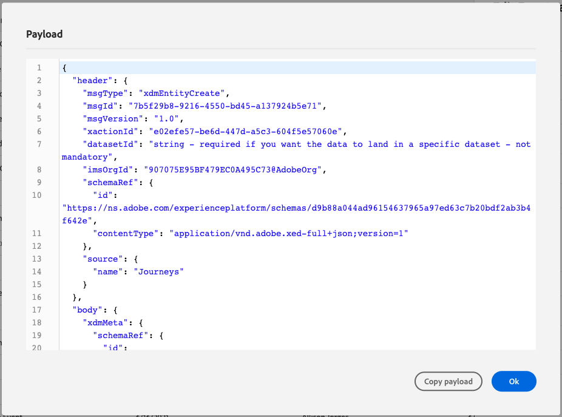

# 7.1 Skapa en aktivitet

Logga in på Adobe Journey Optimizer genom att gå till [Adobe Experience Cloud](https://experience.adobe.com). Klicka **Journey Optimizer**.

Du omdirigeras till **Startsida**  i Journey Optimizer. Kontrollera först att du använder rätt sandlåda. Sandlådan som ska användas anropas `--aepSandboxId--`. Om du vill ändra från en sandlåda till en annan klickar du på **PRODUKTIONSprodukt (VA7)** och välj sandlådan i listan. I det här exemplet heter sandlådan **AEP-aktivering FY22**. Då är du i **Startsida** vy över din sandlåda `--aepSandboxId--`.

Bläddra nedåt i den vänstra menyn och klicka på **Konfigurationer**. Klicka sedan på **Hantera** knapp under **Händelser**.

Därefter visas en översikt över alla tillgängliga händelser. Klicka **Skapa händelse** för att börja skapa en egen händelse.

Ett nytt, tomt händelsefönster öppnas sedan.

Först och främst ger du evenemanget ett namn som detta: `--demoProfileLdap--AccountCreationEvent`.

Lägg sedan till en sådan beskrivning `Account Creation Event`.

Kontrollera sedan att **Typ** är inställd på **Unitary** och för **Typ av händelse-ID** markering, markera **Systemgenererat**.

Nästa steg är schemavalet. Ett schema förbereddes för den här övningen. Använd schemat `Demo System - Event Schema for Website (Global v1.1) v.1`.

När du har valt schemat visas ett antal fält i **Nyttolast** -avsnitt. Nu ska du hovra över **Nyttolast** så visas tre popup-fönster med ikoner. Klicka på **Redigera** ikon.

Du får se en **Fält** fönsterpopup, där du måste markera några av de fält som vi behöver för att anpassa e-postmeddelandet.  Vi väljer andra profilattribut senare med de data som redan finns i Adobe Experience Platform.

I objektet `--aepTenantId--.demoEnvironment`måste du markera fälten **brandLogo** och **brandName**.

I objektet `--aepTenantId--.identification.core`måste du markera fältet **e-post**.

Klicka **OK** för att spara ändringarna.

Du bör då se det här:

Klicka **Spara** ännu en gång för att spara ändringarna.

Din händelse är nu konfigurerad och sparad.

Klicka på aktiviteten igen för att öppna **Redigera händelse** skärm igen. Hovra över **Nyttolast** om du vill visa de tre ikonerna igen. Klicka på **Visa nyttolast** ikon.

Nu visas ett exempel på den förväntade nyttolasten.

Händelsen har ett unikt ID för Orchestration-händelse som du kan hitta genom att rulla nedåt i nyttolasten tills du ser `_experience.campaign.orchestration.eventID`.

Händelse-ID är det som måste skickas till Adobe Experience Platform för att utlösa den resa som du bygger i Exercise 7.2. Kom ihåg detta eventID, som du behöver det i Exercise 7.3.
`"eventID": "227402c540eb8f8855c6b2333adf6d54d7153d9d7d56fa475a6866081c574736"`

Klicka **OK**, följt av att klicka **Avbryt**.

Du har nu avslutat den här övningen.

Nästa steg: [7.2 Journey Optimizer: Skapa en resa och ett e-postmeddelande](./ex2.md)

[Gå tillbaka till modul 7](./journey-orchestration-create-account.md)

[Gå tillbaka till Alla moduler](../../overview.md)
