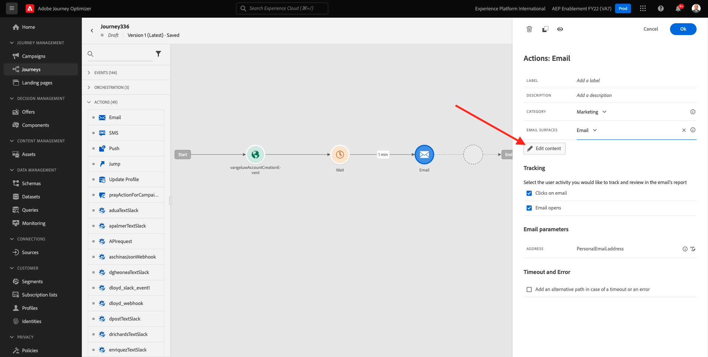
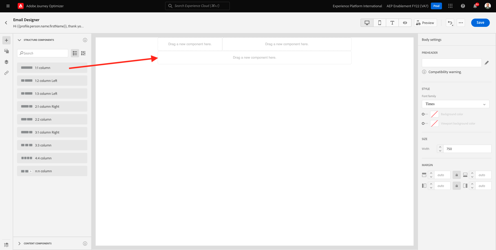
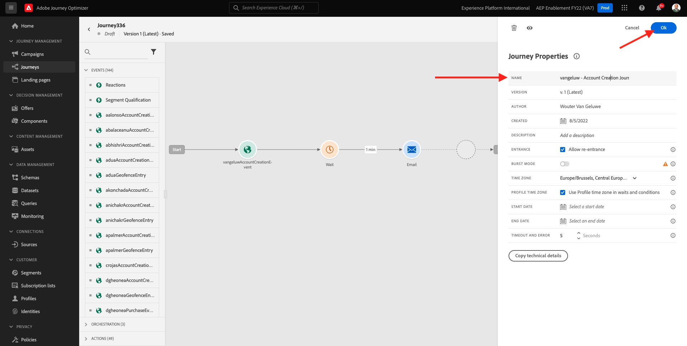
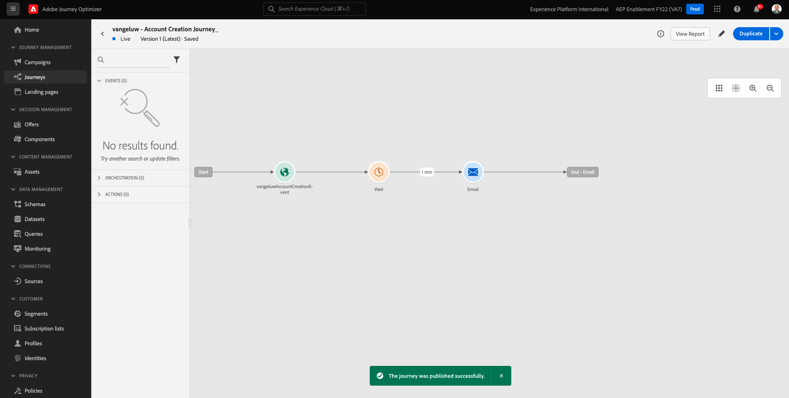

# 7.2 Skapa din resa och ditt e-postmeddelande

I den här övningen ska du konfigurera resan och det meddelande som ska utlösas när någon skapar ett konto på demowebbplatsen.

Logga in på Adobe Journey Optimizer genom att gå till [Adobe Experience Cloud](https://experience.adobe.com). Klicka **Journey Optimizer**.

Du omdirigeras till **Startsida**  i Journey Optimizer. Kontrollera först att du använder rätt sandlåda. Sandlådan som ska användas anropas `--aepSandboxId--`. Om du vill ändra från en sandlåda till en annan klickar du på **PRODUKTIONSprodukt (VA7)** och välj sandlådan i listan. I det här exemplet heter sandlådan **AEP-aktivering FY22**. Då är du i **Startsida** vy över din sandlåda `--aepSandboxId--`.

## 7.2.1 Skapa din resa

Klicka på **Resor**. Klicka på **Skapa resa** för att skapa en ny resa.

Då ser du en tom skärm.

I föregående övning skapade du en ny **Händelse**. Du namngav den så här `ldapAccountCreationEvent` och ersatt `ldap` med din ldap. Detta var resultatet av händelseskapandet:

Du måste nu ta det här evenemanget som början på den här resan. Du kan göra detta genom att gå till vänster på skärmen och söka efter händelsen i listan med händelser.

Markera händelsen, dra och släpp den på arbetsytan på resan. Din resa ser nu ut så här:

Som det andra steget på resan måste du lägga till en kort **Vänta** steg. Gå till vänster på skärmen till vänster **Orchestration** för att hitta det här. Du kommer att använda profilattribut och måste se till att de är ifyllda i kundprofilen i realtid.

Din resa ser nu ut så här. Till höger på skärmen måste du konfigurera väntetiden. Ställ in den på 1 minut. Detta ger mycket tid för profilattributen att vara tillgängliga när händelsen har utlösts.

Klicka **OK** för att spara ändringarna.

Som det tredje steget på resan måste du lägga till en **E-post** åtgärd. Gå till skärmens vänstra sida för att **Åtgärder** väljer du **E-post** och sedan dra och släppa det på den andra noden på din resa. Nu ser du det här.

Ange **Kategori** till **Marknadsföring** och välj en e-postyta som gör att du kan skicka e-post. I det här fallet är e-postytan som ska väljas **E-post**. Se till att kryssrutorna för **Klicka på e-post** och **e-post öppnas** båda är aktiverade.

Nästa steg är att skapa ett meddelande. Det gör du genom att klicka **Redigera innehåll**.

## 7.2.2 Skapa ett meddelande

Klicka på **Redigera innehåll**.

Nu ser du det här.

Klicka på **Subject line** textfält.

Börja skriva i textområdet **Hej**

Ämnesraden är inte färdig än. Därefter måste du ta in en personaliseringstoken för fältet **Förnamn** som lagras under `profile.person.name.firstName`. Bläddra nedåt i den vänstra menyn för att hitta **Person** och klicka på pilen för att gå en nivå längre.

Nu hittar du **Fullständigt namn** och klicka på pilen för att gå en nivå längre.

Till sist hittar du **Förnamn** och klicka på **+** signera bredvid den. Sedan visas personaliseringstoken i textfältet.

Lägg sedan till texten **, tack för att du registrerar dig!**. Klicka **Spara**.

Du kommer då tillbaka hit. Klicka **E-postdesigner** för att skapa e-postens innehåll.

På nästa skärm får du tre olika metoder för att ange e-postens innehåll:

- **Designa från grunden**: Börja med en tom arbetsyta och använd WYSIWYG-redigeraren för att dra och släppa struktur och innehållskomponenter för att visuellt bygga upp e-postmeddelandets innehåll.
- **Koda din egen**: Skapa en egen e-postmall genom att koda den med HTML
- **Importera HTML**: Importera en befintlig HTML-mall som du kan redigera.

Klicka **Designa från grunden**.

På den vänstra menyn hittar du de strukturkomponenter som du kan använda för att definiera e-postmeddelandets struktur (rader och kolumner).

Dra och släpp en **1:2 kolumn vänster** från menyn till arbetsytan. Detta blir platshållare för logotypbilden.

Dra och släpp en **1:1-kolumn** under föregående komponent. Det här blir banderollblocket.

Dra och släpp en **1:2 kolumn vänster** under föregående komponent. Det är det faktiska innehållet med en bild på vänster sida och text på höger sida.

Sedan drar och släpper du en **1:1-kolumn** under föregående komponent. Det här blir e-postsidfoten. Arbetsytan bör nu se ut så här:

Sedan använder vi Innehållskomponenter för att lägga till innehåll i dessa block. Klicka på **Innehållskomponenter** menyalternativ

Dra och släpp en **Bild** i den första cellen på den första raden. Klicka **Bläddra**.

Du kommer då att se det här. Navigera till mappen **enablement-assets** och markera filen **luma-logo.png**. Klicka **Välj**.

Nu är du tillbaka här:

Gå till **Innehållskomponenter** och dra och släppa **Bild** i den första cellen på den första raden. Klicka **Bläddra**.

I **Resurser** popup, gå till **enablement-assets** mapp. I den här mappen hittar du alla resurser som tidigare har förberetts och överförts av det kreativa teamet. Välj **module23-thankyou-new.png** och klicka **Välj**.

Då får du den här:

Markera bilden och rulla nedåt i den högra menyn tills du ser **Storlek** breddreglage. Använd reglaget för att ändra bredden till f.i. **60 %**.

Nästa, gå till **Innehållskomponenter** och dra och släppa **Text** i strukturkomponenten på fjärde raden.

Markera standardtexten **Skriv texten här.** som du skulle göra med valfri textredigerare. Skriv **Bästa** i stället. Lägg märke till att textverktygsfältet visas när du är i textläge.

Klicka på **Lägg till personalisering** ikon.

Nästa steg är att ta fram **Förnamn** personaliseringstoken som lagras under `profile.person.name.firstName`. På menyn hittar du **Person** -element, gå ned till **Fullständigt namn** och sedan klicka på **+** om du vill lägga till fältet Förnamn i uttrycksredigeraren.

Klicka **Spara**.

Nu kommer du att märka hur personaliseringsfältet har lagts till i texten.

I samma textfält: tryck **Retur** två gånger för att lägga till två rader och skriva **Tack för att du har skapat ditt konto hos Luma!**.

Den sista kontrollen som ska utföras för att säkerställa att e-postmeddelandet är klart är att förhandsgranska det. Klicka på **Simulera innehåll** -knappen.

Börja med att identifiera vilken profil du vill använda för förhandsgranskningen. Välj **e-post** genom att klicka på ikonen bredvid **Ange namnutrymme för identitet** fält.

I listan med identitetsnamnutrymmen väljer du **E-post** namnutrymme.

I **Identitetsvärde** anger du e-postadressen till en tidigare demoprofil som redan finns lagrad i kundprofilen i realtid. Till exempel **woutervangeluwe+06022022-01@gmail.com** och klicka på **Sök efter testprofil** knapp

När din profil visas i tabellen klickar du på **Förhandsgranska** för att komma åt förhandsgranskningsskärmen.

När förhandsgranskningen är klar kontrollerar du att personaliseringen är korrekt på ämnesraden, att både brödtexten och avprenumerationslänken är markerade som en hyperlänk.

Klicka **Stäng** för att stänga förhandsgranskningen.

Klicka **Spara** för att spara meddelandet.

Gå tillbaka till meddelandekontrollpanelen genom att klicka på **pil** bredvid texten på ämnesraden i det övre vänstra hörnet.

Du har nu skapat e-postmeddelandet med din registrering. Klicka på pilen i det övre vänstra hörnet för att gå tillbaka till din resa.

Klicka **OK**.

## 7.2.3 Publicera din resa

Du måste fortfarande ge din resa ett namn. Du kan göra det genom att klicka på **Egenskaper** i skärmens övre högra hörn.

Du kan sedan ange resans namn här. Använd `--demoProfileLdap-- - Account Creation Journey`. Klicka **OK** för att spara ändringarna.

Nu kan du publicera din resa genom att klicka **Publicera**.

Klicka **Publicera** igen.

Då visas ett grönt bekräftelsefält som anger att din resa nu är publicerad.

Du har nu avslutat den här övningen.

Nästa steg: [7.3 Uppdatera din datainsamlingsegenskap och testa din resa](./ex3.md)

[Gå tillbaka till modul 7](./journey-orchestration-create-account.md)

[Gå tillbaka till Alla moduler](../../overview.md)
