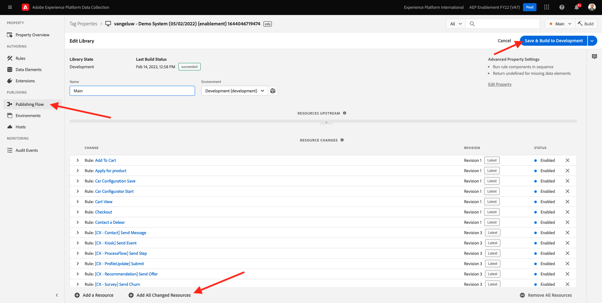

# 7.3 Uppdatera din datainsamlingsegenskap och testa din resa

## 7.3.1 Uppdatera din datainsamlingsegenskap

Gå till [Adobe Experience Platform Data Collection](https://experience.adobe.com/launch/) och markera **Taggar**.

Det här är egenskapssidan för Adobe Experience Platform Data Collection som du såg tidigare.

I modul 0 skapade Demo System två klientegenskaper: en för webbplatsen och en för mobilappen. Hitta dem genom att söka efter `--demoProfileLdap--` i **[!UICONTROL Sök]** box. Klicka för att öppna **Webb** -egenskap.

Du kommer då att se det här.

Gå till den vänstra menyn **Regler** och söka efter regeln **Registrera profil**. Klicka på regeln **Registrera profil** för att öppna den.

Då ser du detaljerna om den här regeln. Klicka för att öppna funktionsmakrot **Skicka&quot;Registreringshändelse&quot; till AEP - utlösande JO**.

Du kommer då att se att när den här åtgärden utlöses används ett specifikt dataelement för att definiera XDM-datastrukturen. Du måste uppdatera det dataelementet och definiera **Händelse-ID** av händelsen som du konfigurerade i [Utövning 7.1](./ex1.md).

Du måste nu uppdatera dataelementet **XDM - Registreringshändelse**. Om du vill göra det går du till **Dataelement**. Sök efter **XDM - Registreringshändelse** och klicka för att öppna det dataelementet.

Då ser du det här:

Navigera till fältet `_experience.campaign.orchestration.eventID`. Ta bort det aktuella värdet och klistra in ditt eventID där.

Händelse-ID:t finns i Adobe Journey Optimizer under **Konfigurationer > Händelser** och du hittar händelse-ID:t i exempelnyttolasten för din even, som ser ut så här: `"eventID": "227402c540eb8f8855c6b2333adf6d54d7153d9d7d56fa475a6866081c574736"`.

När du har klistrat in ditt eventID bör skärmen se ut så här. Klicka på **Spara** eller **Spara i bibliotek**.

Slutligen måste du publicera ändringarna. Gå till **Publiceringsflöde** i den vänstra menyn.

Klicka **Lägg till alla ändrade resurser** och sedan klicka **Spara och bygg till utveckling**.

Biblioteket uppdateras sedan och efter 1-2 minuter kan du testa konfigurationen.

## 7.3.2 Testa din resa

Gå till [https://builder.adobedemo.com/projects](https://builder.adobedemo.com/projects). När du har loggat in med din Adobe ID ser du det här. Klicka på webbplatsprojektet för att öppna det.

På **Skärmar** sida, klicka **Kör**.

Du kommer då att se din demowebbplats öppnas. Markera URL-adressen och kopiera den till Urklipp.

Öppna ett nytt inkognito-webbläsarfönster.

Klistra in webbadressen till demowebbplatsen, som du kopierade i föregående steg. Du ombeds sedan logga in med din Adobe ID.

Välj kontotyp och slutför inloggningsprocessen.

Därefter visas webbplatsen i ett inkognitivt webbläsarfönster. För varje demonstration måste du använda ett nytt, inkognitivt webbläsarfönster för att läsa in webbadressen till demowebbplatsen.

Klicka på logotypikonen för Adobe i det övre vänstra hörnet av skärmen för att öppna profilvisningsprogrammet.

Ta en titt på panelen Profilvisningsprogram och kundprofilen i realtid med **Experience Cloud ID** som primär identifierare för den här okända kunden.

Gå till sidan Register/Login. Klicka **SKAPA ETT KONTO**.

Fyll i detaljerna och klicka **Registrera** därefter omdirigeras du till föregående sida.

Öppna profilvisarpanelen och gå till kundprofilen i realtid. På panelen Profilvisningsprogram ska du se alla dina personuppgifter visas, som dina nya e-post- och telefonidentifierare.

1 minut efter att du har skapat ditt konto får du ett e-postmeddelande från Adobe Journey Optimizer om att du har skapat kontot.

Nästa steg: [Sammanfattning och fördelar](./summary.md)

[Gå tillbaka till modul 7](./journey-orchestration-create-account.md)

[Gå tillbaka till Alla moduler](../../overview.md)
