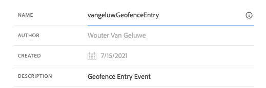
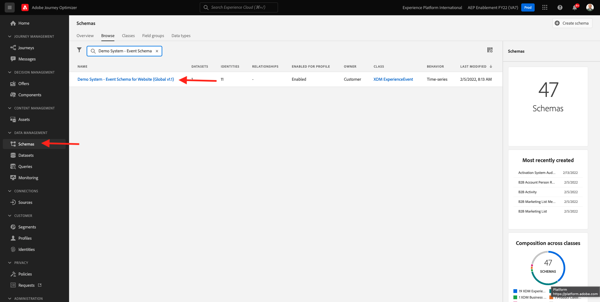

# 8.1 Definiera en händelse

Logga in på Adobe Journey Optimizer genom att gå till [Adobe Experience Cloud](https://experience.adobe.com). Klicka **Journey Optimizer**.

Du omdirigeras till **Startsida**  i Journey Optimizer. Kontrollera först att du använder rätt sandlåda. Sandlådan som ska användas anropas `--aepSandboxId--`. Om du vill ändra från en sandlåda till en annan klickar du på **PRODUKTIONSprodukt (VA7)** och välj sandlådan i listan. I det här exemplet heter sandlådan **AEP-aktivering FY22**. Då är du i **Startsida** vy över din sandlåda `--aepSandboxId--`.

Bläddra nedåt i den vänstra menyn och klicka på **Konfigurationer**. Klicka sedan på **Hantera** knapp under **Händelser**.

Därefter visas en översikt över alla tillgängliga händelser. Klicka **Skapa händelse** för att börja skapa en egen händelse.

Ett nytt, tomt händelsefönster öppnas sedan.

Använd som namn för händelsen `--demoProfileLdap--GeofenceEntry`. I det här exemplet är händelsenamnet `vangeluwGeofenceEntry`.

Ange Beskrivning till: `Geofence Entry Event`.

Kontrollera sedan att **Typ** är inställd på **Unitary** och för **Typ av händelse-ID** markering, markera **Systemgenererat**

Därefter måste du välja ett schema. Alla scheman som visas här är Adobe Experience Platform Schemas.

Alla scheman visas inte. Det finns många fler scheman i Adobe Experience Platform.
Om du vill visa i den här listan måste ett schema ha en mycket specifik fältgrupp länkad till sig. Fältgruppen som ska visas här anropas `Orchestration eventID`.

Låt oss snabbt se hur dessa scheman definieras i Adobe Experience Platform.

Gå till den vänstra menyn **Scheman** och öppna den på en ny flik i webbläsaren. I **Scheman**, gå till **Bläddra** om du vill se en lista över tillgängliga scheman.
Öppna schemat `Demo System - Event Schema for Website (Global v1.1)`.

När du har öppnat schemat ser du att fältgruppen `Orchestration eventID` är en del av schemat.
Den här fältgruppen har bara två fält, `_experience.campaign.orchestration.eventID` och `originJourneyID`.

När den här fältgruppen och det här specifika händelse-ID-fältet är en del av ett schema blir det schemat tillgängligt för användning av Adobe Journey Optimizer.

Gå tillbaka till din eventkonfiguration i Adobe Journey Optimizer.

I det här fallet vill du lyssna på en Geofence-händelse för att förstå om en kund befinner sig på en viss plats, så välj nu schemat `Demo System - Event Schema for Website (Global v1.1)` som schema för händelsen.

Adobe Journey Optimizer väljer sedan automatiskt ut vissa obligatoriska fält, men du kan redigera de fält som är tillgängliga för Adobe Journey Optimizer.

Klicka på **penna** om du vill redigera fälten.

Då visas ett popup-fönster med en schemahierarki där du kan välja fält.

Fält som ECID och Orchestration eventID är obligatoriska och som sådana är förmarkerade.

En marknadsförare måste dock ha flexibel åtkomst till alla datapunkter som ger kontext till en resa. Så vi ska åtminstone se till att markera följande fält (finns i kontextnoden Montera):

- Ort

När det är klart klickar du på **OK**.

Adobe Journey Optimizer behöver också en identifierare som identifierar kunden. Eftersom Adobe Journey Optimizer är länkat till Adobe Experience Platform används den primära identifieraren för ett schema automatiskt som identifierare för resan.
Den primära identifieraren tar automatiskt hänsyn till Adobe Experience Platform fullständiga identitetsdiagram och länkar alla beteenden till samma profil för alla tillgängliga identiteter, enheter och kanaler, så att Adobe Journey Optimizer är sammanhangsberoende, relevant och konsekvent.

Klicka **Spara** för att spara din anpassade händelse.

Din aktivitet kommer sedan att ingå i listan över tillgängliga händelser.

Slutligen måste du återställa `Orchestration eventID` för din egen aktivitet.

Öppna aktiviteten igen genom att klicka på den i listan över händelser.
Klicka på **Visa nyttolast** ikon bredvid **Fält**.

Klicka på **Visa nyttolast** öppnar en XDM-exempelnyttolast för den här händelsen.

Bläddra nedåt i **Nyttolast** tills du ser linjen `eventID`.

Skriv ned `eventID` som du kommer att behöva det i det sista för att testa konfigurationen.

I det här exemplet `eventID` är `fa42ab7982ba55f039eacec24c1e32e5c51b310c67f0fa559ab49b89b63f4934`.

Du har definierat händelsen som ska utlösa resan vi bygger. När resan har utlösts kommer geofence-fälten, som City, och alla andra fält som du har valt (som Country, Latitude och Longitude) att göras tillgängliga för resan.

Som vi nämnt i fallbeskrivningen måste vi sedan erbjuda sammanhangsbaserade kampanjer som är beroende av vädret. För att få väderinformation måste vi definiera externa datakällor som ger oss väderinformation för den platsen. Du kommer att använda **OpenWeather** som tillhandahåller den informationen, som en del av 2.

Nästa steg: [8.2 Definiera en extern datakälla](./ex2.md)

[Gå tillbaka till modul 8](journey-orchestration-external-weather-api-sms.md)

[Gå tillbaka till Alla moduler](../../overview.md)
