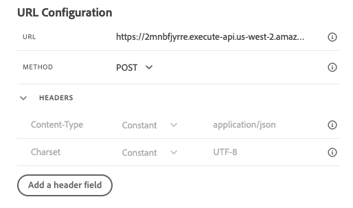
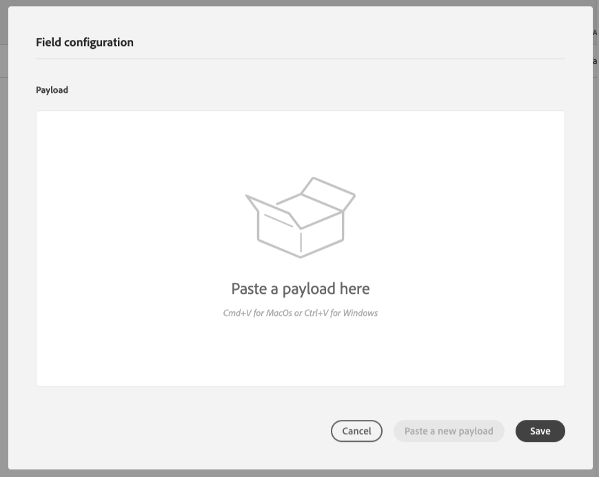
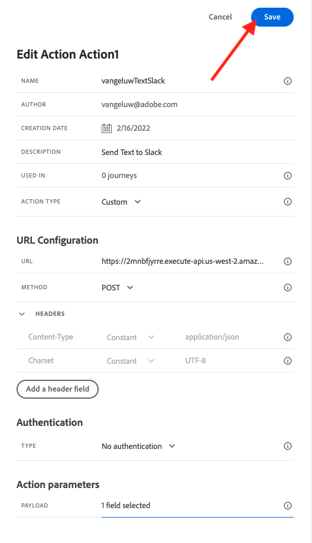

# 8.3 Definiera en anpassad åtgärd

I den här övningen ska du skapa två anpassade åtgärder genom att använda Adobe Journey Optimizer tillsammans.

Logga in på Adobe Journey Optimizer genom att gå till [Adobe Experience Cloud](https://experience.adobe.com). Klicka **Journey Optimizer**.


Du omdirigeras till **Startsida**  i Journey Optimizer. Kontrollera först att du använder rätt sandlåda. Sandlådan som ska användas anropas `--aepSandboxId--`. Om du vill ändra från en sandlåda till en annan klickar du på **PRODUKTIONSprodukt (VA7)** och välj sandlådan i listan. I det här exemplet heter sandlådan **AEP-aktivering FY22**. Då är du i **Startsida** vy över din sandlåda `--aepSandboxId--`.


Bläddra nedåt i den vänstra menyn och klicka på **Konfigurationer**. Klicka sedan på **Hantera** knapp under **Åtgärder**.


Då ser du **Åtgärder** lista.


Du definierar en åtgärd som skickar en text till en Slack-kanal.

## 8.3.1 Åtgärd: Skicka text till Slack Channel

Du kommer nu att använda en befintlig Slack-kanal och skicka meddelanden till den Slack-kanalen. Slack har ett lättanvänt API och vi använder Adobe Journey Optimizer för att utlösa deras API.


Klicka **Skapa åtgärd** för att börja lägga till en ny åtgärd.


En tom åtgärdspopup visas.


Använd som namn på åtgärden `--demoProfileLdap--TextSlack`. I det här exemplet är åtgärdsnamnet `vangeluwTextSlack`.

Ange Beskrivning till: `Send Text to Slack`.


För **URL-konfiguration**, använd detta:

- URL: `https://2mnbfjyrre.execute-api.us-west-2.amazonaws.com/prod`
- Metod: **POST**

>[!NOTE]
>
>Ovanstående URL hänvisar till en AWS Lambda-funktion som sedan vidarebefordrar din begäran till Slack-kanalen enligt ovan. Detta görs för att skydda tillgången till en kanal som ägs av Adobe. Om du har en egen Slack-kanal bör du skapa en Slack-app via [https://api.slack.com/](https://api.slack.com/)måste du sedan skapa en inkommande webkrok i den Slack-appen och sedan ersätta ovanstående URL med din inkommande webkroks-URL.

Du behöver inte ändra rubrikfälten.



**Autentisering** ska anges till **Ingen autentisering**.


För **Åtgärdsparametrar** måste du definiera vilka fält som ska skickas till Slack. Logiskt sett vill vi att Adobe Journey Optimizer och Adobe Experience Platform ska vara hjärnan i personaliseringen, så att texten som ska skickas till Slack ska definieras av Adobe Journey Optimizer och sedan skickas till Slack för genomförande.

Så för **Åtgärdsparametrar** klickar du på **Redigera nyttolast** ikon.


Då visas ett tomt popup-fönster.



Kopiera texten nedan och klistra in den i det tomma popup-fönstret.

```json
{
 "text": {
  "toBeMapped": true,
  "dataType": "string",
  "label": "textToSlack"
 }
}
```

Obs! genom att ange fälten nedan blir dessa fält tillgängliga från kundresan och du kan fylla i dem dynamiskt från resan:

**&quot;toBeMapped&quot;: true,**

**&quot;dataType&quot;: &quot;string&quot;,**

**&quot;label&quot;: &quot;textToSlack&quot;**

Då ser du det här:


Klicka **Spara**.


Bläddra uppåt och klicka **Spara** en gång till för att spara din anpassade åtgärd.



Din anpassade åtgärd ingår nu i **Åtgärder** lista.


Du har definierat händelser, en extern datakälla och åtgärder. Nu ska vi konsolidera allt det på en enda resa.

Nästa steg: [8.4 Skapa din resa och dina meddelanden](./ex4.md)

[Gå tillbaka till modul 8](journey-orchestration-external-weather-api-sms.md)

[Gå tillbaka till Alla moduler](../../overview.md)
