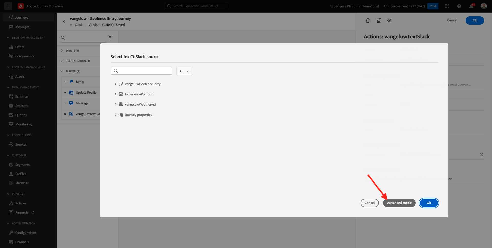
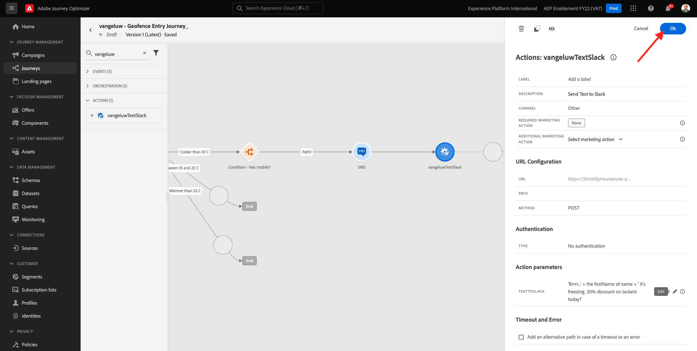
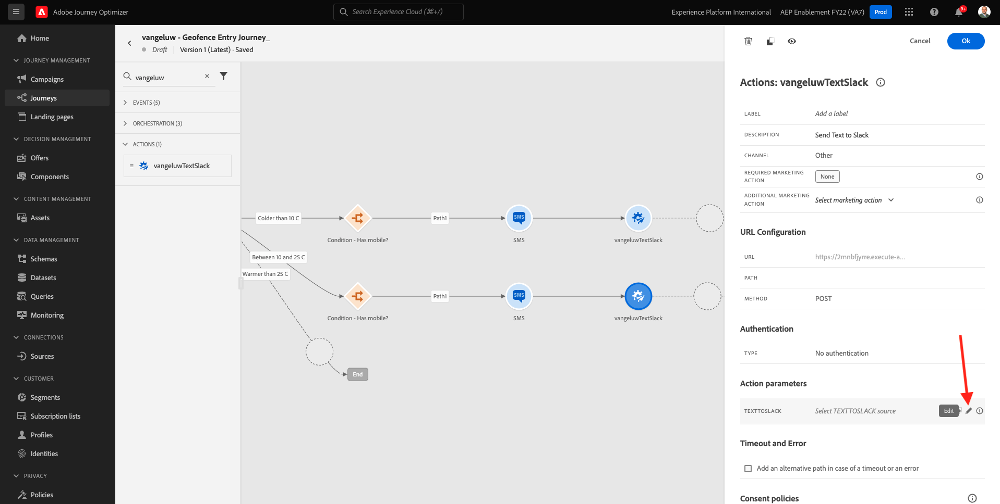
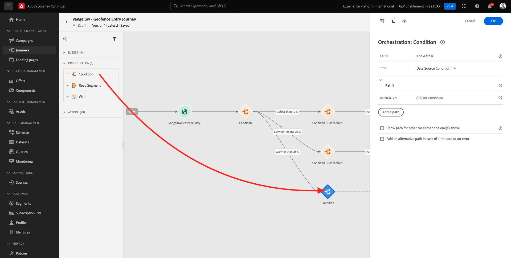
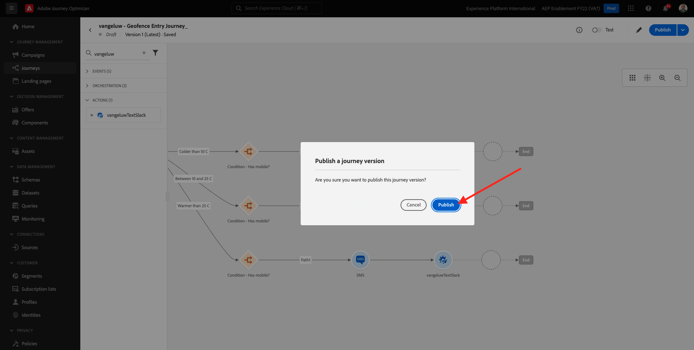

# 8.4 Skapa din resa och dina meddelanden

I den här övningen skapar du en resa och flera textmeddelanden genom att använda Adobe Journey Optimizer.

I det här fallet är målet att skicka olika SMS-meddelanden baserat på väderförhållandena för var kunden befinner sig. Tre scenarier har definierats:

- Färre än 10° Celsius
- Mellan 10° och 25° Celsius
- Varmare än 25° Celsius

För dessa tre villkor måste du definiera tre SMS-meddelanden i Adobe Journey Optimizer.

## 8.4.1 Skapa din resa

Logga in på Adobe Journey Optimizer genom att gå till [Adobe Experience Cloud](https://experience.adobe.com). Klicka **Journey Optimizer**.


Du omdirigeras till **Startsida**  i Journey Optimizer. Kontrollera först att du använder rätt sandlåda. Sandlådan som ska användas anropas `--aepSandboxId--`. Om du vill ändra från en sandlåda till en annan klickar du på **PRODUKTIONSprodukt (VA7)** och välj sandlådan i listan. I det här exemplet heter sandlådan **AEP-aktivering FY22**. Då är du i **Startsida** vy över din sandlåda `--aepSandboxId--`.


Gå till den vänstra menyn **Resor** och klicka **Skapa resa** för att börja skapa din resa.


Du bör i förväg namnge din resa.

Använd som namn för resan `--demoProfileLdap-- - Geofence Entry Journey`. I det här exemplet är resenamnet `vangeluw - Geofence Entry Journey`. Inga andra värden måste anges för tillfället. Klicka **OK**.


På vänster sida av skärmen kan du titta på **Händelser**. Du bör se den händelse du skapade tidigare i den listan. Markera den och dra den sedan och släpp den på arbetsytan. Din resa ser då ut så här. Klicka **OK**.


Klicka på **Orchestration**. Du ser nu tillgängliga **Orchestration** funktioner. Välj **Villkor** och sedan dra och släppa den på arbetsytan på resan.


Nu måste du definiera tre villkor:

- Den är kallare än 10° Celsius
- Den är mellan 10° och 25° Celsius
- Det är varmare än 25° Celsius

Vi definierar det första villkoret.

### Villkor 1: Färre än 10° Celsius

Klicka på **Villkor**.  Klicka på **Bana1** och redigera namnet på sökvägen till **Kolder än 10 C**. Klicka på **Redigera** -ikon för uttrycket för Path1.


Då ser du en tom **Enkel redigerare** skärm. Din fråga kommer att bli lite mer avancerad, så du behöver **Avancerat läge**. Klicka **Avancerat läge**.


Då ser du **Avancerad redigerare** som tillåter kodinmatning.


Markera nedanstående kod och klistra in den i dialogrutan **Avancerad redigerare**.

`#{--demoProfileLdap--WeatherApi.--demoProfileLdap--WeatherByCity.main.temp} <= 10`

Du kommer då att se det här.


För att kunna ta reda på temperaturen som en del av detta villkor måste du ange i vilken stad kunden befinner sig.
The **Ort** måste länkas till den dynamiska parametern `q`, precis som vi såg tidigare i Open Weather API Documentation.

Klicka på fältet **dynamiskt värde: q** enligt skärmbilden.


Sedan måste du hitta fältet som innehåller kundens aktuella ort i någon av de tillgängliga datakällorna.


Du kan hitta fältet genom att navigera till `--demoProfileLdap--GeofenceEntry.placeContext.geo.city`.

Genom att klicka på det fältet läggs det till som det dynamiska värdet för parametern `q`. Det här fältet fylls i med till exempel den geopositioneringstjänst som du har implementerat i din mobilapp. I så fall simulerar vi detta med administrationskonsolen på demowebbplatsen. Klicka **OK**.


### Villkor 2: Mellan 10° och 25° Celsius

När du har lagt till det första villkoret visas den här skärmen. Klicka **Lägg till bana**.


Dubbelklicka på **Bana1** och redigera sökvägen till **Mellan 10 och 25 C**. Klicka på **Redigera** -ikon för uttrycket i den här sökvägen.


Då ser du en tom **Enkel redigerare** skärm. Din fråga kommer att bli lite mer avancerad, så du behöver **Avancerat läge**. Klicka **Avancerat läge**.


Då ser du **Avancerad redigerare** som tillåter kodinmatning.


Markera nedanstående kod och klistra in den i dialogrutan **Avancerad redigerare**.

`#{--demoProfileLdap--WeatherApi.--demoProfileLdap--WeatherByCity.main.temp} > 10 and #{--demoProfileLdap--WeatherApi.--demoProfileLdap--WeatherByCity.main.temp} <= 25`

Du kommer då att se det här.


För att kunna hämta temperaturen som en del av detta villkor måste du ange i vilken stad kunden befinner sig.
The **Ort** måste länkas till den dynamiska parametern **q**, precis som vi såg tidigare i Open Weather API Documentation.

Klicka på fältet **dynamiskt värde: q** enligt skärmbilden.


Sedan måste du hitta fältet som innehåller kundens aktuella ort i någon av de tillgängliga datakällorna.


Du kan hitta fältet genom att navigera till `--demoProfileLdap--GeofenceEntry.placeContext.geo.city`. Genom att klicka på det fältet läggs det till som det dynamiska värdet för parametern **q**. Det här fältet fylls i med till exempel den geopositioneringstjänst som du har implementerat i din mobilapp. I så fall simulerar vi detta med administrationskonsolen på demowebbplatsen. Klicka **OK**.


Sedan lägger du till det tredje villkoret.

### Villkor 3: Varmare än 25° Celsius

När du har lagt till det andra villkoret visas den här skärmen. Klicka **Lägg till bana**.


Dubbelklicka på Bana1 för att ändra namnet till **Varmare än 25 C**.
Klicka sedan på **Redigera** -ikon för uttrycket i den här sökvägen.


Då ser du en tom **Enkel redigerare** skärm. Din fråga kommer att bli lite mer avancerad, så du behöver **Avancerat läge**. Klicka **Avancerat läge**.


Då ser du **Avancerad redigerare** som tillåter kodinmatning.


Markera nedanstående kod och klistra in den i dialogrutan **Avancerad redigerare**.

`#{--demoProfileLdap--WeatherApi.--demoProfileLdap--WeatherByCity.main.temp} > 25`

Du kommer då att se det här.


För att kunna hämta temperaturen som en del av detta villkor måste du ange i vilken stad kunden befinner sig.
The **Ort** måste länkas till den dynamiska parametern **q**, precis som vi såg tidigare i Open Weather API Documentation.

Klicka på fältet **dynamiskt värde: q** enligt skärmbilden.


Sedan måste du hitta fältet som innehåller kundens aktuella ort i någon av de tillgängliga datakällorna.


Du kan hitta fältet genom att navigera till ```--demoProfileLdap--GeofenceEntry.placeContext.geo.city```. Genom att klicka på det fältet läggs det till som det dynamiska värdet för parametern **q**. Det här fältet fylls i med till exempel den geopositioneringstjänst som du har implementerat i din mobilapp. I så fall simulerar vi detta med administrationskonsolen på demowebbplatsen. Klicka **OK**.


Du har nu tre konfigurerade sökvägar. Klicka **OK**.


Eftersom det här är en resa för inlärningsändamål kommer vi nu att konfigurera några åtgärder för att visa upp de olika alternativ som marknadsförare nu behöver för att leverera meddelanden.

## 8.4.2 Skicka meddelanden för sökväg: Färre än 10° Celsius

För varje temperatursammanhang försöker vi skicka ett sms till kunden. Vi kan bara skicka ett SMS om vi har ett mobilnummer tillgängligt för en kund, så vi måste först bekräfta att vi har det.

Låt oss fokusera på **Kolder än 10 C**.


Låt oss ta en till **Villkor** och dra det enligt skärmbilden nedan. Vi kontrollerar om det finns ett mobilnummer för den här kunden.


Eftersom detta bara är ett exempel konfigurerar vi bara alternativet där kunden har ett mobilnummer tillgängligt. Lägg till en etikett för **Har mobilen?**.

Klicka på **Redigera** -ikon för uttrycket för **Bana1** bana.


Navigera till i Datakällor till vänster **ExperiencePlatform.ProfileFieldGroup.profile.mobilePhone.number**. Du läser nu mobiltelefonnumret direkt från Adobe Experience Platform kundprofil i realtid.


Markera fältet **Nummer** och sedan dra och släpp det på Villkorsytan.

Markera operatorn **är inte tom**. Klicka **OK**.


Du kommer då att se det här. Klicka **OK** igen.


Din resa kommer då att se ut så här. Klicka på **Åtgärder** enligt skärmbilden.


Välj åtgärd **SMS** och sedan dra och släppa det efter villkoret du just lade till.


Ange **Kategori** till **Marknadsföring** och välj en SMS-yta som gör att du kan skicka SMS. I det här fallet är e-postytan som ska väljas **SMS**.


Nästa steg är att skapa ett meddelande. Det gör du genom att klicka **Redigera innehåll**.


Nu visas meddelandekontrollpanelen, där du kan konfigurera texten i ditt SMS. Klicka på **Skriv meddelande** för att skapa meddelandet.


Ange följande text: `Brrrr... {{profile.person.name.firstName}}, it's freezing. 20% discount on jackets today!`. Klicka **Spara**.


Du kommer då att se det här. Klicka på pilen i det övre vänstra hörnet för att gå tillbaka till din resa.


Du kommer då tillbaka hit. Klicka **OK**.


Gå tillbaka till den vänstra menyn **Åtgärder** väljer du funktionsmakrot `--demoProfileLdap--TextSlack`och sedan dra och släppa det efter **Meddelande** åtgärd.


Gå till **Åtgärdsparametrar** och klicka på **Redigera** ikon för parametern `TEXTTOSLACK`.


I popup-fönstret klickar du på **Avancerat läge**.



Markera nedanstående kod, kopiera den och klistra in den i **Avancerad lägesredigerare**. Klicka **OK**.

`"Brrrr..." + #{ExperiencePlatform.ProfileFieldGroup.profile.person.name.firstName} + " It's freezing. 20% discount on Jackets today!"`


Du kommer att se den slutförda åtgärden. Klicka **OK**.



Den här vägen på resan är nu färdig.

## 8.4.3 Skicka meddelanden för sökväg: Mellan 10° och 25° Celsius

För varje temperatursammanhang försöker vi skicka ett sms till kunden. Vi kan bara skicka ett SMS om vi har ett mobilnummer tillgängligt för en kund, så vi måste först bekräfta att vi har det.

Låt oss fokusera på **Mellan 10 och 25 C** bana.


Låt oss ta en till **Villkor** och dra det enligt skärmbilden nedan. Vi kontrollerar om det finns ett mobilnummer för den här kunden.


Eftersom detta bara är ett exempel konfigurerar vi bara alternativet där kunden har ett mobilnummer tillgängligt. Lägg till en etikett för **Har mobilen?**.

Klicka på **Redigera** -ikon för uttrycket för **Bana1** bana.


Navigera till i Datakällor till vänster **ExperiencePlatform.ProfileFieldGroup.profile.mobilePhone.number**. Du läser nu mobiltelefonnumret direkt från Adobe Experience Platform kundprofil i realtid.


Markera fältet **Nummer** och sedan dra och släpp det på Villkorsytan.

Markera operatorn **är inte tom**. Klicka **OK**.


Du kommer då att se det här. Klicka **OK**.


Din resa kommer då att se ut så här. Klicka på **Åtgärder** enligt skärmbilden.


Välj åtgärd **SMS** och sedan dra och släppa det efter villkoret du just lade till.


Ange **Kategori** till **Marknadsföring** och välj en SMS-yta som gör att du kan skicka SMS. I det här fallet är e-postytan som ska väljas **SMS**.


Nästa steg är att skapa ett meddelande. Det gör du genom att klicka **Redigera innehåll**.


Nu visas meddelandekontrollpanelen, där du kan konfigurera texten i ditt SMS. Klicka på **Skriv meddelande** för att skapa meddelandet.


Ange följande text: `What a nice weather for the time of year, {{profile.person.name.firstName}} - 20% discount on Sweaters today!`. Klicka **Spara**.


Du kommer då att se det här. Klicka på pilen i det övre vänstra hörnet för att gå tillbaka till din resa.


Nu visas den slutförda åtgärden. Klicka **OK**.


Gå tillbaka till den vänstra menyn **Åtgärder** väljer du funktionsmakrot `--demoProfileLdap--TextSlack`och sedan dra och släppa det efter **Meddelande** åtgärd.


Gå till **Åtgärdsparametrar** och klicka på **Redigera** ikon för parametern `TEXTTOSLACK`.



I popup-fönstret klickar du på **Avancerat läge**.


Markera nedanstående kod, kopiera den och klistra in den i **Avancerad lägesredigerare**. Klicka **OK**.

`"What nice weather for the time of year, " + #{ExperiencePlatform.ProfileFieldGroup.profile.person.name.firstName} + " 20% discount on Sweaters today!"`


Du kommer att se den slutförda åtgärden. Klicka **OK**.


Den här vägen på resan är nu färdig.

## 8.4.4 Skicka meddelanden för sökväg: Varmare än 25° Celsius

För varje temperatursammanhang försöker vi skicka ett sms till kunden. Vi kan bara skicka ett SMS om vi har ett mobilnummer tillgängligt för en kund, så vi måste först bekräfta att vi har det.

Låt oss fokusera på **Varmare än 25 C** bana.


Låt oss ta en till **Villkor** och dra det enligt skärmbilden nedan. Du kommer att verifiera om det finns ett mobilnummer tillgängligt för den här kunden.



Eftersom detta bara är ett exempel konfigurerar vi bara alternativet där kunden har ett mobilnummer tillgängligt. Lägg till en etikett för **Har mobilen?**.

Klicka på **Redigera** -ikon för uttrycket för **Bana1** bana.


Navigera till i Datakällor till vänster **ExperiencePlatform.ProfileFieldGroup.profile.mobilePhone.number**. Du läser nu mobiltelefonnumret direkt från Adobe Experience Platform kundprofil i realtid.


Markera fältet **Nummer** och sedan dra och släpp det på Villkorsytan.

Markera operatorn **är inte tom**. Klicka **OK**.


Du kommer då att se det här. Klicka **OK**.


Din resa kommer då att se ut så här. Klicka på **Åtgärder** enligt skärmbilden.


Välj åtgärd **SMS** och sedan dra och släppa det efter villkoret du just lade till.


Ange **Kategori** till **Marknadsföring** och välj en SMS-yta som gör att du kan skicka SMS. I det här fallet är e-postytan som ska väljas **SMS**.


Nästa steg är att skapa ett meddelande. Det gör du genom att klicka **Redigera innehåll**.


Nu visas meddelandekontrollpanelen, där du kan konfigurera texten i ditt SMS. Klicka på **Skriv meddelande** för att skapa meddelandet.


Ange följande text: `So warm, {{profile.person.name.firstName}}! 20% discount on swimwear today!`. Klicka **Spara**.


Du kommer då att se det här. Klicka på pilen i det övre vänstra hörnet för att gå tillbaka till din resa.


Nu visas den slutförda åtgärden. Klicka **OK**.


Gå tillbaka till den vänstra menyn **Åtgärder** väljer du funktionsmakrot `--demoProfileLdap--TextSlack`och sedan dra och släppa det efter **Meddelanden** åtgärd.


Gå till **Åtgärdsparametrar** och klicka på **Redigera** ikon för parametern `TEXTTOSLACK`.


I popup-fönstret klickar du på **Avancerat läge**.


Markera nedanstående kod, kopiera den och klistra in den i **Avancerad lägesredigerare**. Klicka **OK**.

`"So warm, " + #{ExperiencePlatform.ProfileFieldGroup.profile.person.name.firstName} + "! 20% discount on swimwear today!"`


Du kommer att se den slutförda åtgärden. Klicka **OK**.


Den här vägen på resan är nu färdig.

## 8.4.5 Publicera din resa

Din resa är nu helt konfigurerad. Klicka **Publicera**.


Klicka **Publicera** igen.



Din resa är nu publicerad.


Nästa steg: [8.5 Utlösa din resa](./ex5.md)

[Gå tillbaka till modul 8](journey-orchestration-external-weather-api-sms.md)

[Gå tillbaka till Alla moduler](../../overview.md)
