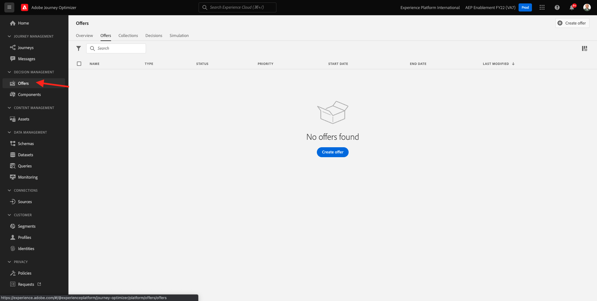

# 9.1 Offer decisioning 101

## 9.1.1 Terminologi

För att få en bättre förståelse för Offer decisioning rekommenderar vi att du läser [översikt](https://experienceleague.adobe.com/docs/journey-optimizer/using/offer-decisioniong/get-started-decision/starting-offer-decisioning.html?lang=en) om hur Offer decisioning Application Service fungerar med Adobe Experience Platform.

När du arbetar med Offer decisioning måste du förstå följande koncept:

| Term | Förklaring |
| ------------------------- | -------------------------------------------------------------------------------------------------------------------------------------------------------------------------------------------------------------------------------------------------------- |
| **Erbjudande** | Ett erbjudande är ett marknadsföringsmeddelande som kan ha kopplade regler som anger vem som kan se erbjudandet. Erbjudandet har följande status: utkast, godkänt eller arkiverat. |
| **Placement** | Den kombination av plats (eller kanaltyp) och kontext (eller innehållstyp) i vilken ett erbjudande visas för en slutanvändare. Det är en kombination av kanalerna Text, HTML, Image, JSON för mobiler, webben, sociala medier, snabbmeddelanden och icke-digitala kanaler. |
| **Regel** | Den logik som definierar och styr slutanvändarnas rätt till ett erbjudande. |
| **Personaliserat erbjudande** | Ett anpassningsbart marknadsföringsmeddelande baserat på regler och begränsningar för behörighet. |
| **Reserverbjudande** | Det standarderbjudande som visas när en slutanvändare inte är berättigad till något av erbjudandena i den mängd som används. |
| **Takning** | Används i en offertdefinition för att definiera hur många gånger ett erbjudande kan presenteras totalt och för en viss användare. |
| **Prioritet** | Nivå för att fastställa prioritetsrangordningen utifrån en resultatmängd med erbjudanden. |
| **Samling** | Används för att filtrera bort en delmängd av erbjudanden från listan med personaliserade erbjudanden för att snabba upp offera decisioningen. |
| **Beslut** | En kombination av en uppsättning erbjudanden, placering och profil som marknadsföraren vill att beslutsmotorn ska erbjuda det bästa erbjudandet för. |
| **AEM Assets Essentials** | En universell och centraliserad upplevelse för lagring, sökning och val av mediefiler i Adobe Experience Cloud Solutions och Adobe Experience Platform. |

{style=&quot;table-layout:auto&quot;}

## 9.1.2 Offer decisioning

Logga in på Adobe Journey Optimizer genom att gå till [Adobe Experience Cloud](https://experience.adobe.com). Klicka **Journey Optimizer**.

Du omdirigeras till **Startsida**  i Journey Optimizer. Kontrollera först att du använder rätt sandlåda. Sandlådan som ska användas anropas `--aepSandboxId--`. Om du vill ändra från en sandlåda till en annan klickar du på **PRODUKTIONSprodukt (VA7)** och välj sandlådan i listan. I det här exemplet heter sandlådan **AEP-aktivering FY22**. Då är du i **Startsida** vy över din sandlåda `--aepSandboxId--`.

Klicka på **Erbjudanden**. Nu visas menyn Erbjudanden, som innehåller saker som Erbjudanden, Samlingar och Beslut.

Klicka **Komponenter**. Nu visas menyn Erbjudanden som innehåller funktioner som Placements, Tags, Rules och Rankings.

## 9.1.3 Placeringar

Gå till **Placeringar**.

I **Placeringar** kan du definiera placeringar för dina erbjudanden. När du definierar ett beslut definierar placeringen var det resulterande erbjudandet ska visas (kanaltyp) och i vilken form (innehållstyp).

Om du inte ser några placeringar i din Adobe Experience Platform-instans skapar du dem enligt nedan och på skärmbilden.

| Namn | Kanaltyp | Innehållstyp |
| ---------------------- | ------------ | ------------ |
| **Icke-digital - text** | Icke-digital | Text |
| **Webb - JSON** | Webb | JSON |
| **Webb - HTML** | Webb | HTML |
| **Webb - text** | Webb | Text |
| **Webb - bild** | Webb | Bild |
| **E-post - JSON** | E-post | JSON |
| **E-post - HTML** | E-post | HTML |
| **E-post - text** | E-post | Text |
| **E-post - bild** | E-post | Bild |

{style=&quot;table-layout:auto&quot;}

**Anteckning**: Ändra ingenting till de placeringar som redan finns.

Klicka på en placering för att visa dess inställningar.

Nu visas alla fält i placeringen:

- **Namn** av placeringen
- **Placement-ID**
- **Kanaltyp** för placeringen
- **Innehållstyp** för placeringen, som kan **Text**, **HTML**, **Bild** eller **JSON**
- **Beskrivning** fält som tillåter att ytterligare beskrivning av placeringen läggs till

## 9.1.4 Beslutsregler

En regel (kallas även behörighetsregel) motsvarar en **Segment**. En regel är i själva verket ett segment med den enda skillnaden att en regel kan användas med ett erbjudande för att ge det bästa erbjudandet till en profil i Adobe Experience Platform.

Som du redan vet hur man definierar segment baserat på de tidigare aktiveringsmodulerna kan vi snabbt gå tillbaka till segmenteringsmiljön:

Gå till **Regler**. Klicka **+ Skapa regel**.

Då visas segmenteringsmiljön i Adobe Experience Platform.

Du kan nu komma åt alla fält som ingår i unionens schema för kundprofilen i realtid och kan bygga ut vilken regel som helst.

Det är också intressant att veta att du helt enkelt kan återanvända redan definierade segment i Adobe Experience Platform genom att gå till **Målgrupper** > ``--aepTenantIdSchema--``.

Då ser du det här:

Om du vill kan du nu konfigurera egna regler. För den här övningen behöver du två regler:

- alla - Manliga kunder
- alla - kvinnliga kunder

Om dessa regler inte finns än, var vänlig och skapa dem. Använd dessa regler om de redan finns och skapa inga nya regler.

Attributet som ska användas för att skapa regeln är **Individuell XDM-profil** > **Person** > **Kön**.

Här är till exempel regeldefinitionen för regeln **alla - Manliga kunder**:

Här är till exempel regeldefinitionen för regeln **alla - kvinnliga kunder**:

## 9.1.5 Erbjudanden

Gå till **Erbjudanden** och markera **Erbjudanden**. Klicka **+ Skapa erbjudande**.

Du kommer då att se den här popup-rutan.

Skapa inga erbjudanden nu - det gör du i nästa övning.

Du ser nu att det finns två typer av erbjudanden:

- Personaliserade erbjudanden
- Reserverbjudanden

Ett personaliserat erbjudande är specifikt innehåll som ska visas i en viss situation. Ett personaliserat erbjudande är särskilt utformat för att leverera en personlig och sammanhangsberoende upplevelse om specifika kriterier uppfylls.

Ett reserverbjudande är ett erbjudande som visas om villkoren för personaliserade erbjudanden inte uppfylls.

## 9.1.6 Beslut

I ett beslut kombineras placeringar, en samling personaliserade erbjudanden och ett reserverbjudande som i slutändan ska användas av Offera decisioningen för att hitta det bästa erbjudandet för en viss profil, baserat på varje enskild personaliserad erbjudandeegenskap, som prioritet, behörighetsbegränsning och total-/användarbegränsning.

Så här konfigurerar du **Beslut**, klicka **Beslut**.

I nästa övning kommer ni att konfigurera era egna erbjudanden och beslut.

Nästa steg: [9.2 Konfigurera erbjudanden och beslut](./ex2.md)

[Gå tillbaka till modul 9](./offer-decisioning.md)

[Gå tillbaka till Alla moduler](./../../overview.md)
