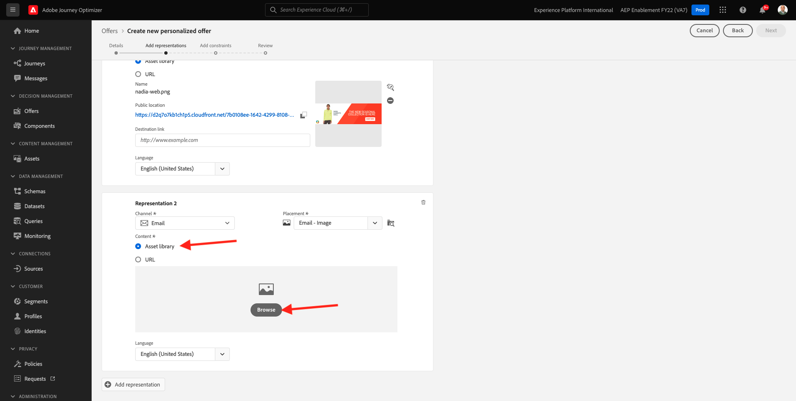
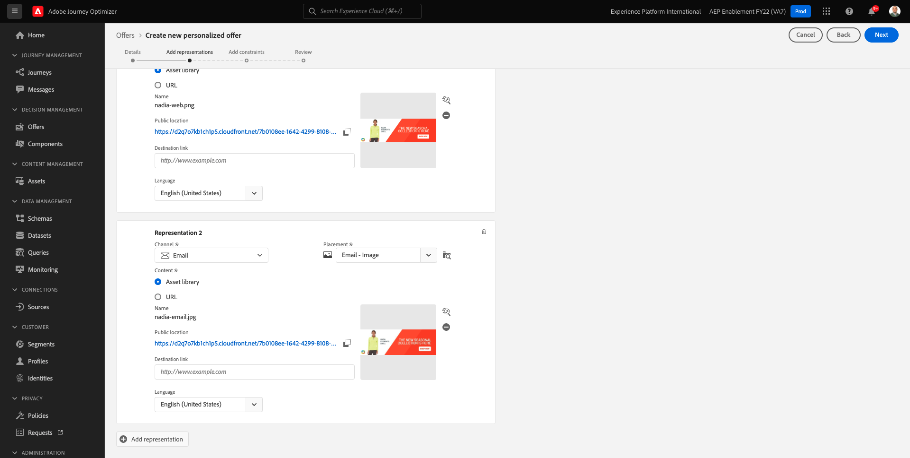
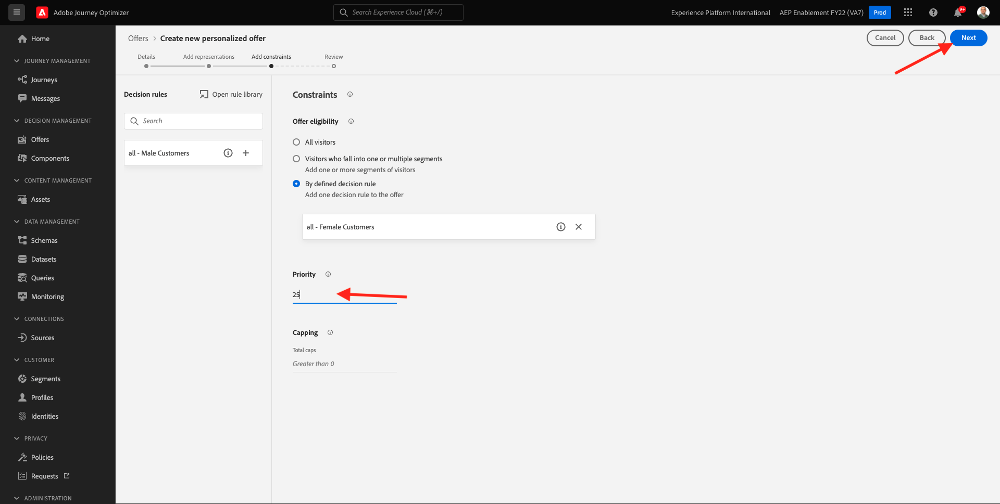
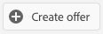
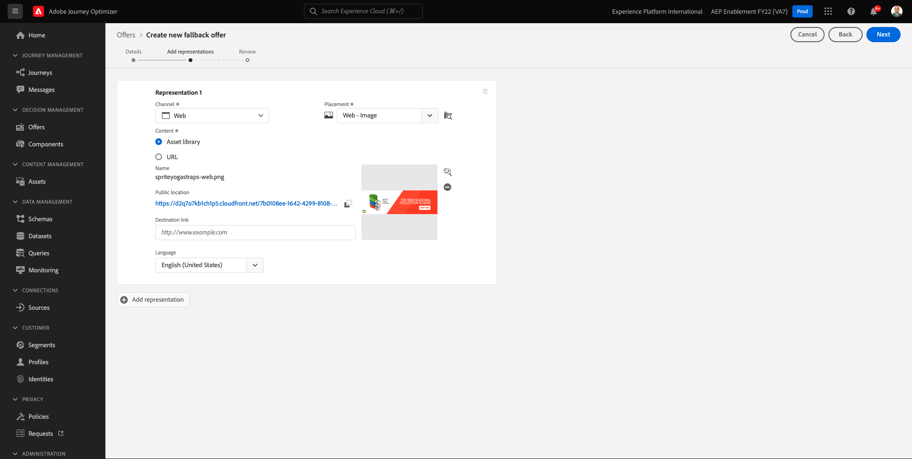
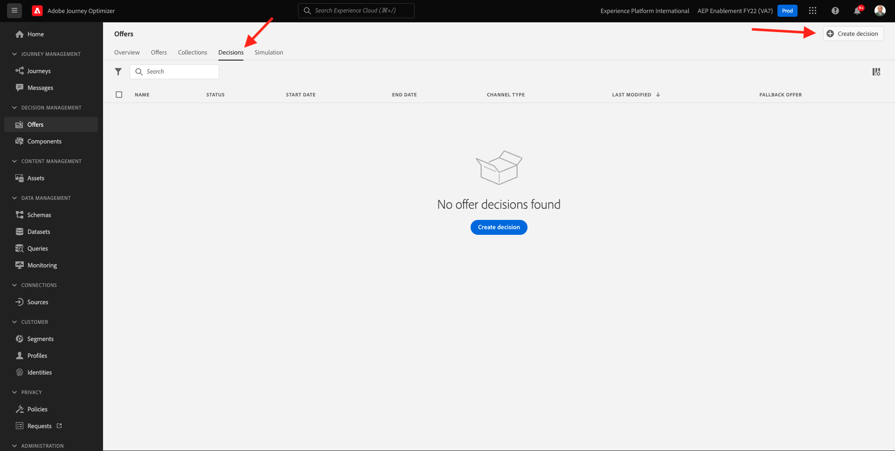

# 9.2 Konfigurera erbjudanden och beslut

## 9.2.1 Skapa personaliserade erbjudanden

I den här övningen ska du skapa fyra **Personaliserade erbjudanden**. Här följer de uppgifter som ska beaktas när erbjudandena skapas:

| Namn | Datumintervall | Bildlänk för e-post | Bildlänk för webben | Text | Prioritet | Kvalificering | Språk |
|-----|------------|----------------------|--------------------|------|:--------:|--------------|:-------:|
| `--demoProfileLdap-- - Nadia Elements Shell` | idag - 1 månad senare | https://bit.ly/3nPiwdZ | https://bit.ly/2INwXjt | `{{ profile.person.name.firstName }}, 10% discount on Nadia Elements Shell` | 25 | alla - kvinnliga kunder | Engelska (USA) |
| `--demoProfileLdap-- - Radiant Tee` | idag - 1 månad senare | https://bit.ly/2HfA17v | https://bit.ly/3pEIdzn | `{{ profile.person.name.firstName }}, 5% discount on Radiant Tee` | 15 | alla - kvinnliga kunder | Engelska (USA) |
| `--demoProfileLdap-- - Zeppelin Yoga Pant` | idag - 1 månad senare | https://bit.ly/2IOaItW | https://bit.ly/2INZHZd | `{{ profile.person.name.firstName }}, 10% discount on Zeppelin Yoga Pant` | 25 | alla - Manliga kunder | Engelska (USA) |
| `--demoProfileLdap-- - Proteus Fitness Jackshirt` | idag - 1 månad senare | https://bit.ly/330a43n | https://bit.ly/36USaQW | `{{ profile.person.name.firstName }}, 5% discount on Proteus Fitness Jackshirt` | 15 | alla - Manliga kunder | Engelska (USA) |

{style=&quot;table-layout:auto&quot;}

Logga in på Adobe Journey Optimizer genom att gå till [Adobe Experience Cloud](https://experience.adobe.com). Klicka **Journey Optimizer**.

Du omdirigeras till **Startsida**  i Journey Optimizer. Kontrollera först att du använder rätt sandlåda. Sandlådan som ska användas anropas `--aepSandboxId--`. Om du vill ändra från en sandlåda till en annan klickar du på **PRODUKTIONSprodukt (VA7)** och välj sandlådan i listan. I det här exemplet heter sandlådan **AEP-aktivering FY22**. Då är du i **Startsida** vy över din sandlåda `--aepSandboxId--`.

Klicka på **Erbjudanden** och sedan gå till **Erbjudanden**. Klicka **+ Skapa erbjudande**.

Du kommer då att se den här popup-rutan. Välj **Personligt erbjudande** och klicka **Nästa**.

Du är nu på **Detaljer** vy.

I så fall måste du konfigurera erbjudandet `--demoProfileLdap-- - Nadia Elements Shell`. Använd informationen i tabellen ovan för att fylla i fälten. I det här exemplet heter det personaliserade erbjudandet **vangeluw - Nadia Elements Shell**. Ange även **Startdatum och -tid** till i går och ställer in **Slutdatum och sluttid** till ett datum om en månad.

När du är klar, borde du ha den här. Klicka på **Nästa**.

Nu måste du skapa **Representationer**. Representationer är en kombination av en **Placement** och en verklig tillgång.

För **Representation 1**, välj:

- Kanal: Webb
- Placement: Webb - bild
- Innehåll: URL
- Offentlig plats: kopiera URL:en från kolumnen **Bildlänk för webben** i tabellen ovan

Du kan också välja **Resursbibliotek** för innehållet och klicka sedan på **Bläddra**.

Därefter visas en popup-meny i resursbiblioteket, gå till mappen **enablement-assets** och markera bildfilen **nadia-web.png**. Klicka sedan på **Välj**.

Då ser du det här:

Klicka **+ Lägg till representation**.

För **Representation 2**, välj:

- Kanal: E-post
- Placement: E-post - bild
- Innehåll: URL
- Offentlig plats: kopiera URL:en från kolumnen **Bildlänk för e-post** i tabellen ovan

Du kan också välja **Resursbibliotek** för innehållet och klicka sedan på **Bläddra**.

Därefter visas en popup-meny i resursbiblioteket, gå till mappen **enablement-assets** och markera bildfilen **nadia-email.png**. Klicka sedan på **Välj**.

Då ser du det här:

Klicka på **+ Lägg till representation**.

För **Representation 3**, välj:

- Kanal: Icke-digital
- Placement: Icke-digital - text

Sedan måste du lägga till innehåll. I det här fallet innebär det att du lägger till texten som ska användas som en uppmaning till åtgärd.

Klicka **Lägg till innehåll**.

Du kommer då att se den här popup-rutan.

Välj **Egen text** och fylla i dessa fält:

Titta på **Text** från ovanstående tabell och ange texten här, i detta fall: `{{ profile.person.name.firstName }}, 10% discount on Nadia Elements Shell`.

Du kommer också att märka att du kan välja valfritt profilattribut och inkludera det som ett dynamiskt fält i erbjudandetexten. I det här exemplet är fältet `{{ profile.person.name.firstName }}` säkerställer att förnamnet på kunden som kommer att få erbjudandet kommer att ingå i erbjudandetexten.

Du kommer då att se det här. Klicka **Spara**.

Du har den här nu. Klicka på **Nästa**.

Då ser du det här:

Välj **Efter definierad beslutsregel** och klicka på **+** ikon för att lägga till regeln **alla - kvinnliga kunder**.

Du kommer då att se det här. Fyll i **Prioritet** enligt tabellen ovan. Klicka på **Nästa**.

Då visas en översikt över dina nya **Personaliserat erbjudande**.

Klicka slutligen **Spara och godkänn**.

Du kommer då att se att ditt nya personaliserade erbjudande blir tillgängligt i Översikt över erbjudanden:

Du bör nu upprepa stegen ovan för att skapa de tre andra personliga erbjudandena för produkterna Radiant Tee, Zeppelin Yoga Pant och Proteus Fitness Jackshirte.

När du är klar **Erbjudandeöversikt** skärm för **Personaliserade erbjudanden** visa alla erbjudanden.

## 9.2.2 Skapa ett reserverbjudande

Efter att ha skapat fyra personaliserade erbjudanden bör du nu konfigurera en **Reserverbjudande**.

Se till att du är i **Erbjudanden** vy:

Klicka **+ Skapa erbjudande**.

Du kommer då att se den här popup-rutan. Välj **Reserverbjudande** och klicka **Nästa**.

Då ser du det här:

Ange detta namn för ditt reserverbjudande: `--demoProfileLdap-- - Luma Fallback Offer`. Klicka på **Nästa**.

Nu måste du skapa **Representationer**. Representationer är en kombination av en **Placement** och en verklig tillgång.

För **Representation 1**, välj:

- Kanal: Webb
- Placement: Webb - bild
- Innehåll: URL
- Offentlig plats: `https://bit.ly/3nBOt9h`

Du kan också välja **Resursbibliotek** för innehållet och klicka sedan på **Bläddra**.

Därefter visas en popup-meny i resursbiblioteket, gå till mappen **enablement-assets** och markera bildfilen **spriteyogastraps-web.png**. Klicka sedan på **Välj**.

Då ser du det här:

För **Representation 2**, välj:

- Kanal: E-post
- Placement: E-post - bild
- Innehåll: URL
- Offentlig plats: `https://bit.ly/3nF4qvE`

Du kan också välja **Resursbibliotek** för innehållet och klicka sedan på **Bläddra**.

Därefter visas en popup-meny i resursbiblioteket, gå till mappen **enablement-assets** och markera bildfilen **spriteyogastraps-email.png**. Klicka sedan på **Välj**.

Då ser du det här:

Klicka på **+ Lägg till representation**.

För **Representation 3**, välj:

- Kanal: Icke-digital
- Placement: Icke-digital - text

Sedan måste du lägga till innehåll. I det här fallet innebär det att du lägger till bildlänken.

Klicka **Lägg till innehåll**.

Du kommer då att se den här popup-rutan.

Välj **Egen text** och fylla i dessa fält:

Ange texten `{{ profile.person.name.firstName }}, discover our Sprite Yoga Straps!` och klicka **Spara**.

Du kommer då att se det här. Klicka på **Nästa**.

Då visas en översikt över dina nya **Reserverbjudande**. Klicka **Slutför**.

Klicka slutligen **Spara och godkänn**.

I **Erbjudandeöversikt** kommer du att se följande:

## 9.2.3 Skapa din samling

En samling används för **filter** Ta fram en delmängd av erbjudandena från listan med personaliserade erbjudanden och använd dessa som en del av ett beslut för att snabba upp beslutsprocessen.

Gå till **Samlingar**. Klicka **+ Skapa samling**.

Du kommer då att se den här popup-rutan. Konfigurera din samling så här. Klicka på **Nästa**.

- Samlingsnamn: use `--demoProfileLdap-- - Luma Collection`
- Välj **Skapa statisk samling**.

På nästa skärm väljer du de fyra **Personaliserade erbjudanden** du skapade i föregående övning. Klicka **Spara**.

Nu ser du det här:

## 9.2.4 Fatta ett beslut

I ett beslut kombineras praktik, en samling personaliserade erbjudanden och ett reserverbjudande som slutligen ska användas av Offera decisioningen för att hitta det bästa erbjudandet för en viss profil, baserat på varje enskild personaliserad erbjudandeegenskap som prioritet, begränsning av behörighet och begränsning av antalet användare.

Så här konfigurerar du **Beslut**, gå till **Beslut**. Klicka **+ Skapa aktivitet**.

Då ser du det här:

Fyll i fälten så här. Klicka på **Nästa**.

- Namn: `--demoProfileLdap-- - Luma Decision`
- Startdatum och starttid: igår
- Slutdatum och sluttid: idag + 1 månad

På nästa skärm måste du lägga till praktik i beslutsomfattningar. Du måste skapa beslutsomfattningar för placeringarna **Webb - bild**, **E-post - bild** och **Icke-digital - text**.

Skapa först beslutsomfånget för **Icke-digital - text** genom att välja den placeringen i listrutan. Klicka sedan på **Lägg till** om du vill lägga till utvärderingskriterier.

Välj din samling `--demoProfileLdap-- - Luma Collection` och klicka **Lägg till**.

Du kommer då att se det här. Klicka på **-** för att lägga till ett nytt beslutsområde.

Välj placering **Webb - bild** och lägga till din samling `--demoProfileLdap-- - Luma Collection` enligt utvärderingskriterier. Klicka sedan på **+** igen för att lägga till ett nytt beslutsomfång.

Välj placering **E-post - bild** och lägga till din samling `--demoProfileLdap-- - Luma Collection` enligt utvärderingskriterier. Klicka sedan på **Nästa**.

Nu måste du välja **Reserverbjudande**, som har namnet `--demoProfileLdap-- - Luma Fallback Offer`. Klicka på **Nästa**.

Granska ditt beslut. Klicka **Slutför**.

Klicka på **Spara och aktivera**.

Slutligen kommer du att se ditt beslut i översikten:

Du har nu konfigurerat ditt beslut. Ditt beslut är nu öppet och kan användas för att leverera optimerade och personaliserade erbjudanden till era kunder i realtid.

Nästa steg: [9.3 Förbered din datainsamling-klientegenskap och Web SDK-konfiguration för Offer decisioning](./ex3.md)

[Gå tillbaka till modul 9](./offer-decisioning.md)

[Gå tillbaka till Alla moduler](./../../overview.md)
