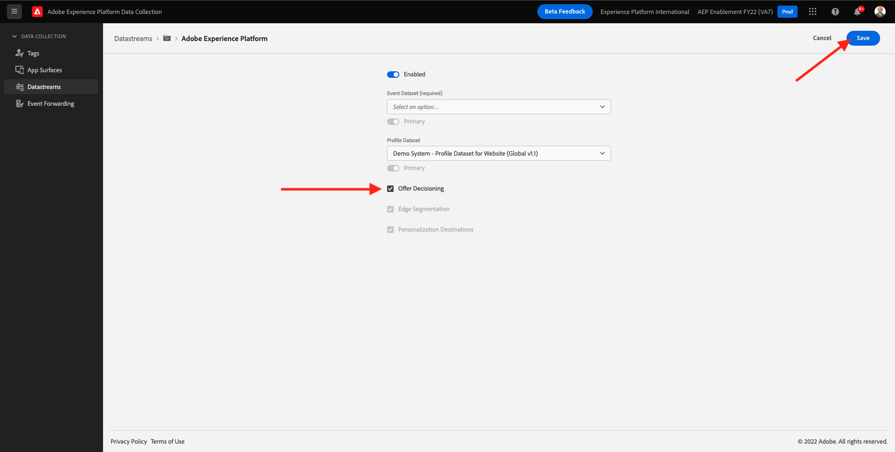
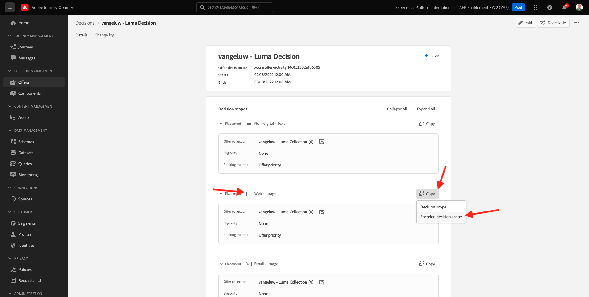

# 9.3 Förbered din klientegenskap för Adobe Experience Platform Data Collection och Web SDK-konfiguration för Offer decisioning

>[!NOTE]
>
>Offer decisioning i Adobe Experience Platform Web SDK är för närvarande tillgänglig i förtid för vissa användare. Den här funktionen är inte tillgänglig för alla IMS-organisationer.

## 9.3.1 Uppdatera ditt datastream

I [Utövning 0.2](./../../modules/module0/ex2.md)har du skapat en egen **[!UICONTROL Datastream]**. Du använde sedan namnet `--demoProfileLdap-- - Demo System Datastream`.

I den här övningen måste du konfigurera att **[!UICONTROL Datastream]** att arbeta med **[!DNL Offer Decisioning]**.

Om du vill göra det går du till [https://experience.adobe.com/#/data-collection/](https://experience.adobe.com/#/data-collection/). Du kommer då att se det här. Klicka **[!UICONTROL Datastreams]** eller **[!UICONTROL Datastreams (beta)]**.

I skärmens övre högra hörn väljer du namnet på sandlådan, som bör vara `--aepSandboxId--`.


Sök efter **[!UICONTROL Datastream]**, som har namnet `--demoProfileLdap-- - Demo System Datastream`. Klicka på **[!UICONTROL Datastream]** för att öppna den.


Du kommer då att se det här. Klicka **...** nästa **Adobe Experience Platform** och sedan klicka **Redigera**.


Aktivera **[!DNL Offer Decisioning]**, markera kryssrutan för **[!DNL Offer Decisioning]**. Klicka **Spara**.



Dina **[!UICONTROL Datastream]** är nu redo att arbeta med **[!DNL Offer Decisioning]**.


## 9.3.2 Konfigurera klientegenskapen för Adobe Experience Platform Data Collection för att begära anpassade erbjudanden

Gå till [https://experience.adobe.com/#/data-collection/](https://experience.adobe.com/#/data-collection/), till **[!UICONTROL Klient]**. Sök efter dina datainsamlingsegenskaper, som har namn `--demoProfileLdap-- - Demo System (DD/MM/YYYY)`. Öppna din Data Collection-klientegenskap för webben.


Gå till **[!UICONTROL Regler]** och öppna regeln **[!UICONTROL Sidvy]**.


Klicka för att öppna [!UICONTROL Åtgärd] **[!UICONTROL AEP Web SDK - skicka händelse]**.


Du kommer då att se det här. Du kommer att märka menyalternativet för **[!UICONTROL Beslutsomfattningar]**.


För varje förfrågan som skickas till Adobe Experience Platform går det att ange en eller flera **[!UICONTROL Beslutsomfattningar]**. A **[!UICONTROL Beslutets omfattning]** är en kombination av två element:

- [!UICONTROL Besluts-ID]
- [!UICONTROL Placement-ID]

Låt oss först ta en titt där du kan hitta de två elementen.

### 9.3.2.1 Hämta din [!UICONTROL Placement-ID]

The [!UICONTROL Placement-ID] identifierar platsen och typen av tillgång som krävs. Hjältebilden på Lumas hemsida motsvarar till exempel [!UICONTROL Placement-ID] for [!UICONTROL Webb - bild].

>[!NOTE]
>
>Som en del av modul 6 har du redan konfigurerat en Adobe Target Experience Targeting-aktivitet som kommer att ändra bilden av hjälteplatsen på hemsidan, som du kan se i skärmbilden. För träningens skull ska du nu få dina erbjudanden att visas på bilden nedanför hjältebilden som visas på skärmbilden.


För att hitta [!UICONTROL Placement-ID] for [!UICONTROL Webb - bild] gå till Adobe Journey Optimizer genom att gå till [Adobe Experience Cloud](https://experience.adobe.com). Klicka **Journey Optimizer**.


Du omdirigeras till **Startsida**  i Journey Optimizer. Kontrollera först att du använder rätt sandlåda. Sandlådan som ska användas anropas `--aepSandboxId--`. Om du vill ändra från en sandlåda till en annan klickar du på **PRODUKTIONSprodukt (VA7)** och välj sandlådan i listan. I det här exemplet heter sandlådan **AEP-aktivering FY22**. Då är du i **Startsida** vy över din sandlåda `--aepSandboxId--`.


Nästa, gå till [!UICONTROL Komponenter] och sedan [!UICONTROL Placeringar]. Klicka på [!UICONTROL Webb - bild] för att se detaljer.


Som du kan se i bilden ovan, i det här exemplet [!UICONTROL Placement-ID] är `xcore:offer-placement:14bf09dc4190ebba`. Skriv ned [!UICONTROL Placement-ID] för din [!UICONTROL Webb - bild] som du kommer att behöva det i nästa övning.

### 9.3.2.2 Hämta din [!UICONTROL Besluts-ID]

The [!UICONTROL Besluts-ID] identifierar vilken kombination av personaliserade erbjudanden och reserverbjudanden du vill använda. I föregående övning skapade du en egen [!UICONTROL Beslut] och namngav `--demoProfileLdap-- - Luma Decision`.

För att hitta [!UICONTROL Besluts-ID] för `--demoProfileLdap-- - Luma Decision`, gå till [https://platform.adobe.com](https://platform.adobe.com).

Nästa, gå till [!UICONTROL Erbjudanden] och sedan gå till [!UICONTROL Beslut]. Klicka för att välja [!UICONTROL Beslut], som har namnet `--demoProfileLdap-- - Luma Decision`.


Som du kan se i bilden ovan, i det här exemplet [!UICONTROL Besluts-ID] är `xcore:offer-activity:14c052382e1b6505`. Skriv ned [!UICONTROL Besluts-ID] för ditt beslut `--demoProfileLdap-- - Luma Decision` som du kommer att behöva det i nästa övning.

Nu när du har hämtat de två elementen du behöver för att skapa en **[!UICONTROL Beslutsomfattningar]** kan du fortsätta med nästa steg, vilket innebär att du måste koda beslutsomfånget.

### 9.3.2.3 BASE64-kodning

The **[!UICONTROL Beslutets omfattning]** Du måste ange en BASE64-kodad sträng. Denna BASE64-kodade sträng är en kombination av [!UICONTROL Placement-ID] och [!UICONTROL Besluts-ID]som du ser nedan.

```json
{
  "activityId":"xcore:offer-activity:14c052382e1b6505",
  "placementId":"xcore:offer-placement:14bf09dc4190ebba"
}
```

The **[!UICONTROL Beslutets omfattning]** kan genereras på två sätt:

- Använda en offentlig tjänst som [https://www.base64encode.org/](https://www.base64encode.org/). Ange JSON-koden enligt ovan och klicka på **[!UICONTROL Koda]** så får du den BASE64-kodade strängen nedan.

   

- Hämta den BASE64-kodade strängen från Adobe Experience Platform. Gå till [!UICONTROL Beslut] och klicka för att öppna [!UICONTROL Beslut], som har namnet `--demoProfileLdap-- - Luma Decision`.

   

   Efter öppning `--demoProfileLdap-- - Luma Decision`, du kommer att se det här. Leta reda på placeringen [!UICONTROL Webb - bild] och klicka på **[!UICONTROL Kopiera]** -knappen. Klicka på **[!UICONTROL Kodat beslutsomfång]**. The **[!UICONTROL Beslutets omfattning]** kopieras nu till Urklipp.

   

Gå sedan tillbaka till Launch, till din åtgärd **[!UICONTROL AEP Web SDK - skicka händelse]**.


Klistra in det kodade beslutsomfånget i indatafältet.


Spara ändringarna i funktionsmakrot **[!UICONTROL AEP Web SDK - skicka händelse]** genom att klicka **[!UICONTROL Behåll ändringar]**.


Klicka på **[!UICONTROL Spara]** eller **[!UICONTROL Spara i bibliotek]**


I Adobe Experience Platform Data Collection går du till **[!UICONTROL Publiceringsflöde]** och öppna **[!UICONTROL Utvecklingsbibliotek]** som namnges **[!UICONTROL Huvud]**. Klicka **[!UICONTROL + Lägg till alla ändrade resurser]** och sedan klicka **[!UICONTROL Spara och bygg för utveckling]**. Ändringarna publiceras nu på demowebbplatsen.


Varje gång du läser in en **Allmän sida** Nu, till exempel startsidan för demowebbplatsen, kommer Offera decisioningen att utvärdera vilket erbjudande som gäller och returnera ett svar till webbplatsen med information om erbjudandet som ska visas. För att visa erbjudandet på webbplatsen krävs ytterligare konfiguration, vilket du gör i nästa steg.

## 9.3.3 Konfigurera din klientegenskap för Adobe Experience Platform Data Collection för att ta emot och tillämpa personaliserade erbjudanden

Gå till [https://experience.adobe.com/#/data-collection/](https://experience.adobe.com/#/data-collection/), till **[!UICONTROL Egenskaper]**. Sök efter dina datainsamlingsegenskaper, som har namn `--demoProfileLdap-- - Demo System (DD/MM/YYYY)`. Öppna din datainsamlingsegenskap för webben.


Gå till **[!UICONTROL Regler]**.


Söka efter och öppna regeln **Mottaget beslut**.


Du kommer då att se det här. Öppna funktionsmakrot **Lägg ut erbjudandet på sidan**.


Klicka **[!UICONTROL Öppna redigeraren]**


Skriv över koden genom att klistra in koden nedan i redigeraren.

```javascript
if(!Array.isArray(event.decisions)) {
  console.log('No decisions returned')
  return;
}
console.log("decision",event.decisions)

event.decisions.forEach(function(payload) {
  payload.items.forEach(function(item){
    console.log("Response from Offer Decisioning ", item.data.content);
   
    var element = document.querySelector("#root > div > div > div.app-content > div > section.feature_part.padding_top > div > div.row.align-items-center.justify-content-between > div.col-lg-7.col-sm-6.\\30  > div");
    if(!element){
      console.log("Offer Placement Area Selector not found")
      return;
    }
    if(!item.data){
      return
    }
    //check if offer already exists
    var offer = document.querySelector("#root > div > div > div.app-content > div > section.feature_part.padding_top > div > div.row.align-items-center.justify-content-between > div.col-lg-7.col-sm-6.\\30  > div");
    if(!offer){ 
      element.insertAdjacentHTML('afterbegin', item.data.content) 
    }
    else { 
      console.log("item.data.deliveryURL: " + item.data.deliveryURL)
      document.querySelector("#root > div > div > div.app-content > div > section.feature_part.padding_top > div > div.row.align-items-center.justify-content-between > div.col-lg-7.col-sm-6.\\30  > div").style.background="url('"+item.data.deliveryURL+"')";
      document.querySelector("#root > div > div > div.app-content > div > section.feature_part.padding_top > div > div.row.align-items-center.justify-content-between > div.col-lg-7.col-sm-6.\\30  > div").style.backgroundRepeat="no-repeat";
      document.querySelector("#root > div > div > div.app-content > div > section.feature_part.padding_top > div > div.row.align-items-center.justify-content-between > div.col-lg-7.col-sm-6.\\30  > div").style.backgroundPosition="center center";
      document.querySelector("#root > div > div > div.app-content > div > section.feature_part.padding_top > div > div.row.align-items-center.justify-content-between > div.col-lg-7.col-sm-6.\\30  > div").style.backgroundSize = "contain";
    }  
  })
});
```

Raderna 26-27-28-29 tillämpar den bild som returneras som Offer decisioning på webbplatsen. Klicka **[!UICONTROL Spara]**.


Klicka **[!UICONTROL Behåll ändringar]**.


Klicka på **[!UICONTROL Spara]** eller **[!UICONTROL Spara i bibliotek]**


I Adobe Experience Platform Data Collection går du till **[!UICONTROL Publiceringsflöde]** och öppna **[!UICONTROL Utvecklingsbibliotek]** som namnges **[!UICONTROL Huvud]**. Klicka **[!UICONTROL + Lägg till alla ändrade resurser]** och sedan klicka **[!UICONTROL Spara och bygg för utveckling]**. Ändringarna publiceras nu på demowebbplatsen.


Denna ändring innebär att den här regeln i Adobe Experience Platform Data Collection nu lyssnar på svaret från Offera decisioningen som ingår i Web SDK-svaret, och när svaret tas emot visas bilden av erbjudandet på hemsidan.

På demowebbplatsen ser du att den här bilden kommer att ersättas nu:

>[!NOTE]
>
>Som en del av modul 6 har du redan konfigurerat en Adobe Target Experience Targeting-aktivitet som kommer att ändra bilden av hjälteplatsen på hemsidan, som du kan se i skärmbilden. För träningens skull ska du nu få dina erbjudanden att visas på bilden nedanför hjältebilden som visas på skärmbilden.


I stället för Lumas standardbilder ser du nu ett liknande erbjudande. I det här fallet visas reserverbjudandet.


Du har nu konfigurerat två typer av personalisering:

- 1 Experience Targeting-aktivitet med Adobe Target i modul 6
- Implementering av 1 Offer decisioning med din datainsamlingsegenskap

I nästa övning får du se hur ni kan kombinera era era erbjudanden och beslut som skapats i Adobe Journey Optimizer med en Adobe Target Experience Targeting-aktivitet.

Nästa steg: [9.4 Kombinera Adobe Target och Offer decisioning](./ex4.md)

[Gå tillbaka till modul 9](./offer-decisioning.md)

[Gå tillbaka till Alla moduler](./../../overview.md)
