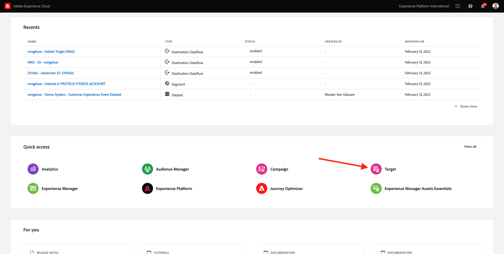

# 9.4 Kombinera Adobe Target och Offer decisioning

## 9.4.1 Samla in länken till ditt demoprojekt

För att kunna läsa in demonstrationswebbplatsprojektet i Adobe Target måste du först samla in en speciell länk som gör att Adobe Target kan läsa in ditt projekt för demowebbplatser.

Om du vill göra det går du till [https://builder.adobedemo.com/projects](https://builder.adobedemo.com/projects). När du har loggat in med din Adobe ID ser du det här. Klicka på webbplatsprojektet för att öppna det.

Du kommer att se det här. Klicka **Dela**.

Klicka **Generera länk** och sedan kopiera länken till Urklipp.

Gå till [https://bitly.com](https://bitly.com), klistra in länken som du kopierade och klicka på **Korta**. Nu får du en förkortad länk som ser ut så här: `https://bit.ly/3JxN7aG`. Du kommer att behöva den länken i nästa övning.

## 9.4.2 Samla in

Gå nu till Adobe Experience Cloud hemsida genom att gå till [https://experiencecloud.adobe.com/](https://experiencecloud.adobe.com/). Klicka **Mål**.

På **Adobe Target** på startsidan ser du alla befintliga aktiviteter.

Klicka **+ Skapa aktivitet** för att skapa en ny aktivitet.

Välj **Experience Targeting**.

Välj nu **Visual** och klistra in den förkortade länken i fältet **Ange aktivitets-URL**. Klicka på **Nästa**.

Du kommer då att se hur ditt demonstrationswebbplatsprojekt läses in i Visuel Experience Composer.

Gå till **Bläddra** läge för att klicka **Tillåt alla** på popup-fönstret för cookie-samtycke.

Klicka på området som innehåller texten **Kategorier**. Klicka **Infoga före** och sedan markera **Erbjudandebeslut**.

Du kommer då att se den här popup-rutan. Välj din sandlåda `--aepSandboxId--` och välj sedan placering **Webb - bild**.

Välj sedan ditt beslut `--demoProfileLdap-- - Luma Decision`. Klicka **Spara**.

Du kommer då att se det här. Se till att lägga till en extra mallregel **URL** **innehåller** **ditt projektnamn**. CLick **Spara**.

Du kommer då att se det här. Klicka på **Nästa**.

Ange ett namn för erbjudandet. Använd det här namnet: `--demoProfileLdap-- - XT with Offers (VEC)`. Klicka på **Nästa**.

Du kommer då att se det här. Definiera **Målmått** enligt vad som anges. Klicka **Spara och stäng**.

Erbjudandet har skapats och publiceras.

När erbjudandet har publicerats kan du aktivera det.

Nästa steg: [9.5 Använd ditt beslut i ett e-postmeddelande och i ett sms](./ex5.md)

[Gå tillbaka till modul 9](./offer-decisioning.md)

[Gå tillbaka till Alla moduler](./../../overview.md)
