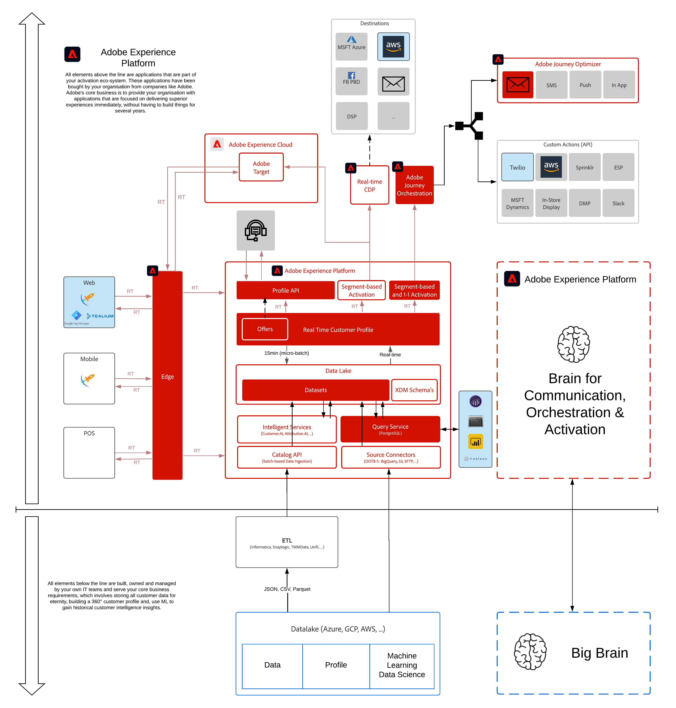

# 9. offer decisioning

**Författare: [Rob in der Maur](https://www.linkedin.com/in/ridmaur/), [Wouter Van Geluwe](https://www.linkedin.com/in/woutervangeluwe/)**

I den här modulen får du en praktisk genomgång av Adobe Journey Optimizer funktioner för Offer decisioning.

Adobe Journey Optimizer ger möjlighet att skapa personaliserade erbjudanden och leverera dem på ett samordnat sätt till alla destinationer som är kopplade till Adobe Journey Optimizer.

Med Offer decisioning kan du välja det bästa alternativet bland en uppsättning tillgängliga alternativ. Dessa alternativ kan vara erbjudanden, produktrekommendationer, innehållskomponenter för en webbupplevelse, konversationsskript och åtgärder som ska vidtas.

Titta på den här videon för att förstå värdet och kundresan:

>[!VIDEO](https://video.tv.adobe.com/v/328829?quality=12&learn=on)

## Utbildningsmål

- Förstå grundläggande terminologi som används som en del av Offera decisioningen.
- Förstå hur ni konfigurerar Offera decisioningens programtjänst så att den påverkar kundresor i realtid.

## Förutsättningar

- Tillgång till Adobe Journey Optimizer

>[!IMPORTANT]
>
>Den här självstudiekursen har skapats för att underlätta ett visst workshop-format. Den använder specifika system och konton som du kanske inte har tillgång till. Även om ni inte har tillgång till dem tror vi att ni fortfarande kan lära er mycket genom att läsa igenom detta mycket detaljerade innehåll. Om du deltar i något av seminarierna och behöver dina inloggningsuppgifter, kontakta din Adobe-representant som kommer att ge dig den information som krävs.

## Arkitektur - översikt

Titta närmare på arkitekturen nedan, som visar vilka komponenter som kommer att diskuteras och användas i den här modulen.

## Sandlåda att använda

Använd den här sandlådan för den här modulen: `--aepSandboxId--`.

>[!NOTE]
>
>Glöm inte att installera, konfigurera och använda Chrome-tillägget enligt referensen i [0.1 - Installera Chrome-tillägget för Experience League-dokumentationen](../module0/ex1.md)

## Utövningar

[9.1 Offer decisioning 101](./ex1.md)

I den här övningen får du en bättre förståelse för alla olika koncept för Offer decisioning och hur du får tillgång till Offer decisioning i Adobe Journey Optimizer.

[9.2 Konfigurera erbjudanden och beslut](./ex2.md)

I den här övningen ska ni konfigurera era egna personaliserade erbjudanden och ert eget beslut, som sedan publiceras.

[9.3 Förbered din datainsamling-klientegenskap och Web SDK-konfiguration för Offer decisioning](./ex3.md)

I den här övningen använder du demowebbplatsen för att testa ditt beslut.

[9.4 Kombinera Adobe Target och Offer decisioning](./ex4.md)

I den här övningen kommer du att använda dina erbjudanden i Adobe Target.

[9.5 Använd ditt beslut i ett e-postmeddelande](./ex5.md)

I den här övningen kommer du att använda ditt beslut i ett e-postmeddelande.

[9.6 Testa ditt beslut med API:t](./ex6.md)

I den här övningen ska du använda Postman och Adobe Experience Platform API:er för att testa ditt beslut.

[Sammanfattning och fördelar](./summary.md)

Sammanfattning av den här modulen och en översikt över fördelarna.

>[!NOTE]
>
>Tack för att du lade ned din tid på att lära dig allt om Adobe Experience Platform. Om du har frågor kan du dela allmän feedback om dina förslag på framtida innehåll. Kontakta Wouter Van Geluwe direkt genom att skicka ett e-postmeddelande till **vangeluw@adobe.com**.

[Gå tillbaka till Alla moduler](../../overview.md)
