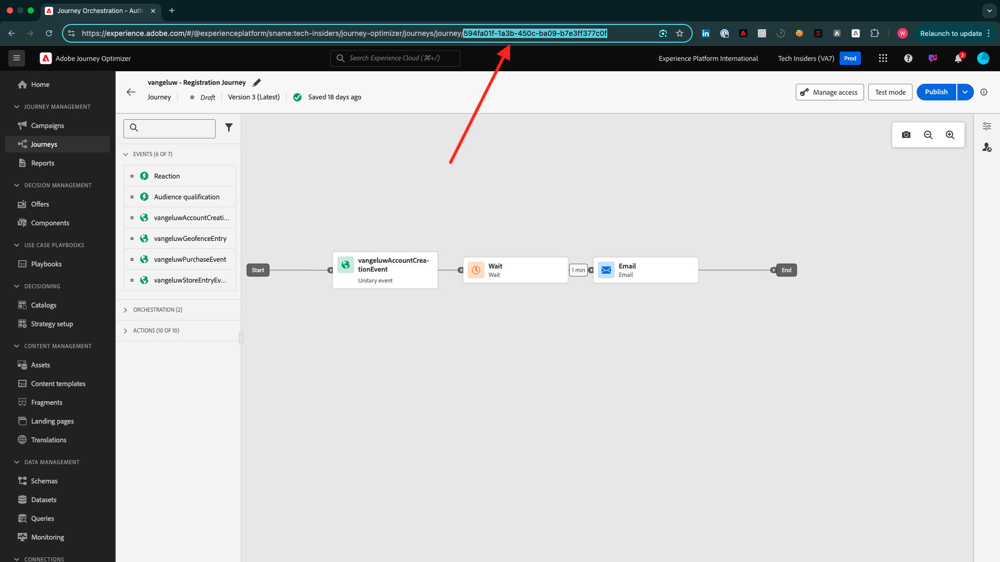

# Hur mäts Slutförande?

Gå till [https://certification.adobe.com](https://certification.adobe.com) och gå till kursen **XXX**.

För att slutföra en modul måste du tillhandahålla ett bevis på att du är klar.

Nedan visas det förväntade korrekturet för varje modul.

## Komma igång

Det förväntade slutförandebeviset för modulen **Komma igång** är ID:t för det demosystemprojekt för webben som du har skapat.

ID:t för Demo System-projektet för webbformat ser ut så här: `--aepUserLdap-- - QIMU`.

## 1.1 Adobe Experience Platform Data Collection och Web SDK

Det förväntade slutförandebeviset för modulen **Datainsamling och webb-SDK** är **miljö-ID** för datainsamlingsegenskapen för webb.

Miljö-ID:t för egenskapen Datainsamling för webbformat ser ut så här: `EN5211f7792b4442f8a45deb68f8902d3a`.

## 1.2 Datainmatning

Det förväntade slutförandebeviset för modulen **Datainmatning** är dataflödes-ID:t för Source-anslutningen för datalandningszonen.

Dataflödes-ID:t ser ut så här: **374c2c6d-f39a-4b0b-b568-40c41e6c4e8e**.

## 1.3 Sammansatt målgrupp

Det förväntade slutförandebeviset för modulen **Federated Audience Composition** är ID:t för den Federated Data-modell som du skapade.

ID:t för Federated Data Model ser ut så här: **DMO5110** och kan hämtas från URL:en enligt bilden nedan.

## 2.1 Kundprofil i realtid

Det förväntade beviset på slutförande för modulen **Kundprofil i realtid** är **målgrupps-ID** för målgruppen som du skapade via användargränssnittet `--aepUserLdap-- - Male customers with interest in iPhone 15 Pro`.

Audience-ID:t ser ut så här: **81a9acbe-12e6-424b-b658-abba3a435c83**.

## 2.2 Intelligenta tjänster

Det förväntade beviset på slutförande för modulen **Intelligenta tjänster** är **Audience ID** för den målgrupp som du skapade via användargränssnittet `--aepUserLdap-- - Customer AI High Propensity`.

Audience ID ser ut så här: **cb6db21d-8fa3-484a-93ac-25aa1ab48412**.

## 2.3 Real-Time CDP: Bygg en målgrupp och agera!

Förväntat slutförandebevis för modulen **Real-Time CDP: Bygg en målgrupp och vidta åtgärder!** är ID:t för ditt **mål för SDK Webkrok**.

ID:t för webkroks mål ser ut så här: **b5b4b959-3166-40e2-8279-8223d00c3987** och kan hämtas från URL:en som anges i bilden nedan.

## 2.4 Real-Time CDP: Audience Activation till Microsoft Azure Event Hub

Det förväntade slutförandebeviset för modulen **Real-Time CDP: Audience Activation till Microsoft Azure Event Hub** är ID:t för ditt **Microsoft Azure Event Hub** -mål i Adobe Experience Platform.

Du hittar **Microsoft Azure Event Hub Destination ID**, som ser ut så här: **43cf85bc-3d01-49fd-80c9-a2913db45e3c**, i den URL som anges nedan:

## 2.5 Real-Time CDP Connections: Event Forwarding

Förväntat slutförandebevis för modulen **Real-Time CDP-anslutningar: Händelsevidarebefordran** är ditt **egenskaps-ID för händelsevidarebefordran**.

Du hittar egenskaps-ID:t **för vidarebefordran av händelser**, som ser ut så här: **PRa18819171c1241dfb16d74a4993dd5b**, i URL:en som anges i bilden nedan:

## 2.6 Strömma data från Apache Kafka till Real-Time CDP

Det förväntade slutförandebeviset för modulen **Direktuppspelningsdata från Apache Kafka till Real-Time CDP** är ID:t för din källanslutning `--aepUserLdap-- - Kafka`.

ID:t ser ut så här: **f843d50a-ee30-4ca8-a766-0e4f3d29a2f7**:

## 3.1 Adobe Journey Optimizer: Orchestration

Det förväntade slutförandebeviset för modulen **Adobe Journey Optimizer: Orchestration** är ID:t om resan du skapade.

ID:t för resan ser ut så här, **594fa01f-1a3b-450c-ba09-b7e3ff377c0f**, och kan hämtas från URL:en som anges i bilden nedan.

## 3.2 Adobe Journey Optimizer: Externa datakällor och anpassade åtgärder

Det förväntade slutförandebeviset för modulen **Adobe Journey Optimizer: Externa datakällor och anpassade åtgärder** är ID:t för den resa du skapade.

ID:t för resan ser ut så här: **6962d3bc-4f44-4f9c-b326-83978f245f2a** och kan hämtas från URL:en som anges i bilden nedan.

## 3.3 Adobe Journey Optimizer: Offer decisioning

Det förväntade slutförandebeviset för modulen **Adobe Journey Optimizer: Offer decisioning** är ID:t för det **beslut** som du skapade.

Du hittar **ID:t för beslut**, som ser ut så här: **dps:offer-activity:1a08ba4b529b2fb2** här:

## 3.4 Adobe Journey Optimizer: Händelsebaserade resor

Det förväntade slutförandebeviset för modulen **Adobe Journey Optimizer: Händelsebaserade resor** är ID:t för den resa du skapade.

ID:t för resan ser ut så här: **5f5efc7e-49f7-44c1-85df-b23482b38d32** och kan hämtas från URL:en som anges i bilden nedan.

## 4.1 Customer Journey Analytics: Bygg en kontrollpanel med Analysis Workspace

Det förväntade slutförandebeviset för modulen **Customer Journey Analytics: Skapa en instrumentpanel med Analysis Workspace** är ID:t för ditt projekt `--aepUserLdap-- - Omnichannel Analysis`.

Formatet ser ut så här: **677bcb247064db3c7de2a0e4**, du hittar det i URL:en när du har öppnat ditt projekt.

## 4.2 Customer Journey Analytics: Importera och analysera data från Google Analytics i Adobe Experience Platform med BigQuery Source Connector

Det förväntade slutförandebeviset för modulen **Customer Journey Analytics: Importera och analysera Google Analytics-data i Adobe Experience Platform med BigQuery Source Connector** är ID:t för **BigQuery** -källanslutningen.

Du hittar **BigQuery Connection ID**, som ser ut så här: **b63a810c-a8cc-4c6b-a57e-dcb7e3368cf8**:

## 5.1 Query Service

Det förväntade slutförandebeviset för modulen **Query Service** är datauppsättnings-ID för din `--aepUserLdap--_callcenter_interaction_analysis` - datauppsättning som du får när du har slutfört modulen.

ID:t ser ut så här: **675033c903fb3b2aefed8a0a**.

{width="50px" align="left"}

>[!NOTE]
>
>Om du har frågor kan du dela allmän feedback om dina förslag på framtida innehåll. Kontakta Tech Insiders direkt genom att skicka ett e-postmeddelande till **techinsiders@adobe.com**.

[Gå tillbaka till Alla moduler](./overview.md)