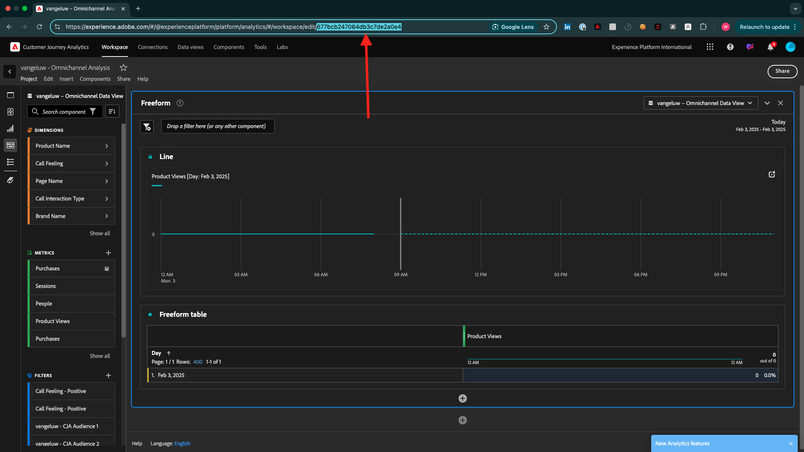

# Hur mäts Slutförande?

Gå till [https://certification.adobe.com](https://certification.adobe.com) och gå till kursen **XXX**.

För att slutföra en modul måste du tillhandahålla ett bevis på att du är klar.

Nedan visas det förväntade korrekturet för varje modul.

## Komma igång

Det förväntade slutförandebeviset för modulen **Komma igång** är ID:t för det demosystemprojekt för webben som du har skapat.

ID:t för Demo System-projektet för webbformat ser ut så här: `--demoProfileLdap-- - OCUC`.

## 1.1 Adobe Experience Platform Data Collection och Web SDK-tillägget

Det förväntade slutförandebeviset för modulen **Datainsamling och Web SDK** är namnet på datainsamlingsegenskapen för webben.

Namnet på datainsamlingsegenskapen för webbformat ser ut så här: `--demoProfileLdap-- - Demo System (05/02/2022) (enablement) 1644046719474`.

## 1.2 Datainmatning

Det förväntade beviset på slutförande för modulen **Datainmatning** är datauppsättnings-ID:t för de två datauppsättningar som du har skapat.

Datauppsättnings-ID-formatet ser ut så här: **5f069724723ef41916a8b5d2**.

`--demoProfileLdap-- - Demo System - Event Dataset for Website`

`--demoProfileLdap-- - Demo System - Profile Dataset for Website`

## 1.3 Sammansatt målgrupp

Det förväntade slutförandebeviset för modulen **Federated Audience Composition** är...

## 2.1 Kundprofil i realtid

Förväntat slutförandebevis för modulen **Kundprofil i realtid** är **Segment-ID** för segmentet som du skapade via gränssnittet `--demoProfileLdap-- - Male customers with interest in Montana Wind Jacket`.

Formatet för segment-ID ser ut så här: **8cb7034d-d4ae-4d26-a61f-a76559c12457**.

## 2.2 Intelligenta tjänster

Det förväntade beviset på slutförande för modulen **Intelligenta tjänster** är ID:t för din **Kundtjänst för produktinköpsförmån**.

Formatet ser ut så här: **12729** och du kan hämta det från URL:en när du har öppnat tjänsten.

## 2.3 Real-Time CDP: Bygg en målgrupp och agera!

Det förväntade slutförandebeviset för modulen **Real-Time CDP** är ID:t för din **Adobe Target-aktivitet**.

Formatet ser ut så här: **11804**.

## 2.4 Real-Time CDP: Audience Activation till Microsoft Azure Event Hub

Det förväntade slutförandebeviset för modulen **RTCDP: EventHub** är ID:t för ditt **Microsoft Azure Event Hub**-mål i Adobe Experience Platform.

Du hittar **Microsoft Azure Event Hub Mål-ID**, som ser ut så här: **fa3f7ce5-86fd-4096-bf7c-e586fdc096ba**:

## 2.5 Real-Time CDP Connections: Event Forwarding

Det förväntade slutförandebeviset för modulen **RTCDP-anslutningar** är ditt **Egenskap-ID för vidarebefordran av händelse**.

Du hittar egenskaps-ID:t **för vidarebefordran av händelser**, som ser ut så här: **PR40f44184c88472e9c19d8d602aab0de**:

## 2.6 Strömma data från Apache Kafka till Real-Time CDP

Det förväntade slutförandebeviset för modulen **Apache Kafka** är ID:t för din källanslutning `--demoProfileLdap-- - Kafka`.

ID:t ser ut så här: **f843d50a-ee30-4ca8-a766-0e4f3d29a2f7**:

## 3.1 Adobe Journey Optimizer: Orchestration

Förväntat slutförandebevis för modulen **AJO: Orchestration** är eventID för din `--demoProfileLdap--AccountCreationEvent`.

Formatet ser ut så här: **227402c540eb8f8855c6b2333adf6d54d7153d9d7d56fa475a686081c5 74736** .

## 3.2 Adobe Journey Optimizer: Externa datakällor och anpassade åtgärder

Förväntat slutförandebevis för modulen **AJO: Anpassade åtgärder** är eventID för händelsen `--demoProfileLdap--GeofenceEntry`.

Formatet ser ut så här: **fa42ab7982ba55f039eacec24c1e32e5c51b310c67f0fa559ab49b89b63f493 4**.

## 3.3 Adobe Journey Optimizer: Offer decisioning

Det förväntade slutförandebeviset för modulen **AJO: Erbjudanden** är ID:t för det **Erbjudandebeslut** som du skapade.

Du hittar ID:t för **erbjudandebeslutet**, som ser ut så här **xcore:offer-activity:1122fcc4603ea499**, här:

## 3.4 Adobe Journey Optimizer: Händelsebaserade resor

Förväntat slutförandebevis för modulen **AJO: Events** är eventID för din `--demoProfileLdap--StoreEntryEvent`.

Formatet ser ut så här: **e3a8f0bdc0b609667cd96a72a6b1e5aafa0ddaf6ccf121c574e6a2030860a63**.

## 4.1 Customer Journey Analytics: Bygg en kontrollpanel med Analysis Workspace

Det förväntade slutförandebeviset för modulen **CJA** är ID:t för ditt projekt `--demoProfileLdap-- - Omnichannel Analysis`.

Formatet ser ut så här: **6217344f6249ac70c726db60**. Du hittar det i URL:en när du har öppnat ditt projekt.

## 4.2 Customer Journey Analytics: Importera och analysera data från Google Analytics i Adobe Experience Platform med BigQuery Source Connector

Förväntat slutförandebevis för modulen **CJA: BigQuery** är ID:t för din **BigQuery**-anslutning.

Du hittar **BigQuery Connection ID**, som ser ut så här: **85a2394d-8b94-410c-a239-4d8b94b10c38**:

## 5.1 Query Service

Det förväntade slutförandebeviset för modulen **Query Service** är datauppsättnings-ID för din `--demoProfileLdap--_callcenter_interaction_analysis` - datauppsättning som du får när du har slutfört modulen.

Formatet ser ut så här: **62076f68f14a9d194995d4e2**.

[Gå tillbaka till Alla moduler](./overview.md)
