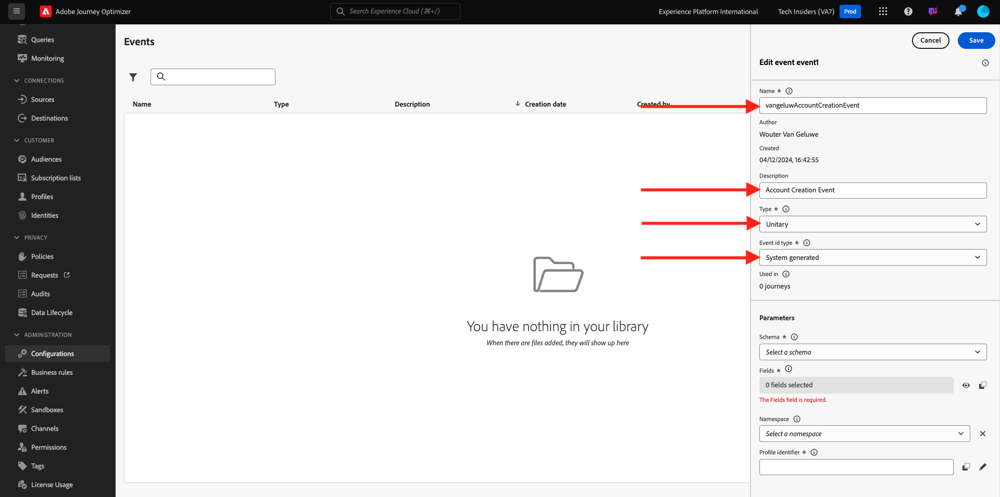

# 3.1.1 Skapa en händelse

Logga in på Adobe Journey Optimizer på [Adobe Experience Cloud](https://experience.adobe.com). Klicka på **Journey Optimizer**.

Du omdirigeras till vyn **Hem** i Journey Optimizer. Kontrollera först att du använder rätt sandlåda. Sandlådan som ska användas kallas `--aepSandboxName--`.

Bläddra nedåt på den vänstra menyn och klicka på **Konfigurationer**. Klicka sedan på knappen **Hantera** under **Händelser**.

Därefter visas en översikt över alla tillgängliga händelser. Klicka på **Skapa händelse** för att börja skapa en egen händelse.

Ett nytt, tomt händelsefönster öppnas sedan.

Först och främst ger du evenemanget ett namn som detta: `--aepUserLdap--AccountCreationEvent`.
Ange beskrivningen till `Account Creation Event`, kontrollera att **Type** är inställd på **Unitary** och välj **System Generated** för valet **Event ID Type**.

Nästa steg är schemavalet. Använd schemat `Demo System - Event Schema for Website (Global v1.1) v.1`.

När du har valt schemat visas ett antal fält som markeras i avsnittet **Nyttolast**. Du bör nu hovra över avsnittet **Nyttolast** så visas 3 ikoner-popup. Klicka på ikonen **Redigera** .

Du kommer att se en popup-meny i fönstret **Fält** där du måste markera några fält som vi behöver för att anpassa e-postmeddelandet.  Vi väljer andra profilattribut senare med de data som redan finns i Adobe Experience Platform.

I objektet `--aepTenantId--.demoEnvironment` måste du markera fälten **brandLogo** och **brandName**.

Markera fältet **email** i objektet `--aepTenantId--.identification.core`. Klicka på **OK** om du vill spara ändringarna.

Du borde se det här då. Ange **Namespace** som **ECID (ECID)**. Klicka på **Spara**.

Din händelse är nu konfigurerad och sparad.

Klicka på aktiviteten igen för att öppna skärmen **Redigera händelse** igen. Håll pekaren över fältet **Nyttolast** igen för att se de tre ikonerna igen. Klicka på ikonen **Visa nyttolast** .

Nu visas ett exempel på den förväntade nyttolasten.

Händelsen har ett unikt ID för Orchestration-händelse som du kan hitta genom att rulla nedåt i nyttolasten tills du ser `_experience.campaign.orchestration.eventID`.

Händelse-ID är det som måste skickas till Adobe Experience Platform för att utlösa den resa som du ska bygga härnäst. Kom ihåg detta eventID, som du kommer att behöva det i någon av de följande övningarna.
`"eventID": "5ae9b8d3f68eb555502b0c07d03ef71780600c4bd0373a4065c692ae0bfbd34d"`

Klicka på **OK**.

Klicka på **Avbryt**.

Du har nu avslutat den här övningen.

Nästa steg: [3.1.2 Skapa fragment som ska användas i meddelandet](./ex2.md)

[Gå tillbaka till modul 3.1](./journey-orchestration-create-account.md)

[Gå tillbaka till Alla moduler](../../../overview.md)
