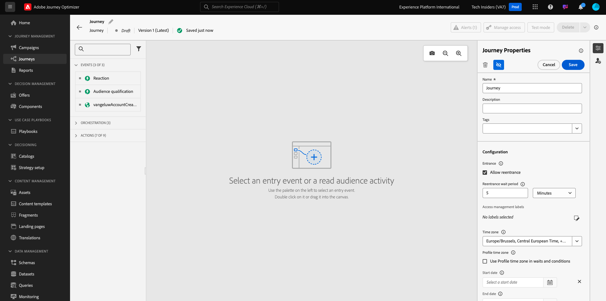
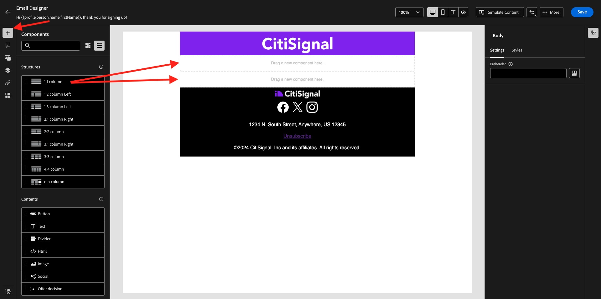
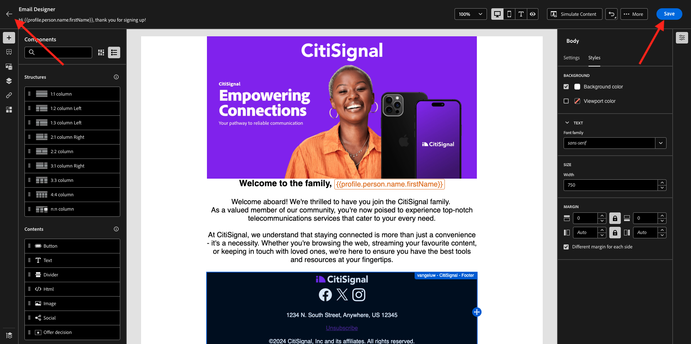

# 3.1.2 Skapa din resa och ditt e-postmeddelande

I den här övningen ska du konfigurera resan och det meddelande som ska utlösas när någon skapar ett konto på demowebbplatsen.

Logga in på Adobe Journey Optimizer på [Adobe Experience Cloud](https://experience.adobe.com). Klicka på **Journey Optimizer**.

Du omdirigeras till vyn **Hem** i Journey Optimizer. Kontrollera först att du använder rätt sandlåda. Sandlådan som ska användas kallas `--aepSandboxName--`. Om du vill ändra från en sandlåda till en annan klickar du på **PRODUKTIONSprodukt (VA7)** och väljer sandlådan i listan. I det här exemplet heter sandlådan **AEP Enablement FY22**. Du kommer sedan att vara i vyn **Hem** i din sandlåda `--aepSandboxName--`.

## 3.1.2.1 Skapa din resa

Klicka på **Resor** på den vänstra menyn. Klicka sedan på **Skapa resa** för att skapa en ny resa.

Då ser du en tom skärm för resan.

I föregående övning skapade du en ny **Event**. Du gav den ett namn som detta `ldapAccountCreationEvent` och ersatte `ldap` med din ldap. Detta var resultatet av händelseskapandet:

Du måste nu ta det här evenemanget som början på den här resan. Du kan göra detta genom att gå till vänster på skärmen och söka efter händelsen i listan med händelser.

Markera händelsen, dra och släpp den på arbetsytan på resan. Din resa ser nu ut så här:

Som det andra steget i resan måste du lägga till ett kort **Vänta**-steg. Gå till vänster på skärmen till avsnittet **Orchestration** om du vill hitta det här. Du kommer att använda profilattribut och måste se till att de är ifyllda i kundprofilen i realtid.

Din resa ser nu ut så här. Till höger på skärmen måste du konfigurera väntetiden. Ställ in den på 1 minut. Detta ger mycket tid för profilattributen att vara tillgängliga när händelsen har utlösts.

Klicka på **OK** om du vill spara ändringarna.

Som det tredje steget på resan måste du lägga till en **e-poståtgärd**. Gå till vänster på skärmen till **Åtgärder**, välj åtgärden **E-post** och dra och släpp den på den andra noden på resan. Nu ser du det här.

Ange **kategorin** till **Marknadsföring** och välj en e-postyta som gör att du kan skicka e-post. I det här fallet är e-postytan som ska väljas **E-post**. Kontrollera att kryssrutorna för **klick på e-post** och **e-post** är aktiverade.

Nästa steg är att skapa ett meddelande. Det gör du genom att klicka på **Redigera innehåll**.

## 3.1.2.2 Skapa ett meddelande

Klicka på **Redigera innehåll** om du vill skapa ditt meddelande.

Nu ser du det här.

Klicka på textfältet **Ämnesrad**.

Börja skriva **Hi** i textområdet

Ämnesraden är inte färdig än. Därefter måste du hämta en personaliseringstoken för fältet **Förnamn** som lagras under `profile.person.name.firstName`. Bläddra nedåt i den vänstra menyn för att hitta elementet **Person** och klicka på pilen för att gå en nivå längre ned.

Leta reda på elementet **Fullständigt namn** och klicka på pilen för att gå en högre nivå.

Leta reda på fältet **Förnamn** och klicka på **+** bredvid det. Sedan visas personaliseringstoken i textfältet.

Lägg sedan till texten **, tack för att du registrerar dig!**. Klicka på **Spara**.

Du kommer då tillbaka hit. Klicka på **E-posta Designer** för att skapa e-postens innehåll.

På nästa skärm får du tre olika metoder för att ange e-postens innehåll:

- **Designa från grunden**: Börja med en tom arbetsyta och använd WYSIWYG-redigeraren för att dra och släppa struktur och innehållskomponenter för att visuellt bygga upp e-postens innehåll.
- **Koda din egen**: Skapa en egen e-postmall genom att koda den med HTML
- **Importera HTML**: Importera en befintlig HTML-mall som du kan redigera.

Klicka på **Skapa från grunden**.

På den vänstra menyn hittar du de strukturkomponenter som du kan använda för att definiera e-postmeddelandets struktur (rader och kolumner).

Dra och släpp en **1:2-kolumn till vänster** från menyn på arbetsytan. Detta blir platshållare för logotypbilden.

Dra och släpp en **1:1-kolumn** under den föregående komponenten. Det här blir banderollblocket.

Dra och släpp en **1:2-kolumn till vänster** under den föregående komponenten. Det här blir det faktiska innehållet med en bild på vänster sida och text på höger sida.

Dra och släpp en **1:1-kolumn** under den föregående komponenten. Det här blir e-postsidfoten. Arbetsytan bör nu se ut så här:

Sedan använder vi Innehållskomponenter för att lägga till innehåll i dessa block. Klicka på menyalternativet **Innehållskomponenter**

Dra och släpp en **bild**-komponent i den första cellen på den första raden. Klicka på **Bläddra**.

Då ser du det här. Navigera till mappen **enablement-assets** och markera filen **luma-logo.png**. Klicka på **Markera**.

Nu är du tillbaka här:

Gå till **Innehållskomponenter** och dra och släpp en **Bild** -komponent i den första cellen på den första raden. Klicka på **Bläddra**.

Gå till mappen **enablement-assets** i popup-fönstret **Assets** . I den här mappen hittar du alla resurser som tidigare har förberetts och överförts av det kreativa teamet. Välj **module23-thankyou-new.png** och klicka på **Select**.

Då får du den här:

Markera bilden och rulla nedåt i den högra menyn tills du ser **Storlek**-breddreglagekomponenten. Använd reglaget för att ändra bredden till f.i. **60%**.

Gå sedan till **Innehållskomponenter** och dra och släpp en **Text** -komponent i strukturkomponenten på den fjärde raden.

Välj standardtexten **Skriv texten här.** som du skulle göra med en textredigerare. Skriv **Bästa** i stället. Lägg märke till att textverktygsfältet visas när du är i textläge.

Klicka på ikonen **Lägg till anpassning** i verktygsfältet.

Därefter måste du hämta en **förnamn**-personaliseringstoken som lagras under `profile.person.name.firstName`. Leta reda på elementet **Person** på menyn, gå ned till elementet **Fullständigt namn** och klicka sedan på ikonen **+** för att lägga till fältet Förnamn i uttrycksredigeraren.

Klicka på **Spara**.

Nu kommer du att märka hur personaliseringsfältet har lagts till i texten.

I samma textfält trycker du på **Enter** två gånger för att lägga till två rader och skriva **Tack för att du har skapat ditt konto med Luma!**.

Den sista kontrollen som utförs för att se till att e-postmeddelandet är klart är att förhandsgranska det. Klicka på knappen **Simulera innehåll** .

Börja med att identifiera vilken profil du vill använda för förhandsgranskningen. Markera namnutrymmet **email** genom att klicka på ikonen bredvid fältet **Ange ID-namnområde**.

Markera namnutrymmet **E-post** i listan med identitetsnamnutrymmen.

I fältet **Identitetsvärde** anger du e-postadressen för en tidigare demoprofil som redan finns lagrad i kundprofilen i realtid. Till exempel **woutervangeluwe+06022022-01@gmail.com** och klicka på knappen **Sök efter testprofil**

När din profil visas i tabellen klickar du på fliken **Förhandsgranska** för att öppna förhandsvisningsskärmen.

När förhandsgranskningen är klar kontrollerar du att personaliseringen är korrekt på ämnesraden, att både brödtexten och avprenumerationslänken är markerade som en hyperlänk.

Klicka på **Stäng** för att stänga förhandsgranskningen.

Klicka på **Spara** för att spara meddelandet.

Gå tillbaka till meddelandekontrollpanelen genom att klicka på **pilen** intill ämnesraden i det övre vänstra hörnet.

Du har nu skapat e-postmeddelandet med din registrering. Klicka på pilen i det övre vänstra hörnet för att gå tillbaka till din resa.

Klicka på **OK**.

## 3.1.2.3 Publish din resa

Du måste fortfarande ge din resa ett namn. Du kan göra det genom att klicka på ikonen **Egenskaper** längst upp till höger på skärmen.

Du kan sedan ange resans namn här. Använd `--aepUserLdap-- - Account Creation Journey`. Klicka på **OK** om du vill spara ändringarna.

Nu kan du publicera din resa genom att klicka på **Publish**.

Klicka på **Publish** igen.

Då visas ett grönt bekräftelsefält som anger att din resa nu är publicerad.

Du har nu avslutat den här övningen.

Nästa steg: [3.1.3 Uppdatera din datainsamlingsegenskap och testa din resa](./ex3.md)

[Gå tillbaka till modul 3.1](./journey-orchestration-create-account.md)

[Gå tillbaka till Alla moduler](../../../overview.md)
