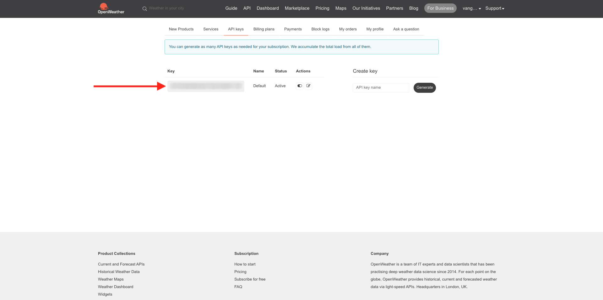

# 3.2.2 Definiera en extern datakälla

I den här övningen skapar du en anpassad extern datakälla genom att använda Adobe Journey Optimizer.

Logga in på Adobe Journey Optimizer på [Adobe Experience Cloud](https://experience.adobe.com). Klicka på **Journey Optimizer**.


Du omdirigeras till vyn **Hem** i Journey Optimizer. Kontrollera först att du använder rätt sandlåda. Sandlådan som ska användas kallas `--aepSandboxName--`. Om du vill ändra från en sandlåda till en annan klickar du på **PRODUKTIONSprodukt (VA7)** och väljer sandlådan i listan. I det här exemplet heter sandlådan **AEP Enablement FY22**. Du kommer sedan att vara i vyn **Hem** i din sandlåda `--aepSandboxName--`.


Bläddra nedåt på den vänstra menyn och klicka på **Konfigurationer**. Klicka sedan på knappen **Hantera** under **Datakällor**.


Sedan visas listan **Datakällor**.
Klicka på **Skapa data-Source** för att börja lägga till din datakälla.


En tom popup-meny för datakälla visas.


Innan du kan börja konfigurera det här behöver du ett konto för tjänsten **Open Weather Map**. Följ de här stegen för att skapa ditt konto och hämta API-nyckeln.

Gå till [https://openweathermap.org/](https://openweathermap.org/). Klicka på **Logga in** på hemsidan.


Klicka på **Skapa ett konto**.


Fyll i detaljerna.


Klicka på **Skapa konto**.


Du omdirigeras sedan till din kontosida.


Klicka på **API-nycklar** på menyn för att hämta API-nyckeln som du måste konfigurera din anpassade externa datakälla för.



En **API-nyckel** ser ut så här: `b2c4c36b6bb59c3458d6686b05311dc3`.

Du hittar **API-dokumentationen** för **Aktuellt väder** [här](https://openweathermap.org/current).

I vårt fall kommer vi att implementera kopplingen till Open Weather Map baserat på den stad kunden är i.


Gå tillbaka till **Adobe Journey Optimizer**, till den tomma popup-menyn **Externa data i Source**.


Använd `--aepUserLdap--WeatherApi` som namn för datakällan. I det här exemplet är datakällans namn `vangeluwWeatherApi `.

Ange Beskrivning till: `Access to the Open Weather Map`.

URL:en för Open Weather Map API är: **http://api.openweathermap.org/data/2.5/weather?units=metric**


Därefter måste du välja den autentisering som ska användas.

Använd dessa variabler:

| Fält | Värde |
|:-----------------------:| :-----------------------|
| Typ | **API-nyckel** |
| Namn | **APPID** |
| Värde | **din API-nyckel** |
| Plats | **Frågeparameter** |


Slutligen måste du definiera en **FieldGroup**, vilket i princip är den begäran du skickar till väder-API:t. I vårt fall vill vi använda namnet på staden för att begära Aktuellt väder för den staden.


Enligt Weather API-dokumentationen måste vi skicka en parameter `q=City`.


För att matcha förväntad API-begäran konfigurerar du FieldGroup enligt följande:

>[!IMPORTANT]
>
>Fältgruppnamnet måste vara unikt. Använd den här namnkonventionen: `--aepUserLdap--WeatherByCity` så i det här fallet ska namnet vara `vangeluwWeatherByCity`


För svarsnyttolasten måste du klistra in ett exempel på det svar som ska skickas av väder-API:t.

Du hittar det förväntade API JSON-svaret på API-dokumentationssidan [här](https://openweathermap.org/current).


Du kan också kopiera JSON-svaret härifrån:

```json
{"coord": { "lon": 139,"lat": 35},
  "weather": [
    {
      "id": 800,
      "main": "Clear",
      "description": "clear sky",
      "icon": "01n"
    }
  ],
  "base": "stations",
  "main": {
    "temp": 281.52,
    "feels_like": 278.99,
    "temp_min": 280.15,
    "temp_max": 283.71,
    "pressure": 1016,
    "humidity": 93
  },
  "wind": {
    "speed": 0.47,
    "deg": 107.538
  },
  "clouds": {
    "all": 2
  },
  "dt": 1560350192,
  "sys": {
    "type": 3,
    "id": 2019346,
    "message": 0.0065,
    "country": "JP",
    "sunrise": 1560281377,
    "sunset": 1560333478
  },
  "timezone": 32400,
  "id": 1851632,
  "name": "Shuzenji",
  "cod": 200
}
```

Kopiera JSON-svaret ovan till Urklipp och gå sedan till konfigurationsskärmen för din anpassade datakälla.

Klicka på ikonen **Redigera nyttolast** .


Du ser ett popup-fönster där du nu måste klistra in ovanstående JSON-svar.


Klistra in ditt JSON-svar, därefter ser du detta. Klicka på **Spara**.


Din anpassade konfiguration av datakälla är nu klar. Bläddra uppåt och klicka på **Spara**.


Datakällan har skapats och ingår i listan **Datakällor**.


Nästa steg: [3.2.3 Definiera en anpassad åtgärd](./ex3.md)

[Gå tillbaka till modul 3.2](journey-orchestration-external-weather-api-sms.md)

[Gå tillbaka till Alla moduler](../../../overview.md)
