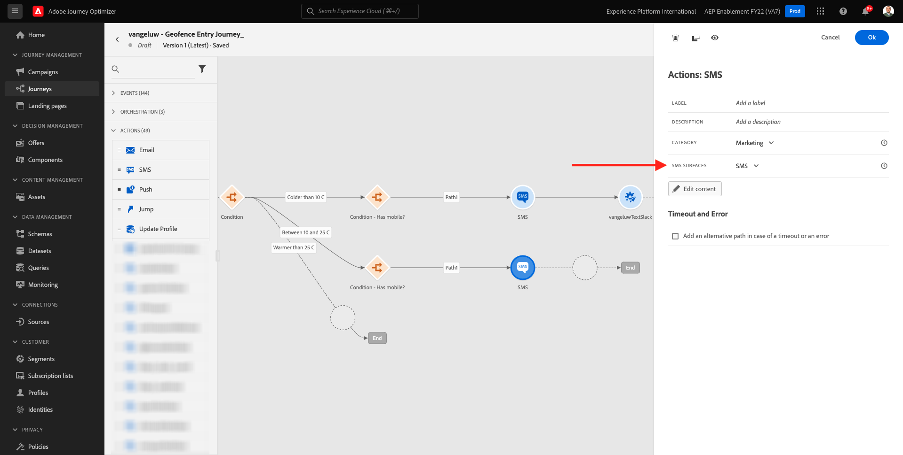
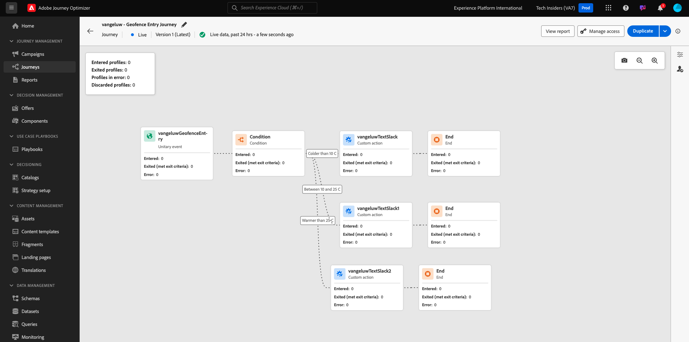

# 3.2.4 Skapa din resa och dina meddelanden

I den här övningen skapar du en resa och flera textmeddelanden genom att använda Adobe Journey Optimizer.

I det här fallet är målet att skicka olika SMS-meddelanden baserat på väderförhållandena för var kunden befinner sig. Tre scenarier har definierats:

- Färre än 10° Celsius
- Mellan 10° och 25° Celsius
- Varmare än 25° Celsius

För dessa tre villkor måste du definiera tre SMS-meddelanden i Adobe Journey Optimizer.

## 3.2.4.1 Skapa din resa

Logga in på Adobe Journey Optimizer på [Adobe Experience Cloud](https://experience.adobe.com). Klicka på **Journey Optimizer**.


Du omdirigeras till vyn **Hem** i Journey Optimizer. Kontrollera först att du använder rätt sandlåda. Sandlådan som ska användas kallas `--aepSandboxName--`. Om du vill ändra från en sandlåda till en annan klickar du på **PRODUKTIONSprodukt (VA7)** och väljer sandlådan i listan. I det här exemplet heter sandlådan **AEP Enablement FY22**. Du kommer sedan att vara i vyn **Hem** i din sandlåda `--aepSandboxName--`.


Gå till **Resor** på den vänstra menyn och klicka på **Skapa resa** för att börja skapa din resa.


Du bör i förväg namnge din resa.

Använd `--aepUserLdap-- - Geofence Entry Journey` som namn för resan. I det här exemplet är resenamnet `vangeluw - Geofence Entry Journey`. Inga andra värden måste anges för tillfället. Klicka på **OK**.


Titta på **Händelser** till vänster på skärmen. Du bör se den händelse du skapade tidigare i den listan. Markera den och dra den sedan och släpp den på arbetsytan. Din resa ser då ut så här. Klicka på **OK**.


Klicka sedan på **Orchestration**. Nu ser du de tillgängliga **Orchestration**-funktionerna. Välj **Villkor** och dra och släpp det på arbetsytan på resan.


Nu måste du definiera tre villkor:

- Den är kallare än 10° Celsius
- Den är mellan 10° och 25° Celsius
- Det är varmare än 25° Celsius

Vi definierar det första villkoret.

### Villkor 1: Färger än 10° Celsius

Klicka på **Villkor**.  Klicka på **Sökväg1** och redigera namnet på sökvägen till **Färg än 10 C**. Klicka på ikonen **Redigera** för uttrycket för Path1.


Du ser då en tom skärm i **Enkel redigerare**. Din fråga kommer att vara lite mer avancerad, så du behöver **avancerat läge**. Klicka på **Avancerat läge**.


Du kommer då att se **Avancerad redigerare** som tillåter kodinmatning.


Markera nedanstående kod och klistra in den i **Avancerad redigerare**.

`#{--aepUserLdap--WeatherApi.--aepUserLdap--WeatherByCity.main.temp} <= 10`

Då ser du det här.


För att kunna ta reda på temperaturen som en del av detta villkor måste du ange i vilken stad kunden befinner sig.
**City** måste länkas till den dynamiska parametern `q`, precis som vi såg tidigare i Open Weather API-dokumentationen.

Klicka på fältet **dynamiskt val: q** som anges i skärmbilden.


Sedan måste du hitta fältet som innehåller kundens aktuella ort i någon av de tillgängliga datakällorna.


Du kan hitta fältet genom att gå till `--aepUserLdap--GeofenceEntry.placeContext.geo.city`.

Genom att klicka på det fältet läggs det till som dynamiskt värde för parametern `q`. Det här fältet fylls i med till exempel den geopositioneringstjänst som du har implementerat i din mobilapp. I så fall simulerar vi detta med administrationskonsolen på demowebbplatsen. Klicka på **OK**.


### Villkor 2: 10-25° Celsius

När du har lagt till det första villkoret visas den här skärmen. Klicka på **Lägg till sökväg**.


Dubbelklicka på **Sökväg1** och redigera sökvägen till **Mellan 10 och 25 C**. Klicka på ikonen **Redigera** för uttrycket med den här sökvägen.


Du ser då en tom skärm i **Enkel redigerare**. Din fråga kommer att vara lite mer avancerad, så du behöver **avancerat läge**. Klicka på **Avancerat läge**.


Du kommer då att se **Avancerad redigerare** som tillåter kodinmatning.


Markera nedanstående kod och klistra in den i **Avancerad redigerare**.

`#{--aepUserLdap--WeatherApi.--aepUserLdap--WeatherByCity.main.temp} > 10 and #{--aepUserLdap--WeatherApi.--aepUserLdap--WeatherByCity.main.temp} <= 25`

Då ser du det här.


För att kunna hämta temperaturen som en del av detta villkor måste du ange i vilken stad kunden befinner sig.
**City** måste länkas till den dynamiska parametern **q**, precis som vi såg tidigare i Open Weather API-dokumentationen.

Klicka på fältet **dynamiskt val: q** som anges i skärmbilden.


Sedan måste du hitta fältet som innehåller kundens aktuella ort i någon av de tillgängliga datakällorna.


Du kan hitta fältet genom att gå till `--aepUserLdap--GeofenceEntry.placeContext.geo.city`. Genom att klicka på det fältet läggs det till som dynamiskt värde för parametern **q**. Det här fältet fylls i med till exempel den geopositioneringstjänst som du har implementerat i din mobilapp. I så fall simulerar vi detta med administrationskonsolen på demowebbplatsen. Klicka på **OK**.


Sedan lägger du till det tredje villkoret.

### Villkor 3: Varmare än 25° Celsius

När du har lagt till det andra villkoret visas den här skärmen. Klicka på **Lägg till sökväg**.


Dubbelklicka på Path1 om du vill ändra namnet till **Varmare än 25 C**.
Klicka sedan på ikonen **Redigera** för uttrycket som den här sökvägen gäller.


Du ser då en tom skärm i **Enkel redigerare**. Din fråga kommer att vara lite mer avancerad, så du behöver **avancerat läge**. Klicka på **Avancerat läge**.


Du kommer då att se **Avancerad redigerare** som tillåter kodinmatning.


Markera nedanstående kod och klistra in den i **Avancerad redigerare**.

`#{--aepUserLdap--WeatherApi.--aepUserLdap--WeatherByCity.main.temp} > 25`

Då ser du det här.


För att kunna hämta temperaturen som en del av detta villkor måste du ange i vilken stad kunden befinner sig.
**City** måste länkas till den dynamiska parametern **q**, precis som vi såg tidigare i Open Weather API-dokumentationen.

Klicka på fältet **dynamiskt val: q** som anges i skärmbilden.


Sedan måste du hitta fältet som innehåller kundens aktuella ort i någon av de tillgängliga datakällorna.


Du kan hitta fältet genom att gå till ```--aepUserLdap--GeofenceEntry.placeContext.geo.city```. Genom att klicka på det fältet läggs det till som dynamiskt värde för parametern **q**. Det här fältet fylls i med till exempel den geopositioneringstjänst som du har implementerat i din mobilapp. I så fall simulerar vi detta med administrationskonsolen på demowebbplatsen. Klicka på **OK**.


Du har nu tre konfigurerade sökvägar. Klicka på **OK**.


Eftersom det här är en resa för inlärningsändamål kommer vi nu att konfigurera några åtgärder för att visa upp de olika alternativ som marknadsförare nu behöver för att leverera meddelanden.

## 3.2.4.2 Skicka meddelanden för sökväg: Färre än 10° Celsius

För varje temperatursammanhang försöker vi skicka ett sms till kunden. Vi kan bara skicka ett SMS om vi har ett mobilnummer tillgängligt för en kund, så vi måste först bekräfta att vi har det.

Vi fokuserar på **Kolder än 10 C**.


Låt oss ta ett annat **Condition** -element och dra det enligt skärmbilden nedan. Vi kommer att verifiera om det finns ett mobilnummer tillgängligt för den här kunden.


Eftersom detta bara är ett exempel konfigurerar vi bara alternativet där kunden har ett mobilnummer tillgängligt. Lägg till etiketten **Har mobil?**.

Klicka på ikonen **Redigera** för uttrycket för sökvägen **Path1**.


Navigera till **ExperiencePlatform.ProfileFieldGroup.profile.mobilePhone.number** i de datakällor som visas till vänster. Du läser nu mobiltelefonnumret direkt från Adobe Experience Platform kundprofil i realtid.


Markera fältet **Nummer** och dra och släpp det på villkorsarbetsytan.

Markera operatorn **som inte är tom**. Klicka på **OK**.


Då ser du det här. Klicka på **OK** igen.


Din resa kommer då att se ut så här. Klicka på **Åtgärder** enligt skärmbilden.


Välj åtgärden **SMS** och dra och släpp den efter villkoret som du just lade till.


Ange **kategori** till **marknadsföring** och välj en SMS-yta som gör att du kan skicka SMS. I det här fallet är e-postytan som ska väljas **SMS**.


Nästa steg är att skapa ett meddelande. Det gör du genom att klicka på **Redigera innehåll**.


Nu visas meddelandekontrollpanelen, där du kan konfigurera texten i ditt SMS. Klicka på området **Disponera meddelande** för att skapa meddelandet.


Ange följande text: `Brrrr... {{profile.person.name.firstName}}, it's freezing. 20% discount on jackets today!`. Klicka på **Spara**.


Då ser du det här. Klicka på pilen i det övre vänstra hörnet för att gå tillbaka till din resa.


Du kommer då tillbaka hit. Klicka på **OK**.


Gå tillbaka till **Åtgärder** på den vänstra menyn, markera åtgärden `--aepUserLdap--TextSlack` och dra och släpp den sedan efter åtgärden **Meddelande** .


Gå till **åtgärdsparametrar** och klicka på ikonen **Redigera** för parametern `TEXTTOSLACK`.


Klicka på **Avancerat läge** i popup-fönstret.


Markera nedanstående kod, kopiera den och klistra in den i **redigeraren för avancerat läge**. Klicka på **OK**.

`"Brrrr..." + #{ExperiencePlatform.ProfileFieldGroup.profile.person.name.firstName} + " It's freezing. 20% discount on Jackets today!"`


Du kommer att se den slutförda åtgärden. Klicka på **OK**.


Den här vägen på resan är nu färdig.

## 3.2.4.3 Skicka meddelanden för sökväg: mellan 10° och 25° Celsius

För varje temperatursammanhang försöker vi skicka ett sms till kunden. Vi kan bara skicka ett SMS om vi har ett mobilnummer tillgängligt för en kund, så vi måste först bekräfta att vi har det.

Vi fokuserar på **Mellan 10 och 25 C**-sökvägar.


Låt oss ta ett annat **Condition** -element och dra det enligt skärmbilden nedan. Vi kommer att verifiera om det finns ett mobilnummer tillgängligt för den här kunden.


Eftersom detta bara är ett exempel konfigurerar vi bara alternativet där kunden har ett mobilnummer tillgängligt. Lägg till etiketten **Har mobil?**.

Klicka på ikonen **Redigera** för uttrycket för sökvägen **Path1**.


Navigera till **ExperiencePlatform.ProfileFieldGroup.profile.mobilePhone.number** i de datakällor som visas till vänster. Du läser nu mobiltelefonnumret direkt från Adobe Experience Platform kundprofil i realtid.


Markera fältet **Nummer** och dra och släpp det på villkorsarbetsytan.

Markera operatorn **som inte är tom**. Klicka på **OK**.


Då ser du det här. Klicka på **OK**.


Din resa kommer då att se ut så här. Klicka på **Åtgärder** enligt skärmbilden.


Välj åtgärden **SMS** och dra och släpp den efter villkoret som du just lade till.


Ange **kategori** till **marknadsföring** och välj en SMS-yta som gör att du kan skicka SMS. I det här fallet är e-postytan som ska väljas **SMS**.



Nästa steg är att skapa ett meddelande. Det gör du genom att klicka på **Redigera innehåll**.


Nu visas meddelandekontrollpanelen, där du kan konfigurera texten i ditt SMS. Klicka på området **Disponera meddelande** för att skapa meddelandet.


Ange följande text: `What a nice weather for the time of year, {{profile.person.name.firstName}} - 20% discount on Sweaters today!`. Klicka på **Spara**.


Då ser du det här. Klicka på pilen i det övre vänstra hörnet för att gå tillbaka till din resa.


Nu visas den slutförda åtgärden. Klicka på **OK**.


Gå tillbaka till **Åtgärder** på den vänstra menyn, markera åtgärden `--aepUserLdap--TextSlack` och dra och släpp den sedan efter åtgärden **Meddelande** .


Gå till **åtgärdsparametrar** och klicka på ikonen **Redigera** för parametern `TEXTTOSLACK`.


Klicka på **Avancerat läge** i popup-fönstret.


Markera nedanstående kod, kopiera den och klistra in den i **redigeraren för avancerat läge**. Klicka på **OK**.

`"What nice weather for the time of year, " + #{ExperiencePlatform.ProfileFieldGroup.profile.person.name.firstName} + " 20% discount on Sweaters today!"`


Du kommer att se den slutförda åtgärden. Klicka på **OK**.


Den här vägen på resan är nu färdig.

## 3.2.4.4 Skicka meddelanden för sökväg: Varmare än 25° Celsius

För varje temperatursammanhang försöker vi skicka ett sms till kunden. Vi kan bara skicka ett SMS om vi har ett mobilnummer tillgängligt för en kund, så vi måste först bekräfta att vi har det.

Vi fokuserar på **Varmare än 25 C**-sökvägar.


Låt oss ta ett annat **Condition** -element och dra det enligt skärmbilden nedan. Du kommer att verifiera om det finns ett mobilnummer tillgängligt för den här kunden.


Eftersom detta bara är ett exempel konfigurerar vi bara alternativet där kunden har ett mobilnummer tillgängligt. Lägg till etiketten **Har mobil?**.

Klicka på ikonen **Redigera** för uttrycket för sökvägen **Path1**.


Navigera till **ExperiencePlatform.ProfileFieldGroup.profile.mobilePhone.number** i de datakällor som visas till vänster. Du läser nu mobiltelefonnumret direkt från Adobe Experience Platform kundprofil i realtid.


Markera fältet **Nummer** och dra och släpp det på villkorsarbetsytan.

Markera operatorn **som inte är tom**. Klicka på **OK**.


Då ser du det här. Klicka på **OK**.


Din resa kommer då att se ut så här. Klicka på **Åtgärder** enligt skärmbilden.


Välj åtgärden **SMS** och dra och släpp den efter villkoret som du just lade till.


Ange **kategori** till **marknadsföring** och välj en SMS-yta som gör att du kan skicka SMS. I det här fallet är e-postytan som ska väljas **SMS**.


Nästa steg är att skapa ett meddelande. Det gör du genom att klicka på **Redigera innehåll**.


Nu visas meddelandekontrollpanelen, där du kan konfigurera texten i ditt SMS. Klicka på området **Disponera meddelande** för att skapa meddelandet.


Ange följande text: `So warm, {{profile.person.name.firstName}}! 20% discount on swimwear today!`. Klicka på **Spara**.


Då ser du det här. Klicka på pilen i det övre vänstra hörnet för att gå tillbaka till din resa.


Nu visas den slutförda åtgärden. Klicka på **OK**.


Gå tillbaka till **Åtgärder** på den vänstra menyn, markera åtgärden `--aepUserLdap--TextSlack` och dra och släpp den sedan efter åtgärden **Meddelanden**.


Gå till **åtgärdsparametrar** och klicka på ikonen **Redigera** för parametern `TEXTTOSLACK`.


Klicka på **Avancerat läge** i popup-fönstret.


Markera nedanstående kod, kopiera den och klistra in den i **redigeraren för avancerat läge**. Klicka på **OK**.

`"So warm, " + #{ExperiencePlatform.ProfileFieldGroup.profile.person.name.firstName} + "! 20% discount on swimwear today!"`


Du kommer att se den slutförda åtgärden. Klicka på **OK**.


Den här vägen på resan är nu färdig.

## 3.2.4.5 Publish din resa

Din resa är nu helt konfigurerad. Klicka på **Publish**.


Klicka på **Publish** igen.


Din resa är nu publicerad.



Nästa steg: [3.2.5 Utlösa din resa](./ex5.md)

[Gå tillbaka till modul 3.2](journey-orchestration-external-weather-api-sms.md)

[Gå tillbaka till Alla moduler](../../../overview.md)
