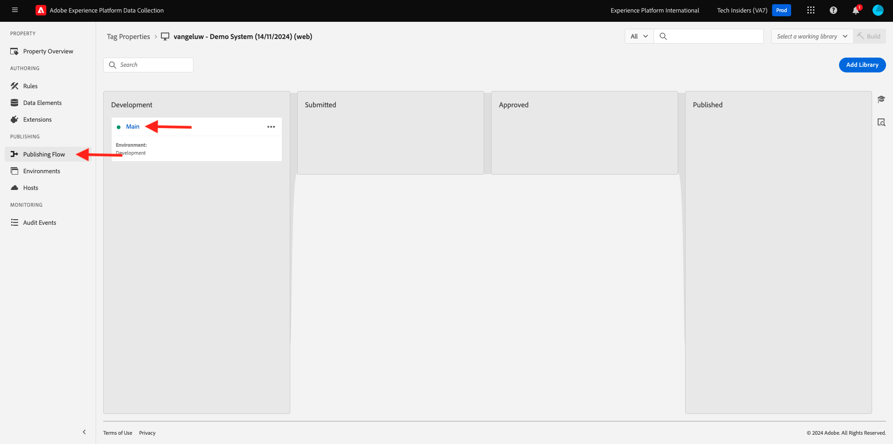

# 3.2.5 Utlösa din resa

I den här övningen ska du testa och utlösa den resa du konfigurerade i den här modulen.

## 3.2.5.1 Uppdatera konfigurationen för geofence-händelsen

Gå till [Adobe Experience Platform Data Collection](https://experience.adobe.com/launch/) och välj **Taggar**.

Det här är egenskapssidan för Adobe Experience Platform Data Collection som du såg tidigare.

I modul 0 skapade Demo System två klientegenskaper åt dig: en för webbplatsen och en för mobilappen. Sök efter dem genom att söka efter `--aepUserLdap--` i rutan **[!UICONTROL Search]**. Klicka för att öppna egenskapen **Webb**.

Då ser du det här.

Gå till **Regler** på den vänstra menyn och sök efter regeln **Geofence-händelse**. Klicka på regeln **Geofence-händelse** för att öppna den.

Då ser du detaljerna om den här regeln. Klicka för att öppna åtgärden **Skicka&quot;geofence-händelse&quot; till AEP - utlösa JO**.

Du kommer då att se att när den här åtgärden utlöses används ett specifikt dataelement för att definiera XDM-datastrukturen. Du måste uppdatera det dataelementet och du måste definiera **händelse-ID** för händelsen som du konfigurerade i [övning 8.1](./ex1.md).

Du måste nu uppdatera dataelementet **XDM - Geofence-händelse**. Gå till **Dataelement** om du vill göra det. Sök efter **XDM - Geofence Event** och öppna dataelementet genom att klicka.

Då ser du det här:

Navigera till fältet `_experience.campaign.orchestration.eventID`. Ta bort det aktuella värdet och klistra in ditt eventID där.

Händelse-ID:t finns i Adobe Journey Optimizer under **Konfigurationer > Händelser** och du hittar händelse-ID:t i exempelnyttolasten för din jämna, som ser ut så här: `"eventID": "fa42ab7982ba55f039eacec24c1e32e5c51b310c67f0fa559ab49b89b63f4934"`.

Därefter bör du definiera din stad i det här dataelementet. Gå till **placeContext > geo > city** och ange en valfri ort. Klicka sedan på **Spara** eller **Spara i bibliotek**.

Slutligen måste du publicera ändringarna. Gå till **Publiceringsflöde** på den vänstra menyn.

Klicka på **Lägg till alla ändrade resurser** och sedan på **Spara och skapa i utveckling**.

## 3.2.5.2 Utlösa din resa

Gå till [https://builder.adobedemo.com/projects](https://builder.adobedemo.com/projects). När du har loggat in med din Adobe ID ser du det här. Klicka på webbplatsprojektet för att öppna det.

Du kommer då att se din demowebbplats öppnas. Markera URL-adressen och kopiera den till Urklipp.

Öppna ett nytt inkognito-webbläsarfönster.

Klistra in webbadressen till demowebbplatsen, som du kopierade i föregående steg. Du ombeds sedan logga in med din Adobe ID.

Välj kontotyp och slutför inloggningsprocessen.

Därefter visas webbplatsen i ett inkognitivt webbläsarfönster. För varje demonstration måste du använda ett nytt, inkognitivt webbläsarfönster för att läsa in webbadressen till demowebbplatsen.

Klicka på logotypikonen för Adobe i det övre vänstra hörnet av skärmen för att öppna profilvisningsprogrammet.

Ta en titt på panelen Profilvisningsprogram och kundprofilen i realtid med **Experience Cloud ID** som primär identifierare för den okända kunden.

Gå till sidan Register/Login. Klicka på **SKAPA ETT KONTO**.

Fyll i dina uppgifter och klicka på **Registrera**. Sedan dirigeras du om till föregående sida.

Öppna profilvisarpanelen och gå till kundprofilen i realtid. På panelen Profilvisningsprogram ska du se alla dina personuppgifter visas, som dina nya e-post- och telefonidentifierare.

Klicka på **VERKTYG** på panelen Profilvisningsprogram. Ange `geofenceevent` och klicka på **Skicka**.

Några sekunder senare får du ett SMS från Adobe Journey Optimizer.

Nästa steg: [Sammanfattning och förmåner](./summary.md)

[Gå tillbaka till modul 3.2](journey-orchestration-external-weather-api-sms.md)

[Gå tillbaka till Alla moduler](../../../overview.md)
