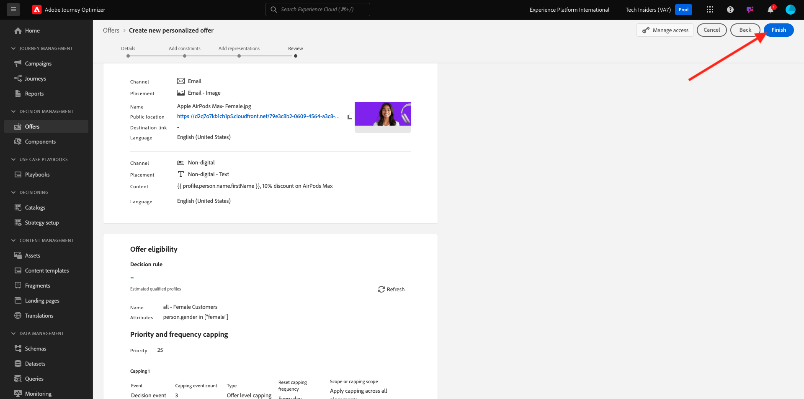
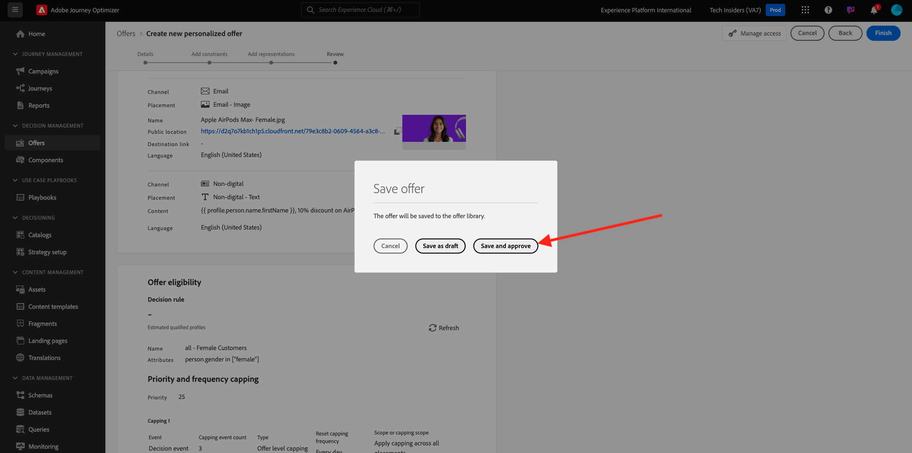

# 3.3.2 Konfigurera erbjudanden och beslut

## 3.3.2.1 Skapa personaliserade erbjudanden

I den här övningen skapar du fyra **Personaliserade erbjudanden**. Här följer de uppgifter som ska beaktas när erbjudandena skapas:

| Namn | Datumintervall | Bildlänk för e-post | Bildlänk för webben | Text | Prioritet | Kvalificering | Språk | Begränsningsfrekvens | Bildnamn |
|-----|------------|----------------------|--------------------|------|:--------:|--------------|:-------:|:-------:|:-------:|
| `--aepUserLdap-- - AirPods Max` | idag - 1 månad senare | https://bit.ly/4a9RJ5d | Välj från Assets Library | `{{ profile.person.name.firstName }}, 10% discount on AirPods Max` | 25 | alla - kvinnliga kunder | Engelska (USA) | 3 | Apple AirPods Max- Female.jpg |
| `--aepUserLdap-- - Galaxy S24` | idag - 1 månad senare | https://bit.ly/3W8yuDv | Välj från Assets Library | `{{ profile.person.name.firstName }}, 5% discount on Galaxy S24` | 15 | alla - kvinnliga kunder | Engelska (USA) | 3 | Galaxy S24 - Female.jpg |
| `--aepUserLdap-- - Apple Watch` | idag - 1 månad senare | https://bit.ly/4fGwfxX | https://bit.ly/4fGwfxX | `{{ profile.person.name.firstName }}, 10% discount on Apple Watch` | 25 | alla - Manliga kunder | Engelska (USA) | 3 | Apple Watch - Male.jpg |
| `--aepUserLdap-- - Galaxy Watch 7` | idag - 1 månad senare | https://bit.ly/4gTrkeo | Välj från Assets Library | `{{ profile.person.name.firstName }}, 5% discount on Galaxy Watch 7` | 15 | alla - Manliga kunder | Engelska (USA) | 3 | Galaxy Watch7 - Male.jpg |

{style="table-layout:auto"}

Logga in på Adobe Journey Optimizer på [Adobe Experience Cloud](https://experience.adobe.com). Klicka på **Journey Optimizer**.

Du omdirigeras till vyn **Hem** i Journey Optimizer. Kontrollera först att du använder rätt sandlåda. Sandlådan som ska användas kallas `--aepSandboxName--`. Du kommer sedan att vara i vyn **Hem** i din sandlåda `--aepSandboxName--`.

Klicka på **Erbjudanden** på den vänstra menyn och gå sedan till **Erbjudanden**. Klicka på **+ Skapa erbjudande**.

Du kommer då att se den här popup-rutan. Välj **Personaliserat erbjudande** och klicka på **Nästa**.

Du finns nu i vyn **Detaljer**.

I det här fallet måste du konfigurera erbjudandet `--aepUserLdap-- - AirPods Max`. Använd informationen i tabellen ovan för att fylla i fälten. I det här exemplet är namnet på det anpassade erbjudandet **vangeluw - AirPods Max**. Ange även **Startdatum och starttid** till idag och **Slutdatum och sluttid** till ett datum om en månad från och med nu.

När du är klar, borde du ha den här. Klicka på **Nästa**.

Då ser du det här:

Välj **Efter definierad beslutsregel** och klicka på ikonen **+** för att lägga till regeln **alla - kvinnliga kunder**.

Fyll i **Prioritet** enligt tabellen ovan. Klicka sedan på **+ Skapa begränsning** för att definiera hur många gånger det här erbjudandet kan visas för en kund.

Välj följande för capping:

- **Välj en klipphändelse**: **Beslutshändelse**
- **Taktyp**: **Per profil (använd begränsning för varje profil)**
- **Antal takthändelser**: **3**
- **Återställ taktfrekvens**: **Dagligen**
- **Var**: **1 dag**

Detta säkerställer att erbjudandet inte visas mer än 3 gånger per dag per kund.

Klicka på **Skapa**.

Du kommer då tillbaka hit. Klicka på **Nästa**.

Du måste nu skapa **representationer**. Representationer är en kombination av en **placering** och en verklig resurs.

För **Representation 1** väljer du:

- Kanal: Webb
- Placering: Webb - Bild
- Innehåll: URL
- Offentlig plats: kopiera URL:en från kolumnen **Bildlänk för webben** i tabellen ovan

Du kan också välja **Resursbibliotek** för innehållet och sedan klicka på **Bläddra**.

Därefter visas ett popup-fönster i Assets-biblioteket, gå till mappen **enablement-assets** och markera bildfilen **Apple AirPods Max - Honale.jpg**. Klicka sedan på **Markera**.

Då ser du det här. Klicka på **+ Lägg till representation**.

Välj **Representation 2**:

- Kanal: E-post
- Placering: E-post - bild
- Innehåll: URL
- Offentlig plats: välj **Resursbibliotek**. Klicka på **Bläddra**

Därefter visas ett popup-fönster i Assets-biblioteket, gå till mappen **enablement-assets** och markera bildfilen **Apple AirPods Max - Honale.jpg**. Klicka sedan på **Markera**.

Då ser du det här. Klicka sedan på **+ Lägg till representation**.

För **representation 3** väljer du:

- Kanal: Icke-digital
- Placement: Non-digital - Text

Sedan måste du lägga till innehåll. I det här fallet innebär det att du lägger till texten som ska användas som en uppmaning till åtgärd.

Välj **Egen** och klicka på **Lägg till innehåll**.

Du kommer då att se den här popup-rutan.

Titta på fältet **Text** från tabellen ovan och ange den texten här, i det här fallet: `{{ profile.person.name.firstName }}, 10% discount on AirPods Max`.

Du kommer också att märka att du kan välja valfritt profilattribut och inkludera det som ett dynamiskt fält i erbjudandetexten. I det här exemplet ser fältet `{{ profile.person.name.firstName }}` till att förnamnet på kunden som ska få erbjudandet inkluderas i erbjudandetexten.

Då ser du det här. Klicka på **Spara**.

Du har den här nu. Klicka på **Nästa**.

Därefter visas en översikt över ditt nya **personaliserade erbjudande**. Klicka på **Slutför**.

Klicka på **Spara och godkänn**.

Du kommer då att se att ditt nya personaliserade erbjudande blir tillgängligt i Översikt över erbjudanden:

Du bör nu upprepa stegen ovan för att skapa de tre andra personliga erbjudandena för de produkter du hittar i tabellen ovan.

När du är klar bör du visa alla dina erbjudanden på skärmen **Erbjud översikter** för **personaliserade erbjudanden**.

## 3.3.2.2 Skapa ett reserverbjudande

När du har skapat fyra anpassade erbjudanden bör du nu konfigurera ett **Reserverbjudande**.

Se till att du är i vyn **Erbjudanden**. Klicka på **+ Skapa erbjudande**.

Du kommer då att se den här popup-rutan. Välj **Reserverbjudande** och klicka på **Nästa**.

Då ser du det här. Ange det här namnet för ditt reserverbjudande: `--aepUserLdap-- - CitiSignal Fallback Offer`. Klicka på **Nästa**.

Du måste nu skapa **representationer**. Representationer är en kombination av en **placering** och en verklig resurs.

För **Representation 1** väljer du:

- **Kanal**: **Webb**
- **Placement**: **Webb - Bild**
- **Innehåll**: **Resursbibliotek**

Klicka på **Bläddra** för att välja bilden.

Därefter visas ett popup-fönster i Assets-biblioteket, gå till mappen **citi-signal-images** och välj bildfilen **App-Banner-Ad.jpg**. Klicka sedan på **Markera**.

Då ser du det här. Klicka på **+ Lägg till representation**.

Välj **Representation 2**:

- **Kanal**: **E-post**
- **Placement**: **Email - Image**
- **Innehåll**: **Resursbibliotek**

Klicka på **Bläddra** för att välja bilden.

Därefter visas ett popup-fönster i Assets-biblioteket, gå till mappen **citi-signal-images** och välj bildfilen **App-Banner-Ad.jpg**. Klicka sedan på **Markera**.

Då ser du det här. Klicka på **+ Lägg till representation**.

För **representation 3** väljer du:

- **Kanal**: **Icke-digital**
- **Placement**: **Icke-digital - text**
- **Innehåll**: **Egen**

Klicka på **Lägg till innehåll**.

Du kommer då att se den här popup-rutan. Ange texten `{{ profile.person.name.firstName }}, download the CitiSignal app now!` och klicka på **Spara**.

Då ser du det här. Klicka på **Nästa**.

Därefter visas en översikt över ditt nya **Reserverbjudande**. Klicka på **Slutför**.

Klicka slutligen på **Spara och godkänn**.

På skärmen **Erbjudandeöversikter** ser du nu följande:

## 3.3.2.3 Skapa din samling

En samling används för att **filtrera** ut en delmängd av erbjudanden från listan med personaliserade erbjudanden och använda den som en del av ett beslut för att snabba upp beslutsprocessen.

Gå till **Samlingar**. Klicka på **+ Skapa samling**.

Du kommer då att se den här popup-rutan. Konfigurera din samling så här. Klicka på **Nästa**.

- Samlingsnamn: använd `--aepUserLdap-- - CitiSignal Collection`
- Välj **Skapa statisk samling**.

Klicka på **Nästa**.

På nästa skärm väljer du de fyra **Personaliserade erbjudanden** som du skapade i föregående övning. Klicka på **Spara**.

Nu ser du det här:

## 3.3.2.4 Ta ett beslut

I ett beslut kombineras praktik, en samling personaliserade erbjudanden och ett reserverbjudande som slutligen ska användas av Offera decisioningen för att hitta det bästa erbjudandet för en viss profil, baserat på varje enskild personaliserad erbjudandeegenskap som prioritet, begränsning av behörighet och begränsning av antalet användare.

Gå till **Beslut** om du vill konfigurera ditt **beslut**. Klicka på **+ Skapa beslut**.

Då ser du det här. Fyll i fälten så här. Klicka på **Nästa**.

- Namn: `--aepUserLdap-- - CitiSignal Decision`
- Startdatum och -tid: idag
- Slutdatum och sluttid: idag + 1 månad

På nästa skärm måste du lägga till praktik i beslutsomfattningar. Du måste skapa beslutsomfattningar för placeringarna **Webb - Bild**, **E-post - Bild** och **Ej digital - Text**.

Skapa först beslutsomfånget för **Icke-digital - text** genom att välja platsen i listrutan. Klicka sedan på knappen **Lägg till** för att lägga till utvärderingskriterier.

Markera din samling `--aepUserLdap-- - CitiSignal Collection` och klicka på **Lägg till**.

Då ser du det här. Klicka på knappen **+** för att lägga till ett nytt beslutsomfång.

Välj placeringen **Webb - bild** och lägg till din samling `--aepUserLdap-- - CitiSignal Collection` under utvärderingskriterier. Klicka sedan på knappen **+** igen för att lägga till ett nytt beslutsområde.

Välj placeringen **E-post - bild** och lägg till din samling `--aepUserLdap-- - CitiSignal Collection` under utvärderingskriterier. Klicka sedan på **Nästa**.

Du måste nu välja ditt **Reserverbjudande**, som har namnet `--aepUserLdap-- - CitiSignal Fallback Offer`. Klicka på **Nästa**.

Granska ditt beslut. Klicka på **Slutför**.

Klicka på **Spara och aktivera** på popup-menyn.

Slutligen kommer du att se ditt beslut i översikten:

Du har nu konfigurerat ditt beslut. Ditt beslut är nu öppet och kan användas för att leverera optimerade och personaliserade erbjudanden till era kunder i realtid.

Nästa steg: [3.3.3 Förbered din datainsamling-klientegenskap och Web SDK-inställningar för Offer decisioning](./ex3.md)

[Gå tillbaka till modul 3.3](./offer-decisioning.md)

[Gå tillbaka till Alla moduler](./../../../overview.md)
