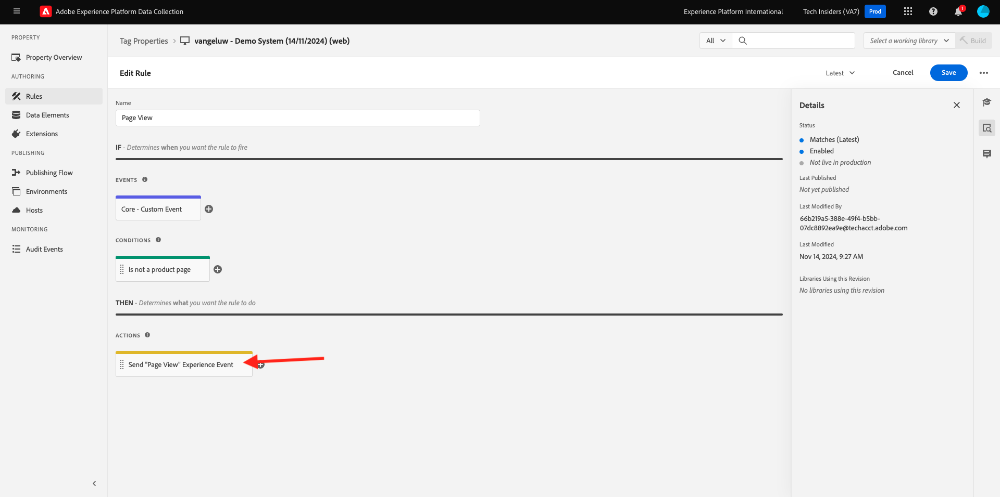
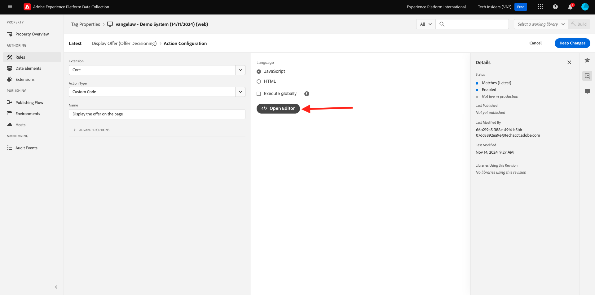

# 3.3.3 Förbered Adobe Experience Platform Data Collection Client property and Web SDK setup for Offer decisioning

## 3.3.3.1 Uppdatera ditt datastam

I [övning 0.2](./../../../modules/gettingstarted/gettingstarted/ex2.md) skapade du din egen **[!UICONTROL Datastream]**. Du använde sedan namnet `--aepUserLdap-- - Demo System Datastream`.

I den här övningen måste du konfigurera den **[!UICONTROL Datastream]** så att den fungerar med **[!DNL Offer Decisioning]**.

Gå till [https://experience.adobe.com/#/data-collection/](https://experience.adobe.com/#/data-collection/) om du vill göra det. Då ser du det här. Klicka på **[!UICONTROL Datastreams]** eller **[!UICONTROL Datastreams (Beta)]**.

I skärmens övre högra hörn väljer du namnet på sandlådan, som ska vara `--aepSandboxName--`.


Sök efter din **[!UICONTROL Datastream]**, som har namnet `--aepUserLdap-- - Demo System Datastream`. Klicka på din **[!UICONTROL Datastream]** för att öppna den.


Då ser du det här. Klicka på **..** bredvid **Adobe Experience Platform** och klicka sedan på **Redigera**.


Markera kryssrutan för **[!DNL Offer Decisioning]** om du vill aktivera **[!DNL Offer Decisioning]**. Klicka på **Spara**.


Din **[!UICONTROL Datastream]** är nu klar att arbeta med **[!DNL Offer Decisioning]**.


## 3.3.3.2 Konfigurera klientegenskapen för Adobe Experience Platform Data Collection för att begära anpassade erbjudanden

Gå till [https://experience.adobe.com/#/data-collection/](https://experience.adobe.com/#/data-collection/), till **[!UICONTROL Client]**. Sök efter dina datainsamlingsegenskaper, som har namnet `--aepUserLdap-- - Demo System (DD/MM/YYYY)`. Öppna din Data Collection-klientegenskap för webben.


Gå till **[!UICONTROL Rules]** i din egenskap och öppna regeln **[!UICONTROL Page View]**.


Klicka för att öppna [!UICONTROL Action] **[!UICONTROL AEP Web SDK - Send Event]**.



Då ser du det här. Du kommer att märka menyalternativet för **[!UICONTROL Decision Scopes]**.


För varje begäran som skickas till sidan och till Adobe Experience Platform går det att ange en eller flera **[!UICONTROL Decision Scopes]**. En **[!UICONTROL Decision Scope]** är en kombination av två element:

- [!UICONTROL Decision ID]
- [!UICONTROL Placement ID]

Låt oss först ta en titt där du kan hitta de två elementen.

### 3.3.3.2.1 Hämta din [!UICONTROL Placement ID]

[!UICONTROL Placement ID] identifierar platsen och typen av resurs som krävs. Hjältebilden på Lumas hemsida motsvarar till exempel [!UICONTROL Placement ID] för [!UICONTROL Web - Image].

>[!NOTE]
>
>Som en del av modul 6 har du redan konfigurerat en Adobe Target Experience Targeting-aktivitet som kommer att ändra bilden av hjälteplatsen på hemsidan, som du kan se i skärmbilden. För träningens skull ska du nu få dina erbjudanden att visas på bilden nedanför hjältebilden som visas på skärmbilden.


Om du vill hitta [!UICONTROL Placement ID] för [!UICONTROL Web - Image] går du till Adobe Journey Optimizer genom att gå till [Adobe Experience Cloud](https://experience.adobe.com). Klicka på **Journey Optimizer**.


Du omdirigeras till vyn **Hem** i Journey Optimizer. Kontrollera först att du använder rätt sandlåda. Sandlådan som ska användas kallas `--aepSandboxName--`. Du kommer sedan att vara i vyn **Hem** i din sandlåda `--aepSandboxName--`.


Gå sedan till [!UICONTROL Components] och sedan till [!UICONTROL Placements]. Klicka på placeringen [!UICONTROL Web - Image] om du vill se information om den.


Som du kan se i bilden ovan är [!UICONTROL Placement ID] `xcore:offer-placement:14bf09dc4190ebba` i det här exemplet. Skriv ned [!UICONTROL Placement ID] för din placering för [!UICONTROL Web - Image] så som du behöver den i nästa övning.

### 3.3.3.2.2 Hämta din [!UICONTROL Decision ID]

[!UICONTROL Decision ID] identifierar vilken kombination av anpassade erbjudanden och reserverbjudanden du vill använda. I föregående övning skapade du din egen [!UICONTROL Decision] och gav den namnet `--aepUserLdap-- - Luma Decision`.

Om du vill hitta [!UICONTROL Decision ID] för din `--aepUserLdap-- - Luma Decision` går du till [https://platform.adobe.com](https://platform.adobe.com).

Gå sedan till [!UICONTROL Offers] och gå till [!UICONTROL Decisions]. Klicka för att välja [!UICONTROL Decision], som har namnet `--aepUserLdap-- - Luma Decision`.


Som du kan se i bilden ovan är [!UICONTROL Decision ID] `xcore:offer-activity:14c052382e1b6505` i det här exemplet. Skriv ned [!UICONTROL Decision ID] för ditt beslut `--aepUserLdap-- - Luma Decision` så som du behöver det i nästa övning.

Nu när du har hämtat de två elementen som du behöver för att skapa en **[!UICONTROL Decision Scopes]** kan du fortsätta med nästa steg, vilket innebär att du måste koda beslutsomfånget.

### 3.3.3.2.3 BASE64-kodning

**[!UICONTROL Decision Scope]** som du måste ange är en BASE64-kodad sträng. Den här BASE64-kodade strängen är en kombination av [!UICONTROL Placement ID] och [!UICONTROL Decision ID], vilket du kan se nedan.

```json
{
  "activityId":"xcore:offer-activity:14c052382e1b6505",
  "placementId":"xcore:offer-placement:14bf09dc4190ebba"
}
```

**[!UICONTROL Decision Scope]** kan genereras på två sätt:

- Använd en offentlig tjänst som [https://www.base64encode.org/](https://www.base64encode.org/). Ange den JSON-kod som nämns ovan, klicka på **[!UICONTROL Encode]** så får du den BASE64-kodade strängen nedan.

  

- Hämta den BASE64-kodade strängen från Adobe Experience Platform. Gå till [!UICONTROL Decisions] och klicka för att öppna [!UICONTROL Decision], som har namnet `--aepUserLdap-- - Luma Decision`.

  

  När du har öppnat `--aepUserLdap-- - Luma Decision` ser du det här. Leta reda på placeringen [!UICONTROL Web - Image] och klicka på knappen **[!UICONTROL Copy]**. Klicka sedan på **[!UICONTROL Encoded decision scope]**. **[!UICONTROL Decision Scope]** kopieras nu till Urklipp.

  

Gå sedan tillbaka till Launch, till din åtgärd **[!UICONTROL AEP Web SDK - Send Event]**.


Klistra in det kodade beslutsomfånget i indatafältet.


Spara ändringarna i funktionsmakrot **[!UICONTROL AEP Web SDK - Send Event]** genom att klicka på **[!UICONTROL Keep Changes]**.


Klicka sedan på **[!UICONTROL Save]** eller **[!UICONTROL Save to Library]**


I Adobe Experience Platform Data Collection går du till **[!UICONTROL Publishing Flow]** och öppnar **[!UICONTROL Development Library]** med namnet **[!UICONTROL Main]**. Klicka på **[!UICONTROL + Add All Changed Resources]** och sedan på **[!UICONTROL Save & Build for Development]**. Ändringarna publiceras nu på demowebbplatsen.


Varje gång du läser in en **allmän sida** nu, till exempel startsidan för demowebbplatsen, kommer Offera decisioningen att utvärdera vilket erbjudande som gäller och returnera ett svar till webbplatsen med information om erbjudandet som ska visas. För att visa erbjudandet på webbplatsen krävs ytterligare konfiguration, vilket du gör i nästa steg.

## 3.3.3.3 Konfigurera klientegenskapen för Adobe Experience Platform Data Collection för att ta emot och tillämpa anpassade erbjudanden

Gå till [https://experience.adobe.com/#/data-collection/](https://experience.adobe.com/#/data-collection/), till **[!UICONTROL Properties]**. Sök efter dina datainsamlingsegenskaper, som har namnet `--aepUserLdap-- - Demo System (DD/MM/YYYY)`. Öppna din datainsamlingsegenskap för webben.


Gå till **[!UICONTROL Rules]** i din egenskap.


Sök efter och öppna regeln **Beslutet togs emot**.


Då ser du det här. Öppna åtgärden **Placera erbjudandet på sidan**.


Klicka på **[!UICONTROL Open Editor]**



Skriv över koden genom att klistra in koden nedan i redigeraren.

```javascript
if(!Array.isArray(event.decisions)) {
  console.log('No decisions returned')
  return;
}
console.log("decision",event.decisions)

event.decisions.forEach(function(payload) {
  payload.items.forEach(function(item){
    console.log("Response from Offer Decisioning ", item.data.content);
   
    var element = document.querySelector("#root > div > div > div.app-content > div > section.feature_part.padding_top > div > div.row.align-items-center.justify-content-between > div.col-lg-7.col-sm-6.\\30  > div");
    if(!element){
      console.log("Offer Placement Area Selector not found")
      return;
    }
    if(!item.data){
      return
    }
    //check if offer already exists
    var offer = document.querySelector("#root > div > div > div.app-content > div > section.feature_part.padding_top > div > div.row.align-items-center.justify-content-between > div.col-lg-7.col-sm-6.\\30  > div");
    if(!offer){ 
      element.insertAdjacentHTML('afterbegin', item.data.content) 
    }
    else { 
      console.log("item.data.deliveryURL: " + item.data.deliveryURL)
      document.querySelector("#root > div > div > div.app-content > div > section.feature_part.padding_top > div > div.row.align-items-center.justify-content-between > div.col-lg-7.col-sm-6.\\30  > div").style.background="url('"+item.data.deliveryURL+"')";
      document.querySelector("#root > div > div > div.app-content > div > section.feature_part.padding_top > div > div.row.align-items-center.justify-content-between > div.col-lg-7.col-sm-6.\\30  > div").style.backgroundRepeat="no-repeat";
      document.querySelector("#root > div > div > div.app-content > div > section.feature_part.padding_top > div > div.row.align-items-center.justify-content-between > div.col-lg-7.col-sm-6.\\30  > div").style.backgroundPosition="center center";
      document.querySelector("#root > div > div > div.app-content > div > section.feature_part.padding_top > div > div.row.align-items-center.justify-content-between > div.col-lg-7.col-sm-6.\\30  > div").style.backgroundSize = "contain";
    }  
  })
});
```

Raderna 26-27-28-29 tillämpar den bild som returneras som Offer decisioning på webbplatsen. Klicka på **[!UICONTROL Save]**.


Klicka på **[!UICONTROL Keep Changes]**.


Klicka sedan på **[!UICONTROL Save]** eller **[!UICONTROL Save to Library]**


I Adobe Experience Platform Data Collection går du till **[!UICONTROL Publishing Flow]** och öppnar **[!UICONTROL Development Library]** med namnet **[!UICONTROL Main]**. Klicka på **[!UICONTROL + Add All Changed Resources]** och sedan på **[!UICONTROL Save & Build for Development]**. Ändringarna publiceras nu på demowebbplatsen.


Denna ändring innebär att den här regeln i Adobe Experience Platform Data Collection nu lyssnar på svaret från Offera decisioningen som ingår i Web SDK-svaret, och när svaret tas emot visas bilden av erbjudandet på hemsidan.

På demowebbplatsen ser du att den här bilden kommer att ersättas nu:

>[!NOTE]
>
>Som en del av modul 6 har du redan konfigurerat en Adobe Target Experience Targeting-aktivitet som kommer att ändra bilden av hjälteplatsen på hemsidan, som du kan se i skärmbilden. För träningens skull ska du nu få dina erbjudanden att visas på bilden nedanför hjältebilden som visas på skärmbilden.


I stället för Lumas standardbilder ser du nu ett liknande erbjudande. I det här fallet visas reserverbjudandet.


Du har nu konfigurerat två typer av personalisering:

- 1 Experience Targeting-aktivitet med Adobe Target i modul 6
- Implementering av 1 Offer decisioning med din datainsamling-egenskap

I nästa övning får du se hur ni kan kombinera era era erbjudanden och beslut som skapats i Adobe Journey Optimizer med en Adobe Target Experience Targeting-aktivitet.

Nästa steg: [3.3.4 Kombinera Adobe Target och Offer decisioning](./ex4.md)

[Gå tillbaka till modul 3.3](./offer-decisioning.md)

[Gå tillbaka till Alla moduler](./../../../overview.md)
