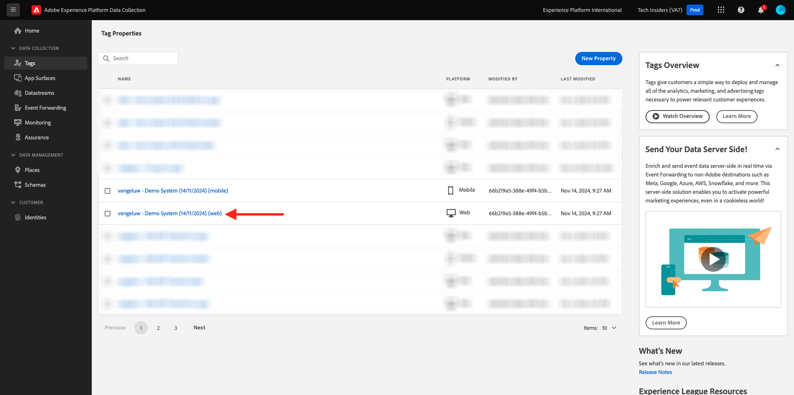

# 3.3.3 Förbered Adobe Experience Platform Data Collection Client property and Web SDK setup for Offer decisioning

## 3.3.3.1 Uppdatera ditt datastam

I [Komma igång](./../../../modules/gettingstarted/gettingstarted/ex2.md) skapade du en egen **DataStream**. Du använde sedan namnet `--aepUserLdap-- - Demo System Datastream`.

I den här övningen måste du konfigurera **Datastream** så att den fungerar med **Offer decisioning**.

Gå till [https://experience.adobe.com/#/data-collection/](https://experience.adobe.com/#/data-collection/) om du vill göra det. Då ser du det här. Klicka på **Datastream**.

I skärmens övre högra hörn väljer du namnet på sandlådan, som ska vara `--aepSandboxName--`.


Sök efter din **datastream**, som har namnet `--aepUserLdap-- - Demo System Datastream`. Klicka på ditt **datastream** för att öppna det.


Då ser du det här. Klicka på **..** bredvid **Adobe Experience Platform** och klicka sedan på **Redigera**.


Markera kryssrutan för **Offer decisioning** om du vill aktivera **Offer decisioning**. Klicka på **Spara**.


**Datastream** är nu klar att fungera med **Offer decisioning**.


## 3.3.3.2 Konfigurera klientegenskapen för Adobe Experience Platform Data Collection för att begära anpassade erbjudanden

Gå till [https://experience.adobe.com/#/data-collection/](https://experience.adobe.com/#/data-collection/), till **Taggar**. Sök efter dina datainsamlingsegenskaper, som har namnet `--aepUserLdap-- - Demo System (DD/MM/YYYY)`. Öppna din Data Collection-klientegenskap för webben.



Gå till **Regler** i din egenskap och öppna regeln **Sidvy**.


Klicka för att öppna **händelsen Skicka sidvy** för åtgärden.


Då ser du det här. Under **Personalization** kan du se alternativet för **omfång**.


För varje begäran som skickas till den aktuella sidan och till Adobe Experience Platform går det att ange en eller flera **beslutsomfattningar**. Ett **beslutsomfång** är en kombination av två element:

- Besluts-ID
- Placement-ID

Låt oss först ta en titt där du kan hitta de två elementen.

### 3.3.3.2.1 Hämta ditt placerings-ID

Placement-ID:t identifierar platsen och typen av resurs som krävs. Hjältebilden på startsidan för CitiSignal-webbplatsen motsvarar till exempel Placement-ID:t för webb-bild.

>[!NOTE]
>
>Som en del av övning 2.3.5 har du redan konfigurerat en Adobe Target Experience Targeting-aktivitet som kommer att ändra bilden av hjälteplatsen på hemsidan, som du ser i skärmbilden. I den här övningen ska du nu visa dina erbjudanden på bilden nedanför hjältebilden som visas på skärmbilden.


Om du vill hitta plats-ID:t för webb-bild går du till Adobe Journey Optimizer på [Adobe Experience Cloud](https://experience.adobe.com). Klicka på **Journey Optimizer**.


Du omdirigeras till vyn **Hem** i Journey Optimizer. Kontrollera först att du använder rätt sandlåda. Sandlådan som ska användas kallas `--aepSandboxName--`. Du kommer sedan att vara i vyn **Hem** i din sandlåda `--aepSandboxName--`.


Gå sedan till Komponenter och sedan till Placeringar. Klicka på placeringen **Webb - bild** om du vill visa information om den.


Som du kan se i bilden ovan är placerings-ID `dps:offer-placement:1a08a14ccfe533b6` i det här exemplet. Skriv ned placerings-ID:t för din webbmontering - bild så som du behöver det i nästa övning.

### 3.3.3.2.2 Hämta ID för ditt erbjudande

ID:t för **erbjudandebeslut** identifierar vilken kombination av personaliserade erbjudanden och reserverbjudanden du vill använda. I föregående övning skapade du ditt eget beslut och gav det namnet `--aepUserLdap-- - CitiSignal Decision`.

Om du vill hitta ID:t för erbjudandebeslut för din `--aepUserLdap-- - CitiSignal Decision` går du till Erbjudanden och sedan till Beslut. Klicka för att välja ditt beslut, som har namnet `--aepUserLdap-- - CitiSignal Decision`.


Som du kan se i bilden ovan är beslut-ID `dps:offer-activity:1a08ba4b529b2fb2` i det här exemplet. Skriv ner ID:t för ditt beslut om erbjudandet `--aepUserLdap-- - CitiSignal Decision` när du behöver det i nästa övning.

Nu när du har hämtat de två elementen som du behöver för att skapa ett **beslutsomfång** kan du fortsätta med nästa steg, som innefattar att koda beslutsomfånget.

### 3.3.3.2.3 BASE64-kodning

Det **beslutsområde** du måste ange är en BASE64-kodad sträng. Den här BASE64-kodade strängen är en kombination av Placement ID och besluts-ID som du kan se nedan:

```json
{
  "xdm:activityId": "dps:offer-activity:1a08ba4b529b2fb2",
  "xdm:placementId": "dps:offer-placement:1a08a14ccfe533b6"
}
```

Du kan hämta BASE64-kodad sträng från Adobe Experience Platform. Gå till Beslut och klicka för att öppna ditt beslut, som har namnet `--aepUserLdap-- - CitiSignal Decision`.


När du har öppnat `--aepUserLdap-- - CitiSignal Decision` ser du det här. Leta reda på placeringswebben - bild och klicka på knappen **Kopiera** . Klicka sedan på **Kodad beslutsomfattning**. **Beslutsomfånget** kopieras nu till Urklipp.


Gå sedan tillbaka till Launch, till din åtgärd **AEP Web SDK - skicka händelse**.


Klistra in det kodade beslutsomfånget i indatafältet. Spara ändringarna i funktionsmakrot **AEP Web SDK - Skicka händelse** genom att klicka på **[!UICONTROL Keep Changes]**.


Klicka sedan på **[!UICONTROL Save]**.


I Adobe Experience Platform Data Collection går du till **[!UICONTROL Publishing Flow]** och öppnar **[!UICONTROL Development Library]** med namnet **[!UICONTROL Main]**. Klicka på **[!UICONTROL + Add All Changed Resources]** och sedan på **[!UICONTROL Save & Build for Development]**. Ändringarna publiceras nu på demowebbplatsen.


Varje gång du läser in en **allmän sida** nu, till exempel startsidan för demowebbplatsen, kommer Offera decisioningen att utvärdera vilket erbjudande som gäller och returnera ett svar till webbplatsen med information om erbjudandet som ska visas. För att visa erbjudandet på webbplatsen krävs ytterligare konfiguration, vilket du gör i nästa steg.

## 3.3.3.3 Konfigurera klientegenskapen för Adobe Experience Platform Data Collection för att ta emot och tillämpa anpassade erbjudanden

Gå till [https://experience.adobe.com/#/data-collection/](https://experience.adobe.com/#/data-collection/), till **[!UICONTROL Properties]**. Sök efter dina datainsamlingsegenskaper, som har namnet `--aepUserLdap-- - Demo System (DD/MM/YYYY)`. Öppna din datainsamlingsegenskap för webben.


Gå till **Regler** i din egenskap. Sök efter och öppna regeln **Visa erbjudande (Offer decisioning)**.


Då ser du det här. Öppna åtgärden **Visa erbjudandet på sidan**.


Klicka på **[!UICONTROL Open Editor]**


Skriv över koden genom att klistra in koden nedan i redigeraren.

```javascript
if (!Array.isArray(event.decisions)) {
  console.log("No personalization decisions");
  return;
}

console.log("Received response from Offer Decisioning", event.decisions);

event.decisions.forEach(function (payload) {
  payload.items.forEach(function (item) {
    console.log("Offer", item.data.deliveryURL);

    if (!item.data || item.data?.deliveryURL==null) {
      return;
    }
    console.log("item.data.deliveryURL", item.data.deliveryURL)
    //document.querySelector(".TopRibbon").innerHTML = item.data.content;
    document.querySelector("#SpectrumProvider > div.App > div > div.Page.home > main > div:nth-child(2)").innerHTML = "";
    document.querySelector("#SpectrumProvider > div.App > div > div.Page.home > main > div:nth-child(2) > img").style.backgroundRepeat="no-repeat";
    document.querySelector("#SpectrumProvider > div.App > div > div.Page.home > main > div:nth-child(2) > img").style.backgroundPosition="center center";
    document.querySelector("#SpectrumProvider > div.App > div > div.Page.home > main > div:nth-child(2) > img").style.backgroundSize = "contain";
  });
});
```

Rader 17 tillämpar den bild som returneras som Offer decisioning på webbplatsen. Klicka på **[!UICONTROL Save]**.


Klicka på **[!UICONTROL Keep Changes]**.


Klicka sedan på **[!UICONTROL Save]**.


I Adobe Experience Platform Data Collection går du till **[!UICONTROL Publishing Flow]** och öppnar **[!UICONTROL Development Library]** med namnet **[!UICONTROL Main]**. Klicka på **[!UICONTROL + Add All Changed Resources]** och sedan på **[!UICONTROL Save & Build for Development]**. Ändringarna publiceras nu på demowebbplatsen.


Denna ändring innebär att den här regeln i Adobe Experience Platform Data Collection nu lyssnar på svaret från Offera decisioningen som ingår i Web SDK-svaret, och när svaret tas emot visas bilden av erbjudandet på hemsidan.

På demowebbplatsen ser du att den här bilden kommer att ersättas nu. I stället för CitiSignal-standardbilderna visas nu ett liknande erbjudande. I det här fallet visas reserverbjudandet.


Du har nu konfigurerat två typer av personalisering:

- 1 Experience Targeting-aktivitet med Adobe Target i övning 2.3.5
- Implementering av 1 Offer decisioning med din datainsamling-egenskap

I nästa övning får du se hur ni kan kombinera era era erbjudanden och beslut som skapats i Adobe Journey Optimizer med en Adobe Target Experience Targeting-aktivitet.

Nästa steg: [3.3.4 Kombinera Adobe Target och Offer decisioning](./ex4.md)

[Gå tillbaka till modul 3.3](./offer-decisioning.md)

[Gå tillbaka till Alla moduler](./../../../overview.md)
