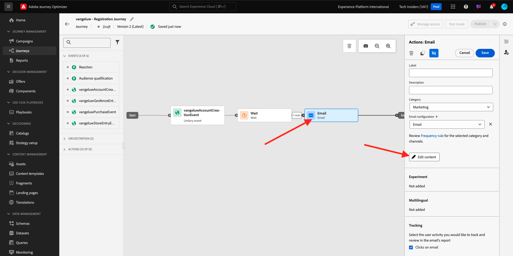
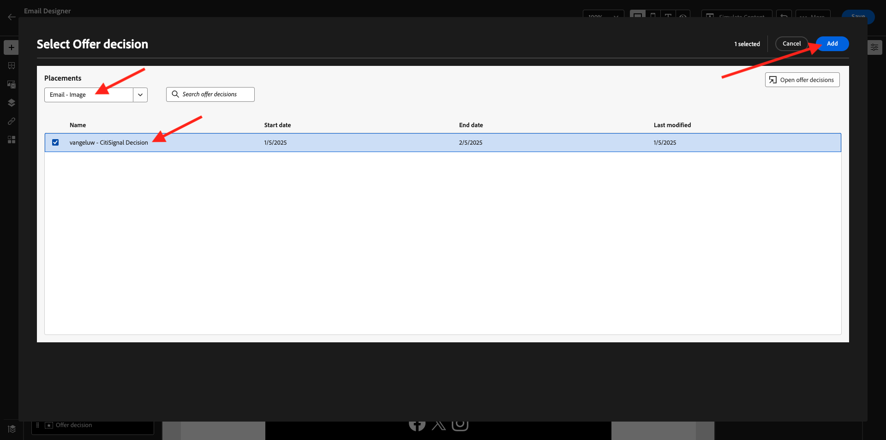
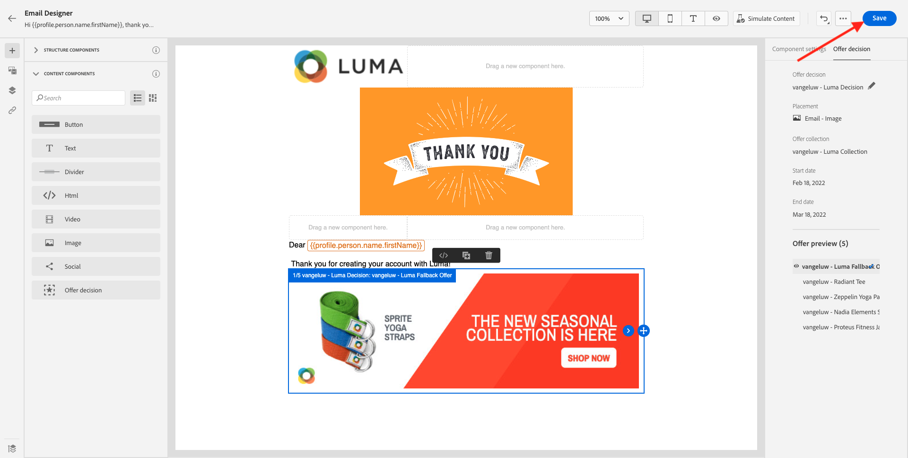

# 3.3.5 Använd ditt beslut i ett e-postmeddelande

I den här övningen använder du ditt beslut för att anpassa leveransen av ett e-postmeddelande och SMS.

Gå till **Resor**. Hitta den resa du skapade i övning 7.2, som heter `--aepUserLdap-- - Account Creation Journey`. Klicka på resan för att öppna den.

Då ser du det här. Klicka på **Skapa en ny version**.

Klicka på **Skapa en ny version**.

Klicka på åtgärden **E-post** och sedan på **Redigera innehåll**.

Då visas meddelandepanelen. Klicka på **E-posta Designer**.

Då ser du det här.

Då ser du det här. Dra en ny **1:1-kolumnstrukturkomponent** till arbetsytan.

Gå till **Innehållskomponenter** på menyn. Välj komponenten **Erbjudandebeslut** och dra och släpp den här komponenten i e-postmeddelandets platshållare för innehållserbjudanden enligt vad som anges. Klicka sedan på **Lägg till**.

Välj den typ av placering som du vill ta med i e-postmeddelandet. Välj **E-post - bild** i listrutan **Placeringar** och välj sedan ditt beslut `--aepUserLdap-- - Luma Decision`. Klicka på **Lägg till**.

Nu ser du alla personaliserade erbjudanden och reserverbjudandet visualiseras inuti e-postdesignern. Klicka på **Simulera innehåll** om du vill förhandsgranska e-postmeddelandet med en riktig kundprofil.

Börja med att identifiera vilken profil du vill använda för förhandsgranskningen. Markera namnområdet **email** och ange e-postadressen för en kundprofil som du har skapat på demowebbplatsen. Klicka sedan på **Förhandsgranska**.

När e-postmeddelandet har visats och erbjudandet visas korrekt klickar du på knappen **Stäng** .

Klicka slutligen på **Spara**.

Klicka på pilen för att gå tillbaka till föregående skärm.

Då ser du det här. Klicka på pilen i det övre vänstra hörnet för att gå tillbaka till din resa.

Klicka på **OK** för att stänga din **e-post**-åtgärd.

Klicka på **Publish** för att publicera den uppdaterade resan.

Bekräfta genom att klicka på **Publish** igen.

Meddelandet har publicerats.

När du skapar ett nytt konto på demowebbplatsen får du nu det här e-postmeddelandet:

Du har gjort klart den här övningen.

Nästa steg: [3.3.6 Testa ditt beslut med API:t](./ex6.md)

[Gå tillbaka till modul 3.3](./offer-decisioning.md)

[Gå tillbaka till Alla moduler](./../../../overview.md)
