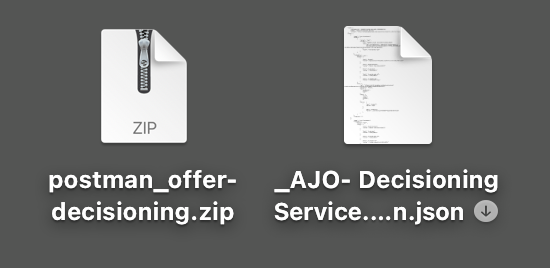

# 3.3.6 Testa ditt beslut med API:t

## 3.3.6.1 Arbeta med Offer decisionings-API:t med Postman

Hämta [den här Postman-samlingen för Offer decisioning](./../../../assets/postman/postman_offer-decisioning.zip) till skrivbordet och zippa upp den. Då får du den här:

Nu har du den här filen på skrivbordet:

- [!UICONTROL _Module 14- Decisioning Service.postman_collection.json]

In [Exercise 2.1.3 - Postman authentication to Adobe I/O](./../../../modules/rtcdp-b2c/module2.1/ex3.md) you installed Postman. Du måste använda Postman igen för den här övningen.

Öppna Postman. Klicka på **[!UICONTROL Import]**.

Klicka på **[!UICONTROL Upload files]**.

Markera filen **[!UICONTROL _Module 14- Decisioning Service.postman_collection.json]** och klicka på **[!UICONTROL Open]**.

Den här samlingen är sedan tillgänglig i Postman.

Nu har du allt du behöver i Postman för att börja interagera med Adobe Experience Platform via API:erna.

### 3.3.6.1.1 Listbehållare

Klicka för att öppna begäran **[!UICONTROL GET - List Containers]**.

Under **[!UICONTROL Params]** ser du följande:

- egenskap: `_instance.parentName==aepenablementfy22`

I den parametern är **[!UICONTROL aepenablementfy22]** namnet på sandlådan som används i Adobe Experience Platform. Sandlådan som du bör använda är `--aepSandboxName--`. Ersätt texten **[!UICONTROL aepenablementfy22]** med `--aepSandboxName--`.

När du har ersatt namnet på sandlådan klickar du på **[!UICONTROL Send]**.

Detta är svaret, som visar behållaren för erbjudandet för den sandlåda som du angav. Kopiera **[!UICONTROL container instanceId]** enligt nedan och skriv ned den i en textfil på datorn. Du måste använda den här **[!UICONTROL container instanceId]** för nästa övning!

### 3.3.6.1.2 Listplaceringar

Klicka för att öppna begäran **[!UICONTROL GET - List Placements]**. Klicka på **[!UICONTROL Send]**.

Du ser nu alla tillgängliga placeringar i erbjudandebehållaren. De placeringar du ser har definierats i Adobe Experience Platform-gränssnittet, vilket du kan se i [Exercise 3.3.1.3](./ex1.md).

### 3.3.6.1.3 Regler för beslut om förteckningen

Klicka för att öppna begäran **[!UICONTROL GET - List Decision Rules]**. Klicka på **[!UICONTROL Send]**.

I svaret visas beslutsreglerna som du definierade i användargränssnittet för Adobe Experience Platform, som du kunde se i [övning 3.3.1.4](./ex1.md).

### 3.3.6.1.4 Förteckning över personaliserade erbjudanden

Klicka för att öppna begäran **[!UICONTROL GET - List Personalized Offers]**. Klicka på **[!UICONTROL Send]**.

I svaret visas de anpassade erbjudandena som du definierade i Adobe Experience Platform-gränssnittet i [Exercise 3.3.2.1](./ex2.md).

### 3.3.6.1.5 Lista över återkopplingserbjudanden

Klicka för att öppna begäran **[!UICONTROL GET - List Fallback Offers]**. Klicka på **[!UICONTROL Send]**.

I svaret visas det reserverbjudande som du definierade i användargränssnittet för Adobe Experience Platform i [Exercise 3.3.2.2](./ex2.md).

### 3.3.6.1.6 Listsamlingar

Klicka för att öppna begäran **[!UICONTROL GET - List Collections]**.

I svaret visas samlingen som du definierade i Adobe Experience Platform-gränssnittet i [Exercise 3.3.2.3](./ex2.md).

### 3.3.6.1.7 Få detaljerade erbjudanden om kundprofiler

Klicka för att öppna begäran **[!UICONTROL POST - Get Detailed Offers for Customer Profile]**. Denna begäran liknar den föregående, men returnerar faktiskt information som bild-URL:er, text osv.

För den här förfrågan, som liknar den föregående övningen som har liknande krav, måste du ange värden för **[!UICONTROL xdm:placementId]** och **[!UICONTROL xdm:activityId]** för att hämta den specifika erbjudandeinformationen för en kund.

Fältet **[!UICONTROL xdm:activityId]** måste fyllas i. Du kan hämta det i användargränssnittet för Adobe Experience Platform enligt nedan.

Fältet **[!UICONTROL xdm:placementId]** måste fyllas i. Du kan hämta det i användargränssnittet för Adobe Experience Platform enligt nedan. I exemplet nedan kan du se placementId för placeringen **[!UICONTROL Web - Image]**.

Gå till **[!UICONTROL Body]** och ange e-postadressen till kunden som du vill begära ett erbjudande för. Klicka på **[!UICONTROL Send]**.

Slutligen kommer ni att se resultatet av vilken typ av personaliserat erbjudande och vilka resurser som behöver visas för den här kunden.

Du har nu avslutat den här övningen.

Nästa steg: [Sammanfattning och förmåner](./summary.md)

[Gå tillbaka till modul 3.3](./offer-decisioning.md)

[Gå tillbaka till Alla moduler](./../../../overview.md)
