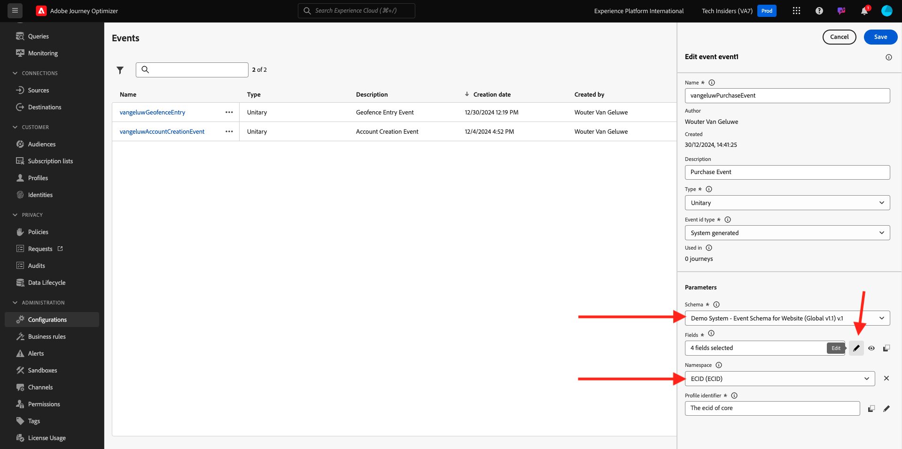
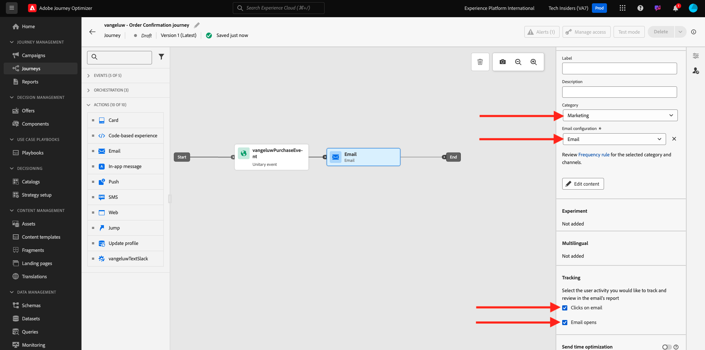
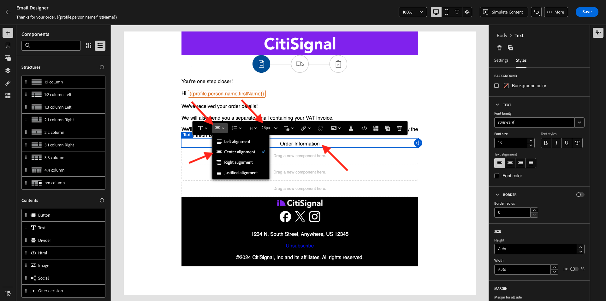

# 3.4.1 Konfigurera en utlösarbaserad resa - orderbekräftelse

Logga in på Adobe Journey Optimizer på [Adobe Experience Cloud](https://experience.adobe.com). Klicka på **Journey Optimizer**.


Du omdirigeras till vyn **Hem** i Journey Optimizer. Kontrollera först att du använder rätt sandlåda. Sandlådan som ska användas kallas `--aepSandboxName--`. Du kommer sedan att vara i vyn **Hem** i din sandlåda `--aepSandboxName--`.


## 3.4.1.1 Skapa en händelse

Gå till **Konfigurationer** på menyn och klicka på **Hantera** under **Händelser**.


På skärmen **Händelser** ser du en liknande vy. Klicka på **Skapa händelse**.


Därefter visas en tom händelsekonfiguration.

Först och främst ger du evenemanget ett namn som detta: `--aepUserLdap--PurchaseEvent`, och lägger till en beskrivning som detta: `Purchase Event`.

För **Type** väljer du **Unitary**.
Välj **System Generated** för **händelse-ID-typ**.


Nästa steg är schemavalet. Ett schema förbereddes för den här övningen. Använd schemat `Demo System - Event Schema for Website (Global v1.1) v.1`.

När du har valt schemat visas ett antal fält som markeras i avsnittet **Nyttolast**. Klicka på ikonen **Redigera/Penna** om du vill lägga till fler fält i den här händelsen.



Du kommer då att se den här popup-rutan. Du måste nu markera ytterligare kryssrutor för att få tillgång till ytterligare data när den här händelsen aktiveras.


Markera kryssrutan på rad `--aepTenantId--` först.


Bläddra sedan nedåt och markera kryssrutan på raden `commerce`.


Bläddra sedan nedåt och markera kryssrutan på raden `productListItems`. Klicka på **OK**.


Därefter ser du att fler fält har lagts till i händelsen. Klicka på **Spara**.


Din nya aktivitet sparas sedan och du ser din aktivitet i listan över tillgängliga händelser nu.

Klicka på aktiviteten igen för att öppna skärmen **Redigera händelse** igen.
Håll pekaren över fältet **Nyttolast** igen för att se de tre ikonerna igen. Klicka på ikonen **Visa nyttolast** .


Nu visas ett exempel på den förväntade nyttolasten. Händelsen har ett unikt ID för Orchestration-händelse som du kan hitta genom att rulla nedåt i nyttolasten tills du ser `_experience.campaign.orchestration.eventID`.


Händelse-ID är det som måste skickas till Adobe Journey Optimizer för att utlösa den resa som du bygger i nästa steg. Skriv ned detta eventID, som du behöver i ett av de följande stegen.
`"eventID": "1c8148a8ab1993537d0ba4e6ac293dd4f2a88d80b2ca7be6293c3b28d4ff5ae6"`

Klicka på **OK**, följt av **Avbryt**.

Händelsen är nu konfigurerad och klar att användas.

## 3.4.1.2 Skapa din resa

Gå till **Resor** på menyn och klicka på **Skapa resa**.


Då ser du det här. Ge resan ett namn. Använd `--aepUserLdap-- - Order Confirmation journey`. Klicka på **Spara**.


Först måste du lägga till din händelse som startpunkt för din resa. Sök efter din händelse `--aepUserLdap--PurchaseEvent` och dra och släpp den på arbetsytan. Klicka på **Spara**.


Under **Åtgärder** söker du sedan efter åtgärden **E-post** och lägger till den på arbetsytan.


Ange **kategorin** till **Marknadsföring** och välj en e-postyta som gör att du kan skicka e-post. I det här fallet är e-postytan som ska väljas **E-post**. Kontrollera att kryssrutorna för **klick på e-post** och **e-post** är aktiverade.



Nästa steg är att skapa ett meddelande. Det gör du genom att klicka på **Redigera innehåll**.


Nu ser du det här. Klicka på textfältet **Ämnesrad**.


Börja skriva **Tack för din beställning** i textområdet och klicka på ikonen **Personalization** .


Ämnesraden är inte färdig än. Därefter måste du hämta en personaliseringstoken för fältet **Förnamn** som lagras under `profile.person.name.firstName`. I den vänstra menyn bläddrar du nedåt för att hitta fältet **Person** > **Fullständigt namn** > **Förnamn** och klickar på ikonen **+** för att lägga till en personaliseringstoken på ämnesraden. Klicka på **Spara**.


Du kommer då tillbaka hit. Klicka på **Redigera e-postbrödtext** för att skapa e-postmeddelandets innehåll.


Klicka på **Designa från grunden** på nästa skärm.


På den vänstra menyn hittar du de strukturkomponenter som du kan använda för att definiera e-postmeddelandets struktur (rader och kolumner).

Dra och släpp 8 gånger en **1:1-kolumn** på arbetsytan, vilket bör ge dig följande:


Gå till **Fragment** på den vänstra menyn. Dra rubriken som du skapade tidigare i [övning 3.1.2.1](./../module3.1/ex2.md) till den första komponenten på arbetsytan. Dra sidfoten som du skapade tidigare i [övning 3.1.2.2](./../module3.1/ex2.md) till den sista komponenten på arbetsytan.


Klicka på ikonen **+** i den vänstra menyn. Gå till **Innehåll** för att börja lägga till innehåll på arbetsytan.


Gå till **Innehåll** och dra och släpp en **Bild** -komponent på den andra raden. Klicka på **Bläddra**.


Öppna mappen **citi-signal-images**, klicka för att välja bilden **citisignal-preparing.png** och klicka på **Select**.


Under **Format** ändrar du bredden till **40 %**.


Gå sedan till **Innehåll** och dra och släpp en **Text** -komponent på den tredje raden.


Markera standardtexten i komponenten **Skriv texten här.** och ersätt den med texten nedan:

```javascript
You’re one step closer!

Hi 

We've received your order details!

We will also send you a separate email containing your VAT Invoice.

We'll be back in touch with you as soon as we've finished packing your package. Please read carefully the Order Information detailed below.
```


Placera markören bredvid texten **Hej** och klicka på **Lägg till Personalization**.


Navigera till fältet **Person** > **Fullständigt namn** > **Förnamn** och klicka på ikonen **+** för att lägga till personaliseringstoken på ämnesraden. Klicka på **Spara**.


Då ser du det här:


Gå sedan till **Innehåll** och dra och släpp en **Text** -komponent på den fjärde raden.


Markera standardtexten i komponenten **Skriv texten här.** och ersätt den med texten nedan:

`Order Information`

Ändra teckenstorleken till **26px** och centrera texten i den här cellen. Då får du den här:



Gå sedan till **Innehåll** och dra och släpp en **HTML** -komponent på den femte raden. Klicka på komponenten HTML och sedan på **Visa källkoden**.


Klistra in HTML i popup-fönstret **Redigera HTML**:

```<table><tbody><tr><td><b>Items purchased</b></td><td></td><td><b>Quantity</b></td><td><b>Subtotal</b></td></tr><tr><td colspan="4" width="500"><hr></td></tr></tbody></table>```

Klicka på **Spara**.


Du får den här då. Klicka på **Spara** för att spara förloppet.


Gå till **Innehåll** och dra och släpp en **HTML** -komponent på den sjätte raden. Klicka på komponenten HTML och sedan på **Visa källkoden**.


Klistra in HTML i popup-fönstret **Redigera HTML**:

```{{#each xxx as |item|}}<table width="500"><tbody><tr><td></td><td><table><tbody><tr><td><b>{{item.name}}</b><br>{{item.--aepTenantId--.core.subCategory}}<br><b>{{item.priceTotal}}</b><br>&nbsp;<br>Article no: {{item.SKU}}</td></tr></tbody></table></td><td>{{item.quantity}}</td><td><b>{{item.priceTotal}}</b></td></tr></tbody></table>{{/each}}```

Då får du den här:


Du måste nu ersätta **xxx** med en referens till objektet productListItems som är en del av händelsen som utlöser resan.


Ta först bort **xxx** i HTML-koden.


Klicka på **Sammanhangsberoende attribut** på den vänstra menyn. Det här sammanhanget skickas till meddelandet från resan.

Då ser du det här. Klicka på pilen bredvid **Journey Orchestration** för att gå djupare.


Klicka på pilen bredvid **Händelser** för att gå djupare.


Klicka på pilen bredvid `--aepUserLdap--PurchaseEvent` om du vill gå djupare.


Klicka på pilen bredvid **productListItems** för att gå djupare.


Klicka på ikonen **+** bredvid **Namn** för att lägga till den på arbetsytan. Du får den här då. Du måste nu välja **.name** enligt skärmbilden nedan och sedan ta bort **.name**.


Du får den här då. Klicka på **Spara**.


Du är tillbaka i e-postprogrammet Designer nu. Klicka på **Spara** för att spara förloppet.


Gå sedan till **Innehåll** och dra och släpp en **HTML** -komponent på den sjunde raden. Klicka på komponenten HTML och sedan på **Visa källkoden**.


Klistra in HTML i popup-fönstret **Redigera HTML**:

```<table><tbody><tr><td><b>Subtotal</b><br>Delivery charge (included)</td><td align="right"><b>xxx</b><br><b>5</b></td></tr><tr><td colspan="2" width="500"><hr></td></tr><tr><td><b>Total including VAT</b></td><td align="right"><b>xxx</b></td></tr></tbody></table>```

Det finns två referenser till **xxx** i den här HTML-koden. Du måste nu ersätta varje **xxx** med en referens till objektet productListItems som är en del av händelsen som utlöser resan.


Ta först bort den första **xxx** i HTML-koden.


Klicka på **Sammanhangsberoende attribut** på den vänstra menyn.
Klicka på pilen bredvid **Journey Orchestration** för att gå djupare.


Klicka på pilen bredvid **Händelser** för att gå djupare.


Klicka på pilen bredvid `--aepUserLdap--PurchaseEvent` om du vill gå djupare.


Klicka på pilen bredvid **Commerce** för att gå djupare.


Klicka på pilen bredvid **Beställning** för att gå djupare.


Klicka på ikonen **+** bredvid **Prissumma** för att lägga till den på arbetsytan.


Du får den här då. Ta nu bort den andra **xxx** i HTML-koden.


Klicka på ikonen **+** bredvid **Prissumma** igen för att lägga till den på arbetsytan.
Du kan också lägga till fältet **Valuta** inifrån objektet **Ordning** på arbetsytan, vilket visas här.
När du är klar klickar du på **Spara** för att spara ändringarna.


Du kommer sedan tillbaka till Designer för e-post. Klicka på **Spara** igen.


Gå tillbaka till meddelandekontrollpanelen genom att klicka på **pilen** intill ämnesraden i det övre vänstra hörnet.


Klicka på pilen i det övre vänstra hörnet för att gå tillbaka till din resa.


Klicka på **Spara** för att stänga e-poståtgärden.


Klicka på **Publish** för att publicera din resa.


Klicka på **Publish** igen.


Din resa är nu publicerad.


## 3.4.1.5 Uppdatera klientegenskapen för Adobe Experience Platform Data Collection

Gå till [Adobe Experience Platform Data Collection](https://experience.adobe.com/launch/) och välj **Taggar**.

Det här är egenskapssidan för Adobe Experience Platform Data Collection som du såg tidigare.


I **Komma igång** skapade Demo System två klientegenskaper åt dig: en för webbplatsen och en för mobilappen. Sök efter dem genom att söka efter `--aepUserLdap--` i rutan **[!UICONTROL Search]**. Klicka för att öppna egenskapen **Webb**.


Gå till **dataelement**. Sök efter och öppna dataelementet **XDM - Köp**.


Då ser du det här. Navigera till fältet **_experience.campaign.orchestration.eventID** och fyll i ditt eventID här. Det eventID som ska fyllas i här är det eventID som du skapade som en del av övningen 3.4.1.1 Klicka på **Spara** eller **Spara i bibliotek**.


Spara ändringarna i din egendom och publicera sedan ändringarna genom att uppdatera ditt utvecklingsbibliotek.


Ändringarna är nu distribuerade och kan testas.

## 3.4.1.6 Testa e-postmeddelandet med orderbekräftelsen på demowebbplatsen

Låt oss testa den uppdaterade resan genom att köpa en produkt på demowebbplatsen.

Gå till [https://dsn.adobe.com](https://dsn.adobe.com). När du har loggat in med din Adobe ID ser du det här. Klicka på de tre punkterna **..** i webbplatsprojektet och klicka sedan på **Kör** för att öppna det.


Du kommer då att se din demowebbplats öppnas. Markera URL-adressen och kopiera den till Urklipp.


Öppna ett nytt inkognito-webbläsarfönster.


Klistra in webbadressen till demowebbplatsen, som du kopierade i föregående steg. Du ombeds sedan logga in med din Adobe ID.


Välj kontotyp och slutför inloggningsprocessen.


Därefter visas webbplatsen i ett inkognitivt webbläsarfönster. För varje övning måste du använda ett nytt, inkognitivt webbläsarfönster för att läsa in webbadressen till demowebbplatsen.


Ta en titt på panelen Profilvisningsprogram och kundprofilen i realtid med **Experience Cloud ID** som primär identifierare för den okända kunden.


Gå till sidan Register/Login. Klicka på **SKAPA ETT KONTO**.


Fyll i dina uppgifter och klicka på **Registrera**. Sedan dirigeras du om till föregående sida.


Lägg valfri produkt i kundvagnen


Gå till sidan **kundvagn**. Klicka på **Utcheckning**.


Verifiera sedan fälten och fyll i om det behövs. Klicka på **Fortsätt**.


Klicka på **Bekräfta beställning**.


Din beställning har bekräftats.


Du får sedan en orderbekräftelse via e-post inom några sekunder.


Du har gjort klart den här övningen.

Nästa steg: [3.4.2 Konfigurera en batchbaserad nyhetsbrevsresa](./ex2.md)

[Gå tillbaka till modul 3.4](./journeyoptimizer.md)

[Gå tillbaka till Alla moduler](../../../overview.md)
