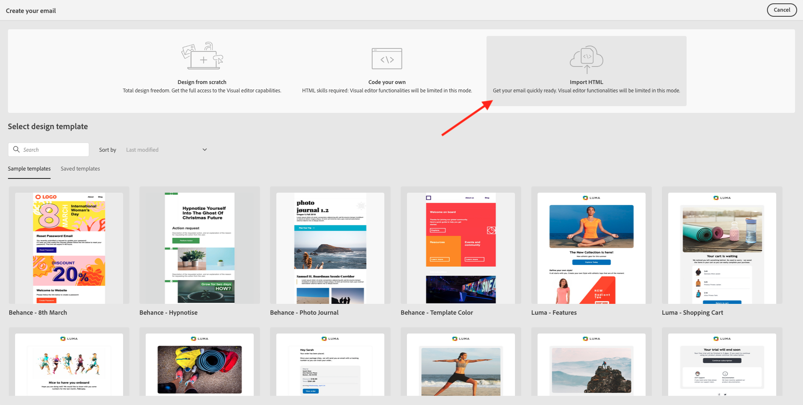

# 3.4.2 Konfigurera en gruppbaserad nyhetsbrevresa

Logga in på Adobe Journey Optimizer på [Adobe Experience Cloud](https://experience.adobe.com). Klicka på **Journey Optimizer**.

Du omdirigeras till vyn **Hem** i Journey Optimizer. Kontrollera först att du använder rätt sandlåda. Sandlådan som ska användas kallas `--aepSandboxName--`. Om du vill ändra från en sandlåda till en annan klickar du på **PRODUKTIONSprodukt (VA7)** och väljer sandlådan i listan. I det här exemplet heter sandlådan **AEP Enablement FY22**. Du kommer sedan att vara i vyn **Hem** i din sandlåda `--aepSandboxName--`.

## 3.4.2.1 Skapa nyhetsbrev

Nu kan du skapa en gruppbaserad resa. Till skillnad från den händelsebaserade resan i den föregående övningen som bygger på inkommande upplevelsehändelser eller segmentposter eller utträden för att utlösa en resa för en viss kund, riktar sig batchbaserade resor till ett helt segment med unikt innehåll som nyhetsbrev, engångskampanjer eller allmän information eller regelbundet med liknande innehåll som skickas regelbundet, till exempel födelsedagskampanjer och påminnelser.

Gå till **Resor** på menyn och klicka på **Skapa resa**.

Till höger ser du ett formulär där du måste ange resans namn och beskrivning. Ange följande värden:

- **Namn**: `--aepUserLdap-- - Newsletter Journey`. Till exempel: **vangeluw - Newsletter Journey**.
- **Beskrivning**: Månadsnyhetsbrev

Klicka på **OK**.

Under **Orchestration** drar och släpper du **Läs segment** på arbetsytan. Det innebär att resan, när den har publicerats, börjar med att hämta hela segmentets målgrupp, som sedan blir målgrupp för resan och budskapet. Klicka på **Markera ett segment**.

I popup-fönstret **Välj ett segment** söker du efter din ldap och väljer det segment du skapade i [Modul 2.3 - CDP i realtid - Bygg ett segment och utför åtgärden ](./../../../modules/rtcdp-b2c/module2.3/real-time-cdp-build-a-segment-take-action.md) `--aepUserLdap-- - Interest in PROTEUS FITNESS JACKSHIRT`. till exempel: vangeluw - Intresse i PROTEUS FITNESS JACKSHIRT. Klicka på **Spara**.

Klicka på **OK**.

I den vänstra menyn hittar du avsnittet **Åtgärder** och drar och släpper en **E-post** -åtgärd på arbetsytan.

Ange **kategorin** till **Marknadsföring** och välj en e-postyta som gör att du kan skicka e-post. I det här fallet är e-postytan som ska väljas **E-post**. Kontrollera att kryssrutorna för **klick på e-post** och **e-post** är aktiverade.

Nästa steg är att skapa ett meddelande. Det gör du genom att klicka på **Redigera innehåll**.

Nu ser du det här. Klicka på textfältet **Ämnesrad**.

Ange den här texten för ämnesraden: `Luma Newsletter - your monthly update has arrived.`. Klicka på **Spara**.

Du kommer då tillbaka hit. Klicka på **E-posta Designer** för att börja skapa e-postinnehållet.

Då ser du det här. Klicka på **Importera HTML**.

På popup-skärmen måste du dra och släppa HTML-filen i e-postmeddelandet. Du hittar mallen [här](./../../../assets/html/ajo-newsletter.html.zip) för HTML. Ladda ned zip-filen med HTML-mallen till den lokala datorn och packa upp den på skrivbordet.

Dra och släpp filen **ajo-newsletter.html** för att överföra den till Journey Optimizer. Klicka på **Importera**.

Det här e-postinnehållet är klart att användas eftersom det har all förväntad personalisering, bilder och text. Endast platshållaren för erbjudandet är tom.

Du kan få ett felmeddelande: **Fel vid försök att hämta resurser**. Det här är länkat till bilden i e-postmeddelandet.

Om det här felet uppstår markerar du bilden och klickar på knappen **Redigera bild** .

Klicka på **Assets Essentials** för att gå tillbaka till ditt AEM Assets Essentials-bibliotek.

Du kommer då att se den här popup-rutan. Navigera till mappen **enablement-assets** och markera bilden **luma-newsletterContent.png**. Klicka på **Markera**.

Ditt enkla nyhetsbrev är nu klart. Klicka på **Spara**.

Gå tillbaka till meddelandekontrollpanelen genom att klicka på **pilen** intill ämnesraden i det övre vänstra hörnet.

Klicka på pilen i det övre vänstra hörnet för att gå tillbaka till din resa.

Klicka på **OK** för att stänga e-poståtgärden.

Din nyhetsbrevsresa är nu klar att publiceras. Innan du gör det bör du lägga märke till avsnittet **Schema** där du kan växla den här resan från att vara en engångskampanj till en återkommande kampanj. Klicka på knappen **Schema**.

Då ser du det här. Välj **En gång**.

Välj ett datum och en tid inom en timme så att du kan testa din resa. Klicka på **OK**.

>[!NOTE]
>
>Datum och tid för sändning av meddelande måste vara inom mer än en timme.

Klicka på **Publish**.

Klicka på **Publish** igen.

Din grundläggande nyhetsbrevsresa är nu publicerad. E-postmeddelandet med nyhetsbrevet skickas så som du har definierat det i ditt schema, och din resa stoppas så fort som det senaste e-postmeddelandet har skickats.

Du har gjort klart den här övningen.

Nästa steg: [3.4.3 Tillämpa personalisering i ett e-postmeddelande](./ex3.md)

[Gå tillbaka till modul 3.4](./journeyoptimizer.md)

[Gå tillbaka till Alla moduler](../../../overview.md)
