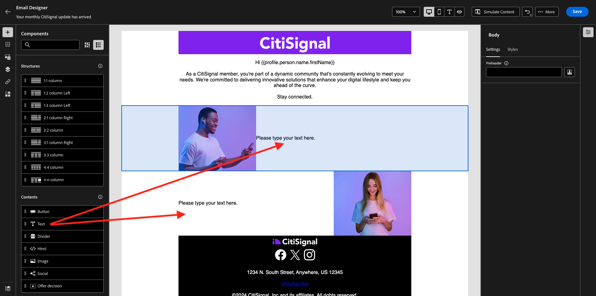

# 3.4.2 Konfigurera en kampanj

Logga in på Adobe Journey Optimizer på [Adobe Experience Cloud](https://experience.adobe.com). Klicka på **Journey Optimizer**.


Du omdirigeras till vyn **Hem** i Journey Optimizer. Kontrollera först att du använder rätt sandlåda. Sandlådan som ska användas kallas `--aepSandboxName--`. Du kommer sedan att vara i vyn **Hem** i din sandlåda `--aepSandboxName--`.


## 3.4.2.1 Skapa målgrupper

Innan ni skapar er kampanj bör ni definiera den målgrupp som ska ta emot kampanjen. Om du vill skapa en målgrupp går du till **Publiker** på den vänstra menyn. Där ser du alla tidigare målgrupper.

Klicka på **+ Skapa publik**.


Välj **Skapa regel** och klicka på **Skapa**.


Markera fältet **XDM Individual Profile > Personal Email > Address** och lägg till det på arbetsytan. Ange regelvillkoret till **exists**.

För att undvika att skicka e-postmeddelanden till andra användare i din delade utbildningsmiljö kan du även lägga till ett filter som **Förnamn är lika med -ditt förnamn-**.

Ange målgruppens namn till `--aepUserLdap-- - All customers with email` och klicka på **Publish**.


Din målgrupp publiceras nu och kan användas i en kampanj.

## 3.4.2.2 Skapa kampanj för nyhetsbrev

Nu ska ni skapa en kampanj. Till skillnad från den händelsebaserade resan från föregående övning, som bygger på inkommande upplevelsehändelser, målgruppsposter eller utträde för att utlösa en resa för en viss kund, riktar kampanjer sig mot en hel målgrupp en gång med unikt innehåll som nyhetsbrev, engångskampanjer eller allmän information eller regelbundet med liknande innehåll som skickas regelbundet, till exempel födelsedagskampanjer och påminnelser.

Gå till **Kampanjer** på menyn och klicka på **Skapa kampanj**.


Välj **Schemalagd - marknadsföring** och klicka på **Skapa**.


Konfigurera följande när kampanjen skapas:

- **Namn**: `--aepUserLdap-- - CitiSignal Newsletter`.
- **Beskrivning**: Månadsnyhetsbrev
- **Identitetstyp**: ändra till e-post

Klicka på **Välj målgrupp**.


För **målgruppen** väljer du målgruppen som du skapade i föregående steg, `--aepUserLdap-- - All customers with email`. Klicka på **Spara**.


För **åtgärden** väljer du **E-post** och väljer en befintlig **e-postkonfiguration**. Du redigerar innehållet om några minuter.


Välj **På ett visst datum och en viss tid** för **Schemalägg** och ange en valtid.


Nu kan du börja skapa själva e-postmeddelandet. Bläddra lite uppåt och klicka på **Redigera innehåll**.


Då ser du det här. Använd följande för **Subject line**: `Your monthly CitiSignal update has arrived.`. Klicka sedan på **Redigera e-postbrödtext**.


Välj **Design från grunden**.


Då ser du det här. På den vänstra menyn hittar du de strukturkomponenter som du kan använda för att definiera e-postmeddelandets struktur (rader och kolumner).

Dra och släpp 3 gånger en **1:1-kolumn** på arbetsytan, 1 gång en 1:2-kolumn åt vänster och 1 gång en 2:1-kolumn åt höger som ska ge dig den här strukturen:


Gå till **Fragment** på den vänstra menyn. Dra rubriken som du skapade tidigare i [övning 3.1.2.1](./../module3.1/ex2.md) till den första komponenten på arbetsytan. Dra sidfoten som du skapade tidigare i [övning 3.1.2.2](./../module3.1/ex2.md) till den sista komponenten på arbetsytan.


Klicka på ikonen **+** i den vänstra menyn. Gå till **Innehåll** för att börja lägga till innehåll på arbetsytan.


Dra och släpp en **Text**-komponent på den andra raden.


Markera standardtexten i komponenten **Skriv texten här.** och ersätt den med texten nedan. Ändra justeringen till **Centrera**.

```javascript
Hi {{profile.person.name.firstName}}

As a CitiSignal member, you're part of a dynamic community that's constantly evolving to meet your needs. We're committed to delivering innovative solutions that enhance your digital lifestyle and keep you ahead of the curve.

Stay connected.
```


Dra och släpp en **bild**-komponent på den tredje och fjärde raden. Klicka på **Bläddra** på den tredje raden.


Öppna mappen **citi-signal-images**, klicka för att markera bilden **Offer_AirPods.jpg** och klicka på **Select**.


Klicka på **Bläddra** på bildplatshållaren på den fjärde raden.


Öppna mappen **citi-signal-images**, klicka för att markera bilden **Offer_Phone.jpg** och klicka på **Select**.


Dra och släpp en **Text** -komponent på den tredje och fjärde raden.



Markera standardtexten i komponenten på den tredje raden **Skriv texten här.** och ersätt den med texten nedan.

```javascript
Get AirPods for free:

Experience seamless connectivity like never before with CitiSignal. Sign up for select premium plans and receive a complimentary pair of Apple AirPods. Stay connected in style with our unbeatable offer.
```

Markera standardtexten i komponenten på den fjärde raden **Skriv texten här.** och ersätt den med texten nedan.

```javascript
We'll pay off your phone:

Make the switch to CitiSignal and say goodbye to phone payments! Switching to CitiSignal has never been more rewarding. Say farewell to hefty phone bills as we help pay off your phone, up to 800$!
```


Ditt enkla nyhetsbrev är nu klart. Klicka på **Spara**.


Gå tillbaka till kontrollpanelen för kampanjer genom att klicka på **pilen** bredvid texten för ämnesraden i det övre vänstra hörnet.


Klicka på **Granska för att aktivera**.


Du kan då få det här felet. Om så är fallet kan du behöva vänta i upp till 24 timmar tills målgruppen har utvärderats och sedan försöka aktivera kampanjen igen. Du kan också behöva uppdatera schemat för din kampanj så att den körs vid ett senare tillfälle.

Klicka på **Aktivera**.


När kampanjen är aktiverad kommer den att köras.


Din kampanj är nu aktiverad. E-postmeddelandet med nyhetsbrevet skickas så som du har definierat det i ditt schema, och kampanjen stoppas så snart som det senaste e-postmeddelandet har skickats.

Du bör också få e-postadressen till den demoprofil du skapade tidigare.


Du har gjort klart den här övningen.

Nästa steg: [3.4.3 Använda segmentbaserad personalisering i ett e-postmeddelande](./ex3.md)

[Gå tillbaka till modul 3.4](./journeyoptimizer.md)

[Gå tillbaka till Alla moduler](../../../overview.md)
